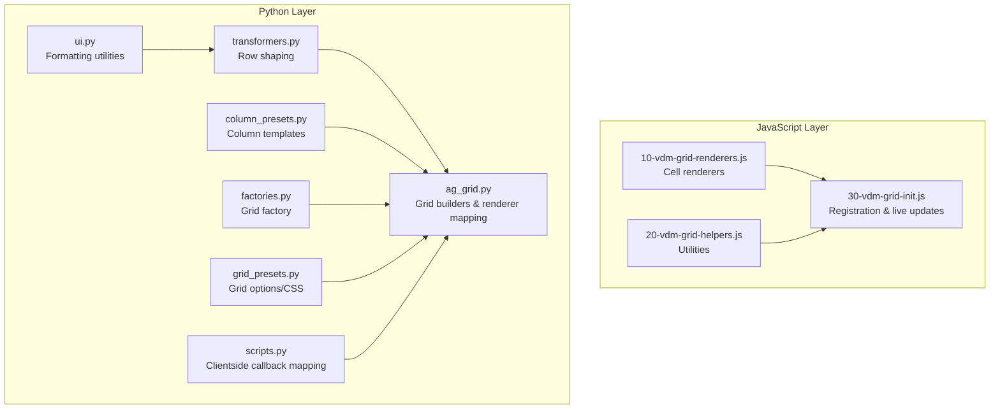
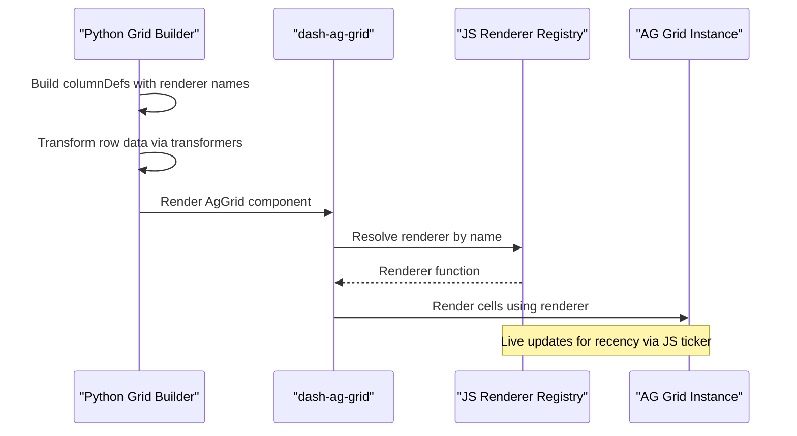
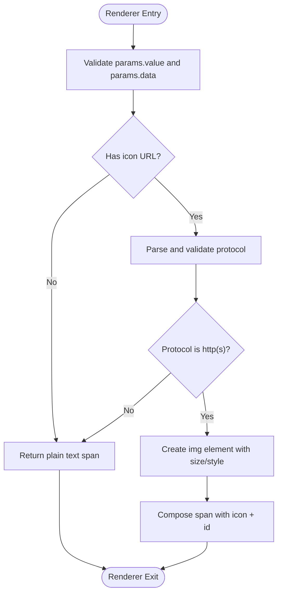
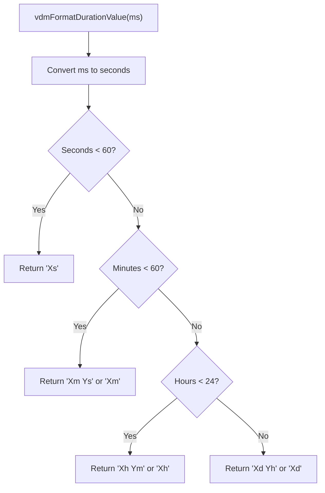
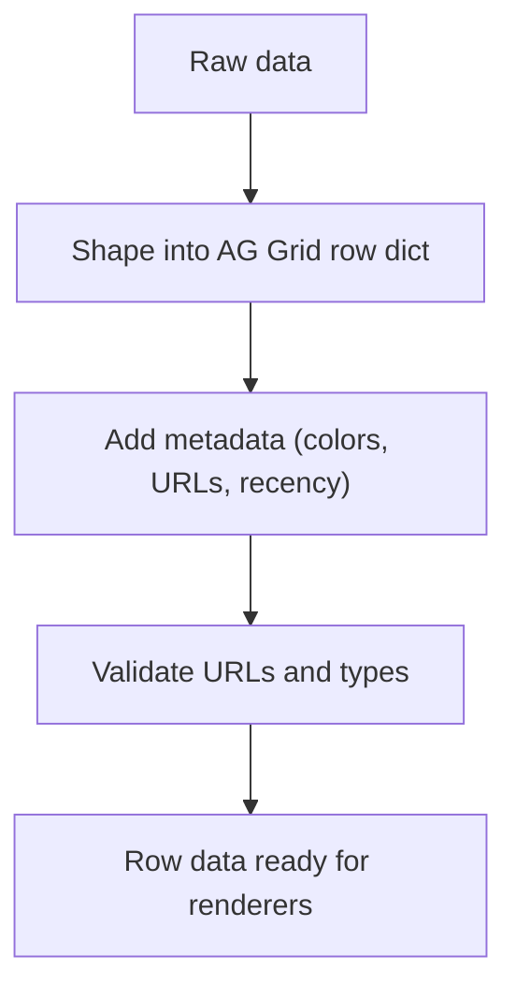
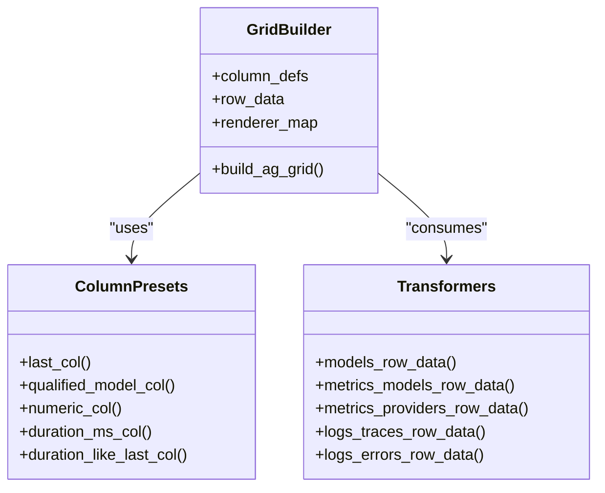
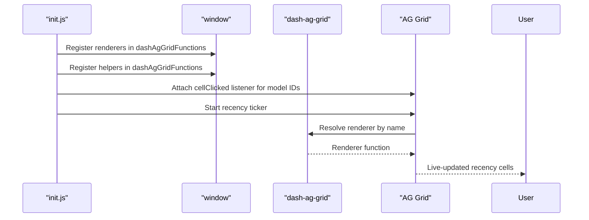
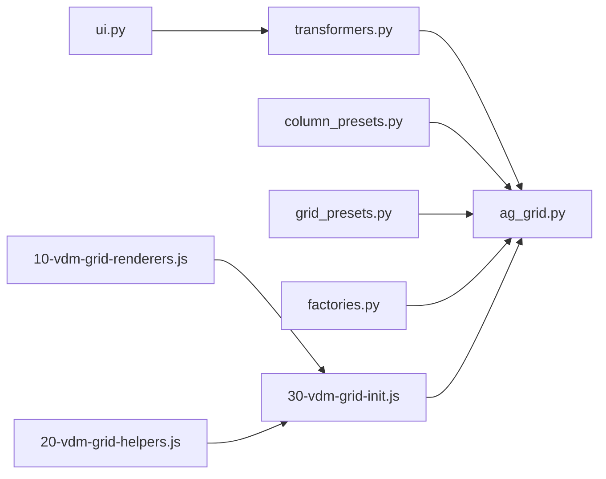

# Custom Cell Rendering

<cite>
**Referenced Files in This Document**
- [10-vdm-grid-renderers.js](file://assets/ag_grid/10-vdm-grid-renderers.js)
- [20-vdm-grid-helpers.js](file://assets/ag_grid/20-vdm-grid-helpers.js)
- [30-vdm-grid-init.js](file://assets/ag_grid/30-vdm-grid-init.js)
- [transformers.py](file://src/dashboard/ag_grid/transformers.py)
- [ag_grid.py](file://src/dashboard/components/ag_grid.py)
- [column_presets.py](file://src/dashboard/ag_grid/column_presets.py)
- [factories.py](file://src/dashboard/ag_grid/factories.py)
- [grid_presets.py](file://src/dashboard/ag_grid/grid_presets.py)
- [scripts.py](file://src/dashboard/ag_grid/scripts.py)
- [ui.py](file://src/dashboard/components/ui.py)
</cite>

## Table of Contents
1. [Introduction](#introduction)
2. [Project Structure](#project-structure)
3. [Core Components](#core-components)
4. [Architecture Overview](#architecture-overview)
5. [Detailed Component Analysis](#detailed-component-analysis)
6. [Dependency Analysis](#dependency-analysis)
7. [Performance Considerations](#performance-considerations)
8. [Troubleshooting Guide](#troubleshooting-guide)
9. [Conclusion](#conclusion)
10. [Appendices](#appendices)

## Introduction
This document explains the custom cell rendering system powering the dashboard’s AG Grid implementation. It covers how specialized renderers are defined in JavaScript, how Python transformers prepare data for rendering, how renderers are registered and mapped via the Python components layer, and how utility functions support formatting and conditional styling. It also provides practical guidance for extending renderers to support new data types and customizing visual appearance.

## Project Structure
The custom cell rendering pipeline spans three layers:
- JavaScript layer: renderers and helpers are defined and registered in the browser.
- Python layer: transformers shape raw data into AG Grid-compatible rows and supply metadata for renderers.
- Composition layer: grid builders assemble column definitions, map renderers by name, and apply shared options.

**Diagram sources**
- [10-vdm-grid-renderers.js](file://assets/ag_grid/10-vdm-grid-renderers.js#L1-L320)
- [20-vdm-grid-helpers.js](file://assets/ag_grid/20-vdm-grid-helpers.js#L1-L129)
- [30-vdm-grid-init.js](file://assets/ag_grid/30-vdm-grid-init.js#L1-L379)
- [transformers.py](file://src/dashboard/ag_grid/transformers.py#L1-L486)
- [ag_grid.py](file://src/dashboard/components/ag_grid.py#L1-L636)
- [column_presets.py](file://src/dashboard/ag_grid/column_presets.py#L1-L167)
- [factories.py](file://src/dashboard/ag_grid/factories.py#L1-L96)
- [grid_presets.py](file://src/dashboard/ag_grid/grid_presets.py#L1-L26)
- [scripts.py](file://src/dashboard/ag_grid/scripts.py#L1-L35)
- [ui.py](file://src/dashboard/components/ui.py#L1-L592)

**Section sources**
- [10-vdm-grid-renderers.js](file://assets/ag_grid/10-vdm-grid-renderers.js#L1-L320)
- [20-vdm-grid-helpers.js](file://assets/ag_grid/20-vdm-grid-helpers.js#L1-L129)
- [30-vdm-grid-init.js](file://assets/ag_grid/30-vdm-grid-init.js#L1-L379)
- [transformers.py](file://src/dashboard/ag_grid/transformers.py#L1-L486)
- [ag_grid.py](file://src/dashboard/components/ag_grid.py#L1-L636)
- [column_presets.py](file://src/dashboard/ag_grid/column_presets.py#L1-L167)
- [factories.py](file://src/dashboard/ag_grid/factories.py#L1-L96)
- [grid_presets.py](file://src/dashboard/ag_grid/grid_presets.py#L1-L26)
- [scripts.py](file://src/dashboard/ag_grid/scripts.py#L1-L35)
- [ui.py](file://src/dashboard/components/ui.py#L1-L592)

## Core Components
- Cell renderers (JavaScript): Specialized functions that produce React elements for AG Grid cells. Examples include model identifiers with icons, provider badges, formatted numbers, qualified model display, and recency dots with live updates.
- Utilities (JavaScript): Helpers for date comparison, copying text to clipboard, HTML escaping, and duration formatting/value getters.
- Transformers (Python): Functions that transform raw data into AG Grid row dictionaries, including metadata required by renderers (e.g., provider colors, model page URLs, icon URLs, recency fields).
- Grid builders (Python): Assemble column definitions, map renderer names to functions, and apply shared options and CSS.
- Registration and initialization (JavaScript): Register renderers globally for dash-ag-grid resolution and set up live recency updates.

**Section sources**
- [10-vdm-grid-renderers.js](file://assets/ag_grid/10-vdm-grid-renderers.js#L48-L320)
- [20-vdm-grid-helpers.js](file://assets/ag_grid/20-vdm-grid-helpers.js#L5-L129)
- [transformers.py](file://src/dashboard/ag_grid/transformers.py#L20-L486)
- [ag_grid.py](file://src/dashboard/components/ag_grid.py#L33-L636)
- [30-vdm-grid-init.js](file://assets/ag_grid/30-vdm-grid-init.js#L94-L160)

## Architecture Overview
The system follows a strict separation of concerns:
- Python prepares structured row data and column definitions.
- JavaScript registers renderers globally and applies them by name.
- Live updates are handled client-side for recency indicators.

**Diagram sources**
- [ag_grid.py](file://src/dashboard/components/ag_grid.py#L207-L323)
- [transformers.py](file://src/dashboard/ag_grid/transformers.py#L388-L485)
- [30-vdm-grid-init.js](file://assets/ag_grid/30-vdm-grid-init.js#L104-L160)

## Detailed Component Analysis

### JavaScript Cell Renderers
The renderer module defines several specialized renderers:
- Model identifier with icon: renders a compact inline image plus model id, with strict URL validation.
- Model page link: renders a clickable link to a provider’s model page, with safety checks and tooltips.
- Provider badge: renders a Bootstrap-styled badge using a color derived from provider name.
- Formatted number: renders thousands-separated numbers safely.
- Qualified model: renders a composite cell combining a provider badge and model id.
- Recency dot: renders a colored dot and relative time string, with live updates.

**Diagram sources**
- [10-vdm-grid-renderers.js](file://assets/ag_grid/10-vdm-grid-renderers.js#L48-L89)

**Section sources**
- [10-vdm-grid-renderers.js](file://assets/ag_grid/10-vdm-grid-renderers.js#L48-L320)

### JavaScript Utilities and Formatting
The helpers module provides:
- Date comparator for ISO strings.
- Clipboard utilities for model IDs and arbitrary text.
- HTML escaping utility.
- Duration formatting for display and tooltips, synchronized with Python formatting.

**Diagram sources**
- [20-vdm-grid-helpers.js](file://assets/ag_grid/20-vdm-grid-helpers.js#L99-L122)
- [ui.py](file://src/dashboard/components/ui.py#L76-L106)

**Section sources**
- [20-vdm-grid-helpers.js](file://assets/ag_grid/20-vdm-grid-helpers.js#L5-L129)
- [ui.py](file://src/dashboard/components/ui.py#L76-L106)

### Python Transformers
Transformers prepare row data for AG Grid:
- Provider badge color mapping.
- Logs/traces rows: enrich timestamps, durations, token counts, and provider colors.
- Metrics rows: compute recency fields, durations, and totals.
- Models rows: derive model page URLs, icon URLs, and descriptions; format timestamps and pricing.
- Top models rows: extract provider, id, name, context window, and average pricing.

**Diagram sources**
- [transformers.py](file://src/dashboard/ag_grid/transformers.py#L20-L486)

**Section sources**
- [transformers.py](file://src/dashboard/ag_grid/transformers.py#L20-L486)

### Grid Builders and Renderer Mapping
Grid builders define column definitions and map renderer names to functions:
- Models grid: uses model icon renderer and model page link renderer.
- Logs grids: use provider badge renderer and formatted number renderer.
- Metrics grids: use recency dot renderer and duration helpers.
- Column presets: reusable templates for common patterns (e.g., last-accessed, qualified model, numeric columns, duration-like columns).

**Diagram sources**
- [ag_grid.py](file://src/dashboard/components/ag_grid.py#L194-L323)
- [column_presets.py](file://src/dashboard/ag_grid/column_presets.py#L16-L167)
- [transformers.py](file://src/dashboard/ag_grid/transformers.py#L210-L485)

**Section sources**
- [ag_grid.py](file://src/dashboard/components/ag_grid.py#L194-L636)
- [column_presets.py](file://src/dashboard/ag_grid/column_presets.py#L16-L167)
- [transformers.py](file://src/dashboard/ag_grid/transformers.py#L210-L485)

### Registration and Live Updates
The initialization script:
- Registers renderers globally under two namespaces for dash-ag-grid resolution.
- Exposes helpers for value getters and tooltips.
- Sets up a ticker to update recency dots and text at controlled rates.
- Attaches copy listeners for model IDs.

**Diagram sources**
- [30-vdm-grid-init.js](file://assets/ag_grid/30-vdm-grid-init.js#L94-L160)
- [30-vdm-grid-init.js](file://assets/ag_grid/30-vdm-grid-init.js#L216-L379)

**Section sources**
- [30-vdm-grid-init.js](file://assets/ag_grid/30-vdm-grid-init.js#L94-L160)
- [30-vdm-grid-init.js](file://assets/ag_grid/30-vdm-grid-init.js#L216-L379)

## Dependency Analysis
- Renderers depend on:
  - Global registration via dash-ag-grid namespaces.
  - Shared helpers for duration formatting and recency computations.
- Transformers depend on:
  - UI utilities for formatting and timestamp computations.
  - Provider configuration for model page templates and badge colors.
- Grid builders depend on:
  - Transformers for row data.
  - Column presets for consistent column definitions.
  - Factories and grid presets for shared options and CSS.

**Diagram sources**
- [transformers.py](file://src/dashboard/ag_grid/transformers.py#L1-L486)
- [ag_grid.py](file://src/dashboard/components/ag_grid.py#L1-L636)
- [column_presets.py](file://src/dashboard/ag_grid/column_presets.py#L1-L167)
- [grid_presets.py](file://src/dashboard/ag_grid/grid_presets.py#L1-L26)
- [factories.py](file://src/dashboard/ag_grid/factories.py#L1-L96)
- [ui.py](file://src/dashboard/components/ui.py#L1-L592)
- [10-vdm-grid-renderers.js](file://assets/ag_grid/10-vdm-grid-renderers.js#L1-L320)
- [20-vdm-grid-helpers.js](file://assets/ag_grid/20-vdm-grid-helpers.js#L1-L129)
- [30-vdm-grid-init.js](file://assets/ag_grid/30-vdm-grid-init.js#L1-L379)

**Section sources**
- [ag_grid.py](file://src/dashboard/components/ag_grid.py#L1-L636)
- [transformers.py](file://src/dashboard/ag_grid/transformers.py#L1-L486)
- [column_presets.py](file://src/dashboard/ag_grid/column_presets.py#L1-L167)
- [grid_presets.py](file://src/dashboard/ag_grid/grid_presets.py#L1-L26)
- [factories.py](file://src/dashboard/ag_grid/factories.py#L1-L96)
- [ui.py](file://src/dashboard/components/ui.py#L1-L592)
- [10-vdm-grid-renderers.js](file://assets/ag_grid/10-vdm-grid-renderers.js#L1-L320)
- [20-vdm-grid-helpers.js](file://assets/ag_grid/20-vdm-grid-helpers.js#L1-L129)
- [30-vdm-grid-init.js](file://assets/ag_grid/30-vdm-grid-init.js#L1-L379)

## Performance Considerations
- Live recency updates throttle dot color updates (~10fps) and text updates (~1fps) to minimize CPU usage.
- Epoch timestamps and precomputed ages are passed to the client to avoid repeated ISO parsing in tight loops.
- Renderer registration uses requestAnimationFrame and retries to handle load ordering.
- Clipboard operations are asynchronous and gracefully fall back to execCommand when the modern API is unavailable.

[No sources needed since this section provides general guidance]

## Troubleshooting Guide
Common issues and resolutions:
- Renderer not applied:
  - Ensure the renderer name is present in columnDefs and registered in the global registry.
  - Verify the renderer is exposed under both dashAgGridFunctions and dashAgGridComponentFunctions.
- Recency dot not updating:
  - Confirm the row data includes required fields: last_accessed_epoch_ms, last_accessed_age_s_at_render, last_accessed_iso.
  - Check that the grid container IDs are present and the ticker is initialized.
- Model page URL invalid:
  - Ensure the URL is http(s) and properly encoded; the renderer validates and sanitizes input.
- Duration formatting mismatch:
  - Align Python and JS formatting functions; both should produce consistent results.

**Section sources**
- [30-vdm-grid-init.js](file://assets/ag_grid/30-vdm-grid-init.js#L94-L160)
- [30-vdm-grid-init.js](file://assets/ag_grid/30-vdm-grid-init.js#L216-L379)
- [10-vdm-grid-renderers.js](file://assets/ag_grid/10-vdm-grid-renderers.js#L92-L144)
- [20-vdm-grid-helpers.js](file://assets/ag_grid/20-vdm-grid-helpers.js#L99-L122)
- [ui.py](file://src/dashboard/components/ui.py#L76-L106)

## Conclusion
The custom cell rendering system cleanly separates data preparation (Python), presentation logic (JavaScript), and composition (Python grid builders). Renderers are robust, performant, and extensible, with strong safety checks and live updates for recency indicators. The design enables consistent visual patterns across grids while allowing easy customization and extension.

[No sources needed since this section summarizes without analyzing specific files]

## Appendices

### Extending Renderers for New Data Types
Steps to add a new renderer:
1. Define the renderer function in the JavaScript renderer module.
2. Add a column definition that references the renderer by name.
3. Prepare the corresponding row data in Python transformers.
4. Register the renderer in the initialization script if needed.
5. Test live updates and accessibility.

Example references:
- Renderer definition site: [10-vdm-grid-renderers.js](file://assets/ag_grid/10-vdm-grid-renderers.js#L48-L320)
- Column mapping site: [ag_grid.py](file://src/dashboard/components/ag_grid.py#L207-L323)
- Transformer data shaping site: [transformers.py](file://src/dashboard/ag_grid/transformers.py#L388-L485)
- Registration site: [30-vdm-grid-init.js](file://assets/ag_grid/30-vdm-grid-init.js#L104-L160)

### Customizing Visual Appearance
- Adjust CSS classes and styles in the renderer functions for badges, icons, and layout.
- Use column presets to standardize fonts, widths, and tooltip fields.
- Apply grid presets for consistent row heights and compact layouts.

Example references:
- Provider badge styling: [10-vdm-grid-renderers.js](file://assets/ag_grid/10-vdm-grid-renderers.js#L147-L168)
- Numeric formatting: [20-vdm-grid-helpers.js](file://assets/ag_grid/20-vdm-grid-helpers.js#L99-L122)
- Column presets: [column_presets.py](file://src/dashboard/ag_grid/column_presets.py#L81-L167)
- Grid presets: [grid_presets.py](file://src/dashboard/ag_grid/grid_presets.py#L12-L26)