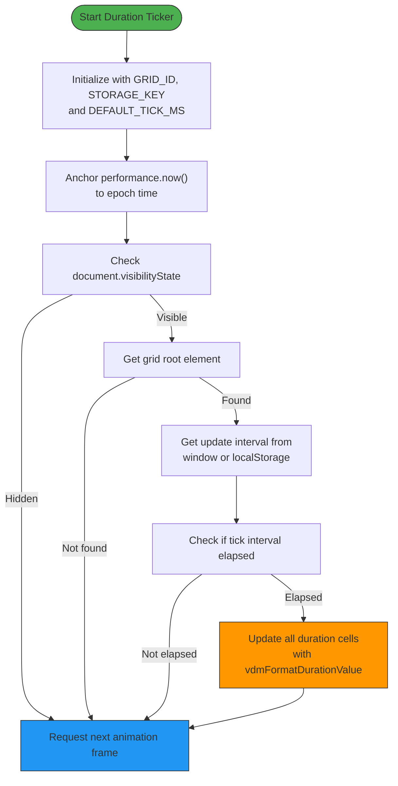
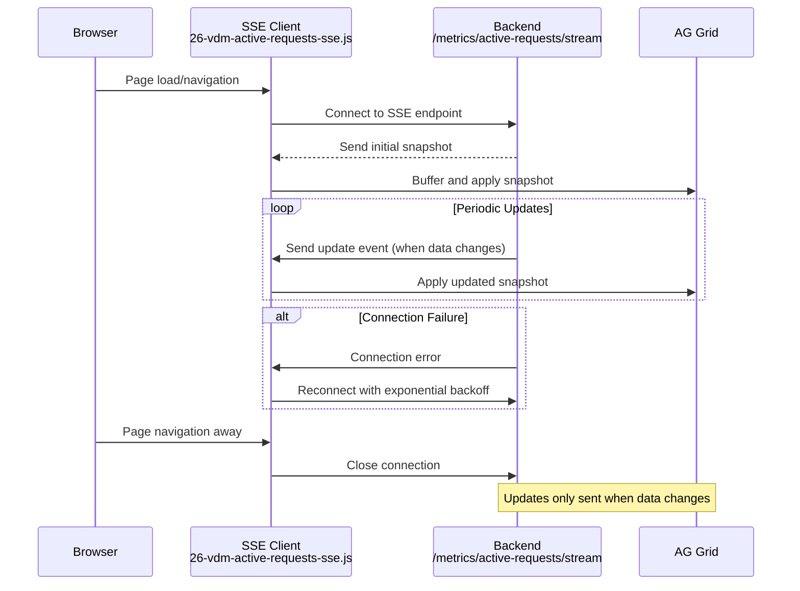
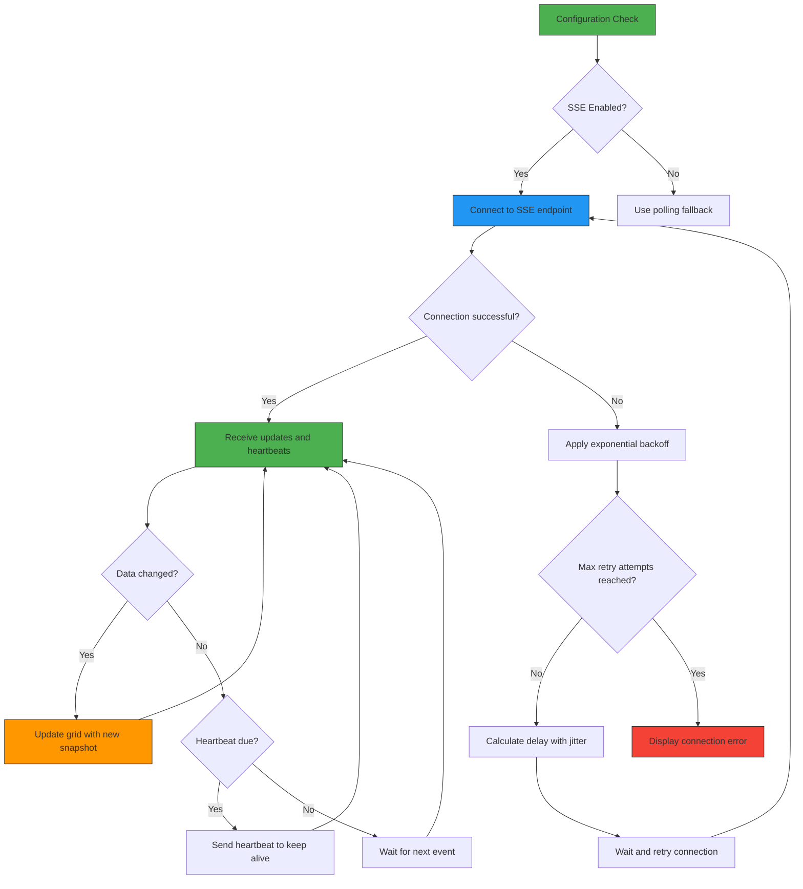

# Dynamic Updates Mechanism

<cite>
**Referenced Files in This Document**   
- [25-vdm-metrics-active-requests.js](file://assets/ag_grid/25-vdm-metrics-active-requests.js)
- [26-vdm-active-requests-sse.js](file://assets/ag_grid/26-vdm-active-requests-sse.js)
- [metrics.py](file://src/api/metrics.py)
- [metrics.py](file://src/dashboard/callbacks/metrics.py)
- [data_sources.py](file://src/dashboard/data_sources.py)
- [ag_grid.py](file://src/dashboard/components/ag_grid.py)
- [column_presets.py](file://src/dashboard/ag_grid/column_presets.py)
- [vdm-grid-helpers.js](file://assets/ag_grid/20-vdm-grid-helpers.js)
- [vdm-grid-init.js](file://assets/ag_grid/30-vdm-grid-init.js)
- [config.py](file://src/core/config.py)
</cite>

## Table of Contents
1. [Introduction](#introduction)
2. [Architecture Overview](#architecture-overview)
3. [Duration Ticker Implementation](#duration-ticker-implementation)
4. [Server-Sent Events Integration](#server-sent-events-integration)
5. [Backend Integration](#backend-integration)
6. [Configuration and Failure Handling](#configuration-and-failure-handling)
7. [Conclusion](#conclusion)

## Introduction

The dynamic update system in the active requests grid provides real-time monitoring of in-flight API requests through two complementary mechanisms: a high-performance client-side duration ticker and a Server-Sent Events (SSE) connection for live data updates. This system enables the dashboard to display accurate request age information (e.g., '12s', '3m 04s') without blocking the main thread or requiring frequent polling. The implementation leverages performance.now() for precise timing calculations and establishes persistent connections to receive real-time updates from the backend, ensuring users have immediate visibility into active request processing.

**Section sources**
- [25-vdm-metrics-active-requests.js](file://assets/ag_grid/25-vdm-metrics-active-requests.js#L1-L95)
- [26-vdm-active-requests-sse.js](file://assets/ag_grid/26-vdm-active-requests-sse.js#L1-L316)

## Architecture Overview

The dynamic update system consists of a client-server architecture where the frontend dashboard maintains two parallel update mechanisms for the active requests grid. The system integrates JavaScript components for client-side rendering with Python backend services for data processing and streaming.

```mermaid
graph TD
subgraph "Frontend"
DurationTicker[Duration Ticker<br>25-vdm-metrics-active-requests.js]
SSEClient[SSE Client<br>26-vdm-active-requests-sse.js]
Grid[AG Grid Component]
Helpers[Grid Helpers<br>20-vdm-grid-helpers.js]
DurationTicker --> Grid
SSEClient --> Grid
Helpers --> DurationTicker
Helpers --> SSEClient
end
subgraph "Backend"
SSEEndpoint[/metrics/active-requests/stream<br>src/api/metrics.py]
DataFetcher[src/dashboard/data_sources.py]
Config[src/core/config.py]
DataFetcher --> SSEEndpoint
Config --> SSEEndpoint
end
Frontend < --> Backend
style DurationTicker fill:#f9f,stroke:#333
style SSEClient fill:#f9f,stroke:#333
style Grid fill:#bbf,stroke:#333
style Helpers fill:#ff9,stroke:#333
style SSEEndpoint fill:#9f9,stroke:#333
style DataFetcher fill:#9f9,stroke:#333
style Config fill:#9f9,stroke:#333
```

**Diagram sources**
- [25-vdm-metrics-active-requests.js](file://assets/ag_grid/25-vdm-metrics-active-requests.js#L11-L95)
- [26-vdm-active-requests-sse.js](file://assets/ag_grid/26-vdm-active-requests-sse.js#L4-L316)
- [metrics.py](file://src/api/metrics.py#L81-L173)
- [data_sources.py](file://src/dashboard/data_sources.py#L99-L115)

## Duration Ticker Implementation

The duration ticker in 25-vdm-metrics-active-requests.js implements a high-performance mechanism for updating request age displays using performance.now() for precise timing calculations. This approach ensures smooth updates without blocking the main thread by leveraging requestAnimationFrame for efficient rendering cycles.

The ticker operates by anchoring performance.now() to the system epoch time, creating a stable time reference that avoids the overhead of repeated Date.now() calls. It updates the duration text at a configurable cadence (default 2 seconds), which can be adjusted through the UI or localStorage. The implementation specifically targets cells with the 'vdm-active-req-duration' class, ensuring only relevant grid cells are updated.



**Diagram sources**
- [25-vdm-metrics-active-requests.js](file://assets/ag_grid/25-vdm-metrics-active-requests.js#L11-L95)
- [20-vdm-grid-helpers.js](file://assets/ag_grid/20-vdm-grid-helpers.js#L97-L122)

**Section sources**
- [25-vdm-metrics-active-requests.js](file://assets/ag_grid/25-vdm-metrics-active-requests.js#L11-L95)
- [20-vdm-grid-helpers.js](file://assets/ag_grid/20-vdm-grid-helpers.js#L97-L122)

## Server-Sent Events Integration

The Server-Sent Events (SSE) integration in 26-vdm-active-requests-sse.js establishes a persistent connection to receive real-time updates from the backend. This implementation provides immediate updates to the active requests grid whenever requests start or complete, eliminating the need for polling and ensuring the dashboard reflects the current state.

The SSE client connects to the '/metrics/active-requests/stream' endpoint and handles three event types: 'update' for new snapshots, 'disabled' when metrics are disabled, and heartbeat messages for connection maintenance. The implementation includes robust reconnection logic with exponential backoff and jitter to handle network interruptions gracefully. When the connection is established, the client receives an initial snapshot and subsequent updates only when the active requests data changes.



**Diagram sources**
- [26-vdm-active-requests-sse.js](file://assets/ag_grid/26-vdm-active-requests-sse.js#L4-L316)
- [metrics.py](file://src/api/metrics.py#L81-L173)

**Section sources**
- [26-vdm-active-requests-sse.js](file://assets/ag_grid/26-vdm-active-requests-sse.js#L4-L316)
- [metrics.py](file://src/api/metrics.py#L81-L173)

## Backend Integration

The dynamic update system integrates with backend components through the metrics.py modules in both the API and dashboard packages. The src/dashboard/callbacks/metrics.py file contains the callback registration that connects the frontend SSE client to the backend data sources, while src/dashboard/data_sources.py provides the fetch_active_requests function that retrieves the active requests data.

The integration follows a layered architecture where the dashboard callbacks orchestrate data retrieval from the data sources layer. The build_metrics_view function in src/dashboard/services/metrics.py coordinates the fetching of both running totals and active requests data, ensuring consistent state across the dashboard components. The AG Grid configuration in src/dashboard/components/ag_grid.py defines the column structure and data transformation for the active requests display.

```mermaid
classDiagram
class MetricsCallbacks {
+register_metrics_callbacks()
+set_metrics_interval()
+user_active_callback()
+sse_state_callback()
}
class DataSources {
+fetch_active_requests()
+fetch_running_totals()
+DashboardConfigProtocol
}
class MetricsService {
+build_metrics_view()
+MetricsView
}
class AgGridComponents {
+metrics_active_requests_ag_grid()
+metrics_active_requests_component()
}
class ColumnPresets {
+duration_like_last_col()
+numeric_col()
}
MetricsCallbacks --> DataSources : uses
MetricsService --> DataSources : uses
AgGridComponents --> ColumnPresets : uses
AgGridComponents --> DataSources : uses
MetricsCallbacks --> MetricsService : uses
MetricsCallbacks --> AgGridComponents : uses
note right of MetricsCallbacks
Registers Dash callbacks for
metrics refresh and SSE state
end note
note right of DataSources
Provides async data fetching
from API endpoints
end note
note right of AgGridComponents
Builds AG Grid components
with proper column definitions
end note
```

**Diagram sources**
- [metrics.py](file://src/dashboard/callbacks/metrics.py#L11-L154)
- [data_sources.py](file://src/dashboard/data_sources.py#L99-L115)
- [ag_grid.py](file://src/dashboard/components/ag_grid.py#L33-L105)
- [column_presets.py](file://src/dashboard/ag_grid/column_presets.py#L123-L167)

**Section sources**
- [metrics.py](file://src/dashboard/callbacks/metrics.py#L11-L154)
- [data_sources.py](file://src/dashboard/data_sources.py#L99-L115)
- [ag_grid.py](file://src/dashboard/components/ag_grid.py#L33-L105)
- [column_presets.py](file://src/dashboard/ag_grid/column_presets.py#L123-L167)

## Configuration and Failure Handling

The dynamic update system provides configurable parameters through environment variables and client-side settings. The update intervals and SSE behavior can be customized through configuration options in src/core/config.py, which defines settings for the active requests SSE functionality.

Key configuration options include:
- VDM_ACTIVE_REQUESTS_SSE_ENABLED: Enables or disables the SSE functionality
- VDM_ACTIVE_REQUESTS_SSE_INTERVAL: Sets the update interval in seconds (default 2.0)
- VDM_ACTIVE_REQUESTS_SSE_HEARTBEAT: Configures the heartbeat interval in seconds (default 30.0)
- LOG_REQUEST_METRICS: Controls whether request metrics are logged and available

The system implements comprehensive failure handling to ensure reliability. The SSE client automatically attempts reconnection with exponential backoff when the connection is lost, with a jitter factor to prevent thundering herd problems. If the backend determines that metrics are disabled, it sends a 'disabled' event that causes the client to fall back to polling. The duration ticker gracefully handles cases where the formatting functions are not available, preventing errors from propagating.



**Diagram sources**
- [config.py](file://src/core/config.py#L140-L149)
- [26-vdm-active-requests-sse.js](file://assets/ag_grid/26-vdm-active-requests-sse.js#L186-L220)
- [metrics.py](file://src/api/metrics.py#L97-L122)

**Section sources**
- [config.py](file://src/core/config.py#L140-L149)
- [26-vdm-active-requests-sse.js](file://assets/ag_grid/26-vdm-active-requests-sse.js#L186-L220)
- [metrics.py](file://src/api/metrics.py#L97-L122)

## Conclusion

The dynamic update system for the active requests grid combines a high-performance client-side duration ticker with a real-time Server-Sent Events connection to provide users with immediate visibility into active API requests. By leveraging performance.now() for precise timing calculations and requestAnimationFrame for non-blocking updates, the duration ticker efficiently displays request age information without impacting UI performance. The SSE integration establishes a persistent connection to the backend, enabling push-based updates that reflect changes in active requests as they occur.

The system's architecture separates concerns between client-side rendering, real-time communication, and backend data processing, with well-defined integration points through the metrics callbacks and data sources. Configuration options allow administrators to tune update intervals and enable or disable features based on operational requirements. Comprehensive failure handling ensures reliability in the face of network interruptions or backend issues, with automatic reconnection and fallback mechanisms maintaining usability even under adverse conditions.

This implementation demonstrates an effective approach to real-time dashboard updates, balancing performance, reliability, and maintainability while providing users with timely information about system activity.