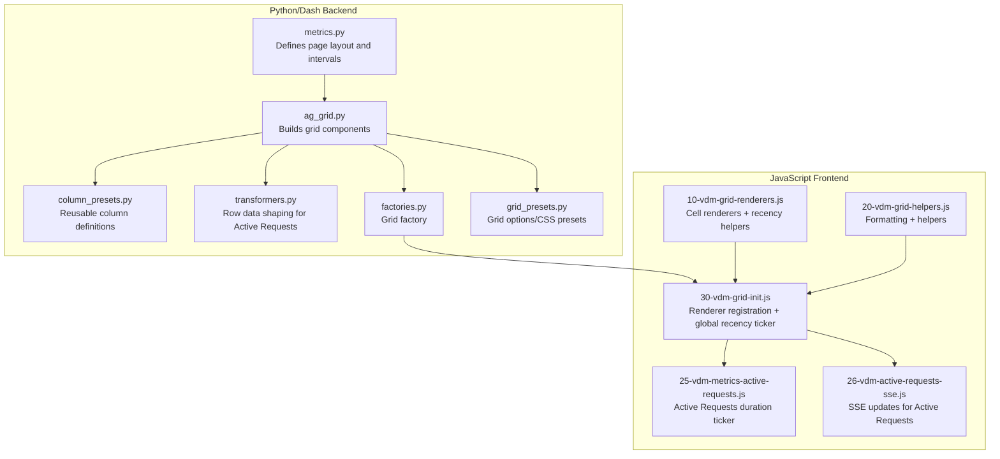
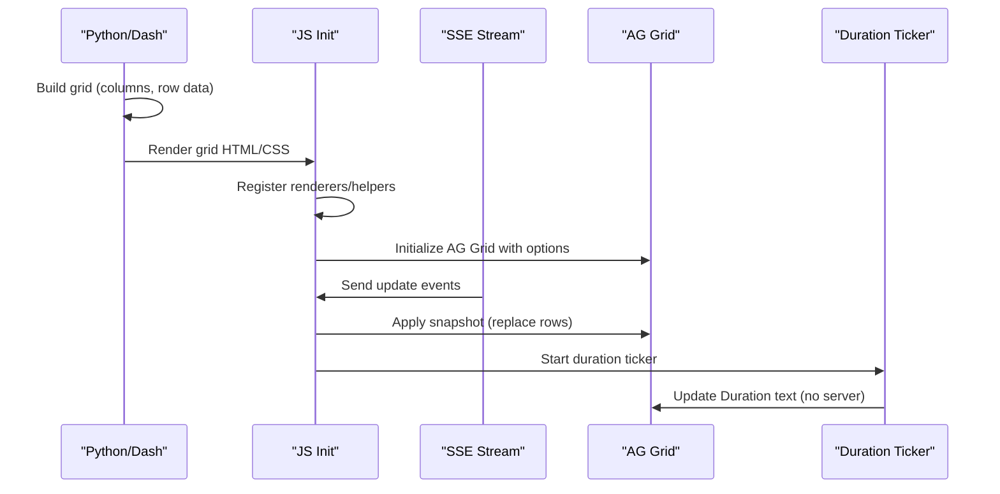
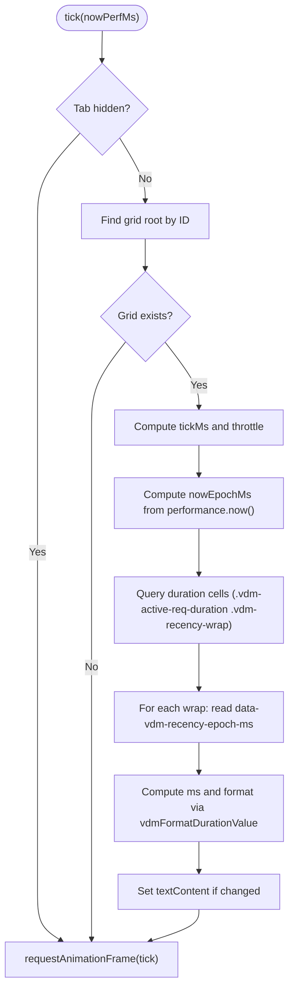
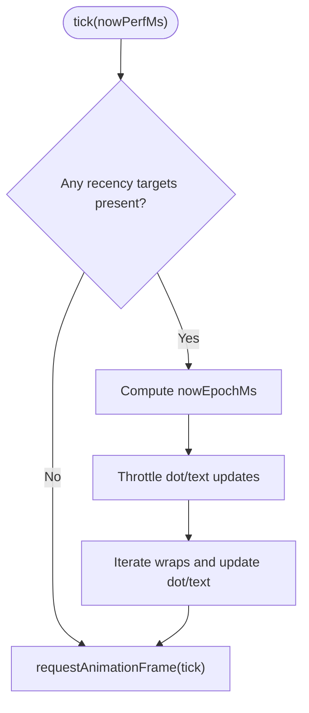
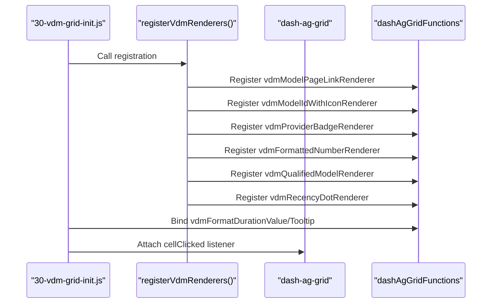
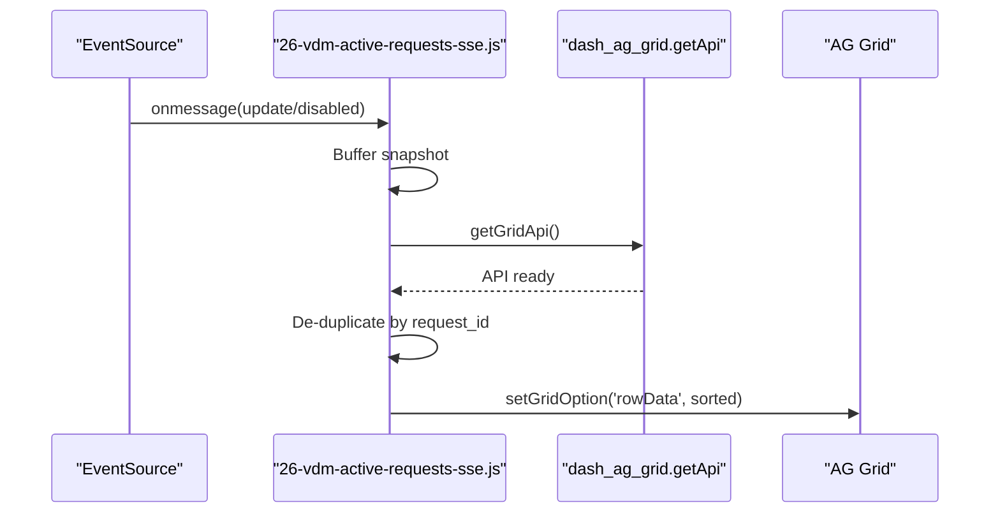
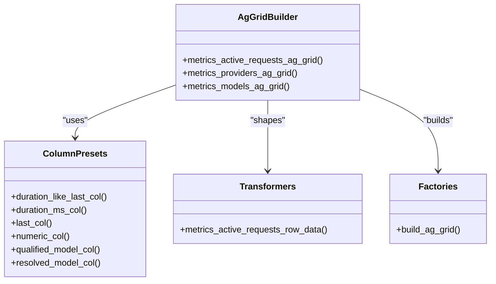
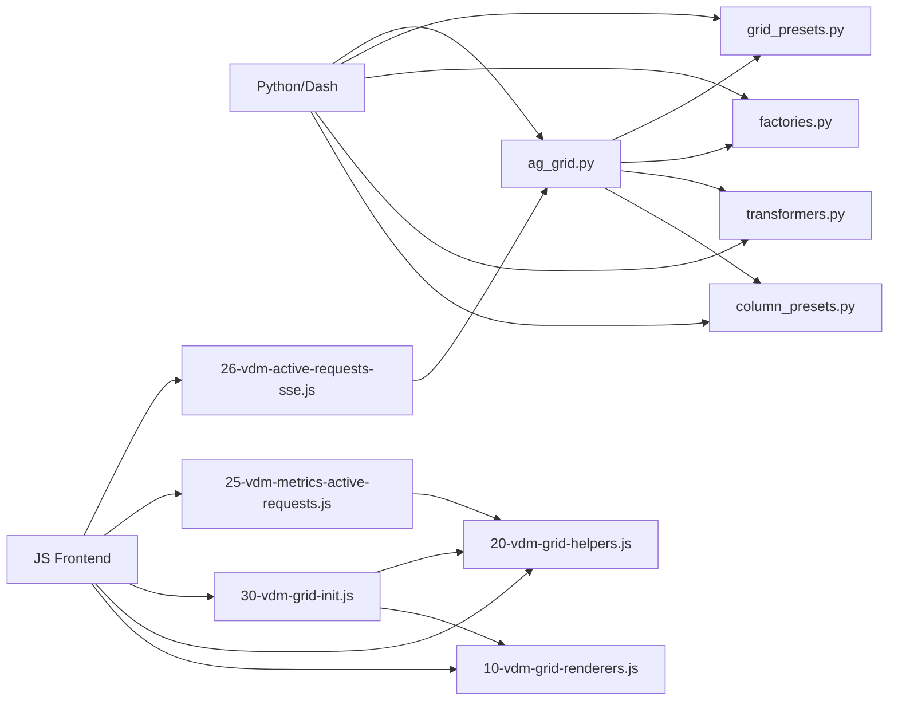

# Frontend Rendering Mechanism

<cite>
**Referenced Files in This Document**
- [25-vdm-metrics-active-requests.js](file://assets/ag_grid/25-vdm-metrics-active-requests.js)
- [30-vdm-grid-init.js](file://assets/ag_grid/30-vdm-grid-init.js)
- [10-vdm-grid-renderers.js](file://assets/ag_grid/10-vdm-grid-renderers.js)
- [20-vdm-grid-helpers.js](file://assets/ag_grid/20-vdm-grid-helpers.js)
- [26-vdm-active-requests-sse.js](file://assets/ag_grid/26-vdm-active-requests-sse.js)
- [ag_grid.py](file://src/dashboard/components/ag_grid.py)
- [metrics.py](file://src/dashboard/pages/metrics.py)
- [column_presets.py](file://src/dashboard/ag_grid/column_presets.py)
- [transformers.py](file://src/dashboard/ag_grid/transformers.py)
- [factories.py](file://src/dashboard/ag_grid/factories.py)
- [grid_presets.py](file://src/dashboard/ag_grid/grid_presets.py)
</cite>

## Table of Contents
1. [Introduction](#introduction)
2. [Project Structure](#project-structure)
3. [Core Components](#core-components)
4. [Architecture Overview](#architecture-overview)
5. [Detailed Component Analysis](#detailed-component-analysis)
6. [Dependency Analysis](#dependency-analysis)
7. [Performance Considerations](#performance-considerations)
8. [Troubleshooting Guide](#troubleshooting-guide)
9. [Conclusion](#conclusion)

## Introduction
This document explains the frontend rendering system for active requests in the dashboard. It focuses on:
- How the Active Requests grid displays request age using a custom duration ticker that updates the “Duration” column independently of the global recency system.
- How performance.now() ensures smooth timing and how localStorage persists user preferences for the ticker cadence.
- How AG Grid is initialized, including renderer registration, column definitions, row ID configuration, and helpers.
- How Python components define the grid structure and layout that the JavaScript enhances.
- Guidance for customizing renderers and extending the grid with additional columns.

## Project Structure
The frontend rendering system spans two layers:
- Python/Dash backend: builds grid definitions, row data, and layout.
- JavaScript frontend: registers renderers, initializes AG Grid, runs live tickers, and applies SSE-driven updates.

**Diagram sources**
- [metrics.py](file://src/dashboard/pages/metrics.py#L16-L161)
- [ag_grid.py](file://src/dashboard/components/ag_grid.py#L33-L94)
- [column_presets.py](file://src/dashboard/ag_grid/column_presets.py#L123-L166)
- [transformers.py](file://src/dashboard/ag_grid/transformers.py#L283-L332)
- [factories.py](file://src/dashboard/ag_grid/factories.py#L47-L95)
- [grid_presets.py](file://src/dashboard/ag_grid/grid_presets.py#L12-L25)
- [10-vdm-grid-renderers.js](file://assets/ag_grid/10-vdm-grid-renderers.js#L221-L319)
- [20-vdm-grid-helpers.js](file://assets/ag_grid/20-vdm-grid-helpers.js#L97-L128)
- [30-vdm-grid-init.js](file://assets/ag_grid/30-vdm-grid-init.js#L104-L160)
- [25-vdm-metrics-active-requests.js](file://assets/ag_grid/25-vdm-metrics-active-requests.js#L11-L94)
- [26-vdm-active-requests-sse.js](file://assets/ag_grid/26-vdm-active-requests-sse.js#L4-L315)

**Section sources**
- [metrics.py](file://src/dashboard/pages/metrics.py#L16-L161)
- [ag_grid.py](file://src/dashboard/components/ag_grid.py#L33-L94)
- [column_presets.py](file://src/dashboard/ag_grid/column_presets.py#L123-L166)
- [transformers.py](file://src/dashboard/ag_grid/transformers.py#L283-L332)
- [factories.py](file://src/dashboard/ag_grid/factories.py#L47-L95)
- [grid_presets.py](file://src/dashboard/ag_grid/grid_presets.py#L12-L25)
- [10-vdm-grid-renderers.js](file://assets/ag_grid/10-vdm-grid-renderers.js#L221-L319)
- [20-vdm-grid-helpers.js](file://assets/ag_grid/20-vdm-grid-helpers.js#L97-L128)
- [30-vdm-grid-init.js](file://assets/ag_grid/30-vdm-grid-init.js#L104-L160)
- [25-vdm-metrics-active-requests.js](file://assets/ag_grid/25-vdm-metrics-active-requests.js#L11-L94)
- [26-vdm-active-requests-sse.js](file://assets/ag_grid/26-vdm-active-requests-sse.js#L4-L315)

## Core Components
- Active Requests Duration Ticker: Updates the “Duration” column text independently of the global recency ticker.
- Global Recency Ticker: Updates dot colors and “Last” column text across metrics grids.
- AG Grid Initialization: Registers renderers, exposes helpers, and sets up listeners.
- SSE Integration: Streams live updates to the Active Requests grid without server round-trips.
- Python Grid Builders: Define columns, row IDs, and row data shaping for Active Requests.

**Section sources**
- [25-vdm-metrics-active-requests.js](file://assets/ag_grid/25-vdm-metrics-active-requests.js#L11-L94)
- [30-vdm-grid-init.js](file://assets/ag_grid/30-vdm-grid-init.js#L216-L378)
- [26-vdm-active-requests-sse.js](file://assets/ag_grid/26-vdm-active-requests-sse.js#L4-L315)
- [ag_grid.py](file://src/dashboard/components/ag_grid.py#L33-L94)
- [transformers.py](file://src/dashboard/ag_grid/transformers.py#L283-L332)

## Architecture Overview
The Active Requests grid combines:
- Python-built column definitions and row data.
- JavaScript renderers and helpers.
- Two independent ticking systems: a global recency ticker and a specialized Active Requests duration ticker.
- SSE-driven updates for real-time row changes.

**Diagram sources**
- [ag_grid.py](file://src/dashboard/components/ag_grid.py#L33-L94)
- [transformers.py](file://src/dashboard/ag_grid/transformers.py#L283-L332)
- [30-vdm-grid-init.js](file://assets/ag_grid/30-vdm-grid-init.js#L104-L160)
- [26-vdm-active-requests-sse.js](file://assets/ag_grid/26-vdm-active-requests-sse.js#L119-L159)
- [25-vdm-metrics-active-requests.js](file://assets/ag_grid/25-vdm-metrics-active-requests.js#L39-L64)

## Detailed Component Analysis

### Active Requests Duration Ticker
Purpose:
- Reuse the shared recency dot renderer for the dot UI.
- Update the text to show request duration (e.g., “12s”, “3m 04s”) instead of “Xs ago”.
- Run at a configurable cadence (default 2s), independent of the global recency ticker.

Key behaviors:
- Uses performance.now() for smooth elapsed time and anchors to epoch.
- Reads start time from the dot’s data attribute and computes elapsed milliseconds.
- Calls vdmFormatDurationValue to format the display text.
- Respects a dedicated cell class to target only the Duration column.
- Respects visibilityState to pause work when the tab is hidden.

**Diagram sources**
- [25-vdm-metrics-active-requests.js](file://assets/ag_grid/25-vdm-metrics-active-requests.js#L68-L91)
- [20-vdm-grid-helpers.js](file://assets/ag_grid/20-vdm-grid-helpers.js#L97-L122)

**Section sources**
- [25-vdm-metrics-active-requests.js](file://assets/ag_grid/25-vdm-metrics-active-requests.js#L11-L94)
- [20-vdm-grid-helpers.js](file://assets/ag_grid/20-vdm-grid-helpers.js#L97-L122)

### Global Recency Ticker (Metrics)
Purpose:
- Update dot colors and “Last” column text across metrics grids at ~10fps dot updates and ~1fps text updates.
- Avoids server round-trips by computing ages client-side.

Key behaviors:
- Uses performance.now() and epoch offset to compute time.
- Skips work when no targets are present or when helpers are missing.
- Excludes the Active Requests Duration column from the global recency text updates to keep semantics distinct.

**Diagram sources**
- [30-vdm-grid-init.js](file://assets/ag_grid/30-vdm-grid-init.js#L333-L378)
- [30-vdm-grid-init.js](file://assets/ag_grid/30-vdm-grid-init.js#L279-L313)

**Section sources**
- [30-vdm-grid-init.js](file://assets/ag_grid/30-vdm-grid-init.js#L216-L378)

### AG Grid Initialization and Renderer Registration
Purpose:
- Register cell renderers globally so dash-ag-grid can resolve them by name.
- Expose helper functions for valueGetters and tooltips.
- Attach listeners and initialize helpers for user activity tracking.

Key behaviors:
- Registers renderers via dashAgGridFunctions and dashAgGridComponentFunctions.
- Defers registration with requestAnimationFrame to handle load order.
- Exposes vdmFormatDurationValue and vdmFormatDurationTooltip for valueGetters.
- Attaches a cell-click listener for model ID copy functionality.

**Diagram sources**
- [30-vdm-grid-init.js](file://assets/ag_grid/30-vdm-grid-init.js#L104-L160)
- [30-vdm-grid-init.js](file://assets/ag_grid/30-vdm-grid-init.js#L94-L98)

**Section sources**
- [30-vdm-grid-init.js](file://assets/ag_grid/30-vdm-grid-init.js#L104-L160)
- [30-vdm-grid-init.js](file://assets/ag_grid/30-vdm-grid-init.js#L94-L98)

### Active Requests SSE Integration
Purpose:
- Consume SSE updates and apply them to the Active Requests grid without server round-trips.
- Maintain deterministic row identity via getRowId and deduplicate by request_id.

Key behaviors:
- Connects to /metrics/active-requests/stream.
- Buffers the latest snapshot until the grid API is ready.
- Shapes row data to match the recency renderer contract and sorts by newest first.
- Applies snapshot by replacing the entire rowData.

**Diagram sources**
- [26-vdm-active-requests-sse.js](file://assets/ag_grid/26-vdm-active-requests-sse.js#L161-L159)
- [26-vdm-active-requests-sse.js](file://assets/ag_grid/26-vdm-active-requests-sse.js#L81-L85)

**Section sources**
- [26-vdm-active-requests-sse.js](file://assets/ag_grid/26-vdm-active-requests-sse.js#L4-L315)

### Python Grid Builders and Transformers
Purpose:
- Define the Active Requests grid structure and transform API snapshots into AG Grid row data.
- Configure row IDs for deterministic updates and reuse.

Key behaviors:
- Column definitions include a duration-like column that uses the recency dot renderer and valueGetters for duration formatting.
- Row data shaping maps request start_time to last_accessed_* fields so the recency helpers can compute ages.
- Row ID is configured to request_id to ensure stable row identity across updates.

**Diagram sources**
- [ag_grid.py](file://src/dashboard/components/ag_grid.py#L33-L94)
- [column_presets.py](file://src/dashboard/ag_grid/column_presets.py#L123-L166)
- [transformers.py](file://src/dashboard/ag_grid/transformers.py#L283-L332)
- [factories.py](file://src/dashboard/ag_grid/factories.py#L47-L95)

**Section sources**
- [ag_grid.py](file://src/dashboard/components/ag_grid.py#L33-L94)
- [column_presets.py](file://src/dashboard/ag_grid/column_presets.py#L123-L166)
- [transformers.py](file://src/dashboard/ag_grid/transformers.py#L283-L332)
- [factories.py](file://src/dashboard/ag_grid/factories.py#L47-L95)

## Dependency Analysis
- Python/Dash depends on:
  - column_presets.py for reusable column definitions.
  - transformers.py to shape row data for Active Requests.
  - factories.py to construct AG Grid components.
  - grid_presets.py for consistent grid options and CSS.
- JavaScript depends on:
  - 10-vdm-grid-renderers.js for cell renderers and recency helpers.
  - 20-vdm-grid-helpers.js for formatting helpers.
  - 30-vdm-grid-init.js to register renderers and expose helpers.
  - 25-vdm-metrics-active-requests.js for the Active Requests duration ticker.
  - 26-vdm-active-requests-sse.js for SSE-driven updates.

**Diagram sources**
- [ag_grid.py](file://src/dashboard/components/ag_grid.py#L7-L28)
- [column_presets.py](file://src/dashboard/ag_grid/column_presets.py#L1-L166)
- [transformers.py](file://src/dashboard/ag_grid/transformers.py#L1-L486)
- [factories.py](file://src/dashboard/ag_grid/factories.py#L1-L96)
- [grid_presets.py](file://src/dashboard/ag_grid/grid_presets.py#L1-L26)
- [10-vdm-grid-renderers.js](file://assets/ag_grid/10-vdm-grid-renderers.js#L1-L320)
- [20-vdm-grid-helpers.js](file://assets/ag_grid/20-vdm-grid-helpers.js#L1-L129)
- [30-vdm-grid-init.js](file://assets/ag_grid/30-vdm-grid-init.js#L1-L379)
- [25-vdm-metrics-active-requests.js](file://assets/ag_grid/25-vdm-metrics-active-requests.js#L1-L95)
- [26-vdm-active-requests-sse.js](file://assets/ag_grid/26-vdm-active-requests-sse.js#L1-L316)

**Section sources**
- [ag_grid.py](file://src/dashboard/components/ag_grid.py#L7-L28)
- [column_presets.py](file://src/dashboard/ag_grid/column_presets.py#L1-L166)
- [transformers.py](file://src/dashboard/ag_grid/transformers.py#L1-L486)
- [factories.py](file://src/dashboard/ag_grid/factories.py#L1-L96)
- [grid_presets.py](file://src/dashboard/ag_grid/grid_presets.py#L1-L26)
- [10-vdm-grid-renderers.js](file://assets/ag_grid/10-vdm-grid-renderers.js#L1-L320)
- [20-vdm-grid-helpers.js](file://assets/ag_grid/20-vdm-grid-helpers.js#L1-L129)
- [30-vdm-grid-init.js](file://assets/ag_grid/30-vdm-grid-init.js#L1-L379)
- [25-vdm-metrics-active-requests.js](file://assets/ag_grid/25-vdm-metrics-active-requests.js#L1-L95)
- [26-vdm-active-requests-sse.js](file://assets/ag_grid/26-vdm-active-requests-sse.js#L1-L316)

## Performance Considerations
- Smooth timing: Both tickers use performance.now() and an epoch offset to avoid frequent Date.now() calls and to ensure consistent elapsed time computation.
- Throttling: The global recency ticker throttles dot updates (~10fps) and text updates (~1fps) to minimize work.
- Visibility-aware: Both tickers pause when the tab is hidden to save resources.
- Efficient DOM queries: The Active Requests ticker targets only duration cells via a dedicated cell class, reducing unnecessary DOM scanning.
- SSE snapshot replacement: The Active Requests SSE module replaces the entire rowData to ensure deterministic updates and avoid transaction edge cases.

[No sources needed since this section provides general guidance]

## Troubleshooting Guide
Common issues and remedies:
- Duration text not updating:
  - Verify the Active Requests grid exists and has the dedicated cell class for duration cells.
  - Confirm vdmFormatDurationValue is available globally.
  - Check that the dot has a valid data-vdm-recency-epoch-ms attribute.
- Dot color or “Last” text not updating:
  - Ensure the global recency ticker is running and helpers are registered.
  - Confirm the wrap element contains both dot and text elements.
- SSE updates not applied:
  - Confirm the grid API is available and getRowId is configured to request_id.
  - Verify the snapshot is buffered and applied when the API becomes ready.
- Renderer not found:
  - Ensure renderer registration occurs after renderers are defined and before dash-ag-grid tries to resolve them.

**Section sources**
- [25-vdm-metrics-active-requests.js](file://assets/ag_grid/25-vdm-metrics-active-requests.js#L39-L64)
- [30-vdm-grid-init.js](file://assets/ag_grid/30-vdm-grid-init.js#L216-L378)
- [26-vdm-active-requests-sse.js](file://assets/ag_grid/26-vdm-active-requests-sse.js#L119-L159)

## Conclusion
The Active Requests rendering system integrates Python/Dash grid construction with JavaScript renderers and helpers to deliver a responsive, efficient, and user-friendly interface. The Active Requests duration ticker provides precise, independent updates for the Duration column, while the global recency ticker maintains consistent “Last” semantics across metrics grids. SSE integration keeps the grid fresh with minimal server overhead. Together, these components offer a robust foundation for customization and extension.