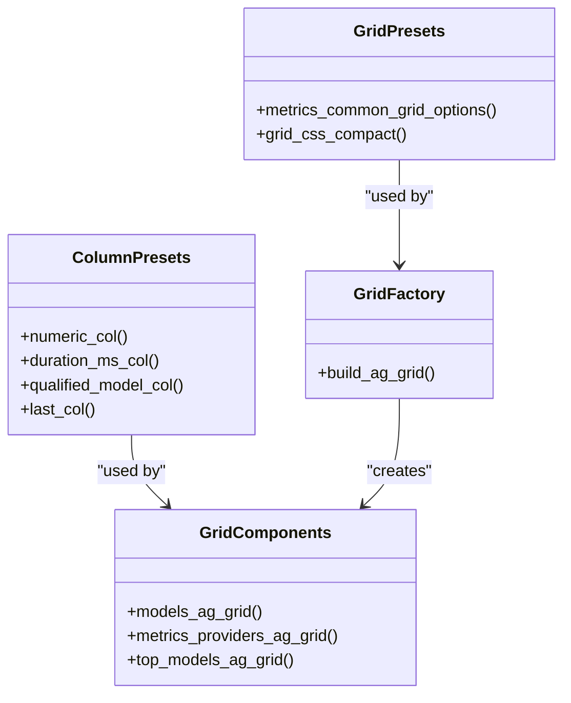
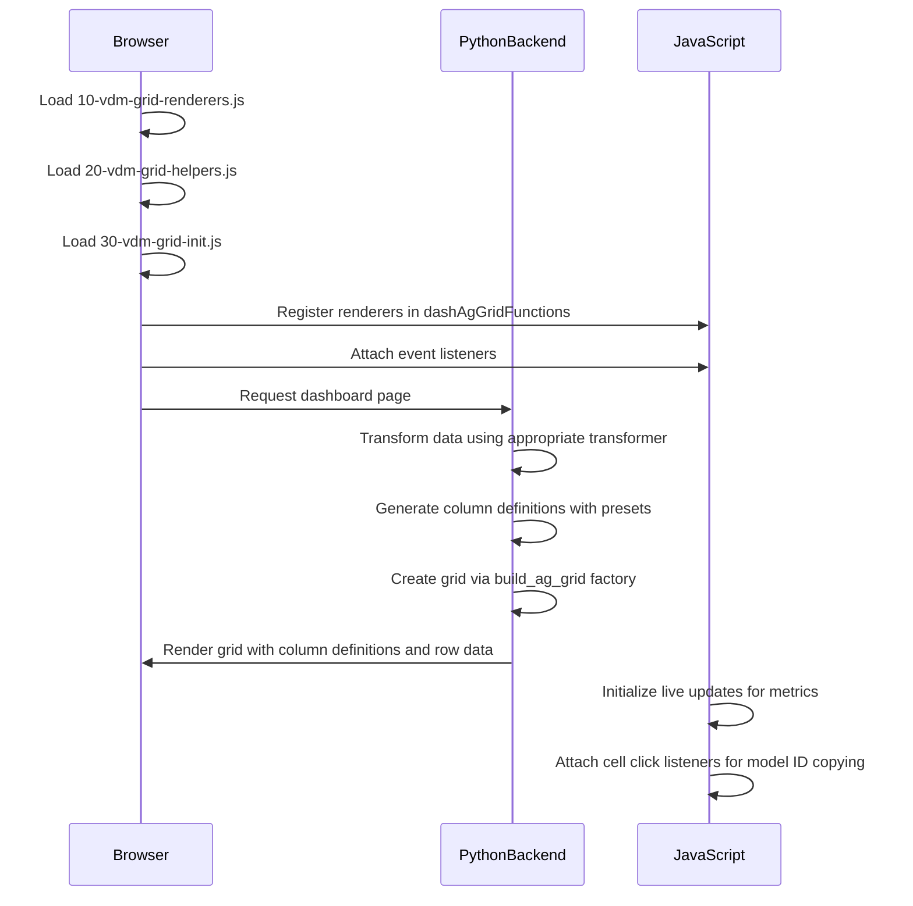

# Grid Initialization Process

<cite>
**Referenced Files in This Document**   
- [30-vdm-grid-init.js](file://assets/ag_grid/30-vdm-grid-init.js)
- [ag_grid.py](file://src/dashboard/components/ag_grid.py)
- [factories.py](file://src/dashboard/ag_grid/factories.py)
- [grid_presets.py](file://src/dashboard/ag_grid/grid_presets.py)
- [column_presets.py](file://src/dashboard/ag_grid/column_presets.py)
- [10-vdm-grid-renderers.js](file://assets/ag_grid/10-vdm-grid-renderers.js)
- [20-vdm-grid-helpers.js](file://assets/ag_grid/20-vdm-grid-helpers.js)
- [transformers.py](file://src/dashboard/ag_grid/transformers.py)
- [scripts.py](file://src/dashboard/ag_grid/scripts.py)
</cite>

## Table of Contents
1. [Introduction](#introduction)
2. [Frontend Initialization Process](#frontend-initialization-process)
3. [Python-Side Grid Configuration](#python-side-grid-configuration)
4. [Grid and Column Presets](#grid-and-column-presets)
5. [Renderer Mappings and Cell Rendering](#renderer-mappings-and-cell-rendering)
6. [Dynamic Column Visibility and Sorting](#dynamic-column-visibility-and-sorting)
7. [Example Grid Configurations](#example-grid-configurations)
8. [Initialization Sequence Diagram](#initialization-sequence-diagram)

## Introduction
The AG Grid initialization process in the dashboard is a coordinated effort between frontend JavaScript and Python backend components. This documentation details how the grid is configured with column definitions, row IDs, and renderer mappings through a combination of reusable presets, factory patterns, and dynamic configuration. The process begins with JavaScript initialization scripts that register custom renderers and helpers, followed by Python components that generate the initial grid structure using factory functions and presets. This architecture enables consistent, maintainable grid configurations across different dashboard pages while supporting dynamic features like column visibility and sorting.

## Frontend Initialization Process
The frontend initialization process for AG Grid begins with the loading of three JavaScript files in sequence: `10-vdm-grid-renderers.js`, `20-vdm-grid-helpers.js`, and `30-vdm-grid-init.js`. This numeric prefixing ensures proper loading order as defined by Dash's asset loading mechanism. The initialization script (`30-vdm-grid-init.js`) performs several critical functions: registering custom cell renderers with the global `dashAgGridFunctions` and `dashAgGridComponentFunctions` objects, attaching event listeners for user interactions like model ID copying, and setting up live update mechanisms for metrics recency indicators. The script uses `requestAnimationFrame` and `setTimeout` to handle cases where the Dash AG Grid API may not be immediately available, ensuring robust initialization across different browser conditions.

**Section sources**
- [30-vdm-grid-init.js](file://assets/ag_grid/30-vdm-grid-init.js#L1-L379)
- [10-vdm-grid-renderers.js](file://assets/ag_grid/10-vdm-grid-renderers.js#L1-L320)
- [20-vdm-grid-helpers.js](file://assets/ag_grid/20-vdm-grid-helpers.js#L1-L129)

## Python-Side Grid Configuration
The Python-side grid configuration is managed through a factory pattern implemented in `src/dashboard/ag_grid/factories.py`. The `build_ag_grid` function serves as the central factory that creates AG Grid components with standardized defaults for styling, behavior, and options. This factory reduces boilerplate by providing common configurations such as dark theme styling (`ag-theme-alpine-dark`), default column behavior (sortable, resizable, filterable), and pagination settings. Grid components in `src/dashboard/components/ag_grid.py` utilize this factory to create specific grid instances, passing in grid-specific column definitions and row data while inheriting the shared defaults. The row data is pre-processed by transformer functions in `transformers.py` that shape the raw data into the format expected by the frontend, including adding computed fields and formatting values.

**Section sources**
- [factories.py](file://src/dashboard/ag_grid/factories.py#L1-L96)
- [ag_grid.py](file://src/dashboard/components/ag_grid.py#L1-L636)
- [transformers.py](file://src/dashboard/ag_grid/transformers.py#L1-L486)

## Grid and Column Presets
The grid initialization process leverages reusable presets to maintain consistency across different dashboard pages. Grid presets in `grid_presets.py` provide standardized configurations for common grid characteristics such as row height and CSS styling. For example, `metrics_common_grid_options` sets a consistent row height for all metrics grids, while `grid_css_compact` provides height-specific CSS for compact grid layouts. Column presets in `column_presets.py` offer composable column definitions that can be reused across different grids. These include `numeric_col` for formatted number display, `duration_ms_col` for duration formatting with tooltips, and `qualified_model_col` for provider-qualified model identifiers. These presets are designed to be small and composable, allowing grid builders to merge and override them as needed while maintaining visual and behavioral consistency across the dashboard.

**Diagram sources **
- [grid_presets.py](file://src/dashboard/ag_grid/grid_presets.py#L1-L26)
- [column_presets.py](file://src/dashboard/ag_grid/column_presets.py#L1-L167)
- [factories.py](file://src/dashboard/ag_grid/factories.py#L1-L96)
- [ag_grid.py](file://src/dashboard/components/ag_grid.py#L1-L636)

## Renderer Mappings and Cell Rendering
Renderer mappings are established through a coordinated process between JavaScript and Python components. Custom cell renderers defined in `10-vdm-grid-renderers.js` (such as `vdmModelIdWithIconRenderer` and `vdmProviderBadgeRenderer`) are registered with the global `dashAgGridFunctions` and `dashAgGridComponentFunctions` objects by the initialization script. These renderers are then referenced by name in the column definitions generated by Python code. For example, the "Model ID" column uses `cellRenderer: "vdmModelIdWithIconRenderer"` to display model IDs with provider icons, while the "Provider" column uses `cellRenderer: "vdmProviderBadgeRenderer"` to display styled provider badges. Helper functions from `20-vdm-grid-helpers.js` are similarly mapped, such as `vdmDateComparator` for date sorting and `vdmFormatDurationValue` for duration formatting in value getters. This mapping allows the Python code to reference JavaScript functions by name without embedding JavaScript code directly.

**Section sources**
- [10-vdm-grid-renderers.js](file://assets/ag_grid/10-vdm-grid-renderers.js#L1-L320)
- [20-vdm-grid-helpers.js](file://assets/ag_grid/20-vdm-grid-helpers.js#L1-L129)
- [30-vdm-grid-init.js](file://assets/ag_grid/30-vdm-grid-init.js#L1-L379)
- [ag_grid.py](file://src/dashboard/components/ag_grid.py#L1-L636)

## Dynamic Column Visibility and Sorting
Dynamic column visibility and sorting are initialized through a combination of default configurations and user preferences. Column definitions include `sortable: True` and `filter: True` by default, enabling these features for all columns unless explicitly disabled. Default sorting is configured through the `sort` property in column definitions, such as the "Created" column which defaults to descending order to show newest models first. The factory configuration includes `animateRows: True` and `ensureDomOrder: True` to maintain visual consistency during sorting and filtering operations. Column visibility is controlled through the grid's built-in column management features, with initial visibility determined by the presence of columns in the column definitions array. The `flex` and `width` properties in column definitions control how columns resize and distribute space, with some columns using fixed widths and others using flexible sizing to adapt to container dimensions.

**Section sources**
- [factories.py](file://src/dashboard/ag_grid/factories.py#L1-L96)
- [ag_grid.py](file://src/dashboard/components/ag_grid.py#L1-L636)
- [column_presets.py](file://src/dashboard/ag_grid/column_presets.py#L1-L167)

## Example Grid Configurations
Example grid configurations demonstrate how the factory pattern and presets are used to create specific grid instances. The models grid (`models_ag_grid`) defines a column layout with "Created" date, "Actions" link, "Sub-Provider", "Model ID" with icon, and various metadata columns. It uses the base factory configuration with overrides for default sorting. The metrics providers grid (`metrics_providers_ag_grid`) uses the `metrics_common_grid_options` preset for consistent row height and applies the `grid_css_compact` preset for compact styling. It includes specialized columns like `duration_ms_col` for average duration display and `numeric_col` for formatted number rendering. The top models grid (`top_models_ag_grid`) showcases a simpler configuration with provider, sub-provider, model ID, name, context window, and pricing information, using standard column definitions without extensive customization. Each grid configuration demonstrates the balance between reusable presets and grid-specific requirements.

**Section sources**
- [ag_grid.py](file://src/dashboard/components/ag_grid.py#L1-L636)
- [grid_presets.py](file://src/dashboard/ag_grid/grid_presets.py#L1-L26)
- [column_presets.py](file://src/dashboard/ag_grid/column_presets.py#L1-L167)

## Initialization Sequence Diagram
The complete initialization sequence for AG Grid involves multiple coordinated steps between the frontend and backend. The process begins with the browser loading the JavaScript assets in order, followed by the registration of renderers and setup of event listeners. Simultaneously, the Python backend processes the page request, transforms the data through the appropriate transformer function, and generates the grid configuration using the factory pattern. The final grid component is rendered with the pre-configured column definitions and row data, at which point the frontend JavaScript components attach event listeners and initialize live update mechanisms.

**Diagram sources **
- [30-vdm-grid-init.js](file://assets/ag_grid/30-vdm-grid-init.js#L1-L379)
- [ag_grid.py](file://src/dashboard/components/ag_grid.py#L1-L636)
- [factories.py](file://src/dashboard/ag_grid/factories.py#L1-L96)
- [transformers.py](file://src/dashboard/ag_grid/transformers.py#L1-L486)