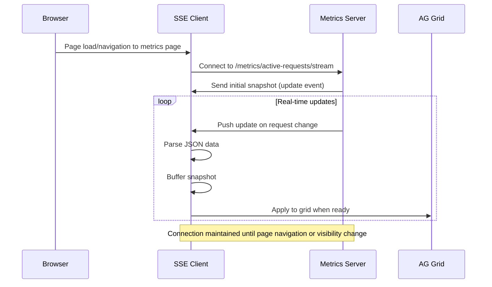
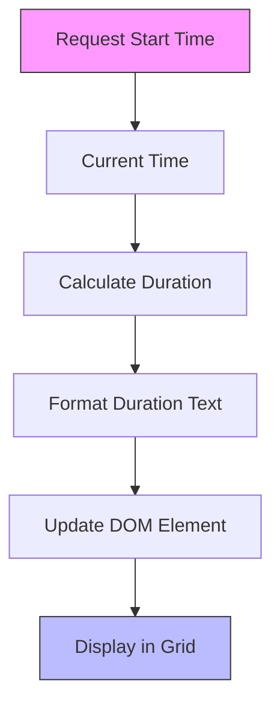
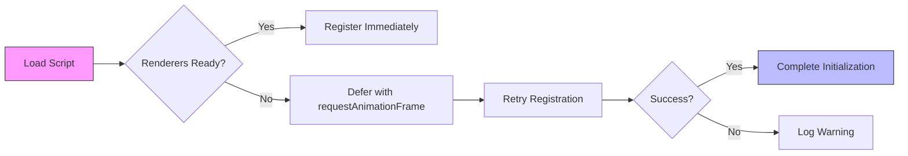
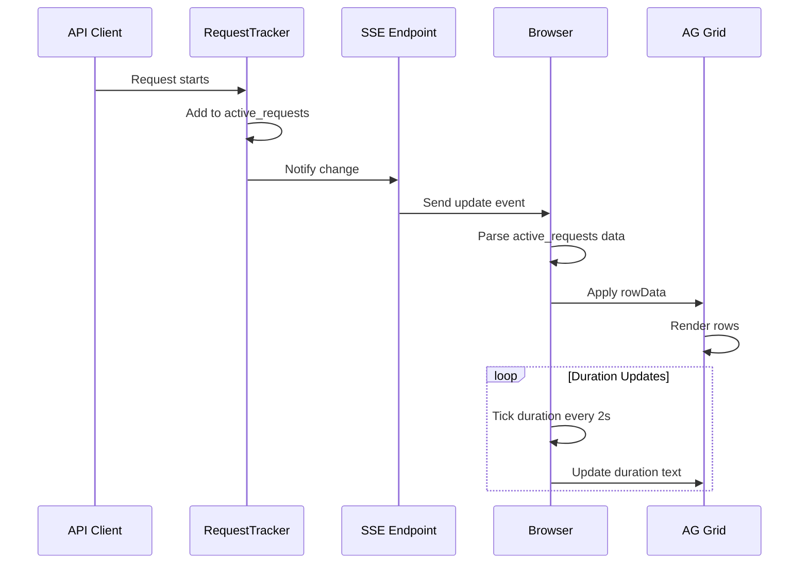

# Real-Time Monitoring

<cite>
**Referenced Files in This Document**   
- [26-vdm-active-requests-sse.js](file://assets/ag_grid/26-vdm-active-requests-sse.js)
- [25-vdm-metrics-active-requests.js](file://assets/ag_grid/25-vdm-metrics-active-requests.js)
- [30-vdm-grid-init.js](file://assets/ag_grid/30-vdm-grid-init.js)
- [metrics.py](file://src/dashboard/services/metrics.py)
- [data_sources.py](file://src/dashboard/data_sources.py)
- [transformers.py](file://src/dashboard/ag_grid/transformers.py)
- [column_presets.py](file://src/dashboard/ag_grid/column_presets.py)
- [ag_grid.py](file://src/dashboard/components/ag_grid.py)
- [tracker.py](file://src/core/metrics/tracker/tracker.py)
- [metrics.py](file://src/api/metrics.py)
</cite>

## Table of Contents
1. [Introduction](#introduction)
2. [Server-Sent Events (SSE) Integration](#server-sent-events-sse-integration)
3. [Active Requests Grid Rendering](#active-requests-grid-rendering)
4. [Grid Initialization Process](#grid-initialization-process)
5. [Data Flow from Backend to Frontend](#data-flow-from-backend-to-frontend)
6. [Interpreting Active Request Metrics](#interpreting-active-request-metrics)
7. [Troubleshooting Performance Issues](#troubleshooting-performance-issues)
8. [Customization and Extension](#customization-and-extension)

## Introduction
The real-time monitoring system provides live visibility into active requests flowing through the proxy service. This documentation explains how Server-Sent Events (SSE) deliver real-time data to the dashboard, how the AG Grid component renders active requests, and how the initialization process integrates with the metrics service. The system enables operators to monitor request metrics, identify bottlenecks, and troubleshoot performance issues in real time.

## Server-Sent Events (SSE) Integration

The `26-vdm-active-requests-sse.js` file implements a Server-Sent Events (SSE) client that establishes a persistent connection to the backend metrics service. This connection enables real-time updates of active requests without requiring periodic polling from the client side.

The SSE integration works as follows:
- The client connects to the `/metrics/active-requests/stream` endpoint to receive a continuous stream of updates
- When new requests start or complete, the server pushes updated snapshots of active requests through the SSE connection
- The client buffers incoming snapshots and applies them to the AG Grid when the grid API becomes available
- A connection indicator shows the current SSE status (connected or reconnecting)
- The system automatically reconnects with exponential backoff if the connection is lost
- Navigation events and page visibility changes are monitored to connect/disconnect appropriately

The SSE client handles two event types:
- `update`: Contains a JSON payload with the current snapshot of active requests
- `disabled`: Indicates that metrics are disabled, causing the client to fall back to polling

**Diagram sources**
- [26-vdm-active-requests-sse.js](file://assets/ag_grid/26-vdm-active-requests-sse.js#L1-L316)

**Section sources**
- [26-vdm-active-requests-sse.js](file://assets/ag_grid/26-vdm-active-requests-sse.js#L1-L316)

## Active Requests Grid Rendering

The `25-vdm-metrics-active-requests.js` file implements a custom ticker system that updates the duration display in the active requests grid. Unlike other recency indicators in the dashboard, this component specifically formats elapsed time as duration (e.g., "12s", "3m 04s") rather than "Xs ago" text.

Key features of the duration ticker:
- Updates at a configurable interval (default 2 seconds)
- Uses `performance.now()` for smooth timing without blocking the main thread
- Supports configuration via UI controls or localStorage
- Only updates duration cells marked with a specific CSS class
- Runs efficiently by checking for visible page state before updating

The rendering process transforms raw request data into display-ready values:
- Request start time is converted to epoch milliseconds
- Current duration is calculated as the difference between now and start time
- Duration values are formatted using the shared `vdmFormatDurationValue` function
- Text updates are throttled to prevent excessive DOM manipulation

**Diagram sources**
- [25-vdm-metrics-active-requests.js](file://assets/ag_grid/25-vdm-metrics-active-requests.js#L1-L95)

**Section sources**
- [25-vdm-metrics-active-requests.js](file://assets/ag_grid/25-vdm-metrics-active-requests.js#L1-L95)

## Grid Initialization Process

The `30-vdm-grid-init.js` file handles the initialization of AG Grid components across the dashboard. This script ensures that custom renderers and helper functions are properly registered and available when the grid components are rendered.

The initialization process includes:
- Registering custom cell renderers in the global `dashAgGridFunctions` and `dashAgGridComponentFunctions` objects
- Setting up toast notification functionality through hidden Dash buttons
- Attaching model cell copy listeners for easy copying of model IDs
- Implementing user activity tracking to optimize polling behavior
- Establishing a global recency ticker for live updates of time-based indicators

The script uses `requestAnimationFrame` to defer registration until renderer functions are defined, ensuring reliable initialization even when script loading order varies. It also implements idempotent attachment to prevent duplicate event listeners.

**Diagram sources**
- [30-vdm-grid-init.js](file://assets/ag_grid/30-vdm-grid-init.js#L1-L379)

**Section sources**
- [30-vdm-grid-init.js](file://assets/ag_grid/30-vdm-grid-init.js#L1-L379)

## Data Flow from Backend to Frontend

The data flow from the backend metrics service to the frontend visualization involves multiple components working together to provide real-time monitoring capabilities.

On the server side:
- The `RequestTracker` class in `tracker.py` maintains in-memory state of active requests
- When requests start or complete, the tracker updates its internal state and notifies listeners
- The SSE endpoint in `src/api/metrics.py` streams updates by listening for changes and sending snapshots
- Configuration settings control SSE behavior (enabled, interval, heartbeat)

On the client side:
- The dashboard service in `src/dashboard/services/metrics.py` orchestrates the view construction
- Data sources in `data_sources.py` fetch metrics from the API endpoints
- Transformers in `transformers.py` convert raw data into grid-ready row data
- The AG Grid component in `ag_grid.py` renders the data with appropriate column definitions

The complete data flow:
1. Client requests start/end → RequestTracker updates state
2. RequestTracker notifies SSE listeners of changes
3. SSE endpoint pushes updated snapshot to connected clients
4. Browser receives update event and parses JSON data
5. Data is transformed and applied to AG Grid
6. Duration ticker updates elapsed time displays

**Diagram sources**
- [metrics.py](file://src/api/metrics.py#L81-L173)
- [tracker.py](file://src/core/metrics/tracker/tracker.py#L1-L490)
- [metrics.py](file://src/dashboard/services/metrics.py#L1-L67)
- [data_sources.py](file://src/dashboard/data_sources.py#L1-L362)
- [transformers.py](file://src/dashboard/ag_grid/transformers.py#L1-L486)
- [ag_grid.py](file://src/dashboard/components/ag_grid.py#L1-L636)

**Section sources**
- [metrics.py](file://src/api/metrics.py#L81-L173)
- [tracker.py](file://src/core/metrics/tracker/tracker.py#L1-L490)
- [metrics.py](file://src/dashboard/services/metrics.py#L1-L67)
- [data_sources.py](file://src/dashboard/data_sources.py#L1-L362)
- [transformers.py](file://src/dashboard/ag_grid/transformers.py#L1-L486)
- [ag_grid.py](file://src/dashboard/components/ag_grid.py#L1-L636)

## Interpreting Active Request Metrics

The active requests grid displays key metrics for each in-flight request:

- **Duration**: Elapsed time since request started, updated in real-time
- **Model**: Requested model name, with provider prefix if applicable
- **Resolved Model**: Final model name after alias resolution
- **Streaming**: Indicates whether the request is streaming responses
- **Token Counts**: Input, output, cache read, and cache creation token counts
- **Tool Usage**: Number of tool calls, uses, and results
- **Request Size**: Size of the request payload
- **Message Count**: Number of messages in the conversation

Key indicators for identifying bottlenecks:
- Long durations may indicate slow provider responses
- High token counts could suggest expensive requests
- Streaming requests that remain active for extended periods may be stuck
- Requests with high tool usage might be complex or recursive

The grid is sorted by recency (most recent first) and updates in real-time as requests progress. The provider badge colors help quickly identify which provider is handling each request.

**Section sources**
- [26-vdm-active-requests-sse.js](file://assets/ag_grid/26-vdm-active-requests-sse.js#L46-L78)
- [transformers.py](file://src/dashboard/ag_grid/transformers.py#L283-L332)
- [ag_grid.py](file://src/dashboard/components/ag_grid.py#L33-L80)

## Troubleshooting Performance Issues

Common issues and their solutions:

**SSE Connection Problems**
- Check that `VDM_ACTIVE_REQUESTS_SSE_ENABLED=true` is set in environment
- Verify the browser supports EventSource API
- Ensure the dashboard is on the metrics page and visible
- Check browser console for connection errors

**Missing or Stale Data**
- Confirm `LOG_REQUEST_METRICS=true` is set to enable metrics collection
- Verify the RequestTracker is receiving request events
- Check that the SSE stream is not being blocked by network policies
- Ensure the grid initialization script has loaded successfully

**Performance Bottlenecks**
- Monitor for requests with unusually long durations
- Identify models with high error rates
- Watch for patterns of failed requests to specific providers
- Check for excessive token usage that might indicate inefficient prompts

Diagnostic steps:
1. Verify SSE connection status indicator
2. Check browser developer tools for network errors
3. Examine console logs for JavaScript errors
4. Review server logs for metrics collection issues
5. Validate configuration settings for metrics and SSE

**Section sources**
- [26-vdm-active-requests-sse.js](file://assets/ag_grid/26-vdm-active-requests-sse.js#L167-L280)
- [metrics.py](file://src/api/metrics.py#L97-L122)
- [tracker.py](file://src/core/metrics/tracker/tracker.py#L1-L490)

## Customization and Extension

The monitoring system can be extended with additional real-time metrics by following these patterns:

**Adding New Metrics**
1. Extend the `RequestMetrics` model to include new fields
2. Update the `get_active_requests_snapshot` method to include new data
3. Modify the `formatActiveRequestsRowData` function to transform new fields
4. Update the AG Grid column definitions to display new metrics

**Customizing the View**
- Adjust the duration update interval by modifying the `DEFAULT_TICK_MS` constant
- Change the grid height by updating the `custom_css` parameter in `build_ag_grid`
- Add new columns by extending the `column_defs` array in `metrics_active_requests_ag_grid`
- Modify the connection indicator styling by updating the `updateConnectionIndicator` function

**Configuration Options**
- `VDM_ACTIVE_REQUESTS_SSE_ENABLED`: Enable/disable SSE functionality
- `VDM_ACTIVE_REQUESTS_SSE_INTERVAL`: Update interval in seconds
- `VDM_ACTIVE_REQUESTS_SSE_HEARTBEAT`: Heartbeat interval in seconds
- `LOG_REQUEST_METRICS`: Enable/disable metrics collection

The system's modular design allows for easy extension while maintaining real-time performance characteristics.

**Section sources**
- [25-vdm-metrics-active-requests.js](file://assets/ag_grid/25-vdm-metrics-active-requests.js#L17-L37)
- [26-vdm-active-requests-sse.js](file://assets/ag_grid/26-vdm-active-requests-sse.js#L13-L14)
- [30-vdm-grid-init.js](file://assets/ag_grid/30-vdm-grid-init.js#L110-L139)
- [ag_grid.py](file://src/dashboard/components/ag_grid.py#L33-L80)
- [transformers.py](file://src/dashboard/ag_grid/transformers.py#L283-L332)