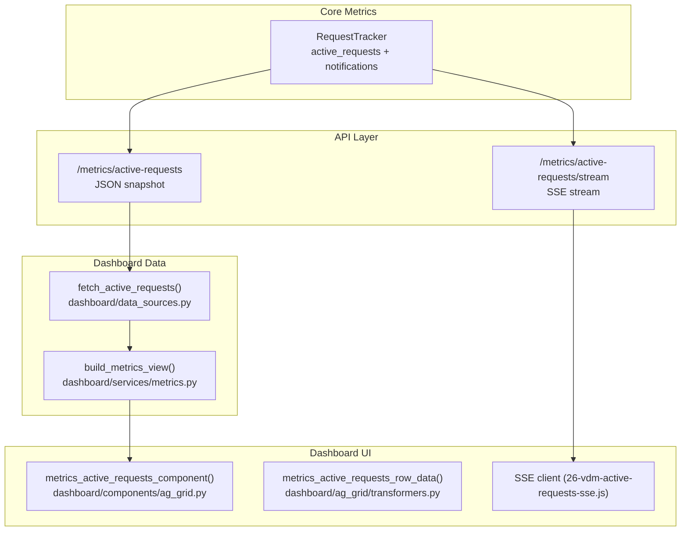
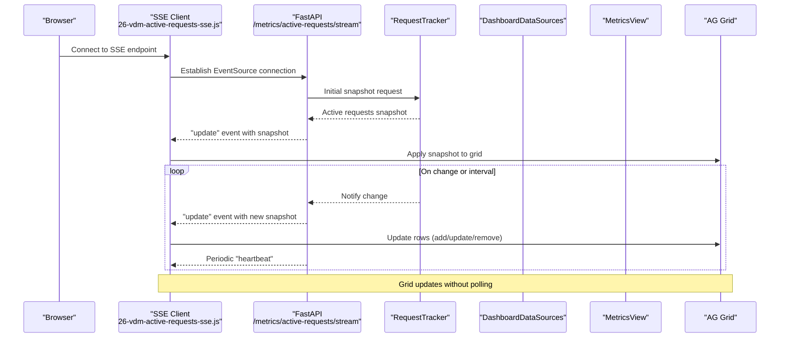
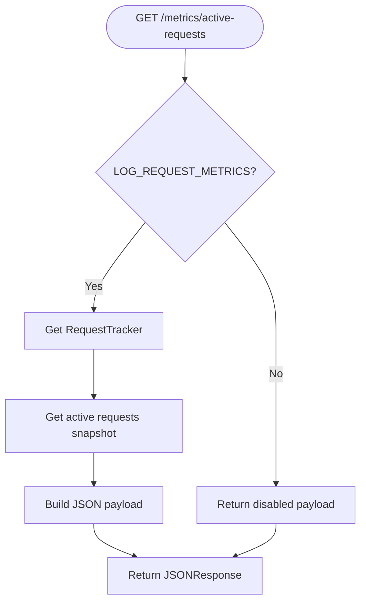
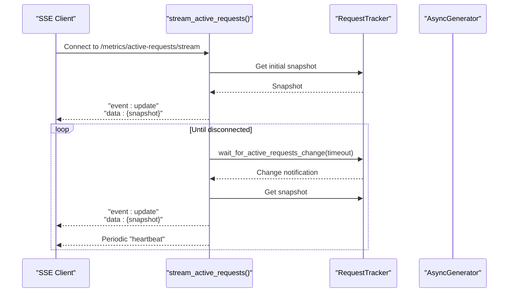
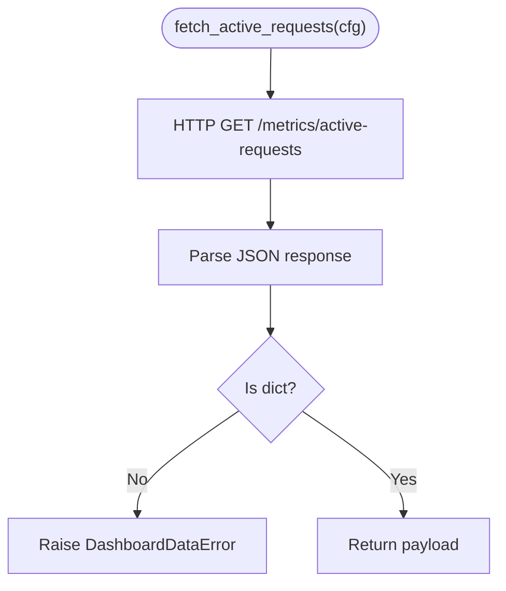
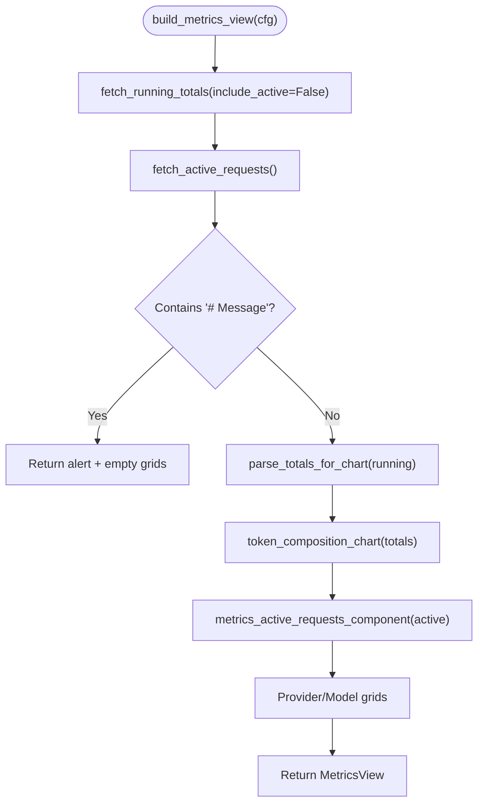
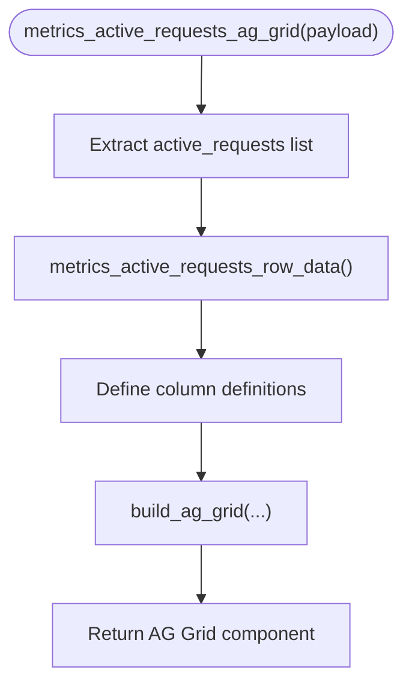
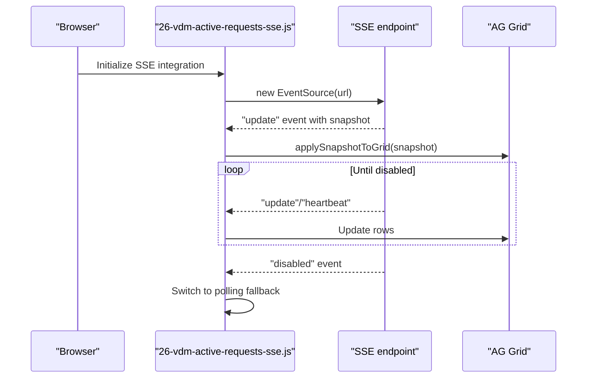
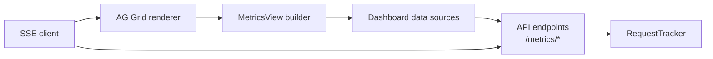

# Backend Streaming Implementation

<cite>
**Referenced Files in This Document**
- [data_sources.py](file://src/dashboard/data_sources.py)
- [metrics.py](file://src/dashboard/services/metrics.py)
- [metrics.py](file://src/api/metrics.py)
- [tracker.py](file://src/core/metrics/tracker/tracker.py)
- [streaming.py](file://src/api/services/streaming.py)
- [config.py](file://src/core/config.py)
- [ag_grid.py](file://src/dashboard/components/ag_grid.py)
- [transformers.py](file://src/dashboard/ag_grid/transformers.py)
- [26-vdm-active-requests-sse.js](file://assets/ag_grid/26-vdm-active-requests-sse.js)
- [25-vdm-metrics-active-requests.js](file://assets/ag_grid/25-vdm-metrics-active-requests.js)
- [metrics.py](file://src/dashboard/callbacks/metrics.py)
</cite>

## Table of Contents
1. [Introduction](#introduction)
2. [Project Structure](#project-structure)
3. [Core Components](#core-components)
4. [Architecture Overview](#architecture-overview)
5. [Detailed Component Analysis](#detailed-component-analysis)
6. [Dependency Analysis](#dependency-analysis)
7. [Performance Considerations](#performance-considerations)
8. [Troubleshooting Guide](#troubleshooting-guide)
9. [Conclusion](#conclusion)

## Introduction
This document explains the backend implementation of Server-Sent Events (SSE) streaming for active request monitoring in the dashboard. It covers how the Python backend prepares active request data via the fetch_active_requests function, integrates it into the MetricsView through build_metrics_view, and documents the data flow from the core metrics tracker to the dashboard endpoint. It also describes the /metrics/active-requests endpoint and the SSE streaming endpoint that powers real-time updates, details the active requests payload structure, and outlines configuration requirements and performance considerations for high-volume streaming.

## Project Structure
The streaming pipeline spans several layers:
- API endpoints expose metrics and streaming
- Core metrics tracker maintains in-memory state and notifies listeners
- Dashboard data sources fetch metrics snapshots and transform them
- Dashboard services assemble the view and render grids
- Frontend consumes SSE to update the Active Requests grid

**Diagram sources**
- [metrics.py](file://src/api/metrics.py#L53-L78)
- [metrics.py](file://src/api/metrics.py#L81-L173)
- [tracker.py](file://src/core/metrics/tracker/tracker.py#L185-L239)
- [data_sources.py](file://src/dashboard/data_sources.py#L99-L114)
- [metrics.py](file://src/dashboard/services/metrics.py#L34-L66)
- [ag_grid.py](file://src/dashboard/components/ag_grid.py#L33-L94)
- [transformers.py](file://src/dashboard/ag_grid/transformers.py#L283-L332)
- [26-vdm-active-requests-sse.js](file://assets/ag_grid/26-vdm-active-requests-sse.js#L1-L205)

**Section sources**
- [metrics.py](file://src/api/metrics.py#L53-L78)
- [metrics.py](file://src/api/metrics.py#L81-L173)
- [tracker.py](file://src/core/metrics/tracker/tracker.py#L185-L239)
- [data_sources.py](file://src/dashboard/data_sources.py#L99-L114)
- [metrics.py](file://src/dashboard/services/metrics.py#L34-L66)
- [ag_grid.py](file://src/dashboard/components/ag_grid.py#L33-L94)
- [transformers.py](file://src/dashboard/ag_grid/transformers.py#L283-L332)
- [26-vdm-active-requests-sse.js](file://assets/ag_grid/26-vdm-active-requests-sse.js#L1-L205)

## Core Components
- Active requests snapshot endpoint: Returns a JSON payload with active_requests list and metadata.
- SSE streaming endpoint: Pushes updates on change with periodic heartbeats.
- Dashboard data source: Fetches the active requests payload and validates shape.
- Metrics view builder: Assembles dashboard fragments using the active requests payload.
- Grid renderer: Transforms active requests into AG Grid row data and renders columns.
- SSE client: Connects to the SSE endpoint, applies snapshots, and updates the grid.

Key responsibilities:
- API layer: Expose endpoints, enforce metrics enablement, and format SSE events.
- Core metrics: Track active requests, compute snapshots, and notify listeners.
- Dashboard layer: Fetch, validate, transform, and render active requests.
- Frontend: Consume SSE updates and drive grid updates.

**Section sources**
- [metrics.py](file://src/api/metrics.py#L53-L78)
- [metrics.py](file://src/api/metrics.py#L81-L173)
- [tracker.py](file://src/core/metrics/tracker/tracker.py#L185-L239)
- [data_sources.py](file://src/dashboard/data_sources.py#L99-L114)
- [metrics.py](file://src/dashboard/services/metrics.py#L34-L66)
- [ag_grid.py](file://src/dashboard/components/ag_grid.py#L33-L94)
- [transformers.py](file://src/dashboard/ag_grid/transformers.py#L283-L332)
- [26-vdm-active-requests-sse.js](file://assets/ag_grid/26-vdm-active-requests-sse.js#L1-L205)

## Architecture Overview
The streaming architecture consists of:
- RequestTracker maintains active_requests and emits change notifications
- API endpoints serve JSON snapshots and SSE streams
- Dashboard data sources and services prepare view fragments
- AG Grid renders the Active Requests table with real-time updates
- SSE client consumes events and updates the grid without server round-trips

**Diagram sources**
- [metrics.py](file://src/api/metrics.py#L81-L173)
- [tracker.py](file://src/core/metrics/tracker/tracker.py#L249-L290)
- [data_sources.py](file://src/dashboard/data_sources.py#L99-L114)
- [metrics.py](file://src/dashboard/services/metrics.py#L34-L66)
- [ag_grid.py](file://src/dashboard/components/ag_grid.py#L33-L94)
- [26-vdm-active-requests-sse.js](file://assets/ag_grid/26-vdm-active-requests-sse.js#L167-L184)

## Detailed Component Analysis

### Active Requests Snapshot Endpoint
- Purpose: Serve a JSON snapshot of currently active requests for the dashboard.
- Behavior:
  - Validates metrics enablement via LOG_REQUEST_METRICS.
  - Returns structured payload with active_requests list and metadata.
  - Disables response with guidance when metrics are off.
- Payload shape:
  - disabled: boolean indicating metrics status
  - active_requests: list of active request records
  - Additional metadata may be included depending on implementation

**Diagram sources**
- [metrics.py](file://src/api/metrics.py#L53-L78)
- [tracker.py](file://src/core/metrics/tracker/tracker.py#L185-L239)

**Section sources**
- [metrics.py](file://src/api/metrics.py#L53-L78)
- [tracker.py](file://src/core/metrics/tracker/tracker.py#L185-L239)

### SSE Streaming Endpoint
- Purpose: Provide real-time updates for active requests via Server-Sent Events.
- Behavior:
  - Validates metrics enablement and SSE enablement via configuration.
  - Streams initial snapshot immediately upon connection.
  - Waits for change notifications or intervals, sending updates only when snapshots differ.
  - Emits periodic heartbeat comments to keep connections alive.
  - Supports graceful shutdown on client disconnect.
- SSE events:
  - update: Contains active_requests snapshot and timestamp
  - disabled: Single event when metrics are disabled
  - heartbeat: Keep-alive comment every configured interval

**Diagram sources**
- [metrics.py](file://src/api/metrics.py#L81-L173)
- [tracker.py](file://src/core/metrics/tracker/tracker.py#L249-L290)

**Section sources**
- [metrics.py](file://src/api/metrics.py#L81-L173)
- [tracker.py](file://src/core/metrics/tracker/tracker.py#L249-L290)

### Dashboard Data Source: fetch_active_requests
- Purpose: Fetch active requests from the API and validate response shape.
- Behavior:
  - Calls GET /metrics/active-requests
  - Parses JSON response
  - Validates payload type and structure
  - Raises DashboardDataError on parsing or shape mismatches
- Integration: Used by build_metrics_view to populate the Active Requests grid.

**Diagram sources**
- [data_sources.py](file://src/dashboard/data_sources.py#L99-L114)

**Section sources**
- [data_sources.py](file://src/dashboard/data_sources.py#L99-L114)

### MetricsView Builder: build_metrics_view
- Purpose: Assemble dashboard view fragments using metrics data.
- Behavior:
  - Fetches running totals (excluding active) and active requests concurrently
  - Handles disabled metrics scenario with alert UI
  - Builds token chart, Active Requests grid, provider breakdown, and model breakdown
- Integration: The Active Requests grid is populated using the active requests payload.

**Diagram sources**
- [metrics.py](file://src/dashboard/services/metrics.py#L34-L66)
- [data_sources.py](file://src/dashboard/data_sources.py#L99-L114)

**Section sources**
- [metrics.py](file://src/dashboard/services/metrics.py#L34-L66)
- [data_sources.py](file://src/dashboard/data_sources.py#L99-L114)

### Active Requests Grid Renderer
- Purpose: Render the Active Requests grid with appropriate columns and transformations.
- Behavior:
  - Converts active_requests payload into AG Grid row data
  - Ensures provider badge fields and recency fields for duration rendering
  - Defines columns: duration, model, resolved model, streaming flag, token counts, and request id
  - Uses deterministic row IDs for SSE transactions

**Diagram sources**
- [ag_grid.py](file://src/dashboard/components/ag_grid.py#L33-L94)
- [transformers.py](file://src/dashboard/ag_grid/transformers.py#L283-L332)

**Section sources**
- [ag_grid.py](file://src/dashboard/components/ag_grid.py#L33-L94)
- [transformers.py](file://src/dashboard/ag_grid/transformers.py#L283-L332)

### SSE Client Integration
- Purpose: Consume SSE updates and apply them to the Active Requests grid without server round-trips.
- Behavior:
  - Connects to /metrics/active-requests/stream via EventSource
  - Buffers latest snapshot until grid API is ready
  - Applies snapshots to the grid, deduplicating by request_id
  - Falls back to polling when metrics are disabled
  - Updates connection indicator and handles reconnection with backoff

**Diagram sources**
- [26-vdm-active-requests-sse.js](file://assets/ag_grid/26-vdm-active-requests-sse.js#L167-L184)
- [26-vdm-active-requests-sse.js](file://assets/ag_grid/26-vdm-active-requests-sse.js#L119-L184)

**Section sources**
- [26-vdm-active-requests-sse.js](file://assets/ag_grid/26-vdm-active-requests-sse.js#L1-L205)

## Dependency Analysis
The streaming pipeline exhibits clear separation of concerns:
- API endpoints depend on RequestTracker for snapshots and change notifications
- Dashboard data sources depend on API endpoints for metrics payloads
- Dashboard services depend on data sources and AG Grid transformers
- Frontend SSE client depends on API endpoints and grid rendering

**Diagram sources**
- [metrics.py](file://src/api/metrics.py#L53-L173)
- [tracker.py](file://src/core/metrics/tracker/tracker.py#L185-L290)
- [data_sources.py](file://src/dashboard/data_sources.py#L99-L114)
- [metrics.py](file://src/dashboard/services/metrics.py#L34-L66)
- [ag_grid.py](file://src/dashboard/components/ag_grid.py#L33-L94)
- [26-vdm-active-requests-sse.js](file://assets/ag_grid/26-vdm-active-requests-sse.js#L1-L205)

**Section sources**
- [metrics.py](file://src/api/metrics.py#L53-L173)
- [tracker.py](file://src/core/metrics/tracker/tracker.py#L185-L290)
- [data_sources.py](file://src/dashboard/data_sources.py#L99-L114)
- [metrics.py](file://src/dashboard/services/metrics.py#L34-L66)
- [ag_grid.py](file://src/dashboard/components/ag_grid.py#L33-L94)
- [26-vdm-active-requests-sse.js](file://assets/ag_grid/26-vdm-active-requests-sse.js#L1-L205)

## Performance Considerations
- SSE configuration:
  - Enable/disable SSE via VDM_ACTIVE_REQUESTS_SSE_ENABLED
  - Tune update interval with VDM_ACTIVE_REQUESTS_SSE_INTERVAL (default 2.0s)
  - Configure heartbeat interval with VDM_ACTIVE_REQUESTS_SSE_HEARTBEAT (default 30.0s)
- Metrics enablement:
  - LOG_REQUEST_METRICS controls whether metrics are tracked and exposed
  - When disabled, SSE returns a single "disabled" event and falls back to polling
- Concurrency and notifications:
  - RequestTracker uses a condition with version counters to reliably notify multiple concurrent SSE clients
  - Snapshots are computed under lock to avoid race conditions
- Frontend buffering:
  - Latest snapshot is buffered until the grid API is ready to prevent missed updates
  - Deduplication by request_id ensures stable grid updates
- High-volume scenarios:
  - Keep intervals reasonable to balance responsiveness and bandwidth
  - Monitor SSE client reconnection behavior and adjust heartbeat intervals accordingly
  - Consider disabling SSE in environments where frequent updates are unnecessary

**Section sources**
- [config.py](file://src/core/config.py#L140-L149)
- [metrics.py](file://src/api/metrics.py#L81-L173)
- [tracker.py](file://src/core/metrics/tracker/tracker.py#L55-L64)
- [26-vdm-active-requests-sse.js](file://assets/ag_grid/26-vdm-active-requests-sse.js#L15-L205)

## Troubleshooting Guide
Common issues and resolutions:
- Metrics disabled:
  - Symptom: SSE returns "disabled" event and client falls back to polling
  - Resolution: Set LOG_REQUEST_METRICS=true and ensure VDM_ACTIVE_REQUESTS_SSE_ENABLED=true
- SSE endpoint unavailable:
  - Symptom: 503 response with disabled payload
  - Resolution: Verify VDM_ACTIVE_REQUESTS_SSE_ENABLED=true and that the endpoint is reachable
- Parsing errors:
  - Symptom: DashboardDataError when fetching active requests
  - Resolution: Ensure API returns valid JSON with expected structure
- Grid not updating:
  - Symptom: Active Requests grid remains stale
  - Resolution: Check SSE connection status, heartbeat presence, and frontend buffering logic
- High CPU usage:
  - Symptom: Elevated CPU during high request volume
  - Resolution: Increase VDM_ACTIVE_REQUESTS_SSE_INTERVAL and monitor SSE client reconnections

**Section sources**
- [metrics.py](file://src/api/metrics.py#L81-L173)
- [data_sources.py](file://src/dashboard/data_sources.py#L99-L114)
- [26-vdm-active-requests-sse.js](file://assets/ag_grid/26-vdm-active-requests-sse.js#L167-L184)

## Conclusion
The backend streaming implementation provides a robust, low-latency mechanism for displaying active requests in the dashboard. The RequestTracker centralizes active request state and notifications, the API exposes both snapshot and streaming endpoints, and the dashboard integrates these seamlessly with AG Grid and SSE clients. Proper configuration of metrics enablement and SSE parameters ensures optimal performance and reliability, especially under high-volume conditions.