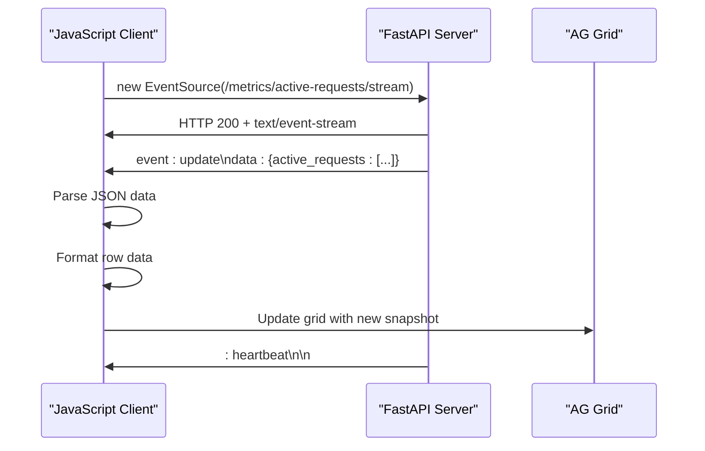
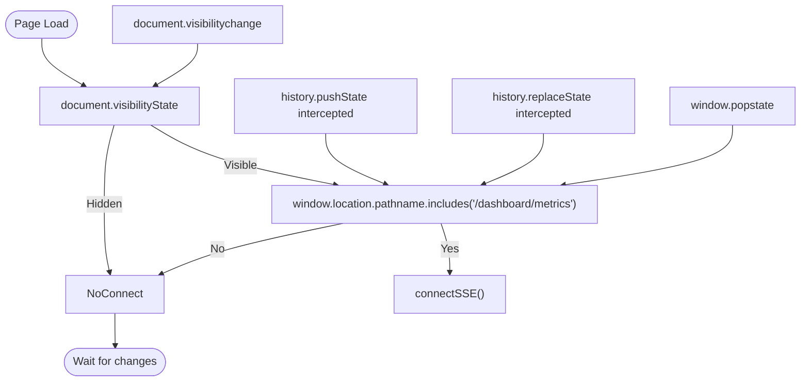
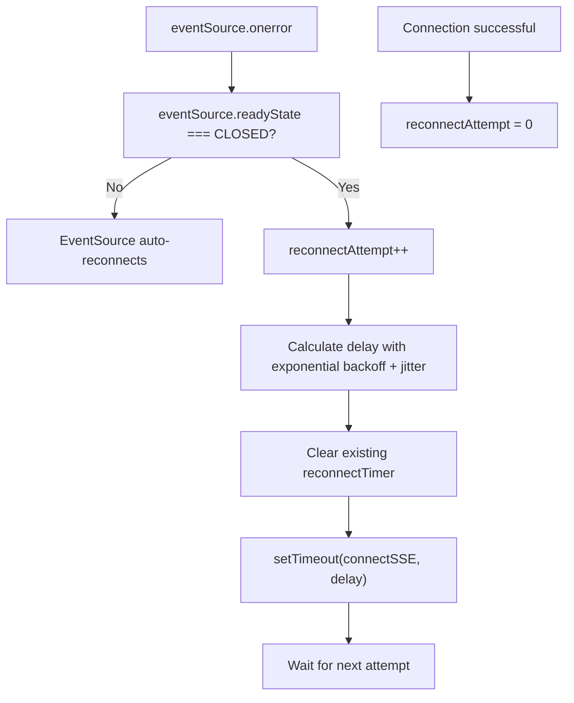
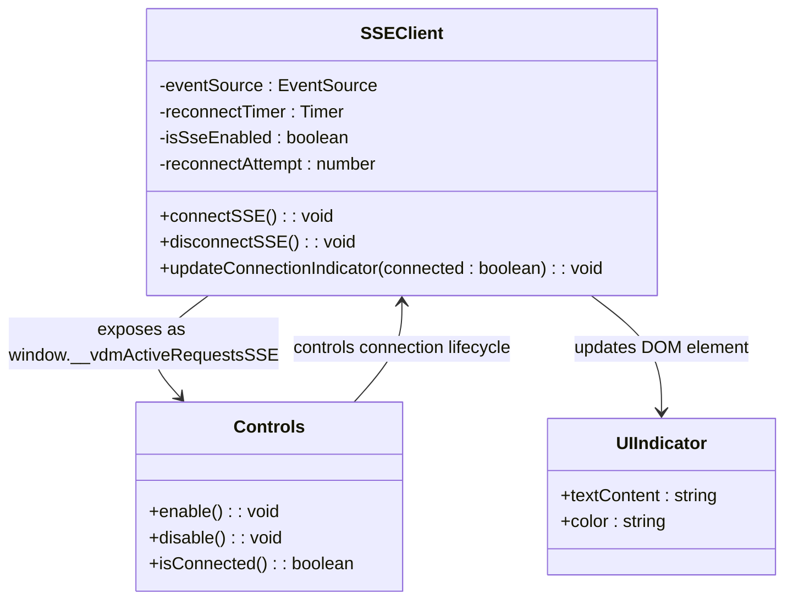

# SSE Connection Lifecycle Management

<cite>
**Referenced Files in This Document**   
- [26-vdm-active-requests-sse.js](file://assets/ag_grid/26-vdm-active-requests-sse.js)
- [metrics.py](file://src/api/metrics.py)
- [config.py](file://src/core/config.py)
- [metrics.py](file://src/dashboard/callbacks/metrics.py)
</cite>

## Table of Contents
1. [Introduction](#introduction)
2. [SSE Connection Establishment](#sse-connection-establishment)
3. [Auto-Connect Behavior](#auto-connect-behavior)
4. [Reconnection Logic](#reconnection-logic)
5. [Connection State Management](#connection-state-management)
6. [Troubleshooting Guide](#troubleshooting-guide)

## Introduction
The SSE (Server-Sent Events) connection lifecycle in the Vandamme dashboard enables real-time updates of active requests through a persistent connection between the JavaScript client and the server. This document details the implementation of the EventSource API in the `26-vdm-active-requests-sse.js` file, which connects to the `/metrics/active-requests/stream` endpoint to receive live updates without requiring polling. The system includes auto-reconnect behavior with exponential backoff and jitter, page visibility detection, SPA navigation interception, and UI indicators for connection status.

**Section sources**
- [26-vdm-active-requests-sse.js](file://assets/ag_grid/26-vdm-active-requests-sse.js#L1-L316)

## SSE Connection Establishment
The JavaScript client establishes a persistent SSE connection using the EventSource API to the `/metrics/active-requests/stream` endpoint. The connection is initiated when the user navigates to the metrics page and the browser tab is visible. The client constructs the SSE URL by combining the window origin with the endpoint pattern `/metrics/active-requests/stream`.

The server-side implementation in `src/api/metrics.py` handles the SSE stream through the `stream_active_requests` function, which emits updates whenever active requests change or at configured intervals (default 2 seconds). The stream sends JSON-formatted snapshots of active requests under the 'update' event type and includes a heartbeat comment every 30 seconds to maintain the connection.

The client listens for two event types: 'update' for receiving active request data and 'disabled' for handling cases where metrics logging is disabled. When an update is received, the client parses the JSON data and applies the snapshot to the AG Grid component after formatting the data to match the grid's expected structure.

**Diagram sources**
- [26-vdm-active-requests-sse.js](file://assets/ag_grid/26-vdm-active-requests-sse.js#L186-L232)
- [metrics.py](file://src/api/metrics.py#L81-L173)

**Section sources**
- [26-vdm-active-requests-sse.js](file://assets/ag_grid/26-vdm-active-requests-sse.js#L186-L232)
- [metrics.py](file://src/api/metrics.py#L81-L173)

## Auto-Connect Behavior
The SSE connection automatically manages its lifecycle based on page visibility and navigation events. The system intercepts `history.pushState` and `history.replaceState` calls to detect SPA (Single Page Application) navigation, allowing it to connect when navigating to the metrics page and disconnect when navigating away.

The auto-connect mechanism uses multiple triggers:
1. Page visibility change events (when switching browser tabs)
2. History API calls (SPA navigation)
3. Popstate events (browser back/forward navigation)
4. Initial connection attempts after DOM load

When the browser tab becomes visible and the current page contains `/dashboard/metrics` in the pathname, the system attempts to establish an SSE connection. This ensures that connections are only active when the user is viewing the metrics dashboard, conserving resources when the dashboard is in the background.

**Diagram sources**
- [26-vdm-active-requests-sse.js](file://assets/ag_grid/26-vdm-active-requests-sse.js#L268-L315)

**Section sources**
- [26-vdm-active-requests-sse.js](file://assets/ag_grid/26-vdm-active-requests-sse.js#L268-L315)

## Reconnection Logic
The SSE client implements robust reconnection logic with exponential backoff and jitter to handle network interruptions and server restarts. When a connection error occurs and the EventSource enters the CLOSED state, the client initiates a reconnection process that increases the delay between attempts exponentially.

The reconnection algorithm uses the following formula:
- Base delay: `Math.min(30000, 750 * Math.pow(1.6, reconnectAttempt))`
- Jitter: `base * 0.25 * (Math.random() * 2 - 1)`
- Final delay: `Math.max(250, base + jitter)`

This approach prevents thundering herd problems by ensuring that clients don't all reconnect simultaneously after a server outage. The jitter introduces randomness to the delay, spreading out reconnection attempts over time. The maximum delay is capped at 30 seconds to prevent excessively long waits.

The `reconnectAttempt` counter increments with each failed connection attempt and resets to zero when a successful connection is established. This counter drives the exponential backoff calculation, ensuring that retry intervals grow longer with each consecutive failure.

**Diagram sources**
- [26-vdm-active-requests-sse.js](file://assets/ag_grid/26-vdm-active-requests-sse.js#L204-L226)

**Section sources**
- [26-vdm-active-requests-sse.js](file://assets/ag_grid/26-vdm-active-requests-sse.js#L204-L226)

## Connection State Management
The SSE connection provides both programmatic controls and visual indicators for connection status. The `window.__vdmActiveRequestsSSE` object exposes three methods for external control:
- `enable()`: Enables SSE and initiates connection
- `disable()`: Disables SSE and closes existing connection
- `isConnected()`: Returns boolean indicating current connection status

These controls allow Dash clientside callbacks to programmatically manage the SSE connection state. The connection indicator UI updates in real-time to reflect the current state, displaying "● Live" in green when connected and "○ Reconnecting..." in red when disconnected.

The dashboard also implements a secondary indicator using emoji symbols: "📡" when live and "⚫" when disconnected. This provides a clear visual cue in the Active Requests card header. The connection state is reported to Dash through clientside callbacks that check the `isConnected()` method at regular intervals.

Configuration options in `src/core/config.py` control SSE behavior:
- `VDM_ACTIVE_REQUESTS_SSE_ENABLED`: Enables/disables SSE functionality
- `VDM_ACTIVE_REQUESTS_SSE_INTERVAL`: Update interval in seconds (default 2.0)
- `VDM_ACTIVE_REQUESTS_SSE_HEARTBEAT`: Heartbeat interval in seconds (default 30.0)

**Diagram sources**
- [26-vdm-active-requests-sse.js](file://assets/ag_grid/26-vdm-active-requests-sse.js#L255-L266)
- [metrics.py](file://src/dashboard/callbacks/metrics.py#L77-L110)
- [config.py](file://src/core/config.py#L140-L149)

**Section sources**
- [26-vdm-active-requests-sse.js](file://assets/ag_grid/26-vdm-active-requests-sse.js#L255-L266)
- [metrics.py](file://src/dashboard/callbacks/metrics.py#L77-L110)
- [config.py](file://src/core/config.py#L140-L149)

## Troubleshooting Guide
When experiencing issues with the SSE connection, consider the following troubleshooting steps:

### Connection Failures
Check if SSE is enabled in configuration by verifying the `VDM_ACTIVE_REQUESTS_SSE_ENABLED` environment variable is set to `true`. If disabled, the server returns a 503 Service Unavailable response with instructions to enable SSE.

Verify that request metrics logging is enabled by checking the `LOG_REQUEST_METRICS` configuration setting. If disabled, the server sends a 'disabled' event and closes the stream.

Ensure the browser supports EventSource API. Most modern browsers support it, but some older versions or privacy-focused browsers may have limitations.

### Browser Tab Throttling
When browser tabs are in the background, browsers may throttle JavaScript execution and network activity, potentially affecting SSE connections. The implementation handles this by reconnecting when the tab becomes visible again through the `visibilitychange` event listener.

To mitigate throttling effects:
- Ensure the reconnection logic is working properly
- Verify the heartbeat interval (default 30 seconds) is sufficient to keep the connection alive
- Check that the exponential backoff is functioning correctly after tab restoration

### Network Interruptions
Network issues are handled by the built-in EventSource reconnection mechanism for transient failures. For complete disconnections, the custom reconnection logic with exponential backoff and jitter ensures reliable recovery.

Monitor the browser console for error messages:
- `[vdm][sse] Connection error (will retry)` indicates the first few reconnection attempts
- `[vdm][sse] Failed to create EventSource:` suggests a fundamental issue with creating the connection
- `[vdm][sse] Metrics disabled, falling back to polling` indicates server-side metrics are disabled

### Configuration Issues
Verify the following environment variables are correctly set:
- `VDM_ACTIVE_REQUESTS_SSE_ENABLED=true`
- `LOG_REQUEST_METRICS=true`
- `VDM_ACTIVE_REQUESTS_SSE_INTERVAL=2.0` (adjust as needed)
- `VDM_ACTIVE_REQUESTS_SSE_HEARTBEAT=30.0` (adjust as needed)

Check that the server is accessible from the client and that there are no CORS or firewall restrictions blocking the SSE endpoint.

**Section sources**
- [26-vdm-active-requests-sse.js](file://assets/ag_grid/26-vdm-active-requests-sse.js#L167-L171)
- [metrics.py](file://src/api/metrics.py#L97-L122)
- [config.py](file://src/core/config.py#L140-L149)