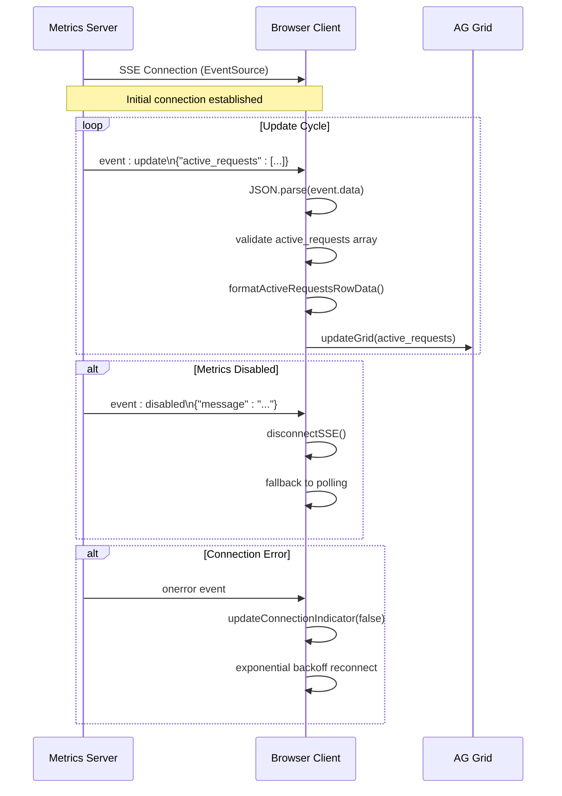
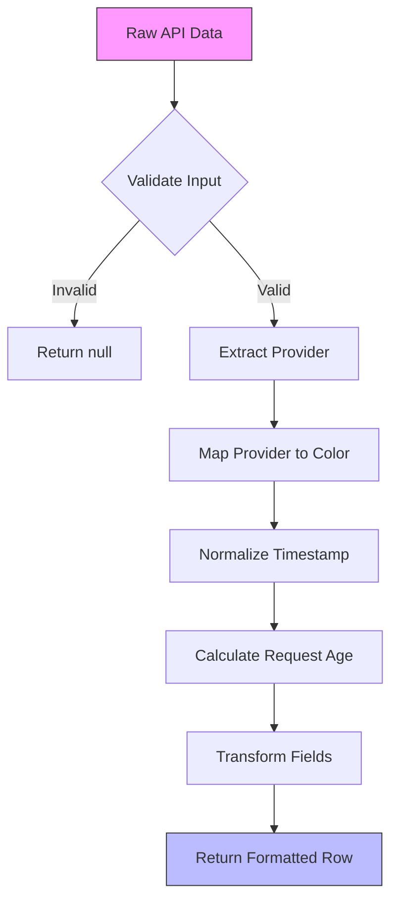
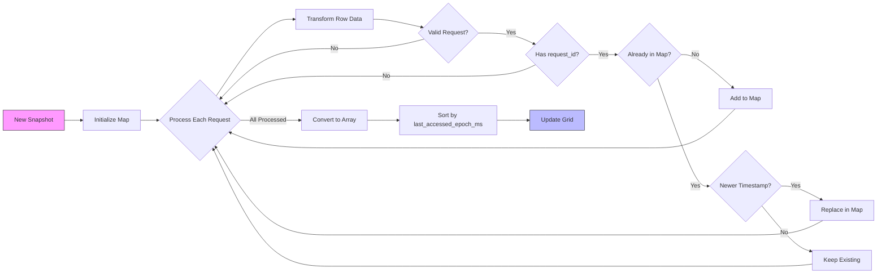
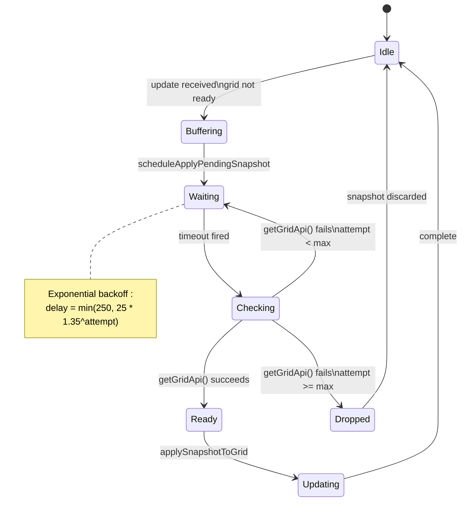
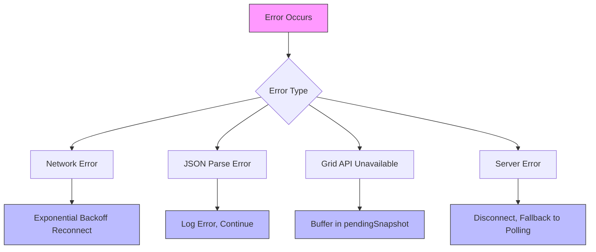
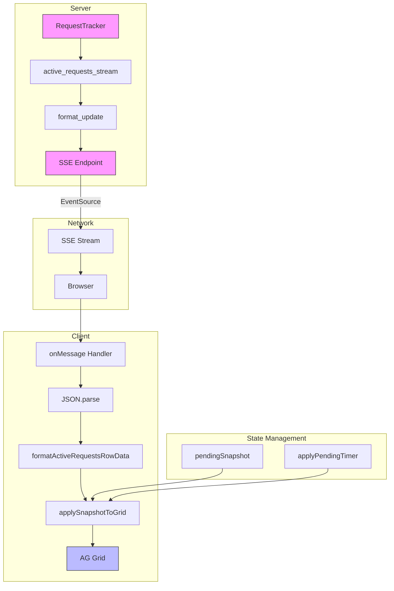

# SSE Message Handling and Data Transformation

<cite>
**Referenced Files in This Document**   
- [26-vdm-active-requests-sse.js](file://assets/ag_grid/26-vdm-active-requests-sse.js)
- [25-vdm-metrics-active-requests.js](file://assets/ag_grid/25-vdm-metrics-active-requests.js)
- [10-vdm-grid-renderers.js](file://assets/ag_grid/10-vdm-grid-renderers.js)
- [30-vdm-grid-init.js](file://assets/ag_grid/30-vdm-grid-init.js)
- [metrics.py](file://src/api/metrics.py)
- [transformers.py](file://src/dashboard/ag_grid/transformers.py)
- [callbacks/metrics.py](file://src/dashboard/callbacks/metrics.py)
- [defaults.toml](file://src/config/defaults.toml)
</cite>

## Table of Contents
1. [Introduction](#introduction)
2. [SSE Event Processing](#sse-event-processing)
3. [Data Transformation and Row Formatting](#data-transformation-and-row-formatting)
4. [De-duplication and Sorting Logic](#de-duplication-and-sorting-logic)
5. [Pending Snapshot and Grid Readiness](#pending-snapshot-and-grid-readiness)
6. [Provider Badge Color Mapping](#provider-badge-color-mapping)
7. [Message Payload Examples](#message-payload-examples)
8. [Error Handling and Reliability](#error-handling-and-reliability)
9. [Configuration and Control Flow](#configuration-and-control-flow)
10. [Architecture Overview](#architecture-overview)

## Introduction
This document provides a comprehensive analysis of the Server-Sent Events (SSE) message handling mechanism in the Vandamme Proxy dashboard. The system enables real-time updates of active request data in the AG Grid component without requiring server round-trips. The documentation covers the complete lifecycle of SSE messages from the server endpoint to client-side processing, including JSON parsing, data transformation, de-duplication, sorting, and reliable grid updates. The mechanism is designed for high reliability, handling connection failures, grid initialization timing, and data consistency across updates.

## SSE Event Processing

The SSE message handling mechanism processes two primary event types: 'update' and 'disabled'. The EventSource client listens for these events from the `/metrics/active-requests/stream` endpoint and handles them accordingly. When an 'update' event is received, the raw JSON data is parsed and transformed into AG Grid-compatible rowData. The 'disabled' event indicates that metrics logging has been disabled on the server, prompting the client to disconnect from the SSE stream and fall back to polling mechanisms.

The onMessage handler in the client-side JavaScript processes these events with robust error handling. For 'update' events, the handler attempts to parse the JSON data and extract the active_requests array. If parsing fails, the error is logged to the console but does not disrupt the overall SSE connection. This defensive programming ensures that transient data issues do not cause the entire real-time update mechanism to fail.



**Diagram sources**
- [26-vdm-active-requests-sse.js](file://assets/ag_grid/26-vdm-active-requests-sse.js#L167-L183)
- [metrics.py](file://src/api/metrics.py#L81-L173)

**Section sources**
- [26-vdm-active-requests-sse.js](file://assets/ag_grid/26-vdm-active-requests-sse.js#L167-L183)
- [metrics.py](file://src/api/metrics.py#L81-L173)

## Data Transformation and Row Formatting

The transformation of raw API data into AG Grid-compatible rowData is handled by the formatActiveRequestsRowData function. This function takes the raw API response and converts it into a standardized format expected by the AG Grid component. The transformation includes several key operations: provider badge color mapping, timestamp normalization, and field standardization.

The function first extracts essential fields from the API response, including provider, model, and start_time. The start_time is normalized from epoch seconds to milliseconds, which is the standard format used by JavaScript Date objects. This normalization ensures consistent time handling across the application. The function also calculates the age of the request in seconds by comparing the start time with the current time.

Provider badge colors are mapped using a fixed color scheme that matches the Python implementation. The getProviderBadgeColor function uses a lookup table to convert provider names to Bootstrap color classes (primary, info, danger, success, or secondary for unknown providers). This ensures visual consistency between the dashboard and other application components.



**Diagram sources**
- [26-vdm-active-requests-sse.js](file://assets/ag_grid/26-vdm-active-requests-sse.js#L44-L78)
- [transformers.py](file://src/dashboard/ag_grid/transformers.py#L283-L332)

**Section sources**
- [26-vdm-active-requests-sse.js](file://assets/ag_grid/26-vdm-active-requests-sse.js#L44-L78)
- [transformers.py](file://src/dashboard/ag_grid/transformers.py#L283-L332)

## De-duplication and Sorting Logic

The de-duplication logic is a critical component of the SSE message handling mechanism, ensuring data integrity in the AG Grid. The system uses request_id as the unique identifier for each active request, preventing duplicate entries that could cause rendering issues or "ghost rows" in the grid. The de-duplication process occurs in the applySnapshotToGrid function, which uses a Map to track requests by their request_id.

When processing a new snapshot, the function iterates through all active requests and applies the transformation via formatActiveRequestsRowData. For each request, it checks if a request with the same request_id already exists in the Map. If a duplicate is found, the system keeps the newest copy by comparing the last_accessed_epoch_ms values. This preferential handling of newer data ensures that updates to existing requests are properly reflected in the grid.

After de-duplication, the rowData is sorted by last_accessed_epoch_ms in descending order, ensuring that the most recent requests appear at the top of the grid. This stable ordering provides a consistent user experience and makes it easier to monitor the most active requests. The sorting is performed using JavaScript's Array.sort method with a custom comparator function that subtracts the epoch milliseconds values.



**Diagram sources**
- [26-vdm-active-requests-sse.js](file://assets/ag_grid/26-vdm-active-requests-sse.js#L122-L144)
- [transformers.py](file://src/dashboard/ag_grid/transformers.py#L283-L332)

**Section sources**
- [26-vdm-active-requests-sse.js](file://assets/ag_grid/26-vdm-active-requests-sse.js#L122-L144)
- [transformers.py](file://src/dashboard/ag_grid/transformers.py#L283-L332)

## Pending Snapshot and Grid Readiness

The pendingSnapshot buffer and applyPendingTimer mechanism ensure reliable updates when the grid API is not yet ready. This is a crucial reliability feature that addresses the asynchronous nature of web application initialization. When an update is received but the grid API is not available, the snapshot is stored in the pendingSnapshot buffer rather than being discarded.

The scheduleApplyPendingSnapshot function implements a backoff retry mechanism to apply the pending snapshot once the grid becomes available. It uses a recursive timeout approach with exponential backoff, starting with short delays and increasing up to a maximum of approximately 10 seconds. This prevents excessive CPU usage while ensuring timely updates. If the grid API remains unavailable after 40 attempts, the pending snapshot is dropped to prevent memory leaks.

The applyPendingTimer variable tracks the current timeout, preventing multiple concurrent attempts to apply the pending snapshot. This coordination ensures that the system doesn't overwhelm the grid API with repeated update attempts. The mechanism is particularly important during page load and SPA navigation, when the grid component may not be immediately available.



**Diagram sources**
- [26-vdm-active-requests-sse.js](file://assets/ag_grid/26-vdm-active-requests-sse.js#L87-L117)
- [30-vdm-grid-init.js](file://assets/ag_grid/30-vdm-grid-init.js#L104-L159)

**Section sources**
- [26-vdm-active-requests-sse.js](file://assets/ag_grid/26-vdm-active-requests-sse.js#L87-L117)
- [30-vdm-grid-init.js](file://assets/ag_grid/30-vdm-grid-init.js#L104-L159)

## Provider Badge Color Mapping

The provider badge color mapping system ensures consistent visual representation of different AI providers across the dashboard. The mapping is implemented in both JavaScript and Python to maintain consistency between client and server components. The getProviderBadgeColor function in JavaScript and the provider_badge_color function in Python use identical logic and color assignments.

The color mapping follows a fixed scheme where specific providers are assigned to Bootstrap color classes: OpenAI to "primary" (blue), OpenRouter to "info" (light blue), Anthropic to "danger" (red), and Poe to "success" (green). All other providers, including unknown or custom providers, are assigned to "secondary" (gray). This consistent color coding helps users quickly identify the provider associated with each request.

The mapping is case-insensitive, as both implementations convert the provider name to lowercase before lookup. This prevents issues with inconsistent capitalization in provider names. The color mapping is used not only in the active requests grid but also in other dashboard components, ensuring a cohesive visual language throughout the application.

```mermaid
classDiagram
class ProviderBadgeMapper {
+getProviderBadgeColor(provider : string) string
-colors : Map~string, string~
}
class ProviderBadgeRenderer {
+vdmProviderBadgeRenderer(params : any) ReactElement
-className : string
}
ProviderBadgeMapper --> ProviderBadgeRenderer : "used by"
note right of ProviderBadgeMapper
Fixed color mapping : \n
openai → primary\n
openrouter → info\n
anthropic → danger\n
poe → success\n
default → secondary
end note
```

**Diagram sources**
- [26-vdm-active-requests-sse.js](file://assets/ag_grid/26-vdm-active-requests-sse.js#L32-L42)
- [transformers.py](file://src/dashboard/ag_grid/transformers.py#L19-L28)
- [10-vdm-grid-renderers.js](file://assets/ag_grid/10-vdm-grid-renderers.js#L146-L168)

**Section sources**
- [26-vdm-active-requests-sse.js](file://assets/ag_grid/26-vdm-active-requests-sse.js#L32-L42)
- [transformers.py](file://src/dashboard/ag_grid/transformers.py#L19-L28)

## Message Payload Examples

The SSE message payloads follow a standardized JSON structure that includes both metadata and the actual active requests data. For 'update' events, the payload contains a disabled flag (always false for update events), an active_requests array, and a timestamp. Each request in the active_requests array includes detailed information such as request_id, provider, model, start_time, and various token counts.

Example 'update' event payload:
```json
{
  "disabled": false,
  "active_requests": [
    {
      "request_id": "req_123",
      "provider": "openai",
      "model": "gpt-4-turbo",
      "start_time": 1701234567,
      "is_streaming": true,
      "input_tokens": 150,
      "output_tokens": 200,
      "resolved_model": "gpt-4-0125-preview",
      "qualified_model": "openai:gpt-4-turbo"
    }
  ],
  "timestamp": 1701234568.123
}
```

Example 'disabled' event payload:
```json
{
  "disabled": true,
  "message": "Request metrics logging is disabled",
  "suggestion": "Set LOG_REQUEST_METRICS=true to enable tracking"
}
```

Common parsing issues include malformed JSON due to network corruption, missing required fields in the active_requests array, and type mismatches (e.g., start_time as a string instead of a number). The client-side code handles these issues gracefully by wrapping JSON.parse in a try-catch block and logging parsing errors without disrupting the SSE connection. This defensive approach ensures that transient data issues do not cause the entire real-time update mechanism to fail.

**Section sources**
- [26-vdm-active-requests-sse.js](file://assets/ag_grid/26-vdm-active-requests-sse.js#L175-L182)
- [metrics.py](file://src/api/metrics.py#L133-L139)

## Error Handling and Reliability

The SSE message handling mechanism includes comprehensive error handling to ensure reliability under various failure conditions. The system handles network disconnections, JSON parsing errors, grid API unavailability, and server-side failures through multiple redundant mechanisms.

For network errors, the EventSource implementation includes automatic reconnection with exponential backoff. When the connection is lost, the client waits for a progressively longer period before attempting to reconnect, preventing overwhelming the server with rapid reconnection attempts. The reconnect delay starts at a minimum of 250ms and increases by a factor of 1.6 with each attempt, up to a maximum of 30 seconds.

JSON parsing errors are handled within the onMessage handler using try-catch blocks. When a parsing error occurs, it is logged to the console but does not disrupt the SSE connection. This allows the system to continue receiving updates even if individual messages are corrupted or malformed. The error logging includes the specific error object, which aids in debugging data format issues.

Grid API unavailability is addressed through the pendingSnapshot mechanism, which buffers updates until the grid is ready. This ensures that no data is lost during page load or component initialization. The system also includes fallback mechanisms, such as switching to polling when SSE is disabled, providing graceful degradation when real-time updates are not available.



**Diagram sources**
- [26-vdm-active-requests-sse.js](file://assets/ag_grid/26-vdm-active-requests-sse.js#L204-L226)
- [26-vdm-active-requests-sse.js](file://assets/ag_grid/26-vdm-active-requests-sse.js#L180-L182)

**Section sources**
- [26-vdm-active-requests-sse.js](file://assets/ag_grid/26-vdm-active-requests-sse.js#L180-L182)
- [26-vdm-active-requests-sse.js](file://assets/ag_grid/26-vdm-active-requests-sse.js#L204-L226)

## Configuration and Control Flow

The SSE message handling mechanism is controlled by several configuration options that can be set via environment variables or configuration files. The primary configuration flags are LOG_REQUEST_METRICS, which enables or disables request metrics logging, and VDM_ACTIVE_REQUESTS_SSE_ENABLED, which specifically controls the SSE functionality for active requests.

When LOG_REQUEST_METRICS is disabled, the server immediately sends a 'disabled' event and closes the stream, prompting the client to fall back to polling. When VDM_ACTIVE_REQUESTS_SSE_ENABLED is disabled, the server returns a 503 error, which the client handles by disconnecting and potentially falling back to alternative update mechanisms.

The control flow is managed through a combination of server-side configuration checks and client-side state management. The server validates these configuration options at the beginning of the stream request and responds appropriately. The client monitors the connection state and updates the UI accordingly, showing a "Live" indicator when connected and a "Reconnecting..." message when attempting to reconnect.

The system also includes SPA navigation handling, using overridden history.pushState and history.replaceState methods to detect route changes. When the user navigates away from the metrics page, the SSE connection is automatically disconnected to conserve resources. When navigating to the metrics page, the connection is automatically established if SSE is enabled.

**Section sources**
- [metrics.py](file://src/api/metrics.py#L97-L122)
- [26-vdm-active-requests-sse.js](file://assets/ag_grid/26-vdm-active-requests-sse.js#L279-L301)
- [defaults.toml](file://src/config/defaults.toml#L1-L89)

## Architecture Overview

The SSE message handling architecture consists of several interconnected components that work together to provide real-time updates to the dashboard. The system follows a client-server model with the server pushing updates to the client via Server-Sent Events, which are then processed and displayed in the AG Grid component.

The architecture includes three main layers: the server endpoint that generates the SSE stream, the client-side event processing that handles incoming messages, and the grid integration that displays the data. The server endpoint in metrics.py generates the stream by polling the RequestTracker for changes to active requests. When changes are detected, it formats the data and sends it as an 'update' event.

The client-side processing in 26-vdm-active-requests-sse.js handles the incoming events, parses the JSON data, transforms it into the appropriate format, and updates the grid. The transformation process ensures data consistency and applies business logic such as de-duplication and sorting. The grid integration layer ensures that updates are applied reliably, even when the grid API is not immediately available.



**Diagram sources**
- [metrics.py](file://src/api/metrics.py#L81-L173)
- [26-vdm-active-requests-sse.js](file://assets/ag_grid/26-vdm-active-requests-sse.js#L1-L316)
- [transformers.py](file://src/dashboard/ag_grid/transformers.py#L283-L332)