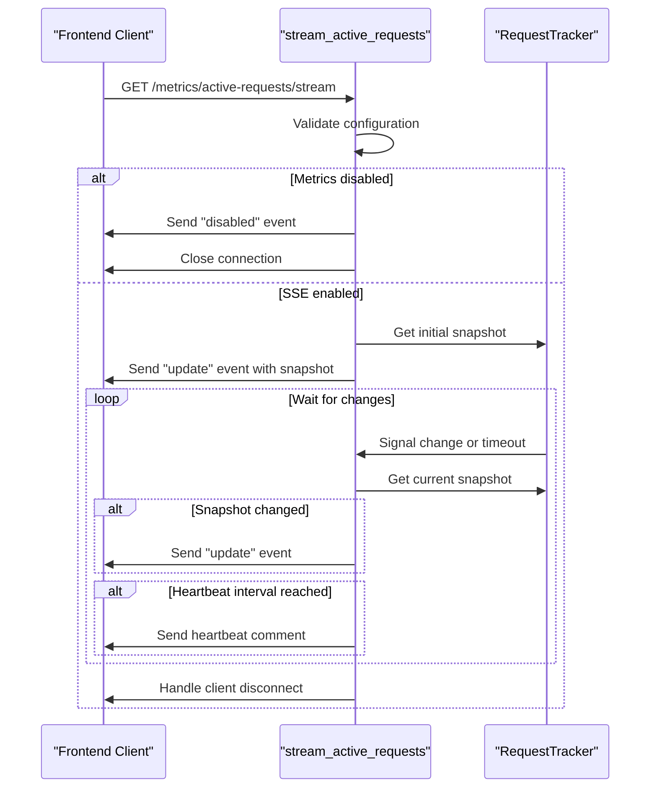
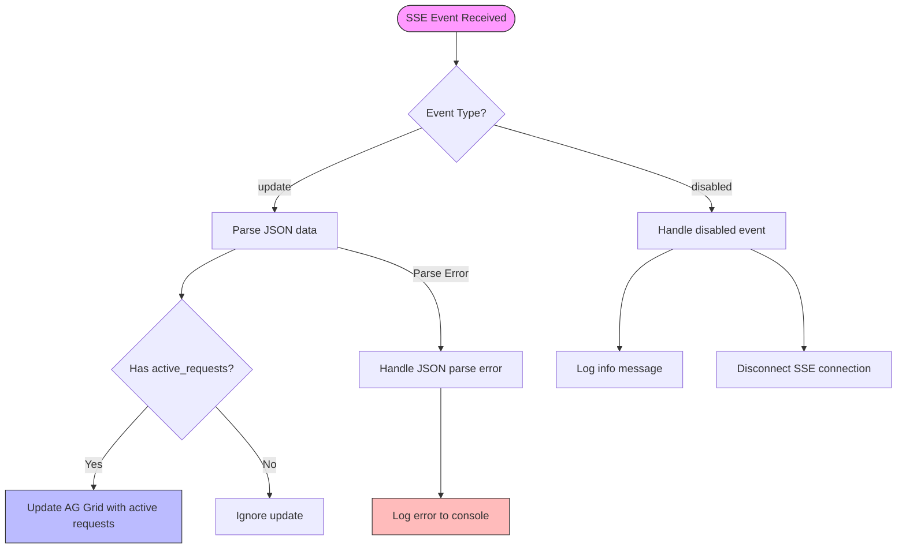
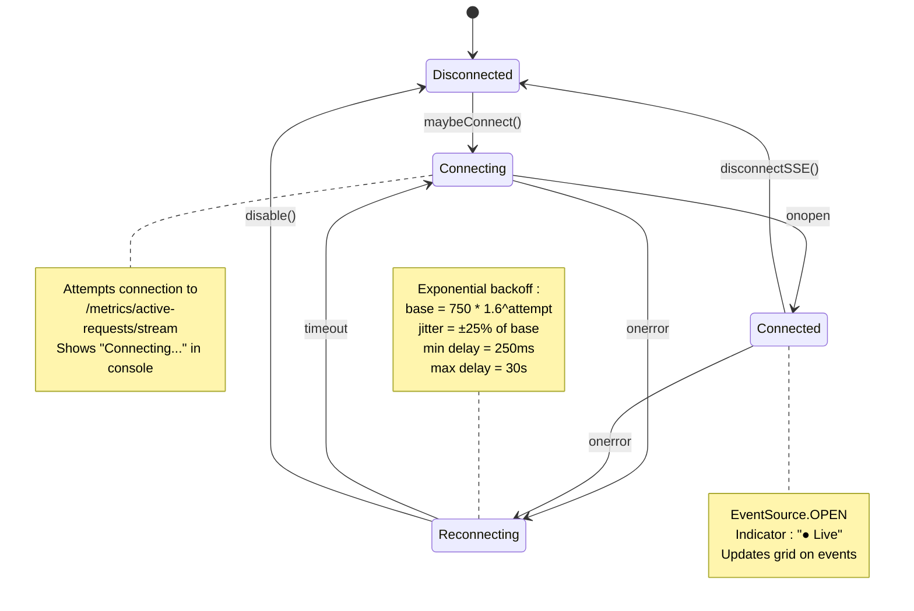

# SSE Streaming Integration

<cite>
**Referenced Files in This Document**   
- [26-vdm-active-requests-sse.js](file://assets/ag_grid/26-vdm-active-requests-sse.js)
- [metrics.py](file://src/dashboard/services/metrics.py)
- [data_sources.py](file://src/dashboard/data_sources.py)
- [metrics.py](file://src/api/metrics.py)
- [streaming.py](file://src/api/services/streaming.py)
- [config.py](file://src/core/config.py)
- [ag_grid.py](file://src/dashboard/components/ag_grid.py)
- [transformers.py](file://src/dashboard/ag_grid/transformers.py)
</cite>

## Table of Contents
1. [Introduction](#introduction)
2. [SSE Client Implementation](#sse-client-implementation)
3. [Backend Streaming Endpoint](#backend-streaming-endpoint)
4. [Event Types and Payloads](#event-types-and-payloads)
5. [Data Transformation and Grid Integration](#data-transformation-and-grid-integration)
6. [Connection Management and SPA Navigation](#connection-management-and-spa-navigation)
7. [Configuration and Environment Variables](#configuration-and-environment-variables)
8. [Troubleshooting Guide](#troubleshooting-guide)

## Introduction
This document provides comprehensive documentation for the Server-Sent Events (SSE) streaming mechanism used for real-time monitoring in the Vandamme Proxy dashboard. The system enables live updates of active API requests through a persistent connection between the frontend dashboard and backend metrics endpoint. The implementation consists of a JavaScript client that establishes and maintains an SSE connection to the `/metrics/active-requests/stream` endpoint, receiving real-time updates about in-flight requests. The backend streams active request data with push-on-change semantics, sending updates when requests start or complete, along with periodic snapshots at a configurable interval. This documentation covers the complete integration, including client-side connection handling with exponential backoff reconnection, event processing, data transformation for AG Grid display, and backend streaming implementation.

## SSE Client Implementation

The SSE client implementation in `assets/ag_grid/26-vdm-active-requests-sse.js` establishes and manages a persistent connection to the metrics streaming endpoint. The client uses the browser's native `EventSource` API to connect to the `/metrics/active-requests/stream` endpoint, automatically handling the low-level SSE protocol details. When initialized, the client checks for the presence of the grid element and page visibility before establishing the connection, ensuring resources are only consumed when necessary. The implementation includes robust error handling and automatic reconnection logic with exponential backoff, enhancing reliability in unstable network conditions. Connection state is exposed through the `window.__vdmActiveRequestsSSE` object, allowing Dash clientside callbacks to monitor the connection status. The client also manages a pending snapshot buffer to handle cases where the grid API is not immediately available, ensuring no data is lost during initialization.

**Section sources**
- [26-vdm-active-requests-sse.js](file://assets/ag_grid/26-vdm-active-requests-sse.js#L1-L316)

## Backend Streaming Endpoint

The backend streaming endpoint is implemented in `src/api/metrics.py` as the `stream_active_requests` function, which handles the SSE connection and streams active request data to connected clients. The endpoint first validates configuration settings, checking if request metrics logging is enabled via the `LOG_REQUEST_METRICS` flag and if SSE is explicitly enabled through the `active_requests_sse_enabled` configuration. When metrics are disabled, the endpoint returns a single "disabled" event and closes the connection, allowing the client to gracefully fall back to polling. For active connections, the endpoint creates a streaming generator that pushes updates whenever the active requests state changes, with a configurable timeout interval. The stream includes periodic heartbeat comments every 30 seconds to keep the connection alive through proxies and load balancers. The implementation uses the `get_request_tracker` to access the current snapshot of active requests and waits for changes using `wait_for_active_requests_change`, ensuring efficient push-based updates rather than periodic polling.



**Diagram sources**
- [metrics.py](file://src/api/metrics.py#L81-L173)
- [streaming.py](file://src/api/services/streaming.py#L28-L37)

**Section sources**
- [metrics.py](file://src/api/metrics.py#L81-L173)
- [streaming.py](file://src/api/services/streaming.py#L18-L37)

## Event Types and Payloads

The SSE stream emits two primary event types: "update" and "disabled", each with specific payload structures and handling requirements. The "update" event carries the current snapshot of active requests as a JSON payload containing an array of request objects with detailed metadata. Each request object includes fields such as request_id, provider, model, start_time, token counts, and streaming status. The payload also includes a timestamp field indicating when the snapshot was generated. The "disabled" event is sent when metrics collection is disabled, containing a JSON payload with a disabled flag, message explaining the disabled state, and suggestion for enabling metrics. The client handles these events differently: "update" events trigger grid updates after JSON parsing, while "disabled" events cause the client to disconnect and potentially fall back to polling. The implementation includes error handling for JSON parsing failures, logging errors to the console without disrupting the overall SSE connection.



**Diagram sources**
- [26-vdm-active-requests-sse.js](file://assets/ag_grid/26-vdm-active-requests-sse.js#L167-L183)
- [metrics.py](file://src/api/metrics.py#L91-L94)

**Section sources**
- [26-vdm-active-requests-sse.js](file://assets/ag_grid/26-vdm-active-requests-sse.js#L167-L183)
- [metrics.py](file://src/api/metrics.py#L91-L94)

## Data Transformation and Grid Integration

The SSE integration includes a comprehensive data transformation pipeline that converts raw active request data into the format required by the AG Grid component. The transformation process begins on the backend in `src/dashboard/ag_grid/transformers.py` with the `metrics_active_requests_row_data` function, which processes the request snapshot and adds fields needed for grid rendering, such as provider badge colors and recency indicators. On the frontend, the `formatActiveRequestsRowData` function in `26-vdm-active-requests-sse.js` performs additional client-side transformation, converting timestamps and calculating request age. The implementation includes deduplication logic to prevent duplicate request IDs from causing grid rendering issues, using a Map to ensure only the most recent version of each request is displayed. The grid update strategy replaces the entire dataset rather than using transactional updates, leveraging AG Grid's `getRowId` configuration to efficiently reuse row nodes and avoid performance issues with frequent incremental updates.

```mermaid
flowchart LR
Backend[(Backend)] --> |Raw data| Transformer1["transformers.py<br>metrics_active_requests_row_data()"]
Transformer1 --> |Processed data| SSE["SSE Stream"]
SSE --> |JSON payload| Client[(Frontend)]
Client --> Transformer2["26-vdm-active-requests-sse.js<br>formatActiveRequestsRowData()"]
Transformer2 --> |Formatted data| Dedupe["Deduplicate by request_id"]
Dedupe --> |Clean data| Sort["Sort by recency"]
Sort --> |Sorted data| Grid["AG Grid setGridOption('rowData')"]
classDef backend fill:#e6f3ff,stroke:#333;
classDef frontend fill:#fff2e6,stroke:#333;
classDef transform fill:#e6ffe6,stroke:#333;
class Backend backend
class Client frontend
class Transformer1,Transformer2 transform
```



**Diagram sources**
- [transformers.py](file://src/dashboard/ag_grid/transformers.py#L283-L316)
- [26-vdm-active-requests-sse.js](file://assets/ag_grid/26-vdm-active-requests-sse.js#L46-L78)
- [ag_grid.py](file://src/dashboard/components/ag_grid.py#L80-L90)

**Section sources**
- [transformers.py](file://src/dashboard/ag_grid/transformers.py#L283-L316)
- [26-vdm-active-requests-sse.js](file://assets/ag_grid/26-vdm-active-requests-sse.js#L46-L78)
- [ag_grid.py](file://src/dashboard/components/ag_grid.py#L80-L90)

## Connection Management and SPA Navigation

The SSE client implements sophisticated connection management that integrates with the Dash frontend's SPA navigation and page lifecycle events. The implementation intercepts `history.pushState` and `history.replaceState` to detect route changes, automatically connecting when navigating to the metrics page and disconnecting when leaving it. This ensures the SSE connection is only active when relevant, conserving resources and preventing unnecessary network traffic. The client also listens to the `popstate` event for browser back/forward navigation and the `visibilitychange` event to handle tab switching, reconnecting when the page becomes visible again. An exponential backoff algorithm manages reconnection attempts after network failures, with a base delay of 750ms that increases by a factor of 1.6 for each attempt, capped at 30 seconds, and includes random jitter to prevent thundering herd problems. Connection state is visually indicated in the UI with a live indicator that shows "● Live" when connected and "○ Reconnecting..." when attempting to reconnect.



**Diagram sources**
- [26-vdm-active-requests-sse.js](file://assets/ag_grid/26-vdm-active-requests-sse.js#L278-L308)
- [26-vdm-active-requests-sse.js](file://assets/ag_grid/26-vdm-active-requests-sse.js#L204-L220)

**Section sources**
- [26-vdm-active-requests-sse.js](file://assets/ag_grid/26-vdm-active-requests-sse.js#L278-L308)
- [26-vdm-active-requests-sse.js](file://assets/ag_grid/26-vdm-active-requests-sse.js#L204-L220)

## Configuration and Environment Variables

The SSE streaming functionality is controlled by several configuration settings and environment variables that allow fine-tuning of the behavior. The `VDM_ACTIVE_REQUESTS_SSE_ENABLED` environment variable globally enables or disables the SSE endpoint, with a default value of "true". The `VDM_ACTIVE_REQUESTS_SSE_INTERVAL` setting controls the polling interval for the backend stream in seconds, defaulting to 2.0 seconds, which determines how frequently the server checks for changes in the active requests state. The `VDM_ACTIVE_REQUESTS_SSE_HEARTBEAT` variable sets the interval for heartbeat messages in seconds, defaulting to 30.0 seconds, which helps maintain the connection through intermediaries. Additional configuration includes `LOG_REQUEST_METRICS` which must be enabled to collect the underlying metrics data, and various timeout settings for request handling. These configuration options provide operators with control over the trade-off between real-time responsiveness and system resource usage.

```mermaid
erDiagram
CONFIGURATION ||--o{ ENVIRONMENT_VARIABLES : "maps to"
CONFIGURATION {
boolean active_requests_sse_enabled
float active_requests_sse_interval
float active_requests_sse_heartbeat
boolean log_request_metrics
int request_timeout
float streaming_read_timeout
}
ENVIRONMENT_VARIABLES {
string VDM_ACTIVE_REQUESTS_SSE_ENABLED
string VDM_ACTIVE_REQUESTS_SSE_INTERVAL
string VDM_ACTIVE_REQUESTS_SSE_HEARTBEAT
string LOG_REQUEST_METRICS
string REQUEST_TIMEOUT
string STREAMING_READ_TIMEOUT_SECONDS
}
CONFIGURATION ||--o{ CODE_COMPONENTS : "controls"
CODE_COMPONENTS {
string "SSE Client (JS)"
string "SSE Endpoint (Python)"
string "Request Tracker"
string "Metrics Collector"
}
```

**Diagram sources**
- [config.py](file://src/core/config.py#L140-L149)
- [metrics.py](file://src/api/metrics.py#L114-L122)

**Section sources**
- [config.py](file://src/core/config.py#L140-L149)
- [metrics.py](file://src/api/metrics.py#L114-L122)

## Troubleshooting Guide

Common issues with the SSE streaming implementation typically fall into several categories: connection failures, configuration problems, and browser compatibility issues. Connection failures may occur due to network interruptions, firewall restrictions, or proxy configurations that block long-lived connections. To diagnose connection issues, check the browser developer console for error messages and verify that the `/metrics/active-requests/stream` endpoint is accessible directly via curl or a REST client. Configuration problems often stem from the `LOG_REQUEST_METRICS` or `VDM_ACTIVE_REQUESTS_SSE_ENABLED` environment variables being set to false, which will cause the endpoint to return a "disabled" event. Browser compatibility issues may arise in older browsers that lack full EventSource support; the implementation should gracefully degrade in such cases. CORS policies are handled by the backend's `sse_headers` function, which includes `Access-Control-Allow-Origin: *` in the response headers, but custom proxy configurations may override these headers. Monitoring the server logs for errors in the `active_requests_stream` generator can help identify backend issues affecting the stream.

**Section sources**
- [26-vdm-active-requests-sse.js](file://assets/ag_grid/26-vdm-active-requests-sse.js#L204-L231)
- [metrics.py](file://src/api/metrics.py#L97-L122)
- [streaming.py](file://src/api/services/streaming.py#L20-L25)