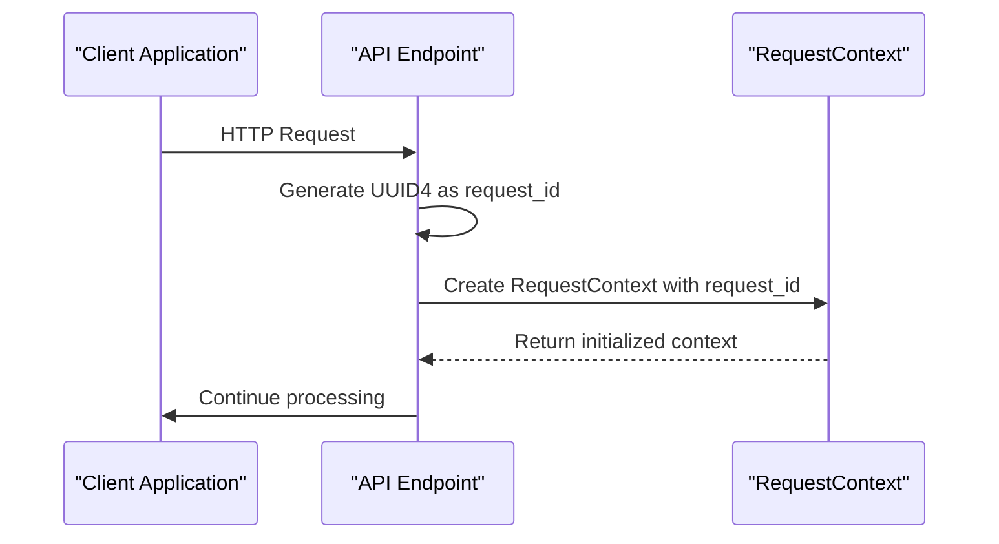
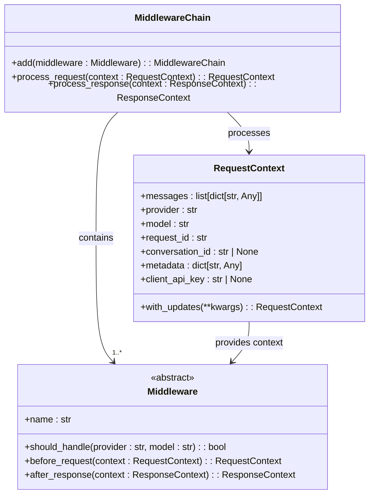
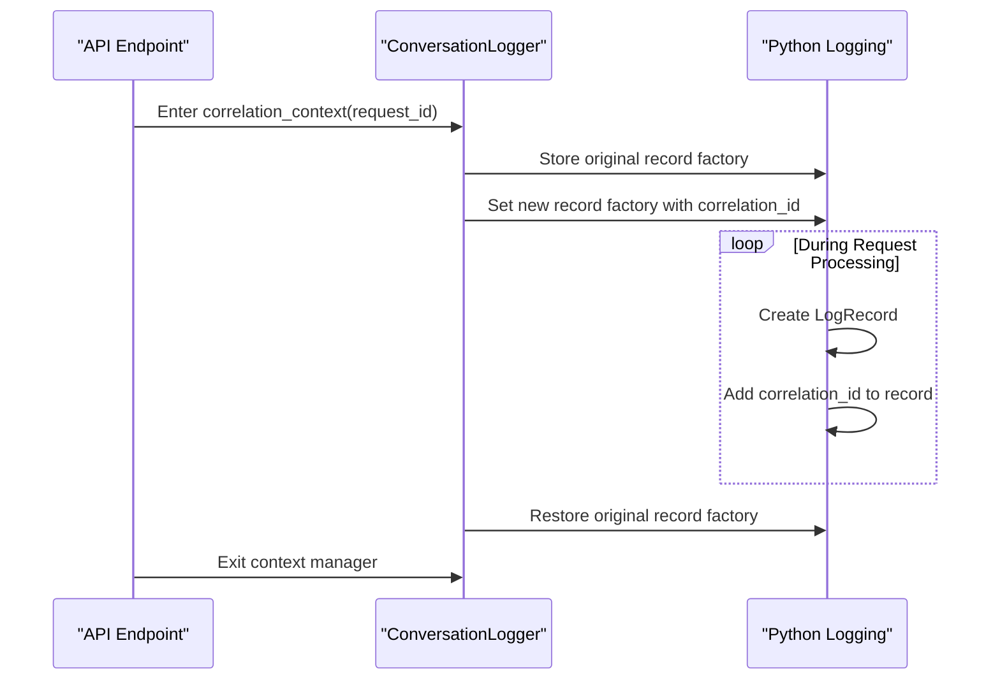
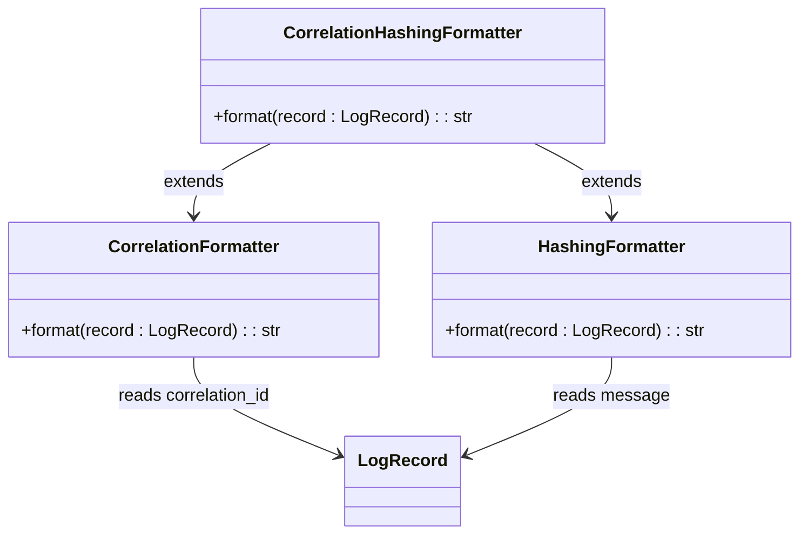
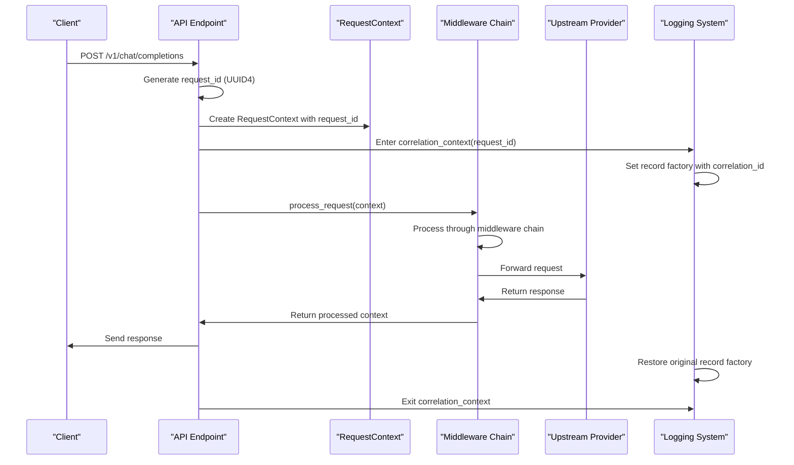

# Correlation ID Management

<cite>
**Referenced Files in This Document**   
- [base.py](file://src/middleware/base.py)
- [conversation.py](file://src/core/logging/conversation.py)
- [correlation.py](file://src/core/logging/formatters/correlation.py)
- [configuration.py](file://src/core/logging/configuration.py)
- [endpoints.py](file://src/api/endpoints.py)
- [streaming.py](file://src/api/services/streaming.py)
- [middleware_integration.py](file://src/api/middleware_integration.py)
</cite>

## Table of Contents
1. [Introduction](#introduction)
2. [Correlation ID Generation and Ingress](#correlation-id-generation-and-ingress)
3. [RequestContext Propagation](#requestcontext-propagation)
4. [Conversation Context Management](#conversation-context-management)
5. [Log Formatter Integration](#log-formatter-integration)
6. [End-to-End Request Tracing Example](#end-to-end-request-tracing-example)
7. [Header Propagation and Behavior](#header-propagation-and-behavior)
8. [Troubleshooting Guidance](#troubleshooting-guidance)
9. [Performance Implications](#performance-implications)

## Introduction
The correlation ID system in Vandamme Proxy provides end-to-end request tracing across microservices, enabling comprehensive monitoring and debugging capabilities. This documentation details the architecture and implementation of the correlation ID system, which generates unique identifiers at request ingress and propagates them through the entire request lifecycle. The system integrates with logging infrastructure to enable aggregation of related events across service boundaries, providing visibility into request processing from API entry to upstream provider calls and responses.

## Correlation ID Generation and Ingress
Correlation IDs are generated at the API ingress point in endpoint handlers using UUID4 for uniqueness. The `chat_completions` and `create_message` endpoints in `endpoints.py` generate a new request ID using `str(uuid.uuid4())` at the beginning of request processing. This ID serves as the correlation ID for the entire request lifecycle.

The correlation ID is first established when creating the `RequestContext` object, which encapsulates all request data and metadata. The `request_id` field in `RequestContext` is initialized with the generated UUID and remains immutable throughout the request processing chain. This ensures consistency and prevents accidental modification of the correlation identifier.

**Diagram sources**
- [endpoints.py](file://src/api/endpoints.py#L185)
- [base.py](file://src/middleware/base.py#L34)

**Section sources**
- [endpoints.py](file://src/api/endpoints.py#L185-L186)
- [base.py](file://src/middleware/base.py#L23-L34)

## RequestContext Propagation
The `RequestContext` dataclass serves as the primary vehicle for correlation ID propagation throughout the middleware chain. Defined as an immutable dataclass in `base.py`, `RequestContext` contains the `request_id` field that carries the correlation ID across all processing stages.

Middleware components access the correlation ID through the `request_id` attribute of the `RequestContext` object. When middleware needs to modify the context, it uses the `with_updates()` method to create a new instance with updated fields while preserving the original correlation ID. This immutable approach ensures thread safety and prevents accidental modification of the correlation identifier.

The middleware chain processes requests by passing the `RequestContext` through a series of middleware components that may modify request parameters, add metadata, or perform other processing tasks. At each stage, the correlation ID remains accessible and unchanged, providing a consistent identifier for tracing purposes.

**Diagram sources**
- [base.py](file://src/middleware/base.py#L23-L52)

**Section sources**
- [base.py](file://src/middleware/base.py#L23-L52)
- [middleware_integration.py](file://src/api/middleware_integration.py#L73-L80)

## Conversation Context Management
The conversation context system, implemented in `conversation.py`, injects correlation IDs into log records using a context manager pattern. The `ConversationLogger.correlation_context()` method temporarily replaces the logging system's record factory to include the correlation ID in all log records created within its scope.

This context manager approach ensures that the correlation ID is automatically injected into all log entries generated during request processing, without requiring explicit parameter passing to logging calls. When the context manager exits, it restores the original record factory, maintaining clean separation between requests.

The implementation uses Python's `contextlib.contextmanager` decorator to create a clean API for managing the logging context. This design choice enhances testability and prevents state leakage between requests, as each context manager instance is isolated and automatically cleaned up.

**Diagram sources**
- [conversation.py](file://src/core/logging/conversation.py#L27-L41)

**Section sources**
- [conversation.py](file://src/core/logging/conversation.py#L18-L41)
- [endpoints.py](file://src/api/endpoints.py#L212)

## Log Formatter Integration
The correlation formatter system, implemented in `correlation.py`, renders correlation IDs as prefixes in log messages. The `CorrelationFormatter` and `CorrelationHashingFormatter` classes modify log output to include the first 8 characters of the correlation ID in square brackets at the beginning of each message.

These formatters check for the presence of the `correlation_id` attribute on log records and, if found, prepend the shortened ID to the message. This enables easy visual correlation of related log entries across services and simplifies log aggregation in monitoring systems.

The formatting system is integrated with the overall logging configuration through the `CorrelationHashingFormatter` class, which inherits from `HashingFormatter` to provide both correlation ID prefixing and API key hashing functionality. This layered approach allows for modular formatter composition while maintaining clean separation of concerns.

**Diagram sources**
- [correlation.py](file://src/core/logging/formatters/correlation.py#L15-L30)

**Section sources**
- [correlation.py](file://src/core/logging/formatters/correlation.py#L15-L30)
- [configuration.py](file://src/core/logging/configuration.py#L65-L67)

## End-to-End Request Tracing Example
The complete request tracing flow begins with an incoming HTTP request to the `/v1/chat/completions` endpoint. The endpoint generates a correlation ID and creates a `RequestContext` with this ID. The request processing then enters the conversation context manager, which enables correlation ID injection into log records.

The request passes through the middleware chain, where each applicable middleware component can access the correlation ID via the `RequestContext`. If the request is streaming, the `MiddlewareStreamingWrapper` processes each chunk while maintaining the correlation context. Throughout this process, all log entries include the correlation ID prefix, enabling aggregation of related events.

When the upstream provider responds, the response processing maintains the same correlation ID through the `ResponseContext`. The correlation context remains active until the entire response is processed, ensuring that all log entries related to the request can be traced across the complete lifecycle.

**Diagram sources**
- [endpoints.py](file://src/api/endpoints.py#L171-L388)
- [middleware_integration.py](file://src/api/middleware_integration.py#L53-L123)
- [conversation.py](file://src/core/logging/conversation.py#L27-L41)

**Section sources**
- [endpoints.py](file://src/api/endpoints.py#L171-L388)
- [middleware_integration.py](file://src/api/middleware_integration.py#L53-L123)

## Header Propagation and Behavior
The system does not explicitly handle correlation ID propagation through HTTP headers such as `X-Correlation-ID`. Instead, it generates a new correlation ID at the ingress point for each request, ensuring that every proxied request has a unique identifier regardless of incoming headers.

This approach simplifies the implementation by avoiding the complexity of header validation, parsing, and potential conflicts with existing correlation IDs. Since the proxy acts as a gateway, generating fresh correlation IDs at ingress provides a clean boundary for tracing within the proxy system.

When the correlation ID system encounters missing or malformed headers, it simply ignores them and proceeds with the newly generated ID. This behavior ensures robustness and prevents request failures due to header issues, while still providing complete tracing capabilities within the proxy infrastructure.

**Section sources**
- [endpoints.py](file://src/api/endpoints.py#L185)
- [base.py](file://src/middleware/base.py#L34)

## Troubleshooting Guidance
When correlation IDs are missing from log entries, verify that the `correlation_context` context manager is properly entered at the beginning of request processing. Check that the `with ConversationLogger.correlation_context(request_id):` block encompasses all code that generates log entries.

Ensure that the logging configuration is correctly set up with the `CorrelationHashingFormatter` or `CorrelationFormatter`. Verify that the root logger and all relevant child loggers use a handler with one of these formatters attached.

If correlation IDs appear in some logs but not others, check for code paths that may be executing outside the correlation context manager scope. This commonly occurs in asynchronous tasks or background workers that are not properly wrapped with the context manager.

For testing correlation ID functionality, use the `ConversationLogger.correlation_context()` context manager in test cases to simulate request processing and verify that log records contain the expected correlation ID prefix.

**Section sources**
- [conversation.py](file://src/core/logging/conversation.py#L27-L41)
- [endpoints.py](file://src/api/endpoints.py#L212)
- [configuration.py](file://src/core/logging/configuration.py#L65-L67)

## Performance Implications
The correlation ID system has minimal performance overhead due to its efficient implementation. The UUID4 generation at request ingress has negligible cost, and the immutable `RequestContext` design avoids expensive copying operations by sharing data between instances.

The context manager approach for log record injection has low overhead, as it only replaces the record factory once per request rather than modifying each log record individually. The formatter's string concatenation operation is also minimal, adding only a short prefix to each log message.

The system avoids thread-local storage or global state, which could create performance bottlenecks under high concurrency. Instead, it relies on explicit context passing and context managers, which are well-optimized in Python and scale efficiently across async tasks.

Memory usage is optimized by storing only the first 8 characters of the correlation ID in log messages, reducing the impact on log storage while maintaining sufficient uniqueness for tracing purposes.

**Section sources**
- [base.py](file://src/middleware/base.py#L34)
- [conversation.py](file://src/core/logging/conversation.py#L32-L35)
- [correlation.py](file://src/core/logging/formatters/correlation.py#L20)