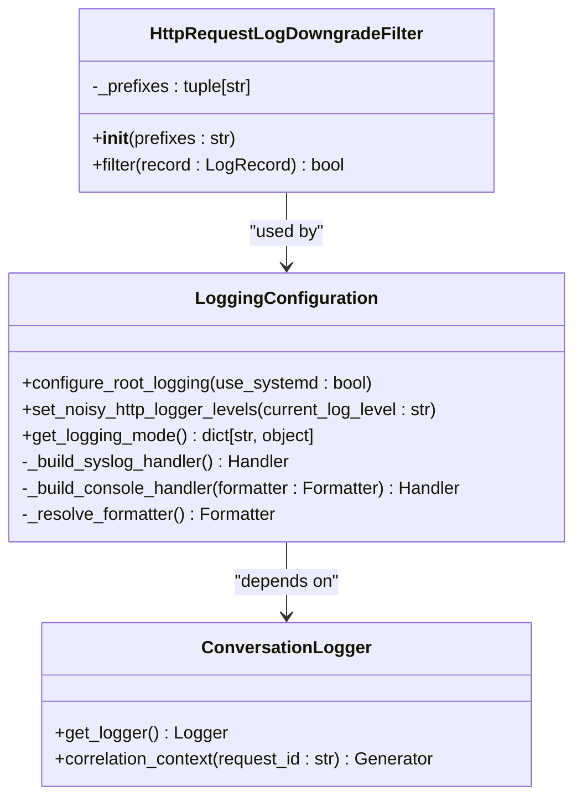
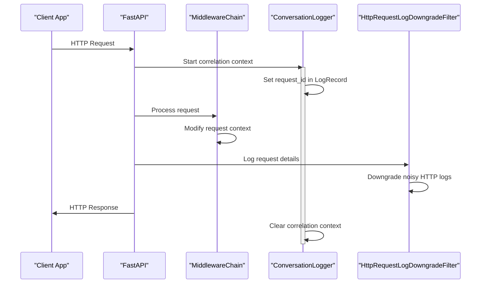
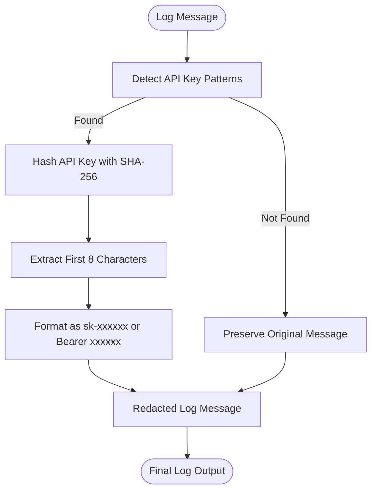
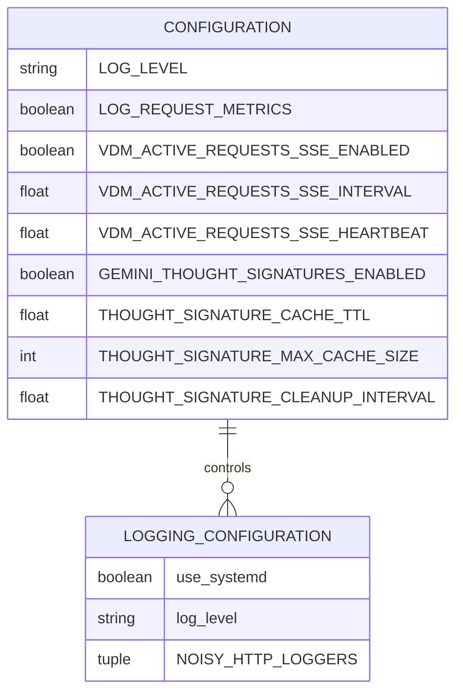
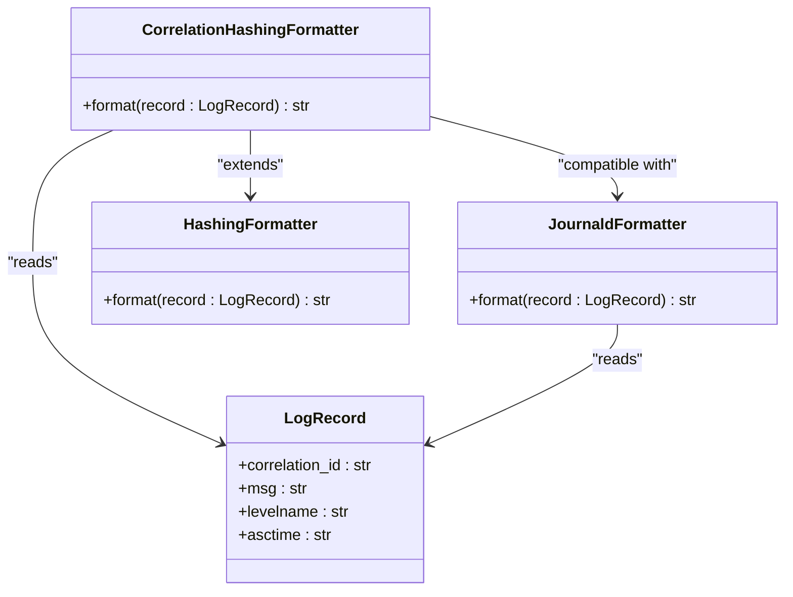

# HTTP Request/Response Filtering

<cite>
**Referenced Files in This Document**   
- [http.py](file://src/core/logging/filters/http.py)
- [configuration.py](file://src/core/logging/configuration.py)
- [conversation.py](file://src/core/logging/conversation.py)
- [base.py](file://src/core/logging/formatters/base.py)
- [correlation.py](file://src/core/logging/formatters/correlation.py)
- [syslog.py](file://src/core/logging/formatters/syslog.py)
- [security.py](file://src/core/security.py)
- [base.py](file://src/middleware/base.py)
- [middleware_integration.py](file://src/api/middleware_integration.py)
</cite>

## Table of Contents
1. [Introduction](#introduction)
2. [HTTP Logging Filter Architecture](#http-logging-filter-architecture)
3. [Request/Response Cycle Interception](#requestresponse-cycle-interception)
4. [Sensitive Data Redaction](#sensitive-data-redaction)
5. [Configuration Options](#configuration-options)
6. [Log Enrichment and Correlation](#log-enrichment-and-correlation)
7. [Performance Considerations](#performance-considerations)
8. [Extension Points](#extension-points)
9. [Conclusion](#conclusion)

## Introduction

The HTTP logging filter system in Vandamme Proxy provides comprehensive request/response logging with intelligent filtering and enrichment capabilities. This documentation details how the system intercepts FastAPI request/response cycles to extract critical HTTP metadata while maintaining security through sensitive data redaction. The architecture is designed to provide diagnostic value without compromising security or performance.

The logging infrastructure follows a modular design with clear separation of concerns, where each component has a single responsibility. The system is built to be import-safe, ensuring predictable behavior regardless of import order, and provides explicit initialization through entry points.

**Section sources**
- [http.py](file://src/core/logging/filters/http.py#L1-L36)
- [configuration.py](file://src/core/logging/configuration.py#L1-L144)

## HTTP Logging Filter Architecture

The HTTP logging filter architecture consists of several interconnected components that work together to provide comprehensive logging capabilities. At its core is the `HttpRequestLogDowngradeFilter` class, which selectively downgrades noisy third-party HTTP logs from INFO to DEBUG level based on configurable logger prefixes.



**Diagram sources**
- [http.py](file://src/core/logging/filters/http.py#L11-L36)
- [configuration.py](file://src/core/logging/configuration.py#L36-L144)
- [conversation.py](file://src/core/logging/conversation.py#L18-L42)

The filter operates by examining each log record's level and name, downgrading INFO-level logs from specified noisy HTTP clients (such as openai, httpx, and httpcore) to DEBUG level. This prevents overwhelming application logs with verbose HTTP client messages in non-debug environments while preserving the ability to access this information when needed.

**Section sources**
- [http.py](file://src/core/logging/filters/http.py#L11-L36)
- [configuration.py](file://src/core/logging/configuration.py#L27-L42)

## Request/Response Cycle Interception

The HTTP logging system intercepts the FastAPI request/response cycle through a combination of middleware integration and logging configuration. The interception occurs at multiple levels, from the initial request processing to the final response delivery.



**Diagram sources**
- [middleware_integration.py](file://src/api/middleware_integration.py#L26-L297)
- [base.py](file://src/middleware/base.py#L22-L398)
- [conversation.py](file://src/core/logging/conversation.py#L27-L42)

The interception begins when a request enters the FastAPI application. The system creates a `RequestContext` with a unique request ID, which is then used to establish a correlation context for logging. Throughout the request processing lifecycle, all log entries are enriched with this correlation ID, allowing for easy tracking of logs across the entire request chain.

**Section sources**
- [middleware_integration.py](file://src/api/middleware_integration.py#L26-L297)
- [base.py](file://src/middleware/base.py#L22-L398)

## Sensitive Data Redaction

The logging system implements comprehensive sensitive data redaction to prevent the exposure of API keys and other confidential information in log entries. This is achieved through a multi-layered approach that combines pattern matching with cryptographic hashing.



**Diagram sources**
- [security.py](file://src/core/security.py#L20-L95)
- [base.py](file://src/core/logging/formatters/base.py#L14-L20)

The redaction process uses regular expressions to identify common API key patterns in log messages, including:
- OpenAI-style keys (sk-xxxxxxxxxxxxxxxxxxxx)
- Bearer tokens
- x-api-key headers
- JSON API key fields

When a pattern is detected, the system extracts the key value and replaces it with a stable 8-character SHA-256 hash prefix. This approach provides several security benefits:
- Non-reversible: The original key cannot be reconstructed from the hash
- Stable: The same key always produces the same hash, enabling correlation of incidents
- Short: The 8-character hash is concise enough for human scanning in logs

**Section sources**
- [security.py](file://src/core/security.py#L45-L95)
- [base.py](file://src/core/logging/formatters/base.py#L14-L20)

## Configuration Options

The HTTP logging system provides several configuration options that control its behavior and verbosity. These options are primarily managed through environment variables and the central configuration system.



**Diagram sources**
- [configuration.py](file://src/core/logging/configuration.py#L70-L85)
- [config.py](file://src/core/config.py#L81-L149)

Key configuration options include:
- **LOG_LEVEL**: Controls the global logging verbosity (DEBUG, INFO, WARNING, ERROR, CRITICAL)
- **use_systemd**: Determines whether to use syslog/journald integration
- **NOISY_HTTP_LOGGERS**: Configurable list of logger prefixes whose INFO logs should be downgraded
- **VDM_ACTIVE_REQUESTS_SSE_ENABLED**: Controls Server-Sent Events for active requests monitoring
- **GEMINI_THOUGHT_SIGNATURES_ENABLED**: Enables thought signature middleware for Gemini providers

The configuration system is designed to be explicit and predictable, with the `configure_root_logging()` function serving as the single entry point for logging configuration. This ensures consistent behavior across different deployment environments.

**Section sources**
- [configuration.py](file://src/core/logging/configuration.py#L88-L144)
- [config.py](file://src/core/config.py#L81-L149)

## Log Enrichment and Correlation

The logging system enriches log entries with contextual information to facilitate debugging and monitoring. The primary enrichment mechanism is request correlation, which links all log entries from a single request through a shared correlation ID.



**Diagram sources**
- [correlation.py](file://src/core/logging/formatters/correlation.py#L15-L31)
- [syslog.py](file://src/core/logging/formatters/syslog.py#L15-L27)
- [base.py](file://src/core/logging/formatters/base.py#L14-L20)

The `ConversationLogger` class provides a context manager (`correlation_context`) that temporarily modifies the logging record factory to inject the correlation ID into all newly created log records. This approach is thread-safe and ensures that all log entries within the context share the same correlation ID.

The formatters then render this correlation ID as an 8-character prefix in the log message, making it easy to filter and correlate logs from the same request. The `CorrelationHashingFormatter` combines this with API key redaction, providing both traceability and security in a single formatter.

**Section sources**
- [conversation.py](file://src/core/logging/conversation.py#L18-L42)
- [correlation.py](file://src/core/logging/formatters/correlation.py#L15-L31)

## Performance Considerations

The HTTP logging system is designed with performance in mind, particularly for high-throughput operations. Several optimizations ensure minimal impact on request processing latency and memory usage.

The system avoids payload logging by default, focusing on metadata extraction rather than content logging. This prevents memory bloat during high-volume operations and reduces disk I/O for log storage. The filtering logic is optimized to minimize processing overhead:

- The `HttpRequestLogDowngradeFilter` only processes INFO-level records, reducing the number of records that require examination
- Prefix matching uses efficient string operations with early termination
- The filter is applied at the handler level, preventing unnecessary processing of filtered-out records

For streaming responses, the system uses an asynchronous wrapper (`MiddlewareStreamingWrapper`) that processes chunks incrementally without buffering the entire response. This maintains low memory usage even for large streaming responses.


**Diagram sources**
- [middleware_integration.py](file://src/api/middleware_integration.py#L214-L297)
- [http.py](file://src/core/logging/filters/http.py#L28-L36)

The correlation context management is also optimized for performance, using Python's context manager protocol to ensure proper cleanup without requiring additional memory allocation for tracking.

**Section sources**
- [middleware_integration.py](file://src/api/middleware_integration.py#L214-L297)
- [http.py](file://src/core/logging/filters/http.py#L28-L36)

## Extension Points

The HTTP logging system provides several extension points for customizing its behavior to meet specific requirements. These extension points follow the open/closed principle, allowing for extension without modification of existing code.

The primary extension mechanisms include:
- Custom middleware implementation through the `Middleware` abstract base class
- Custom formatter creation by extending the base formatter classes
- Configuration of additional logger prefixes for the HTTP log downgrade filter

To implement custom header capture or business-specific context injection, developers can create a new middleware class that extends the `Middleware` base class and overrides the appropriate methods:

```python
class CustomContextMiddleware(Middleware):
    async def before_request(self, context: RequestContext) -> RequestContext:
        # Extract custom headers and inject into context
        custom_value = context.metadata.get('custom-header')
        if custom_value:
            # Add business-specific context
            context = context.with_updates(
                metadata={**context.metadata, 'business_context': process_custom_value(custom_value)}
            )
        return context
```

The middleware chain architecture allows for multiple middleware instances to be registered and executed in sequence, enabling complex processing pipelines while maintaining separation of concerns.

**Section sources**
- [base.py](file://src/middleware/base.py#L94-L189)
- [middleware_integration.py](file://src/api/middleware_integration.py#L34-L47)

## Conclusion

The HTTP logging filter system in Vandamme Proxy provides a robust, secure, and performant solution for request/response logging. By intelligently filtering noisy HTTP client logs, redacting sensitive information, and enriching log entries with correlation context, the system delivers valuable diagnostic information without compromising security or performance.

The modular architecture with clear separation of concerns makes the system easy to understand, maintain, and extend. The explicit initialization model ensures predictable behavior across different environments, while the comprehensive configuration options allow for fine-tuning to meet specific operational requirements.

For high-throughput deployments, the system's performance optimizations ensure minimal impact on request processing latency and memory usage. The extension points provide flexibility for custom requirements while maintaining the integrity of the core logging infrastructure.