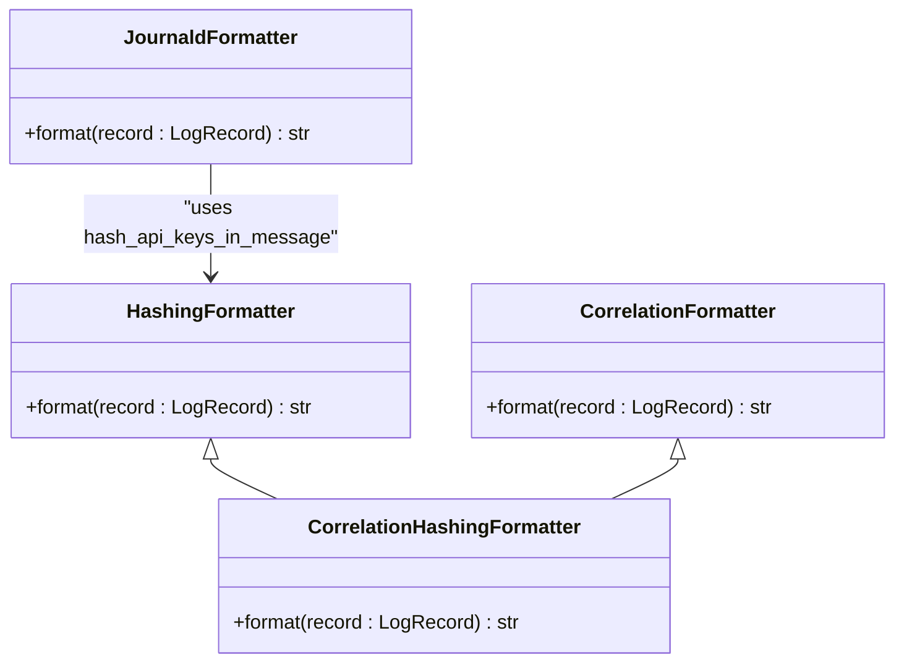
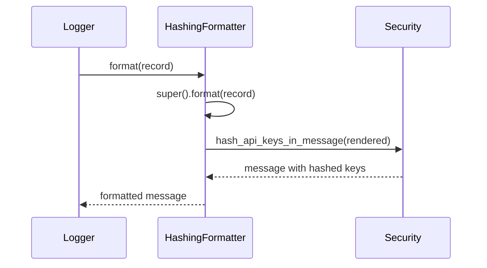
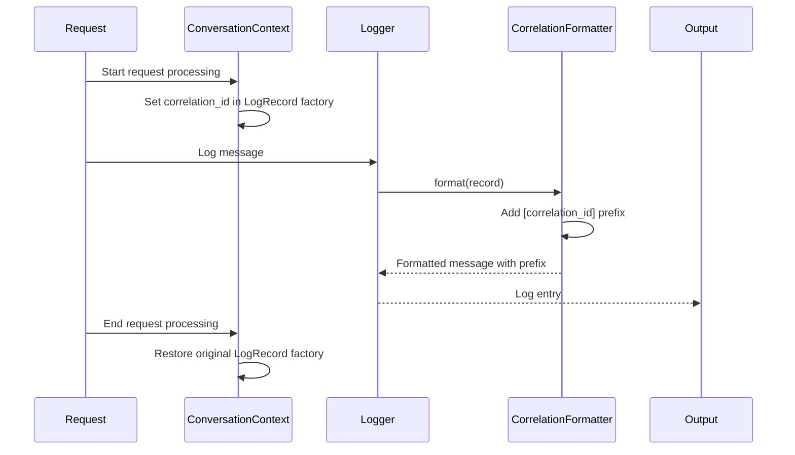
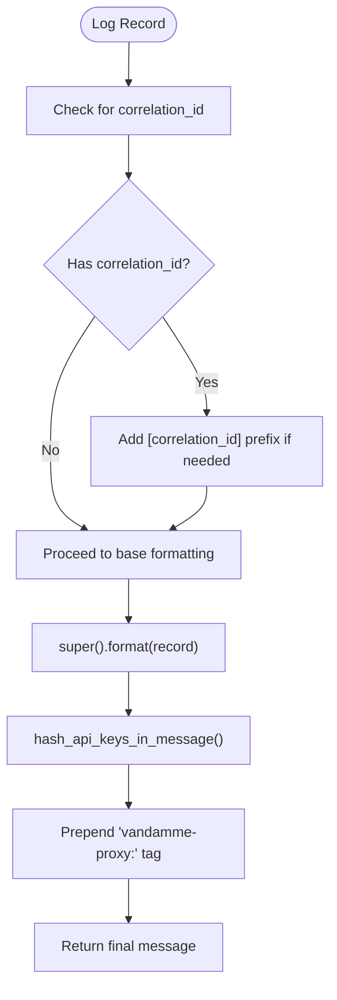
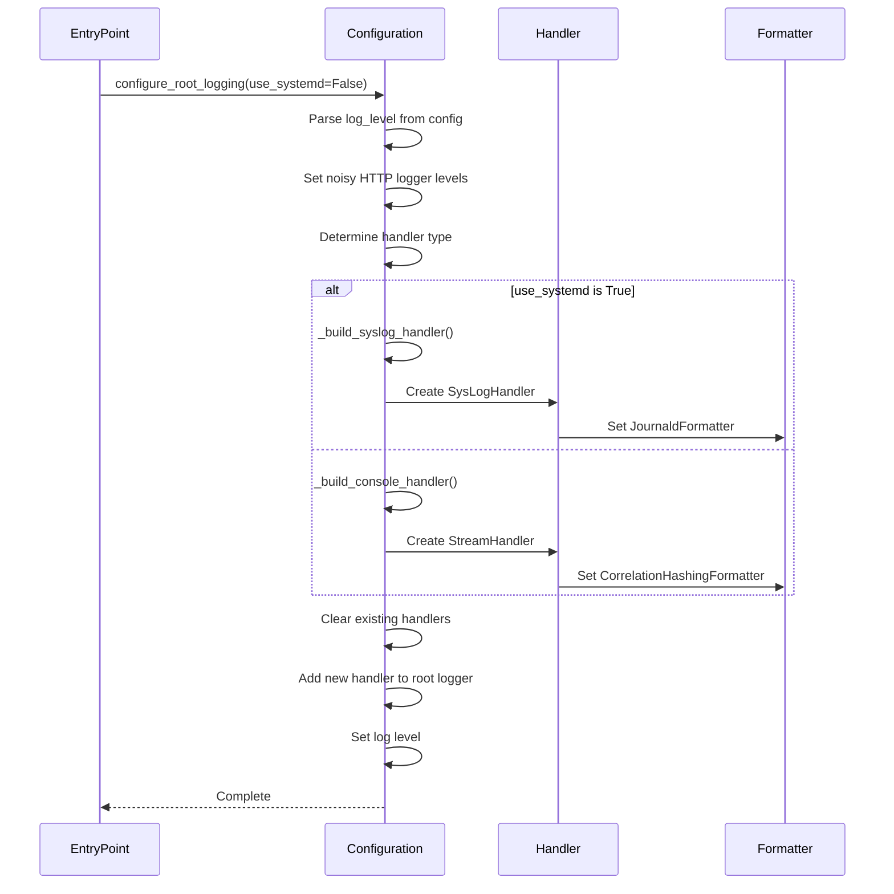
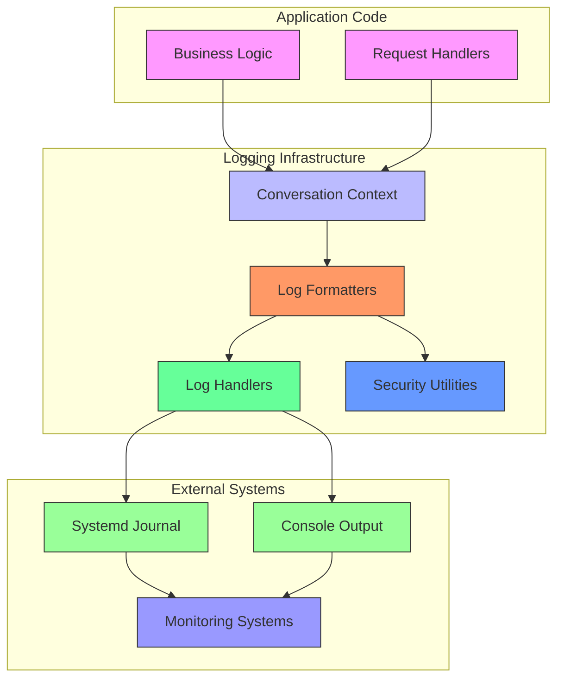

# Log Formatters

<cite>
**Referenced Files in This Document**   
- [base.py](file://src/core/logging/formatters/base.py)
- [correlation.py](file://src/core/logging/formatters/correlation.py)
- [syslog.py](file://src/core/logging/formatters/syslog.py)
- [configuration.py](file://src/core/logging/configuration.py)
- [security.py](file://src/core/security.py)
- [conversation.py](file://src/core/logging/conversation.py)
- [main.py](file://src/main.py)
- [server.py](file://src/cli/commands/server.py)
</cite>

## Table of Contents
1. [Introduction](#introduction)
2. [Core Formatter Components](#core-formatter-components)
3. [Base Formatter: JSON Structure Foundation](#base-formatter-json-structure-foundation)
4. [Correlation Formatter: Distributed Tracing](#correlation-formatter-distributed-tracing)
5. [Syslog Formatter: RFC 5424 Compliance](#syslog-formatter-rfc-5424-compliance)
6. [Formatter Instantiation and Registration](#formatter-instantiation-and-registration)
7. [Sample Log Outputs](#sample-log-outputs)
8. [Environment-Specific Use Cases](#environment-specific-use-cases)
9. [Customization Options](#customization-options)
10. [Architecture Overview](#architecture-overview)

## Introduction
The log formatter system in Vandamme Proxy provides a flexible and secure logging infrastructure designed for both development and production environments. The system consists of three primary formatter classes that work together to ensure logs are properly structured, traceable, and compliant with system-level logging standards. This documentation explains the role of each formatter component, how they are instantiated and registered within the logging configuration, and their respective use cases across different deployment environments.

## Core Formatter Components
The logging formatter system is organized into three specialized components that address different aspects of log formatting requirements. The base formatter establishes the foundational JSON structure, the correlation formatter enables distributed tracing through request correlation, and the syslog formatter ensures compatibility with system-level logging infrastructure. These components are designed to be composable and focused, avoiding complex metaprogramming to maintain clear and predictable behavior.



**Diagram sources**
- [base.py](file://src/core/logging/formatters/base.py#L14-L19)
- [correlation.py](file://src/core/logging/formatters/correlation.py#L15-L30)
- [syslog.py](file://src/core/logging/formatters/syslog.py#L15-L26)

**Section sources**
- [base.py](file://src/core/logging/formatters/base.py)
- [correlation.py](file://src/core/logging/formatters/correlation.py)
- [syslog.py](file://src/core/logging/formatters/syslog.py)

## Base Formatter: JSON Structure Foundation
The base formatter, implemented in `base.py`, defines the foundational structure for all log entries in the system. It serves as the parent class for other formatters and provides the core functionality for securing sensitive information in log output. The `HashingFormatter` class extends Python's built-in `logging.Formatter` to add API key protection by hashing sensitive credentials before they appear in logs.

The formatter works by first rendering the log message using the parent class's format method, then passing the rendered output through the `hash_api_keys_in_message` function from the security module. This ensures that any API keys or authentication tokens in the log message are replaced with stable, non-reversible hashes that preserve the ability to correlate incidents without compromising security.



**Diagram sources**
- [base.py](file://src/core/logging/formatters/base.py#L14-L19)
- [security.py](file://src/core/security.py#L45-L94)

**Section sources**
- [base.py](file://src/core/logging/formatters/base.py)

## Correlation Formatter: Distributed Tracing
The correlation formatter, implemented in `correlation.py`, enhances log entries with correlation IDs to enable distributed tracing across requests. This functionality is critical for tracking the flow of individual requests through the system, especially in complex scenarios involving multiple service interactions.

The formatter system includes two classes: `CorrelationFormatter` for backward compatibility without hashing, and `CorrelationHashingFormatter` which combines correlation ID prefixing with API key hashing. Both formatters check if the log record has a `correlation_id` attribute, and if present, prepend a shortened version (first 8 characters) of the ID to the log message. This creates a consistent prefix that allows operations teams to easily filter and trace all logs associated with a specific request across the entire stack.

The correlation ID is injected into log records through the `ConversationLogger` context manager in the conversation module, which temporarily modifies the log record factory to include the request ID. This approach keeps the implementation simple and testable without relying on global singletons.



**Diagram sources**
- [correlation.py](file://src/core/logging/formatters/correlation.py#L15-L30)
- [conversation.py](file://src/core/logging/conversation.py#L18-L41)

**Section sources**
- [correlation.py](file://src/core/logging/formatters/correlation.py)
- [conversation.py](file://src/core/logging/conversation.py)

## Syslog Formatter: RFC 5424 Compliance
The syslog formatter, implemented in `syslog.py`, provides RFC 5424-compliant output for integration with system-level logging infrastructure such as systemd's journald. This formatter ensures that logs can be properly ingested and processed by centralized logging systems while maintaining the security and traceability features of the application.

The `JournaldFormatter` class handles several key requirements for system logging. It first checks if the log record contains a correlation ID and ensures this is included in the message prefix if not already present. After formatting the base message, it applies API key hashing to protect sensitive information. Finally, it prepends the application tag "vandamme-proxy:" to identify the source of the log message.

An important design consideration is that the SysLogHandler itself prepends the priority wrapper (<N>), so the formatter only adds the application-specific tag. This separation of responsibilities ensures compliance with the syslog protocol while maintaining clean separation of concerns in the code.



**Diagram sources**
- [syslog.py](file://src/core/logging/formatters/syslog.py#L15-L26)

**Section sources**
- [syslog.py](file://src/core/logging/formatters/syslog.py)

## Formatter Instantiation and Registration
Formatter classes are instantiated and registered through the centralized logging configuration system in `configuration.py`. The system follows an explicit initialization pattern where importing the logging package does not automatically configure the logging subsystem. Instead, entry points such as the main application and CLI commands must explicitly call `configure_root_logging()` to set up the logging infrastructure.

The configuration process begins by determining the appropriate formatter based on the deployment mode. The `_resolve_formatter()` function returns a `CorrelationHashingFormatter` instance with a standard time format ("%H:%M:%S"). When systemd integration is requested, the system attempts to create a syslog handler using `_build_syslog_handler()`, which configures a `JournaldFormatter`. If the syslog socket is unavailable (common in development environments), it falls back to a console handler with the correlation-aware formatter.

Both the main application in `main.py` and the CLI server command in `server.py` follow the same pattern of configuring logging early in their execution, before any other output. This ensures consistent log handling and prevents sensitive information from being leaked through unformatted output.



**Diagram sources**
- [configuration.py](file://src/core/logging/configuration.py#L44-L125)
- [main.py](file://src/main.py#L64-L68)
- [server.py](file://src/cli/commands/server.py#L28-L41)

**Section sources**
- [configuration.py](file://src/core/logging/configuration.py)
- [main.py](file://src/main.py)
- [server.py](file://src/cli/commands/server.py)

## Sample Log Outputs
The formatter system produces different output formats depending on the active configuration and environment. In development mode with console output, logs include timestamps, log levels, and correlation prefixes:

```
14:30:25 - INFO - [a1b2c3d4] Processing request for user123
14:30:26 - DEBUG - [a1b2c3d4] API call to upstream service completed
14:30:26 - INFO - [a1b2c3d4] Request completed in 125ms
```

When API keys appear in logs, they are automatically hashed to protect sensitive information:

```
14:30:25 - INFO - [a1b2c3d4] Making request with Bearer sk-abc123def456 -> Bearer sk-8a7f2b1c
```

In systemd mode, logs are formatted for journald integration with the application tag:

```
vandamme-proxy: [a1b2c3d4] 14:30:25 - INFO - Processing request for user123
```

The wrap command, which always uses systemd logging, produces clean output suitable for integration with other tools:

```
vandamme-proxy: 14:30:25 - INFO - Proxy server started on port 8082
```

**Section sources**
- [base.py](file://src/core/logging/formatters/base.py)
- [correlation.py](file://src/core/logging/formatters/correlation.py)
- [syslog.py](file://src/core/logging/formatters/syslog.py)
- [security.py](file://src/core/security.py)

## Environment-Specific Use Cases
The formatter system is designed to support different use cases across development, staging, and production environments. In development environments, the default console output with correlation IDs provides developers with immediate feedback and easy request tracing. The readable timestamp format and clear message structure make it simple to diagnose issues during local development.

In staging environments, teams can enable systemd logging to validate that the application integrates properly with the target logging infrastructure. This allows operations teams to verify that logs are being properly collected, indexed, and available in their monitoring systems before deployment to production.

In production environments, the combination of correlation IDs and API key hashing provides both operational visibility and security. The correlation IDs enable effective incident response by allowing teams to trace requests across the entire system, while the hashing of API keys prevents credential leakage in log files that might be accessed by multiple teams or stored in centralized logging systems.

The wrap command uses systemd logging by default, making it suitable for production use where logs need to be integrated into system monitoring. The CLI server command allows operators to choose between console and systemd output based on their deployment requirements.

**Section sources**
- [configuration.py](file://src/core/logging/configuration.py)
- [main.py](file://src/main.py)
- [server.py](file://src/cli/commands/server.py)
- [proxy_manager.py](file://src/cli/wrap/proxy_manager.py)

## Customization Options
The formatter system provides several customization options for adding additional context fields and modifying timestamp formats. While the core formatters are designed to be focused and composable, the system allows for configuration through the logging setup process.

The timestamp format can be modified by changing the `datefmt` parameter when creating formatter instances. Currently, the system uses "%H:%M:%S" for console output, but this could be extended to include date information or milliseconds for more detailed timing analysis.

Additional context fields can be added by extending the log record with custom attributes, similar to how the correlation ID is added through the conversation context. Custom formatters could be created to extract and format these additional fields, following the same composition patterns used in the existing formatters.

The API key hashing patterns in the security module can also be customized to handle different credential formats. The current implementation targets common patterns like "sk-" prefixes, "Bearer" tokens, and "x-api-key" headers, but additional patterns can be added to the substitutions list to handle organization-specific credential formats.

**Section sources**
- [base.py](file://src/core/logging/formatters/base.py)
- [correlation.py](file://src/core/logging/formatters/correlation.py)
- [syslog.py](file://src/core/logging/formatters/syslog.py)
- [security.py](file://src/core/security.py)

## Architecture Overview
The log formatter system follows a modular architecture with clear separation of concerns. The system is organized into specialized components that handle specific aspects of log formatting, with a centralized configuration system that wires these components together based on deployment requirements.



**Diagram sources**
- [base.py](file://src/core/logging/formatters/base.py)
- [correlation.py](file://src/core/logging/formatters/correlation.py)
- [syslog.py](file://src/core/logging/formatters/syslog.py)
- [configuration.py](file://src/core/logging/configuration.py)
- [conversation.py](file://src/core/logging/conversation.py)

**Section sources**
- [configuration.py](file://src/core/logging/configuration.py)