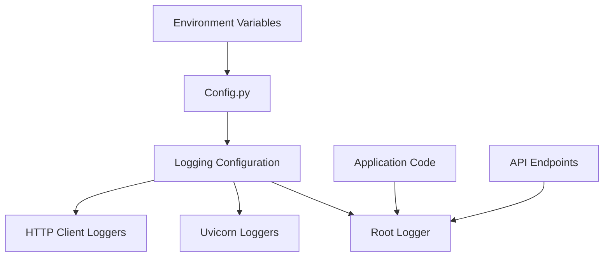
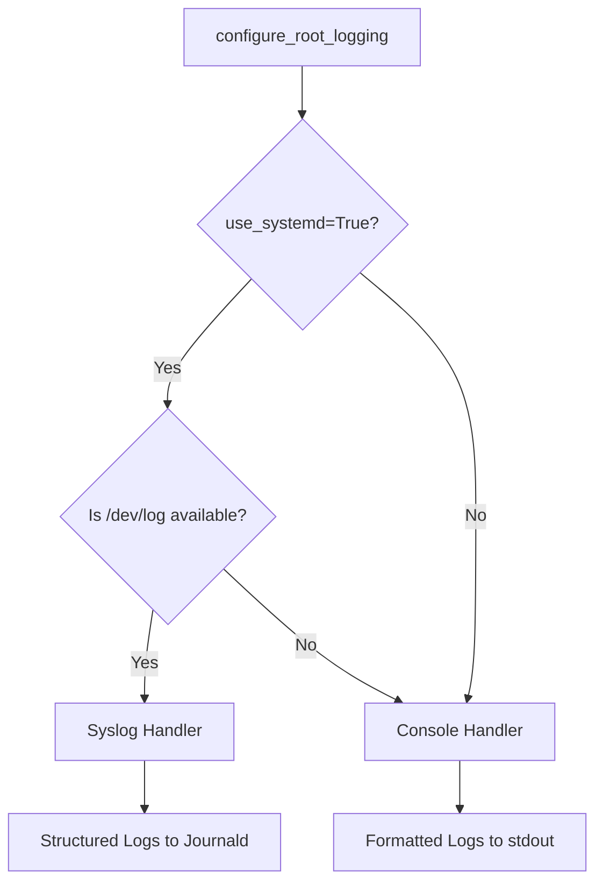
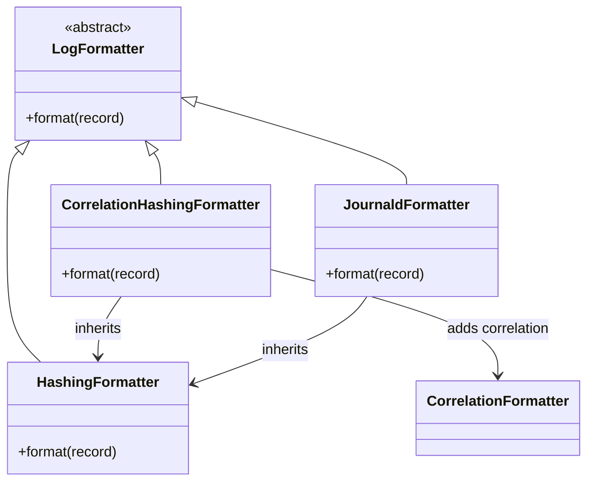
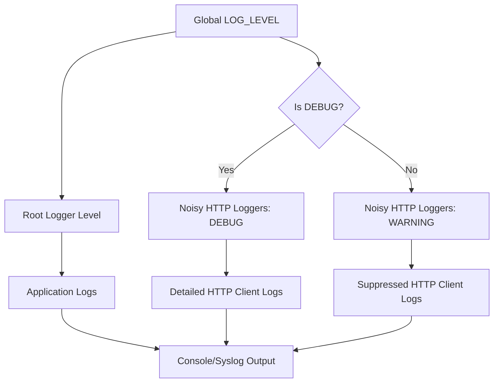
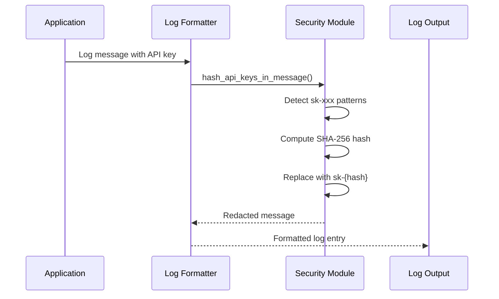

# Logging Configuration

<cite>
**Referenced Files in This Document**   
- [configuration.py](file://src/core/logging/configuration.py)
- [config.py](file://src/core/config.py)
- [correlation.py](file://src/core/logging/formatters/correlation.py)
- [syslog.py](file://src/core/logging/formatters/syslog.py)
- [http.py](file://src/core/logging/filters/http.py)
- [base.py](file://src/core/logging/formatters/base.py)
- [security.py](file://src/core/security.py)
- [defaults.toml](file://src/config/defaults.toml)
- [main.py](file://src/main.py)
</cite>

## Table of Contents
1. [Introduction](#introduction)
2. [Core Configuration System](#core-configuration-system)
3. [Log Level Management](#log-level-management)
4. [Output Destinations](#output-destinations)
5. [Formatter Selection](#formatter-selection)
6. [Hierarchical Configuration Model](#hierarchical-configuration-model)
7. [Deployment Scenarios](#deployment-scenarios)
8. [Log Rotation and Retention](#log-rotation-and-retention)
9. [Security Considerations](#security-considerations)
10. [Configuration Examples](#configuration-examples)

## Introduction
The logging configuration system in Vandamme Proxy provides a centralized, flexible approach to managing application logs. The system is designed to balance detailed debugging capabilities with clean production output, while ensuring sensitive information is protected. This documentation explains the architecture, configuration options, and best practices for the logging system.

**Section sources**
- [configuration.py](file://src/core/logging/configuration.py)
- [config.py](file://src/core/config.py)

## Core Configuration System
The logging system is centralized in the `src/core/logging/configuration.py` module, which serves as the single point for configuring the Python logging subsystem. The system follows explicit initialization principles, where logging configuration only occurs when `configure_root_logging()` is called by entry points. This design prevents side effects during imports and ensures predictable behavior.

The configuration system integrates with the core configuration via `src/core/config.py`, which reads environment variables to determine logging parameters. This allows for environment-driven configuration overrides without code changes.



**Diagram sources **
- [configuration.py](file://src/core/logging/configuration.py)
- [config.py](file://src/core/config.py)

**Section sources**
- [configuration.py](file://src/core/logging/configuration.py)
- [config.py](file://src/core/config.py)

## Log Level Management
The logging system supports standard Python log levels: DEBUG, INFO, WARNING, ERROR, and CRITICAL. The log level is configured through the `LOG_LEVEL` environment variable, with INFO as the default if not specified.

A key feature is the intelligent handling of noisy HTTP client logs from libraries like `openai`, `httpx`, and `httpcore`. These logs are automatically downgraded to WARNING level unless the global log level is set to DEBUG, preventing them from overwhelming application logs in production environments.

```mermaid
stateDiagram-v2
[*] --> Default
Default --> DEBUG : LOG_LEVEL=DEBUG
Default --> INFO : LOG_LEVEL=INFO
Default --> WARNING : LOG_LEVEL=WARNING
Default --> ERROR : LOG_LEVEL=ERROR
Default --> CRITICAL : LOG_LEVEL=CRITICAL
DEBUG --> HTTP_DEBUG : Noisy HTTP logs at DEBUG level
INFO --> HTTP_WARNING : Noisy HTTP logs downgraded to WARNING
WARNING --> HTTP_WARNING : Noisy HTTP logs downgraded to WARNING
ERROR --> HTTP_WARNING : Noisy HTTP logs downgraded to WARNING
CRITICAL --> HTTP_WARNING : Noisy HTTP logs downgraded to WARNING
```

**Diagram sources **
- [configuration.py](file://src/core/logging/configuration.py)
- [http.py](file://src/core/logging/filters/http.py)

**Section sources**
- [configuration.py](file://src/core/logging/configuration.py)
- [http.py](file://src/core/logging/filters/http.py)

## Output Destinations
The logging system supports multiple output destinations, with automatic selection based on the runtime environment. The primary destinations are:

1. **Console (stdout)**: Default output destination, used when systemd integration is not available
2. **Syslog/Journald**: Used when running in systemd environments with `/dev/log` available

The system automatically falls back to console output when syslog is not available, making it suitable for both local development and production deployments.



**Diagram sources **
- [configuration.py](file://src/core/logging/configuration.py)

**Section sources**
- [configuration.py](file://src/core/logging/configuration.py)

## Formatter Selection
The logging system uses a correlation-aware formatter that enhances log messages with request context. The primary formatter, `CorrelationHashingFormatter`, adds a short prefix with the first 8 characters of the correlation ID, enabling easy tracking of requests across the system.

For syslog output, the `JournaldFormatter` is used, which adds the "vandamme-proxy" tag prefix to messages. All formatters incorporate API key hashing to prevent credential leakage in logs.



**Diagram sources **
- [correlation.py](file://src/core/logging/formatters/correlation.py)
- [syslog.py](file://src/core/logging/formatters/syslog.py)
- [base.py](file://src/core/logging/formatters/base.py)

**Section sources**
- [correlation.py](file://src/core/logging/formatters/correlation.py)
- [syslog.py](file://src/core/logging/formatters/syslog.py)
- [base.py](file://src/core/logging/formatters/base.py)

## Hierarchical Configuration Model
The logging system supports per-component log level tuning through a hierarchical configuration model. While the global log level is set via the `LOG_LEVEL` environment variable, specific components can have their log levels adjusted independently.

The system identifies noisy HTTP loggers through the `NOISY_HTTP_LOGGERS` tuple and applies special handling to them. This allows for fine-grained control over log verbosity without affecting the overall application log level.



**Diagram sources **
- [configuration.py](file://src/core/logging/configuration.py)

**Section sources**
- [configuration.py](file://src/core/logging/configuration.py)

## Deployment Scenarios
The logging configuration adapts to different deployment scenarios through environment variables. For development debugging, setting `LOG_LEVEL=DEBUG` enables verbose output including detailed HTTP client logs. For production auditing, the default `LOG_LEVEL=INFO` provides essential operational information while suppressing noisy details.

The system automatically detects systemd environments and routes logs to journald when available, enabling integration with system-level log management tools.

**Section sources**
- [configuration.py](file://src/core/logging/configuration.py)
- [main.py](file://src/main.py)

## Log Rotation and Retention
The logging system relies on external log management systems for rotation and retention. When using syslog/journald output, rotation and retention are handled by the system's logging daemon according to its configuration.

For console output, log rotation should be managed by the process supervisor or container runtime. The system does not implement internal log rotation to avoid complexity and leverage established system tools.

**Section sources**
- [configuration.py](file://src/core/logging/configuration.py)

## Security Considerations
The logging system incorporates several security features to prevent sensitive information exposure:

1. **API Key Hashing**: All log messages are processed to replace API keys with stable short hashes using SHA-256
2. **PII Protection**: The system detects and redacts common credential patterns in log output
3. **Context Isolation**: Correlation IDs are managed through context managers to prevent leakage between requests

The `hash_api_keys_in_message` function in `src/core/security.py` implements pattern-based detection and replacement of sensitive tokens in log messages.



**Diagram sources **
- [security.py](file://src/core/security.py)
- [base.py](file://src/core/logging/formatters/base.py)

**Section sources**
- [security.py](file://src/core/security.py)
- [base.py](file://src/core/logging/formatters/base.py)

## Configuration Examples
### Development Debugging
```env
LOG_LEVEL=DEBUG
```
This configuration enables verbose logging for debugging, including detailed HTTP client logs and access logs.

### Production Auditing
```env
LOG_LEVEL=INFO
```
This configuration provides essential operational information while suppressing noisy HTTP client logs, suitable for production environments.

### Systemd Integration
```env
LOG_LEVEL=INFO
# System automatically detects systemd environment
```
When running under systemd, logs are automatically routed to journald with structured formatting.

**Section sources**
- [defaults.toml](file://src/config/defaults.toml)
- [main.py](file://src/main.py)