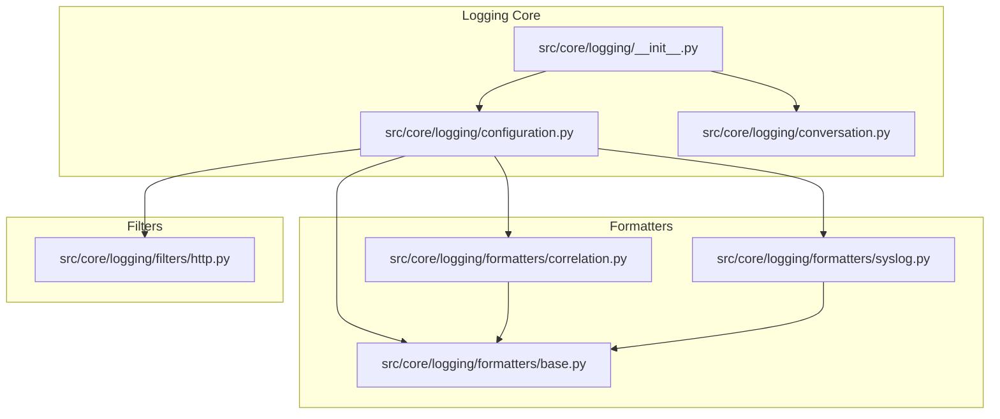
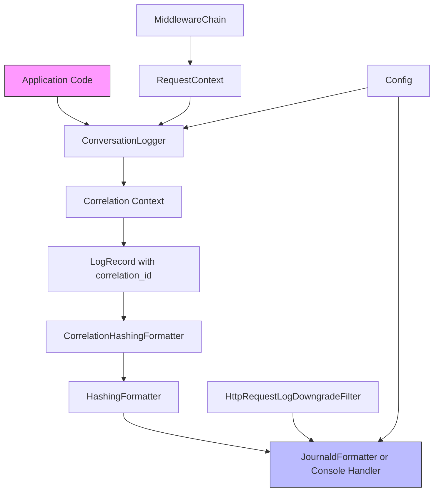
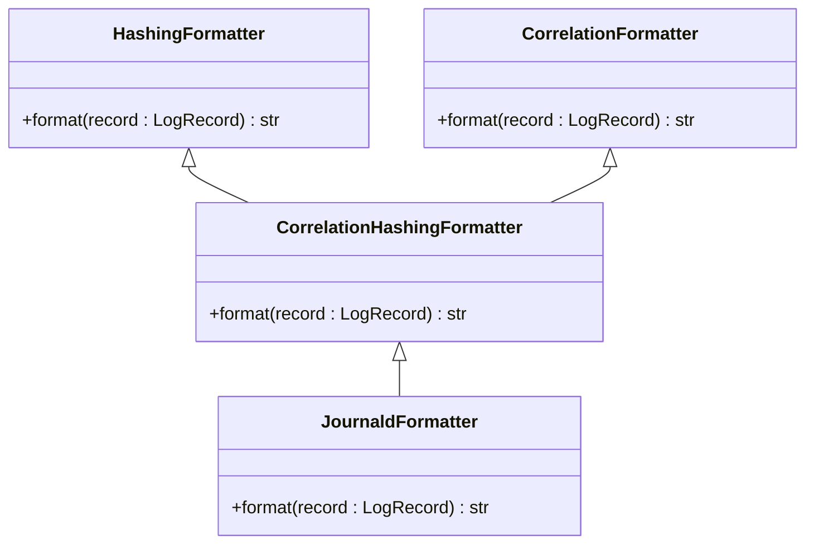
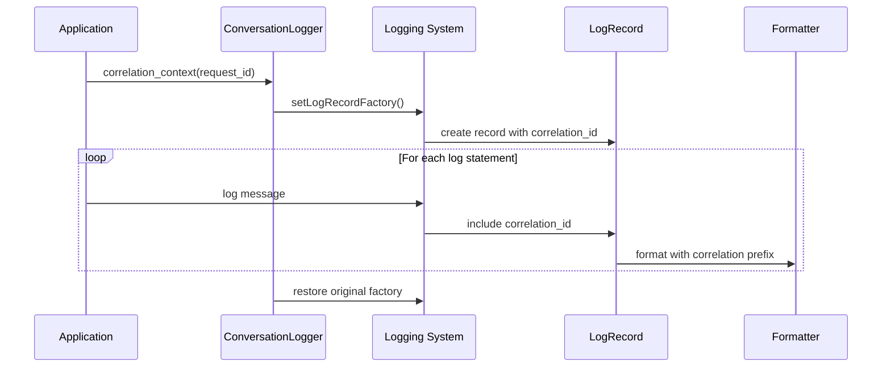
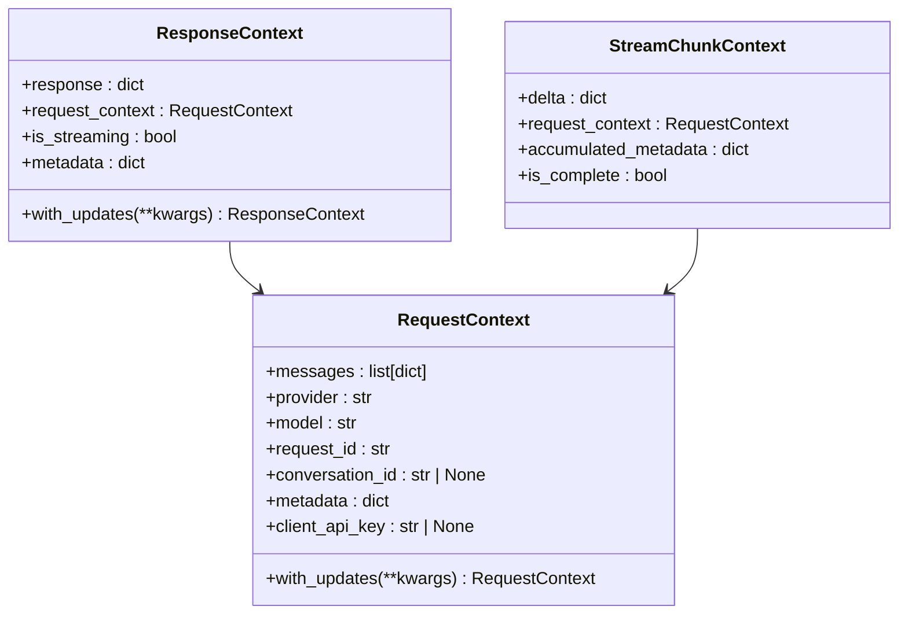
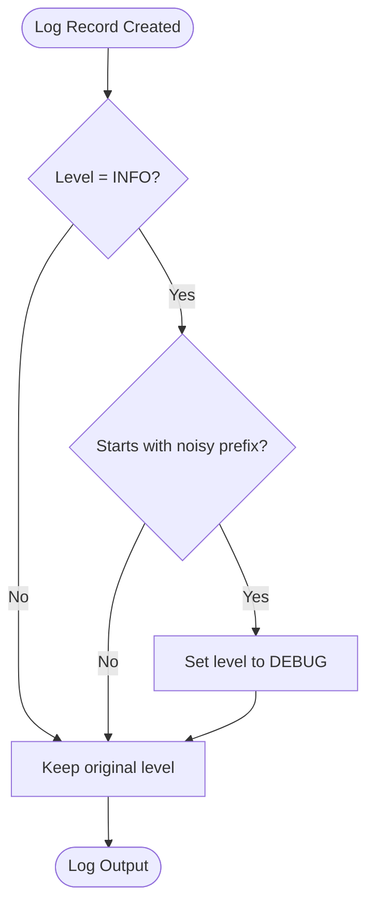
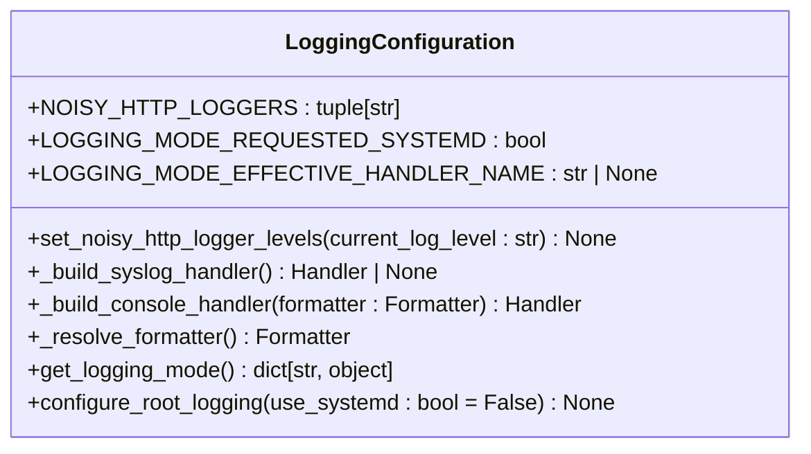
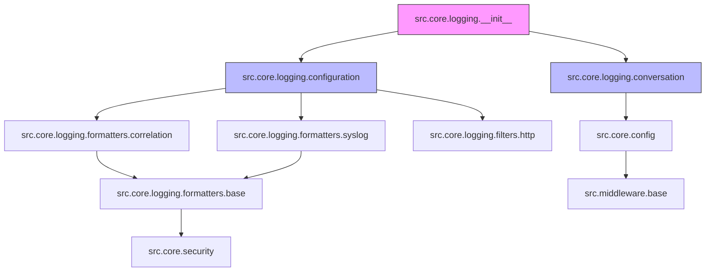

# Structured Logging

<cite>
**Referenced Files in This Document**   
- [src/core/logging/__init__.py](file://src/core/logging/__init__.py)
- [src/core/logging/configuration.py](file://src/core/logging/configuration.py)
- [src/core/logging/conversation.py](file://src/core/logging/conversation.py)
- [src/core/logging/formatters/base.py](file://src/core/logging/formatters/base.py)
- [src/core/logging/formatters/correlation.py](file://src/core/logging/formatters/correlation.py)
- [src/core/logging/formatters/syslog.py](file://src/core/logging/formatters/syslog.py)
- [src/core/logging/filters/http.py](file://src/core/logging/filters/http.py)
- [src/middleware/base.py](file://src/middleware/base.py)
- [src/core/security.py](file://src/core/security.py)
- [src/core/config.py](file://src/core/config.py)
- [src/api/endpoints.py](file://src/api/endpoints.py)
- [src/core/metrics/tracker/tracker.py](file://src/core/metrics/tracker/tracker.py)
</cite>

## Table of Contents
1. [Introduction](#introduction)
2. [Project Structure](#project-structure)
3. [Core Components](#core-components)
4. [Architecture Overview](#architecture-overview)
5. [Detailed Component Analysis](#detailed-component-analysis)
6. [Dependency Analysis](#dependency-analysis)
7. [Performance Considerations](#performance-considerations)
8. [Troubleshooting Guide](#troubleshooting-guide)
9. [Conclusion](#conclusion)

## Introduction
The structured logging framework in Vandamme Proxy provides a consistent, secure, and traceable logging system for monitoring and debugging API requests across multiple AI providers. The system generates JSON-formatted logs with a consistent schema using custom formatters, implements a correlation ID system to link related log entries across requests and services, and enriches logs with request/response metadata through HTTP filters. This documentation details the implementation, configuration, and best practices for the logging framework.

## Project Structure
The logging framework is organized within the `src/core/logging/` directory with a modular design that separates concerns into distinct components:

**Diagram sources**
- [src/core/logging/__init__.py](file://src/core/logging/__init__.py)
- [src/core/logging/configuration.py](file://src/core/logging/configuration.py)
- [src/core/logging/conversation.py](file://src/core/logging/conversation.py)
- [src/core/logging/formatters/base.py](file://src/core/logging/formatters/base.py)
- [src/core/logging/formatters/correlation.py](file://src/core/logging/formatters/correlation.py)
- [src/core/logging/formatters/syslog.py](file://src/core/logging/formatters/syslog.py)
- [src/core/logging/filters/http.py](file://src/core/logging/filters/http.py)

**Section sources**
- [src/core/logging/__init__.py](file://src/core/logging/__init__.py)
- [src/core/logging/configuration.py](file://src/core/logging/configuration.py)

## Core Components
The structured logging framework consists of several core components that work together to provide comprehensive logging capabilities. The system is designed with explicit initialization principles, ensuring predictable behavior and test isolation. Key components include the configuration module for setting up logging handlers, conversation utilities for request correlation, formatters for consistent log output, and filters for controlling log verbosity.

**Section sources**
- [src/core/logging/__init__.py](file://src/core/logging/__init__.py)
- [src/core/logging/configuration.py](file://src/core/logging/configuration.py)
- [src/core/logging/conversation.py](file://src/core/logging/conversation.py)

## Architecture Overview
The logging architecture follows a modular design with clear separation of concerns. The system is initialized explicitly through the `configure_root_logging()` function, which sets up handlers and formatters for both the root logger and uvicorn loggers. The architecture includes a correlation system that links log entries across requests, formatters that ensure consistent JSON output, and filters that control the verbosity of HTTP client logs.

**Diagram sources**
- [src/core/logging/configuration.py](file://src/core/logging/configuration.py)
- [src/core/logging/conversation.py](file://src/core/logging/conversation.py)
- [src/core/logging/formatters/correlation.py](file://src/core/logging/formatters/correlation.py)
- [src/core/logging/formatters/base.py](file://src/core/logging/formatters/base.py)
- [src/core/logging/formatters/syslog.py](file://src/core/logging/formatters/syslog.py)
- [src/core/logging/filters/http.py](file://src/core/logging/filters/http.py)
- [src/middleware/base.py](file://src/middleware/base.py)
- [src/core/config.py](file://src/core/config.py)

## Detailed Component Analysis

### JSON-Formatted Logs with Consistent Schema
The logging framework generates JSON-formatted logs with a consistent schema using custom formatters in the `src/core/logging/formatters/` directory. The system uses a formatter hierarchy where specialized formatters inherit from base formatters to ensure consistent behavior.

**Diagram sources**
- [src/core/logging/formatters/base.py](file://src/core/logging/formatters/base.py#L14-L20)
- [src/core/logging/formatters/correlation.py](file://src/core/logging/formatters/correlation.py#L15-L31)
- [src/core/logging/formatters/syslog.py](file://src/core/logging/formatters/syslog.py#L15-L27)

**Section sources**
- [src/core/logging/formatters/base.py](file://src/core/logging/formatters/base.py)
- [src/core/logging/formatters/correlation.py](file://src/core/logging/formatters/correlation.py)
- [src/core/logging/formatters/syslog.py](file://src/core/logging/formatters/syslog.py)

### Correlation ID System
The correlation ID system links related log entries across requests and services by injecting a correlation ID into LogRecord instances during request processing. This is implemented through the `ConversationLogger` class which uses a context manager to temporarily modify the log record factory.

**Diagram sources**
- [src/core/logging/conversation.py](file://src/core/logging/conversation.py#L18-L42)
- [src/api/endpoints.py](file://src/api/endpoints.py#L211-L212)
- [src/api/endpoints.py](file://src/api/endpoints.py#L435-L436)

**Section sources**
- [src/core/logging/conversation.py](file://src/core/logging/conversation.py)
- [src/api/endpoints.py](file://src/api/endpoints.py#L211-L212)
- [src/api/endpoints.py](file://src/api/endpoints.py#L435-L436)

### RequestContext and Context Propagation
The `RequestContext` from `src/middleware/base.py` propagates request context into logs by providing immutable data structures that carry request metadata including the request ID, which is used as the correlation ID in logs.

**Diagram sources**
- [src/middleware/base.py](file://src/middleware/base.py#L22-L78)

**Section sources**
- [src/middleware/base.py](file://src/middleware/base.py)

### HTTP Filter for Request/Response Metadata
The HTTP filter in `src/core/logging/filters/http.py` enriches logs by downgrading noisy third-party HTTP INFO logs to DEBUG level, preventing them from overwhelming application logs in non-debug environments.

**Diagram sources**
- [src/core/logging/filters/http.py](file://src/core/logging/filters/http.py#L11-L36)

**Section sources**
- [src/core/logging/filters/http.py](file://src/core/logging/filters/http.py)

### Configuration Options
The logging configuration in `src/core/logging/configuration.py` provides options for log levels, output formats, and destinations, with support for both console and syslog/journald output.

**Diagram sources**
- [src/core/logging/configuration.py](file://src/core/logging/configuration.py#L27-L144)

**Section sources**
- [src/core/logging/configuration.py](file://src/core/logging/configuration.py)

## Dependency Analysis
The logging framework has well-defined dependencies between components, with clear import relationships and minimal circular dependencies.

**Diagram sources**
- [src/core/logging/__init__.py](file://src/core/logging/__init__.py)
- [src/core/logging/configuration.py](file://src/core/logging/configuration.py)
- [src/core/logging/conversation.py](file://src/core/logging/conversation.py)
- [src/core/logging/formatters/correlation.py](file://src/core/logging/formatters/correlation.py)
- [src/core/logging/formatters/base.py](file://src/core/logging/formatters/base.py)
- [src/core/logging/formatters/syslog.py](file://src/core/logging/formatters/syslog.py)
- [src/core/logging/filters/http.py](file://src/core/logging/filters/http.py)
- [src/core/config.py](file://src/core/config.py)
- [src/middleware/base.py](file://src/middleware/base.py)
- [src/core/security.py](file://src/core/security.py)

**Section sources**
- [src/core/logging/__init__.py](file://src/core/logging/__init__.py)
- [src/core/logging/configuration.py](file://src/core/logging/configuration.py)
- [src/core/logging/conversation.py](file://src/core/logging/conversation.py)

## Performance Considerations
The logging framework is designed with performance in mind, minimizing overhead through efficient formatter composition and selective log filtering. The system avoids unnecessary string operations and uses efficient data structures for log record processing. The correlation context manager has minimal overhead as it only modifies the log record factory once per request rather than for each log statement.

## Troubleshooting Guide
When troubleshooting logging issues, consider the following common scenarios:

1. **Missing correlation IDs**: Ensure that `ConversationLogger.correlation_context()` is properly wrapped around request processing code.
2. **Noisy HTTP logs**: Verify that the `HttpRequestLogDowngradeFilter` is properly applied to handlers.
3. **Incorrect log levels**: Check the `LOG_LEVEL` environment variable and ensure `configure_root_logging()` is called with the correct parameters.
4. **Missing log output**: Confirm that handlers are properly configured and that the logging subsystem has been initialized.

**Section sources**
- [src/core/logging/configuration.py](file://src/core/logging/configuration.py)
- [src/core/logging/conversation.py](file://src/core/logging/conversation.py)
- [src/core/logging/filters/http.py](file://src/core/logging/filters/http.py)

## Conclusion
The structured logging framework in Vandamme Proxy provides a robust, secure, and traceable logging system that enables effective monitoring and debugging of AI proxy operations. By implementing consistent JSON formatting, correlation IDs, and intelligent log filtering, the system ensures that logs are both human-readable and machine-parsable. The modular design allows for easy configuration and extension, while the security-focused approach prevents sensitive data from being logged. This documentation provides a comprehensive overview of the framework's architecture, components, and best practices for effective log management.