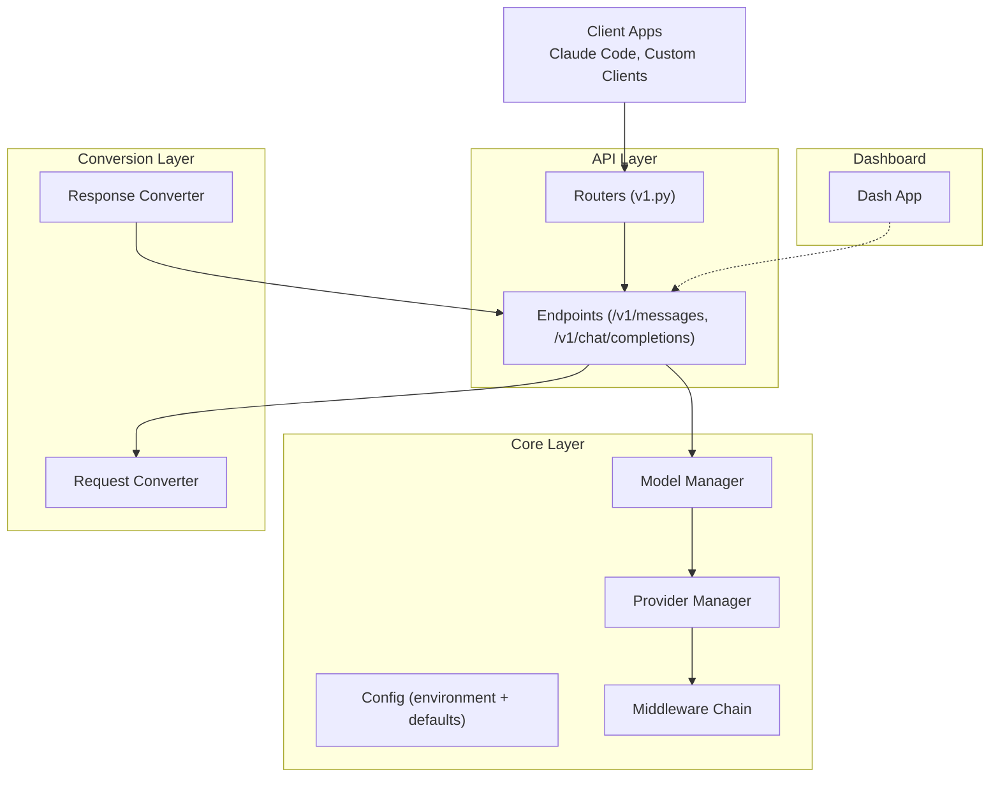
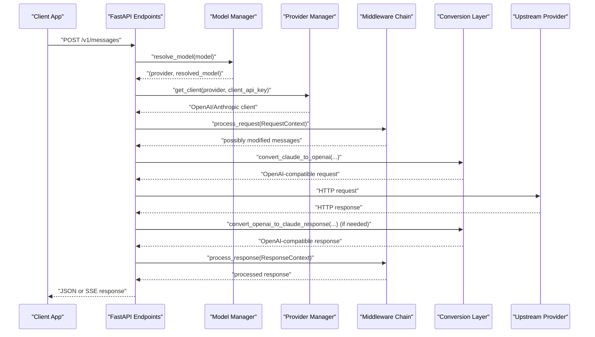
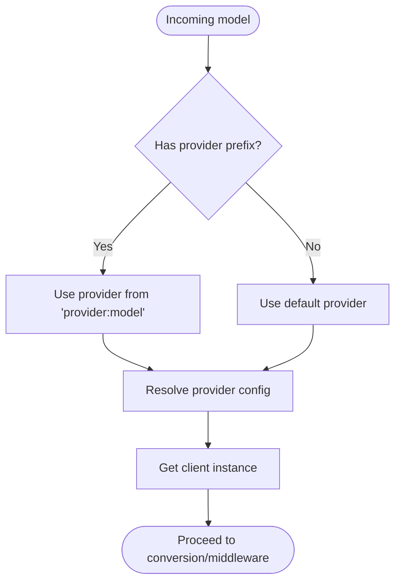
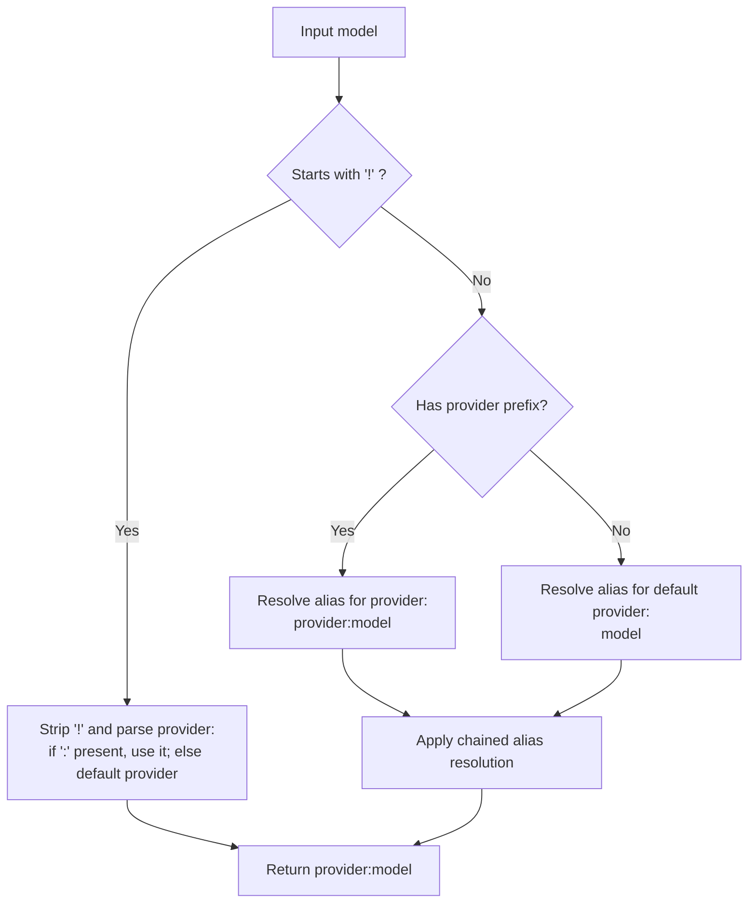
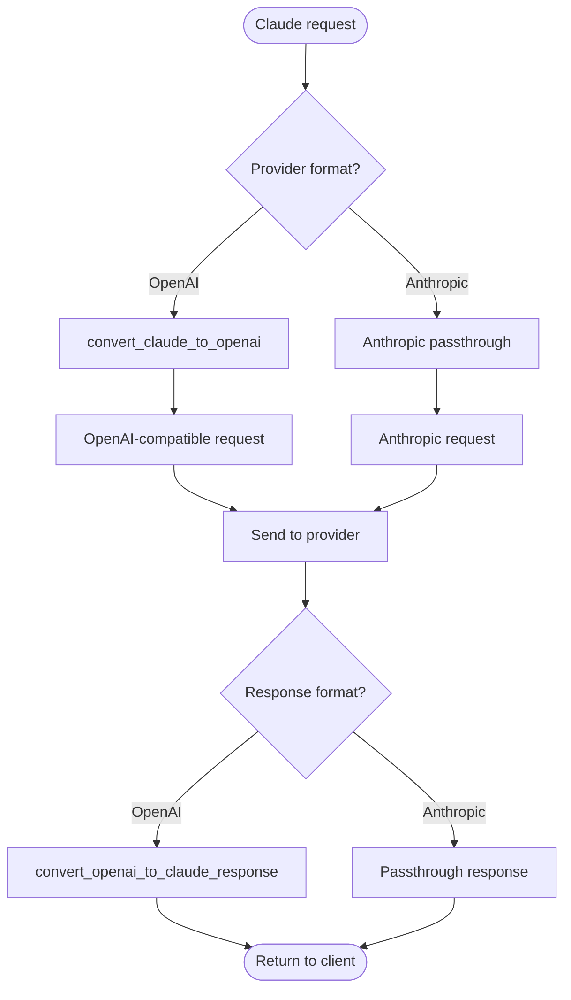
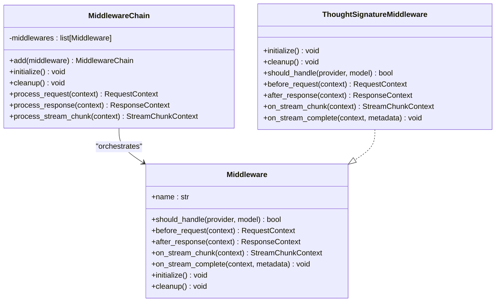
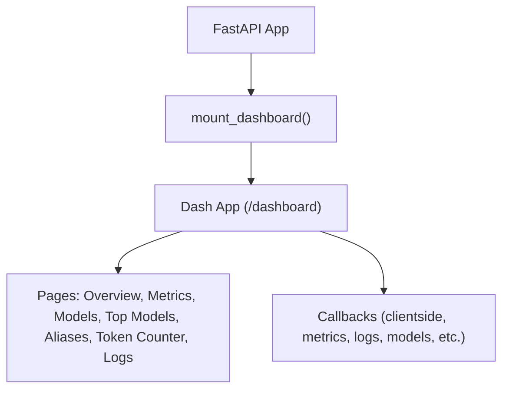
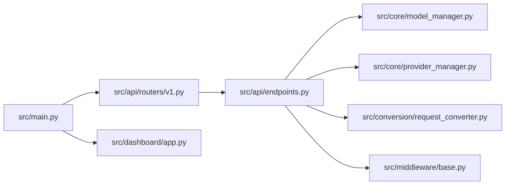

# Project Overview

<cite>
**Referenced Files in This Document**
- [README.md](file://README.md)
- [QUICKSTART.md](file://QUICKSTART.md)
- [src/main.py](file://src/main.py)
- [src/api/routers/v1.py](file://src/api/routers/v1.py)
- [src/api/endpoints.py](file://src/api/endpoints.py)
- [src/core/config.py](file://src/core/config.py)
- [src/core/provider_manager.py](file://src/core/provider_manager.py)
- [src/core/model_manager.py](file://src/core/model_manager.py)
- [src/conversion/request_converter.py](file://src/conversion/request_converter.py)
- [src/middleware/base.py](file://src/middleware/base.py)
- [src/middleware/thought_signature.py](file://src/middleware/thought_signature.py)
- [src/dashboard/app.py](file://src/dashboard/app.py)
</cite>

## Table of Contents
1. [Introduction](#introduction)
2. [Project Structure](#project-structure)
3. [Core Components](#core-components)
4. [Architecture Overview](#architecture-overview)
5. [Detailed Component Analysis](#detailed-component-analysis)
6. [Dependency Analysis](#dependency-analysis)
7. [Performance Considerations](#performance-considerations)
8. [Troubleshooting Guide](#troubleshooting-guide)
9. [Conclusion](#conclusion)

## Introduction
Vandamme Proxy is a universal LLM gateway that unifies diverse AI providers behind a single, consistent API surface. It enables seamless integration across OpenAI, Anthropic, Poe, Azure OpenAI, Gemini, AWS Bedrock, and other compatible APIs. The system provides protocol translation, smart model aliasing, secure API key passthrough, and a built-in dashboard for observability. Its value proposition centers on reducing integration complexity, enabling flexible routing, and offering production-ready features like multi-provider routing, dual API format support, and extensible middleware.

Key benefits:
- Reduced integration complexity: One proxy handles multiple providers and protocols.
- Flexible routing: Provider routing and alias resolution simplify model selection.
- Enhanced observability: Built-in metrics, health checks, and a live dashboard.
- Security and multi-tenancy: API key passthrough and rotation for resilient deployments.

## Project Structure
The project is organized into cohesive layers:
- API layer: FastAPI routers and endpoints expose standardized routes.
- Core layer: Configuration, provider management, model management, and middleware orchestration.
- Conversion layer: Protocol translation between Claude, OpenAI, and Anthropic formats.
- Dashboard: A Dash-based UI for monitoring and management.
- CLI and utilities: Server lifecycle, configuration, and developer workflows.

**Diagram sources**
- [src/api/routers/v1.py](file://src/api/routers/v1.py#L10-L17)
- [src/api/endpoints.py](file://src/api/endpoints.py#L171-L388)
- [src/core/config.py](file://src/core/config.py#L16-L284)
- [src/core/provider_manager.py](file://src/core/provider_manager.py#L29-L586)
- [src/core/model_manager.py](file://src/core/model_manager.py#L13-L117)
- [src/conversion/request_converter.py](file://src/conversion/request_converter.py#L72-L199)
- [src/dashboard/app.py](file://src/dashboard/app.py#L41-L144)

**Section sources**
- [README.md](file://README.md#L85-L127)
- [src/main.py](file://src/main.py#L12-L35)

## Core Components
- Provider routing: Selects the target provider based on model prefixes and default provider configuration.
- Smart model aliasing: Resolves human-friendly aliases to concrete provider:model identifiers with substring matching and prioritization.
- Dual API format support: Converts Claude requests to OpenAI-compatible format or passes through Anthropic-native requests without conversion.
- Middleware chain: Extensible pipeline for custom logic such as thought signature handling for Gemini.
- Dashboard: Live monitoring of metrics, models, aliases, logs, and top models.

These components work together to deliver a unified API surface while preserving provider-specific semantics.

**Section sources**
- [src/core/provider_manager.py](file://src/core/provider_manager.py#L408-L418)
- [src/core/model_manager.py](file://src/core/model_manager.py#L19-L91)
- [src/conversion/request_converter.py](file://src/conversion/request_converter.py#L72-L199)
- [src/middleware/base.py](file://src/middleware/base.py#L191-L398)
- [src/dashboard/app.py](file://src/dashboard/app.py#L41-L144)

## Architecture Overview
The system sits between client applications (notably Claude Code) and multiple LLM providers. Requests flow through provider routing, alias resolution, and optional protocol conversion before reaching the upstream provider. Responses are transformed back to the client’s expected format and optionally processed by middleware.

**Diagram sources**
- [src/api/endpoints.py](file://src/api/endpoints.py#L391-L782)
- [src/core/model_manager.py](file://src/core/model_manager.py#L19-L91)
- [src/core/provider_manager.py](file://src/core/provider_manager.py#L419-L472)
- [src/conversion/request_converter.py](file://src/conversion/request_converter.py#L72-L199)
- [src/middleware/base.py](file://src/middleware/base.py#L253-L340)

## Detailed Component Analysis

### Provider Routing and Configuration
Provider routing determines which upstream client to use based on the model string:
- If the model includes a provider prefix (e.g., openai:gpt-4o), the router uses that provider.
- Otherwise, it falls back to the configured default provider.
- Provider configurations are loaded from environment variables and TOML defaults, including base URLs, timeouts, and API formats.

**Diagram sources**
- [src/core/provider_manager.py](file://src/core/provider_manager.py#L408-L418)
- [src/core/provider_manager.py](file://src/core/provider_manager.py#L419-L472)

**Section sources**
- [src/core/provider_manager.py](file://src/core/provider_manager.py#L91-L112)
- [src/core/config.py](file://src/core/config.py#L16-L108)

### Smart Model Aliasing and Resolution
The Model Manager resolves aliases to concrete provider:model identifiers:
- Supports exact and substring matching with case-insensitive, underscore/hyphen variations.
- Honors provider scoping: default provider when no prefix is present; cross-provider when a prefix is included.
- Handles chained aliases and literal names prefixed with an exclamation mark to bypass aliasing.

**Diagram sources**
- [src/core/model_manager.py](file://src/core/model_manager.py#L19-L91)
- [src/core/alias/resolver.py](file://src/core/alias/resolver.py#L135-L172)
- [src/core/alias/resolver.py](file://src/core/alias/resolver.py#L175-L270)
- [src/core/alias/resolver.py](file://src/core/alias/resolver.py#L273-L340)
- [src/core/alias/resolver.py](file://src/core/alias/resolver.py#L343-L414)

**Section sources**
- [src/core/model_manager.py](file://src/core/model_manager.py#L19-L91)
- [src/core/alias/resolver.py](file://src/core/alias/resolver.py#L135-L172)
- [src/core/alias/resolver.py](file://src/core/alias/resolver.py#L175-L270)
- [src/core/alias/resolver.py](file://src/core/alias/resolver.py#L273-L340)
- [src/core/alias/resolver.py](file://src/core/alias/resolver.py#L343-L414)

### Dual API Format Support and Protocol Translation
The conversion layer translates between Claude and OpenAI formats when needed:
- Claude-to-OpenAI conversion for standard OpenAI-compatible providers.
- Anthropic passthrough for providers that require native SSE and Anthropic semantics (e.g., AWS Bedrock, Google Vertex AI).
- Streaming and non-streaming paths are supported for both directions.

**Diagram sources**
- [src/conversion/request_converter.py](file://src/conversion/request_converter.py#L72-L199)
- [src/api/endpoints.py](file://src/api/endpoints.py#L253-L323)
- [src/api/endpoints.py](file://src/api/endpoints.py#L535-L723)

**Section sources**
- [src/conversion/request_converter.py](file://src/conversion/request_converter.py#L72-L199)
- [src/api/endpoints.py](file://src/api/endpoints.py#L253-L323)
- [src/api/endpoints.py](file://src/api/endpoints.py#L535-L723)

### Middleware Chain and Thought Signature
The middleware chain enables extensible request/response processing:
- Middleware can choose whether to handle a given provider/model.
- Supports request modification, response post-processing, and streaming chunk handling.
- Thought signature middleware for Gemini persists reasoning details across turns to improve function calling reliability.

**Diagram sources**
- [src/middleware/base.py](file://src/middleware/base.py#L94-L189)
- [src/middleware/base.py](file://src/middleware/base.py#L191-L398)
- [src/middleware/thought_signature.py](file://src/middleware/thought_signature.py#L31-L150)

**Section sources**
- [src/middleware/base.py](file://src/middleware/base.py#L94-L189)
- [src/middleware/base.py](file://src/middleware/base.py#L191-L398)
- [src/middleware/thought_signature.py](file://src/middleware/thought_signature.py#L31-L150)

### Dashboard and Observability
The built-in dashboard provides live insights:
- Overview, metrics, models, top models, aliases, token counter, and logs.
- Dark-themed UI with navigation and theme-aware components.
- Mounted under /dashboard and integrates with the FastAPI app.

**Diagram sources**
- [src/main.py](file://src/main.py#L21-L35)
- [src/dashboard/app.py](file://src/dashboard/app.py#L41-L144)

**Section sources**
- [src/main.py](file://src/main.py#L21-L35)
- [src/dashboard/app.py](file://src/dashboard/app.py#L41-L144)

## Dependency Analysis
High-level dependencies:
- FastAPI app wires routers and includes metrics and dashboard mounts.
- Endpoints depend on Model Manager for alias resolution, Provider Manager for client selection, and Conversion Layer for protocol translation.
- Middleware chain is integrated into request/response processing and streaming.

**Diagram sources**
- [src/main.py](file://src/main.py#L12-L35)
- [src/api/routers/v1.py](file://src/api/routers/v1.py#L10-L17)
- [src/api/endpoints.py](file://src/api/endpoints.py#L171-L388)
- [src/core/model_manager.py](file://src/core/model_manager.py#L13-L117)
- [src/core/provider_manager.py](file://src/core/provider_manager.py#L29-L586)
- [src/conversion/request_converter.py](file://src/conversion/request_converter.py#L72-L199)
- [src/middleware/base.py](file://src/middleware/base.py#L191-L398)
- [src/dashboard/app.py](file://src/dashboard/app.py#L41-L144)

**Section sources**
- [src/main.py](file://src/main.py#L12-L35)
- [src/api/routers/v1.py](file://src/api/routers/v1.py#L10-L17)
- [src/api/endpoints.py](file://src/api/endpoints.py#L171-L388)

## Performance Considerations
- Streaming-first design: Both Claude and OpenAI-compatible providers benefit from streaming responses to reduce latency and improve UX.
- Minimal conversion overhead: Anthropic passthrough mode avoids conversion costs for providers that support native SSE.
- Middleware is selective: Only applies to providers/models that explicitly opt-in, minimizing unnecessary processing.
- Provider client caching: Reuses clients per provider to reduce connection overhead.

[No sources needed since this section provides general guidance]

## Troubleshooting Guide
Common operational checks:
- Health checks: Verify server and upstream connectivity.
- Configuration validation: Confirm environment variables and provider settings.
- Metrics and logs: Use the dashboard and server logs to diagnose issues.
- Timeout handling: Requests that exceed the configured timeout map to a gateway timeout response.

Operational tips:
- Use the interactive configuration wizard for guided setup.
- Start in development mode with hot reload for rapid iteration.
- Enable detailed logging at debug level when investigating issues.

**Section sources**
- [README.md](file://README.md#L197-L213)
- [QUICKSTART.md](file://QUICKSTART.md#L136-L150)
- [src/api/endpoints.py](file://src/api/endpoints.py#L53-L83)

## Conclusion
Vandamme Proxy delivers a pragmatic, production-ready solution for multi-provider LLM integration. By unifying diverse provider interfaces under a consistent API surface, it reduces complexity, improves flexibility, and enhances observability. Its architecture supports provider routing, smart aliasing, dual API format handling, and extensible middleware—making it suitable for both simple setups and advanced use cases like multi-tenant deployments, A/B testing, and cost optimization through intelligent routing and key rotation.