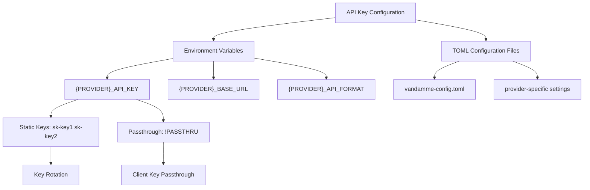
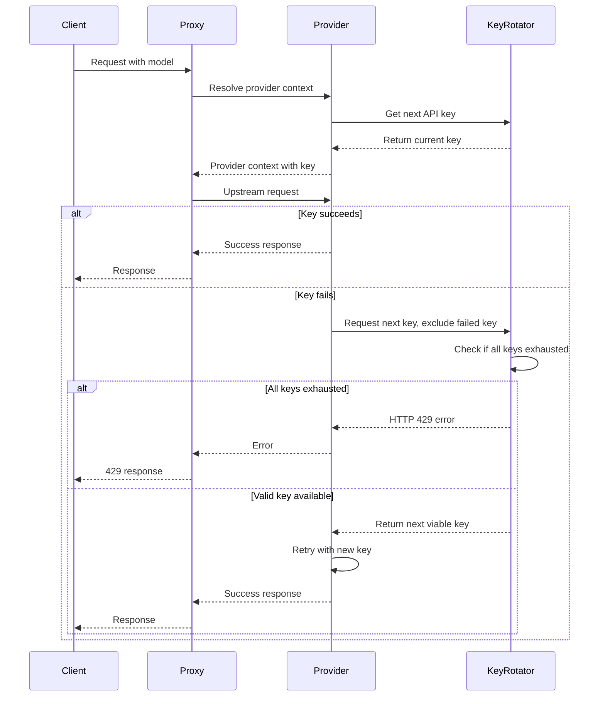
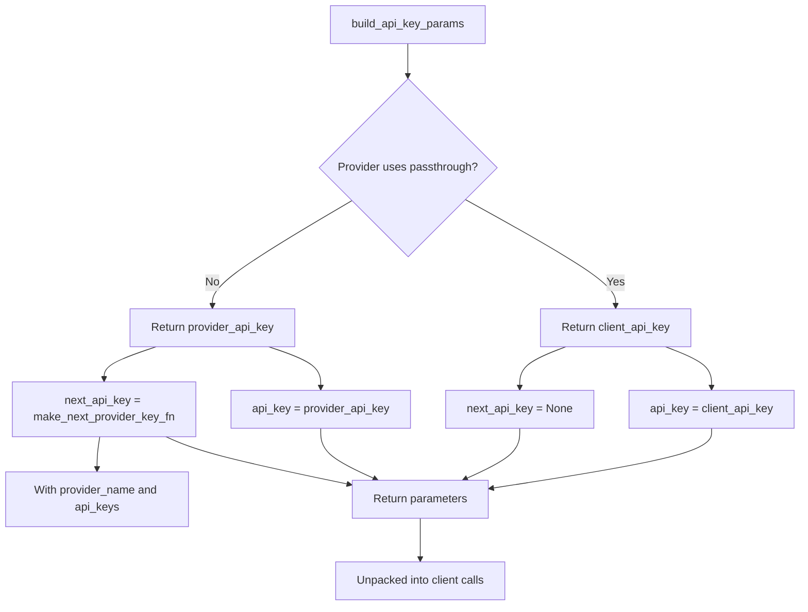
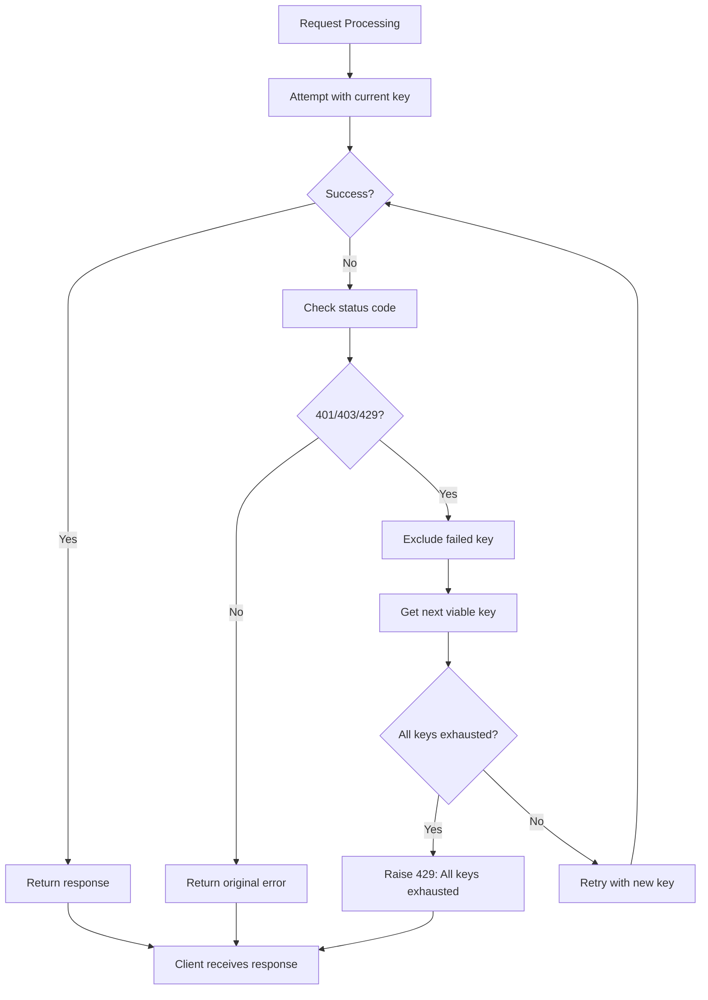
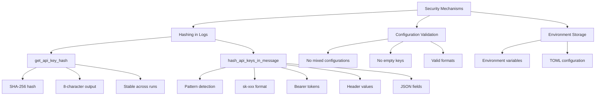

# API Key Management

<cite>
**Referenced Files in This Document**   
- [key_rotation.py](file://src/api/services/key_rotation.py)
- [security.py](file://src/core/security.py)
- [provider_config.py](file://src/core/provider_config.py)
- [provider_manager.py](file://src/core/provider_manager.py)
- [config.py](file://src/core/config.py)
- [provider_context.py](file://src/api/services/provider_context.py)
- [vandamme-config.toml](file://vandamme-config.toml)
- [multi-api-keys.md](file://docs/multi-api-keys.md)
</cite>

## Table of Contents
1. [Introduction](#introduction)
2. [API Key Storage and Configuration](#api-key-storage-and-configuration)
3. [Key Rotation Mechanism](#key-rotation-mechanism)
4. [build_api_key_params Function](#build_api_key_params-function)
5. [Multi-Key Configuration Examples](#multi-key-configuration-examples)
6. [429 Error Handling](#429-error-handling)
7. [Security Considerations](#security-considerations)
8. [Troubleshooting Guide](#troubleshooting-guide)

## Introduction
The vandamme-proxy system implements a comprehensive API key management system that handles both client and provider API keys securely. The system supports multiple authentication patterns including static key configuration and client key passthrough, with robust mechanisms for key rotation, validation, and security. This documentation details the implementation of the key management system, focusing on the secure handling of credentials, the key rotation mechanism, and error handling when all keys are exhausted.

**Section sources**
- [key_rotation.py](file://src/api/services/key_rotation.py#L1-L70)
- [security.py](file://src/core/security.py#L1-L95)

## API Key Storage and Configuration
API keys in the vandamme-proxy system are primarily configured through environment variables, with support for multiple configuration patterns. The system distinguishes between two main types of API key configurations: static keys and passthrough mode.

Static API keys are configured using environment variables following the pattern `{PROVIDER}_API_KEY`, where multiple keys can be specified by separating them with whitespace. For example, `OPENAI_API_KEY="sk-key1 sk-key2 sk-key3"` configures three OpenAI API keys for rotation. The system validates these configurations during initialization, ensuring that mixed configurations (combining static keys with passthrough) are rejected.

Passthrough mode is enabled by setting the API key to the sentinel value `!PASSTHRU`, which indicates that the provider should use the client's API key rather than a provider-managed key. This is useful for scenarios where clients provide their own credentials for upstream services.

The configuration system also supports provider-specific settings through TOML configuration files, allowing for base URLs, timeouts, and other parameters to be defined alongside API keys. The system validates all configurations during startup, ensuring that required fields are present and properly formatted.



**Diagram sources**
- [provider_config.py](file://src/core/provider_config.py#L1-L102)
- [config.py](file://src/core/config.py#L1-L285)
- [vandamme-config.toml](file://vandamme-config.toml#L1-L44)

**Section sources**
- [provider_config.py](file://src/core/provider_config.py#L1-L102)
- [config.py](file://src/core/config.py#L1-L285)
- [vandamme-config.toml](file://vandamme-config.toml#L1-L44)

## Key Rotation Mechanism
The vandamme-proxy system implements a sophisticated key rotation mechanism that automatically handles failed API keys and selects the next viable key from a configured pool. This functionality is centered around the `make_next_provider_key_fn` function in `src/api/services/key_rotation.py`, which creates a reusable key rotator for a specific provider.

The key rotation system uses a round-robin algorithm with process-global state, ensuring that keys are rotated across all requests in a predictable manner. Each provider maintains its own rotation state, with an index tracking the current position in the key list. The rotation is thread-safe, using asyncio locks to prevent race conditions when multiple requests attempt to rotate keys simultaneously.

When an upstream request fails with authentication errors (401/403) or rate limiting (429), the calling code can exclude the failed key by passing it to the `next_api_key` function. The system then iterates through the remaining keys until it finds one that is not in the exclusion set. If all configured keys are exhausted, the system raises an HTTP 429 error with the message "All provider API keys exhausted".

The rotation logic is implemented in the `ProviderManager.get_next_provider_api_key` method, which handles the actual selection of the next key using modulo arithmetic to wrap around to the beginning of the list when the end is reached. This ensures continuous rotation through all configured keys.



**Diagram sources**
- [key_rotation.py](file://src/api/services/key_rotation.py#L1-L70)
- [provider_manager.py](file://src/core/provider_manager.py#L1-L586)

**Section sources**
- [key_rotation.py](file://src/api/services/key_rotation.py#L1-L70)
- [provider_manager.py](file://src/core/provider_manager.py#L1-L586)

## build_api_key_params Function
The `build_api_key_params` function in `src/api/services/key_rotation.py` is a central utility that constructs the authentication parameters for upstream API calls. This function determines the appropriate API key configuration based on whether the provider uses passthrough mode or static keys.

For passthrough providers (where the provider configuration's API key is set to the `!PASSTHRU` sentinel), the function returns the client's API key as the `api_key` parameter and sets `next_api_key` to None, as key rotation is not applicable when using client-provided credentials.

For non-passthrough providers, the function returns the current provider API key as the `api_key` parameter and configures the `next_api_key` parameter with a callable that can provide the next viable key in case of authentication failure. This callable is created using the `make_next_provider_key_fn` function, which is initialized with the provider's name and complete list of API keys.

The function serves as a central point for API key parameter construction, eliminating code duplication across the codebase. It handles the conditional logic for different authentication modes and ensures consistent parameter formatting for upstream client calls.



**Diagram sources**
- [key_rotation.py](file://src/api/services/key_rotation.py#L35-L69)

**Section sources**
- [key_rotation.py](file://src/api/services/key_rotation.py#L35-L69)

## Multi-Key Configuration Examples
The vandamme-proxy system supports various multi-key configuration patterns for different deployment scenarios. These configurations are typically set through environment variables or TOML configuration files.

For production deployments requiring high availability, multiple API keys can be configured for each provider using whitespace separation in the environment variable:

```bash
OPENAI_API_KEY="sk-prod-key1 sk-prod-key2 sk-prod-key3"
ANTHROPIC_API_KEY="sk-ant-prod1 sk-ant-prod2 sk-ant-backup"
```

For cost optimization, different providers can be configured with different key sets for various use cases:

```bash
# High-priority tasks with premium provider
OPENAI_API_KEY="sk-gpt4-key1 sk-gpt4-key2"

# Bulk operations with cost-effective provider
POE_API_KEY="poe-bulk-key1 poe-bulk-key2 poe-bulk-key3"

# Development with local models
OLLAMA_API_KEY="dummy-key"
OLLAMA_BASE_URL="http://localhost:11434/v1"
```

Passthrough mode can be combined with static key configurations for different providers, but not for the same provider:

```bash
# Static keys with automatic rotation (recommended for production)
OPENAI_API_KEY="sk-key1 sk-key2 sk-key3"

# Passthrough mode for client-provided keys
POE_API_KEY=!PASSTHRU
```

It's important to note that mixing static keys with the `!PASSTHRU` sentinel for the same provider is explicitly prohibited and will raise a configuration error.

**Section sources**
- [multi-api-keys.md](file://docs/multi-api-keys.md#L1-L272)
- [provider_config.py](file://src/core/provider_config.py#L1-L102)

## 429 Error Handling
The vandamme-proxy system implements specific handling for HTTP 429 (Too Many Requests) errors when all configured API keys for a provider are exhausted. This occurs when the key rotation mechanism has attempted all available keys and none are viable, typically due to all keys being rate-limited or having insufficient quota.

When the `make_next_provider_key_fn` function detects that the number of excluded keys equals or exceeds the total number of configured keys, it raises an HTTPException with status code 429 and the detail message "All provider API keys exhausted". This provides clear feedback to clients about the nature of the failure.

The system automatically detects key exhaustion during the rotation process. When a request fails with a 401, 403, or 429 status code, the failed key is added to the exclusion set, and the system attempts to retrieve the next viable key. This process continues until either a working key is found or all keys are exhausted.

For passthrough providers, the 429 error handling is different, as the system does not manage multiple keys. In this case, rate limiting is handled by the upstream provider, and the proxy simply passes through the response.



**Diagram sources**
- [key_rotation.py](file://src/api/services/key_rotation.py#L23-L32)
- [test_api_key_rotation.py](file://tests/unit/test_api_key_rotation.py#L119-L138)

**Section sources**
- [key_rotation.py](file://src/api/services/key_rotation.py#L23-L32)
- [test_api_key_rotation.py](file://tests/unit/test_api_key_rotation.py#L119-L138)

## Security Considerations
The vandamme-proxy system implements several security measures to protect API keys from exposure and leakage. The most important of these is the hashing mechanism implemented in `src/core/security.py`, which prevents credential leakage in logs and other output.

The `get_api_key_hash` function generates an 8-character stable hash of an API key using SHA-256. This hash is non-reversible and stable across application runs, allowing for incident correlation without exposing the actual key. Empty or sentinel values are returned as "REDACTED" to prevent confusion.

The `hash_api_keys_in_message` function scans log messages and other text for common API key patterns and replaces them with their hashed equivalents. This function detects various formats including:
- OpenAI-style keys (sk-xxx)
- Bearer tokens
- x-api-key headers
- JSON-encoded api_key fields

The pattern matching is conservative to avoid false positives while catching typical key formats. When a key is detected, it is replaced with its hash while preserving the surrounding structure (e.g., "Bearer <hash>") to maintain the usefulness of the log message.

Additional security considerations include:
- Storing API keys in environment variables rather than code
- Validating key configurations during startup
- Preventing mixed configurations of static keys and passthrough
- Using process-global state for key rotation to prevent information leakage



**Diagram sources**
- [security.py](file://src/core/security.py#L1-L95)

**Section sources**
- [security.py](file://src/core/security.py#L1-L95)

## Troubleshooting Guide
This section provides guidance for troubleshooting common API key-related issues in the vandamme-proxy system.

### Authentication Failures
When experiencing authentication failures, check the following:

1. **Verify key configuration**: Ensure API keys are correctly set in environment variables
   ```bash
   env | grep API_KEY
   ```

2. **Check key format**: Ensure proper whitespace separation and no trailing spaces
   ```bash
   echo $OPENAI_API_KEY | xxd  # Check for unexpected characters
   ```

3. **Validate individual keys**: Test each key separately to identify which ones are valid
   ```bash
   # Test with single key
   OPENAI_API_KEY="sk-test-key" vdm server start
   ```

### Quota Exhaustion
When encountering quota exhaustion issues:

1. **Monitor key usage**: Check if specific keys are being overused
   ```bash
   # Enable debug logging to see key rotation
   LOG_LEVEL=DEBUG vdm server start
   ```

2. **Verify key quotas**: Ensure all configured keys have sufficient quota
   ```bash
   # Check provider dashboards for usage statistics
   ```

3. **Add backup keys**: Configure additional keys for failover
   ```bash
   OPENAI_API_KEY="sk-primary sk-backup1 sk-backup2"
   ```

### Common Error Messages
**"All provider API keys exhausted" (HTTP 429)**
- **Cause**: All configured keys are rate-limited or invalid
- **Solution**: Check key validity and quota, add additional keys

**"Cannot mix !PASSTHRU with static keys"**
- **Cause**: Attempting to combine passthrough mode with static keys for the same provider
- **Solution**: Use either all static keys or `!PASSTHRU`, not both

**"Empty API key detected"**
- **Cause**: Configuration contains empty strings in key list
- **Solution**: Ensure no empty strings in your key configuration

### Debugging Steps
1. **Check configuration**: Verify all environment variables are set correctly
2. **Enable verbose logging**: Use `LOG_LEVEL=DEBUG` to see detailed key rotation information
3. **Monitor logs**: Look for key hash changes and rotation events
   ```bash
   vdm server start 2>&1 | grep -E "(API KEY|rotation|exhausted)"
   ```
4. **Test with minimal configuration**: Start with a single key to isolate issues

**Section sources**
- [multi-api-keys.md](file://docs/multi-api-keys.md#L153-L197)
- [test_multi_api_keys.py](file://tests/unit/test_multi_api_keys.py#L62-L89)
- [test_api_key_rotation.py](file://tests/unit/test_api_key_rotation.py#L119-L155)