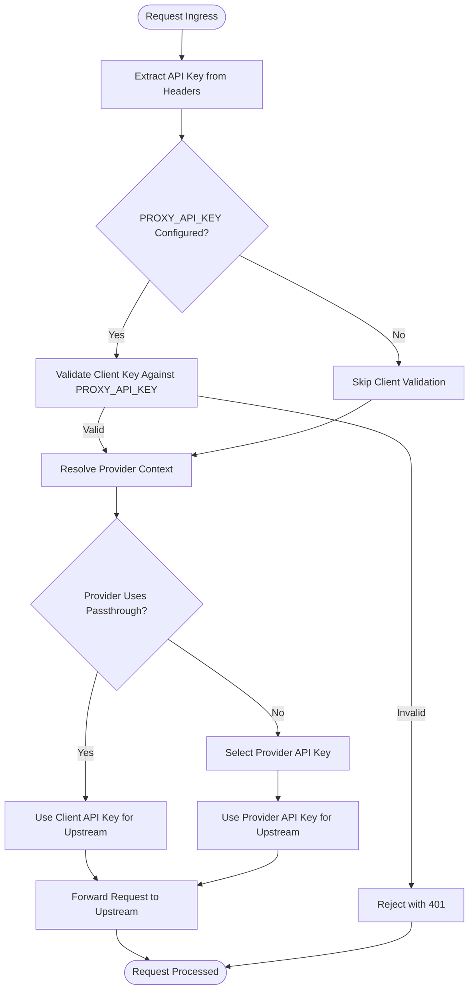
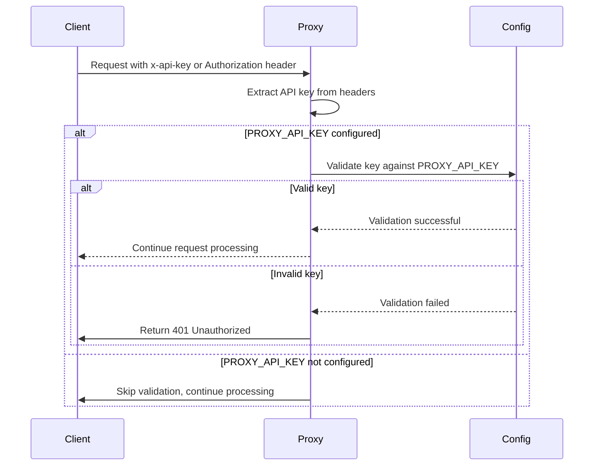
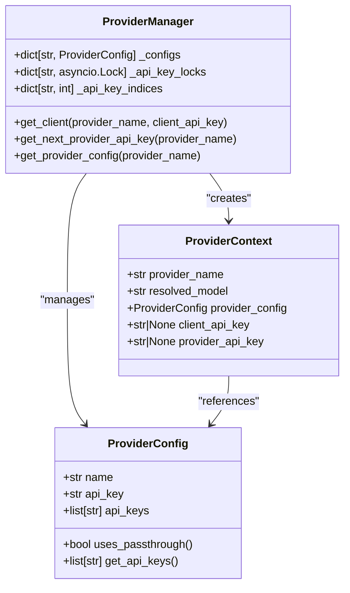
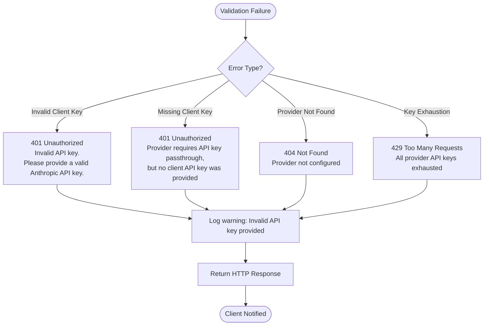
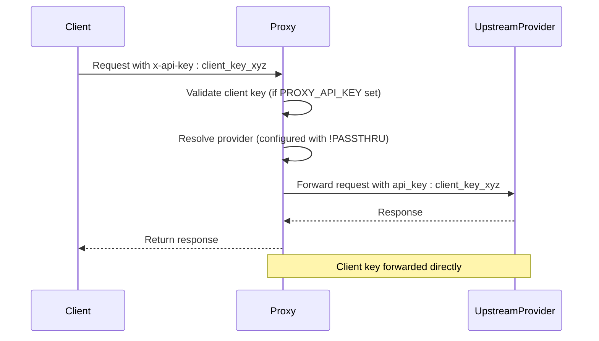
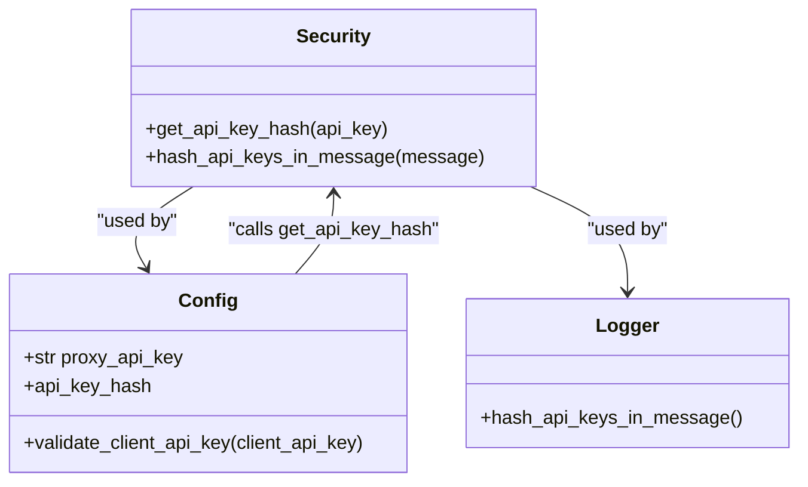

# API Key Validation

<cite>
**Referenced Files in This Document**   
- [endpoints.py](file://src/api/endpoints.py)
- [config.py](file://src/core/config.py)
- [security.py](file://src/core/security.py)
- [key_rotation.py](file://src/api/services/key_rotation.py)
- [provider_config.py](file://src/core/provider_config.py)
- [provider_manager.py](file://src/core/provider_manager.py)
- [provider_context.py](file://src/api/services/provider_context.py)
</cite>

## Table of Contents
1. [Introduction](#introduction)
2. [Validation Flow](#validation-flow)
3. [Client API Key Validation](#client-api-key-validation)
4. [Provider API Key Management](#provider-api-key-management)
5. [Error Handling and Response](#error-handling-and-response)
6. [Passthrough Architecture](#passthrough-architecture)
7. [Security and Logging](#security-and-logging)
8. [Configuration and Best Practices](#configuration-and-best-practices)
9. [Troubleshooting](#troubleshooting)
10. [Conclusion](#conclusion)

## Introduction
The vandamme-proxy system implements a comprehensive API key validation mechanism to authenticate client requests and manage provider authentication. This documentation details the validation process for both client and provider API keys, covering the complete request lifecycle from header parsing to upstream forwarding. The system supports both static provider keys and client key passthrough configurations, with robust validation, error handling, and security features.

**Section sources**
- [endpoints.py](file://src/api/endpoints.py#L112-L138)
- [config.py](file://src/core/config.py#L233-L241)

## Validation Flow
The API key validation process begins when a request enters the system through the `/v1/messages` or `/v1/chat/completions` endpoints. The validation flow follows a structured sequence:

1. **Header Extraction**: The system extracts the API key from either the `x-api-key` header or the `Authorization` header (using Bearer token format).
2. **Proxy Validation**: If a `PROXY_API_KEY` is configured in the environment, the client's key is validated against this value.
3. **Provider Context Resolution**: The system resolves the target provider and model, determining whether passthrough authentication is required.
4. **Provider Key Selection**: For non-passthrough providers, an appropriate provider API key is selected from the configured keys.
5. **Upstream Request**: The request is forwarded to the upstream provider with the appropriate authentication.

This flow ensures that all requests are properly authenticated before being processed by upstream providers.

**Diagram sources**
- [endpoints.py](file://src/api/endpoints.py#L112-L138)
- [provider_context.py](file://src/api/services/provider_context.py#L21-L58)

**Section sources**
- [endpoints.py](file://src/api/endpoints.py#L112-L138)
- [provider_context.py](file://src/api/services/provider_context.py#L21-L58)

## Client API Key Validation
Client API key validation is controlled by the `PROXY_API_KEY` environment variable. When this variable is set, the system validates all incoming client API keys against its value. The validation process supports two header formats:

- `x-api-key`: Direct API key header
- `Authorization`: Bearer token format (extracts key after "Bearer " prefix)

The validation function `validate_api_key` in `endpoints.py` handles this process, returning the validated key or raising a 401 Unauthorized error for invalid keys. When `PROXY_API_KEY` is not set, client key validation is disabled, and the system accepts any provided key (or no key).

**Diagram sources**
- [endpoints.py](file://src/api/endpoints.py#L112-L138)
- [config.py](file://src/core/config.py#L233-L241)

**Section sources**
- [endpoints.py](file://src/api/endpoints.py#L112-L138)
- [config.py](file://src/core/config.py#L233-L241)

## Provider API Key Management
The system manages provider API keys through the ProviderManager and ProviderConfig classes. Providers can be configured in two authentication modes:

1. **Static Keys**: The proxy uses one or more pre-configured API keys for the provider
2. **Passthrough**: The client's API key is forwarded directly to the provider

The authentication mode is determined by the provider's configuration. When multiple static keys are configured, the system implements round-robin key rotation to distribute load and handle key exhaustion. The `build_api_key_params` function in `key_rotation.py` constructs the appropriate authentication parameters based on the provider's configuration.

**Diagram sources**
- [provider_config.py](file://src/core/provider_config.py#L7-L102)
- [provider_manager.py](file://src/core/provider_manager.py#L29-L586)
- [provider_context.py](file://src/api/services/provider_context.py#L12-L19)

**Section sources**
- [provider_config.py](file://src/core/provider_config.py#L7-L102)
- [provider_manager.py](file://src/core/provider_manager.py#L29-L586)
- [provider_context.py](file://src/api/services/provider_context.py#L12-L19)

## Error Handling and Response
The system implements comprehensive error handling for API key validation failures. When a client provides an invalid API key, the system returns a 401 Unauthorized response with a descriptive error message. The error handling follows these principles:

- **Client Validation Errors**: Return 401 with "Invalid API key" message when the client key doesn't match the expected `PROXY_API_KEY`
- **Missing Client Key**: Return 401 when a passthrough provider requires a client key but none is provided
- **Provider Configuration Errors**: Return appropriate HTTP status codes for misconfigured providers

Error responses include detailed messages to help clients understand the issue while avoiding exposure of sensitive configuration details. The system also logs validation failures for monitoring and troubleshooting purposes.

**Diagram sources**
- [endpoints.py](file://src/api/endpoints.py#L134-L136)
- [provider_context.py](file://src/api/services/provider_context.py#L38-L45)
- [key_rotation.py](file://src/api/services/key_rotation.py#L23-L31)

**Section sources**
- [endpoints.py](file://src/api/endpoints.py#L134-L136)
- [provider_context.py](file://src/api/services/provider_context.py#L38-L45)
- [key_rotation.py](file://src/api/services/key_rotation.py#L23-L31)

## Passthrough Architecture
The passthrough architecture allows the proxy to forward client API keys directly to upstream providers. This feature is enabled by setting a provider's API key to the sentinel value `!PASSTHRU` in the environment variables. The passthrough system provides several benefits:

- **Client Autonomy**: Clients can use their own provider accounts and API keys
- **Cost Management**: Organizations can control costs by using their own keys for expensive providers
- **Rate Limit Isolation**: Client rate limits are enforced by the upstream provider, preventing one client from affecting others

When a provider is configured for passthrough, the system validates that a client API key is present and uses it directly for upstream authentication. This eliminates the need for the proxy to manage provider credentials for that service.

**Diagram sources**
- [provider_config.py](file://src/core/provider_config.py#L33-L39)
- [key_rotation.py](file://src/api/services/key_rotation.py#L56-L58)
- [provider_context.py](file://src/api/services/provider_context.py#L38-L45)

**Section sources**
- [provider_config.py](file://src/core/provider_config.py#L33-L39)
- [key_rotation.py](file://src/api/services/key_rotation.py#L56-L58)
- [provider_context.py](file://src/api/services/provider_context.py#L38-L45)

## Security and Logging
The system implements several security measures to protect API keys and ensure secure operation:

- **Key Hashing**: API keys are hashed using SHA-256 for secure identification without exposing the full key
- **Log Redaction**: The `hash_api_keys_in_message` function in `security.py` replaces API keys in log messages with stable short hashes
- **Configuration Validation**: The system validates provider configurations at startup, preventing mixed passthrough/static key configurations

These security features ensure that sensitive credentials are not exposed in logs or error messages while still providing sufficient information for debugging and monitoring.

**Diagram sources**
- [security.py](file://src/core/security.py#L20-L94)
- [config.py](file://src/core/config.py#L264-L277)
- [endpoints.py](file://src/api/endpoints.py#L47)

**Section sources**
- [security.py](file://src/core/security.py#L20-L94)
- [config.py](file://src/core/config.py#L264-L277)

## Configuration and Best Practices
Proper configuration is essential for secure and reliable API key validation. Key configuration variables include:

- **PROXY_API_KEY**: The master key against which client keys are validated
- **[PROVIDER]_API_KEY**: Provider-specific API keys, with `!PASSTHRU` for passthrough mode
- **LOG_REQUEST_METRICS**: Enables detailed request logging and metrics

Best practices for key management include:

- Use strong, randomly generated keys for `PROXY_API_KEY`
- Rotate keys periodically and update configurations accordingly
- Use passthrough mode for providers where clients should use their own accounts
- Monitor logs for validation failures and investigate suspicious activity
- Implement proper access controls for environment variables containing API keys

The system also supports multiple API keys per provider for load distribution and failover, with round-robin rotation to balance usage across keys.

**Section sources**
- [config.py](file://src/core/config.py#L64-L65)
- [provider_config.py](file://src/core/provider_config.py#L4-L5)
- [docs/api-key-passthrough.md](file://docs/api-key-passthrough.md#L7-L11)

## Troubleshooting
Common validation-related issues and their diagnostic indicators include:

- **401 Unauthorized - Invalid API key**: Client provided a key that doesn't match `PROXY_API_KEY`. Check client key and `PROXY_API_KEY` configuration.
- **401 Unauthorized - Missing client key**: Passthrough provider configured but no client key provided. Ensure client includes `x-api-key` or `Authorization` header.
- **404 Provider not found**: Requested provider not configured. Check available providers with `/v1/models?provider=...`.
- **429 All provider API keys exhausted**: All configured keys for a provider have failed. Check key validity and upstream provider status.

Diagnostic logs include correlation IDs, provider information, and hashed key identifiers to help trace issues without exposing sensitive data. The health endpoint (`/health`) provides system status including API key configuration.

**Section sources**
- [endpoints.py](file://src/api/endpoints.py#L134-L136)
- [provider_context.py](file://src/api/services/provider_context.py#L38-L45)
- [config.py](file://src/core/config.py#L1008-L1014)
- [endpoints.py](file://src/api/endpoints.py#L998-L1070)

## Conclusion
The vandamme-proxy system provides a robust API key validation framework that balances security, flexibility, and ease of use. By supporting both static and passthrough authentication modes, the system accommodates various deployment scenarios while maintaining strong security controls. The validation process is integrated throughout the request lifecycle, ensuring that only properly authenticated requests reach upstream providers. With comprehensive error handling, detailed logging, and flexible configuration options, the system provides a reliable foundation for secure API proxy operations.