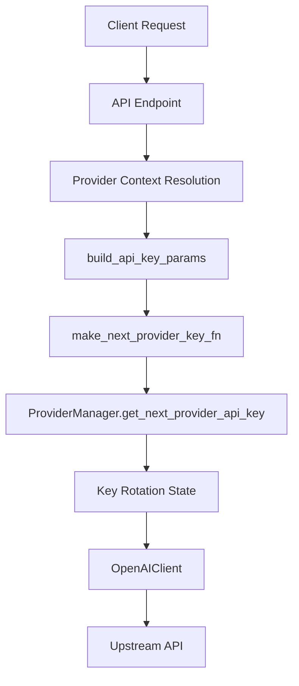
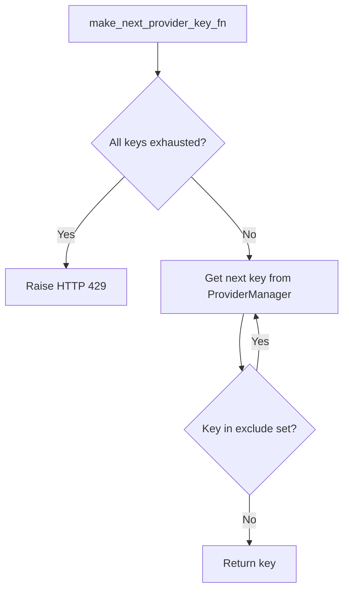
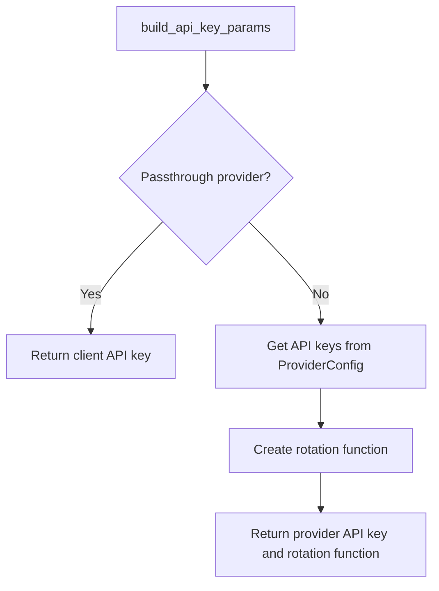
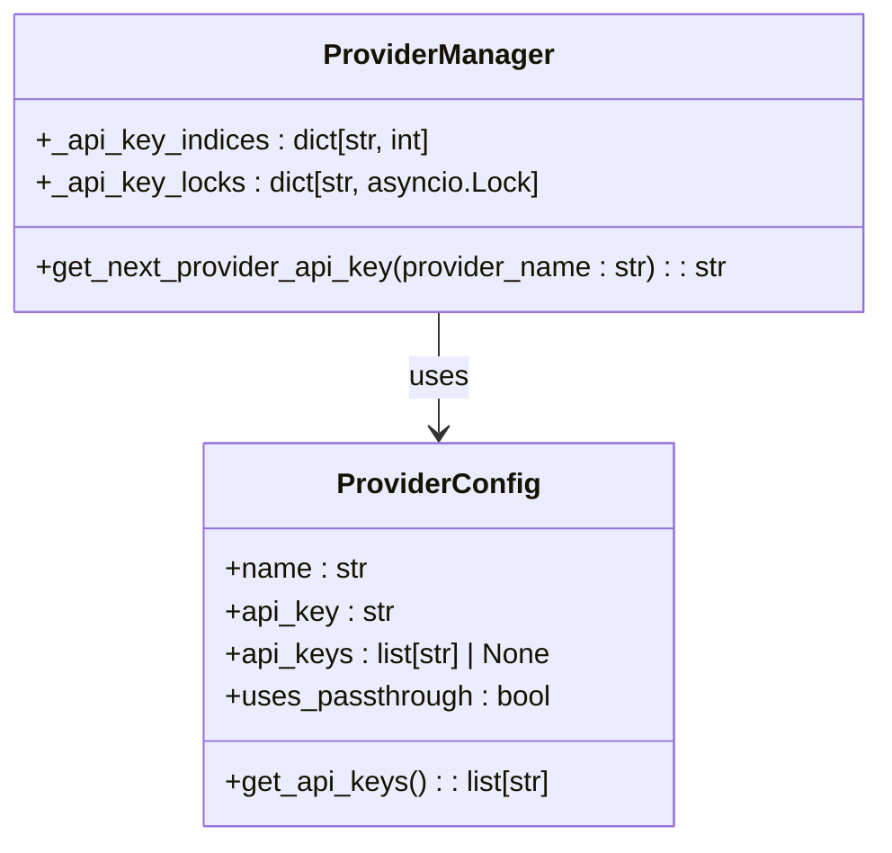
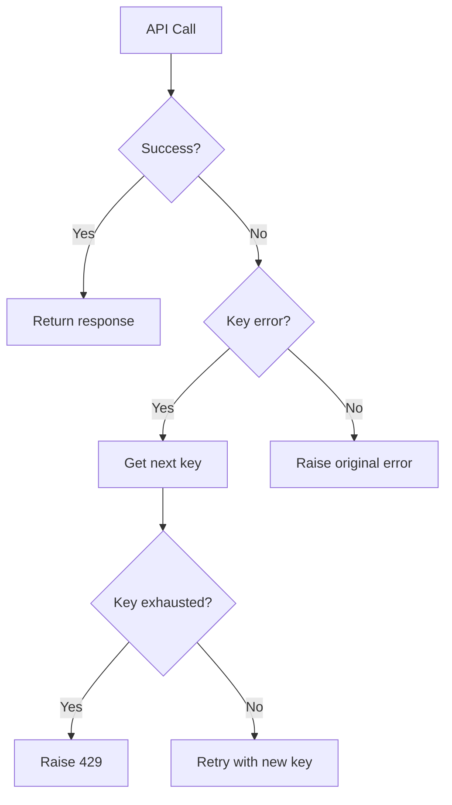

# Key Rotation Mechanism

<cite>
**Referenced Files in This Document**   
- [key_rotation.py](file://src/api/services/key_rotation.py)
- [provider_config.py](file://src/core/provider_config.py)
- [provider_manager.py](file://src/core/provider_manager.py)
- [client.py](file://src/core/client.py)
- [anthropic_client.py](file://src/core/anthropic_client.py)
- [endpoints.py](file://src/api/endpoints.py)
- [multi-api-keys.md](file://docs/multi-api-keys.md)
</cite>

## Table of Contents
1. [Introduction](#introduction)
2. [Key Rotation Architecture](#key-rotation-architecture)
3. [Implementation of make_next_provider_key_fn](#implementation-of-make_next_provider_key_fn)
4. [Integration with build_api_key_params](#integration-with-build_api_key_params)
5. [Provider Configuration and Key Pool Management](#provider-configuration-and-key-pool-management)
6. [Error Handling and Exhaustion Scenarios](#error-handling-and-exhaustion-scenarios)
7. [Troubleshooting Common Rotation Issues](#troubleshooting-common-rotation-issues)
8. [Conclusion](#conclusion)

## Introduction

The vandamme-proxy implements a robust key rotation system to handle provider API key rotation when rate limits or authentication failures occur. This mechanism ensures high availability and reliability by automatically rotating through multiple API keys configured for a provider. The system is designed to seamlessly handle failures by excluding invalid keys and cycling through the remaining valid keys in the rotation pool. When all keys are exhausted, the system returns a 429 Too Many Requests error to the client. This documentation details the implementation of the key rotation logic, focusing on the `make_next_provider_key_fn` function and its integration with the provider configuration system.

**Section sources**
- [key_rotation.py](file://src/api/services/key_rotation.py#L1-L69)
- [multi-api-keys.md](file://docs/multi-api-keys.md#L1-L272)

## Key Rotation Architecture

The key rotation system in vandamme-proxy follows a layered architecture that separates concerns between configuration management, rotation logic, and client integration. The core components include the ProviderConfig class for managing provider-specific settings, the ProviderManager for handling key rotation state, and the OpenAIClient for executing API calls with automatic key rotation. The system uses a round-robin approach to cycle through available keys, with process-global state tracking to ensure consistent rotation across concurrent requests. Each provider maintains independent rotation state, allowing for per-provider key management.

**Diagram sources **
- [key_rotation.py](file://src/api/services/key_rotation.py#L1-L69)
- [provider_manager.py](file://src/core/provider_manager.py#L1-L586)
- [client.py](file://src/core/client.py#L1-L352)

**Section sources**
- [key_rotation.py](file://src/api/services/key_rotation.py#L1-L69)
- [provider_manager.py](file://src/core/provider_manager.py#L1-L586)

## Implementation of make_next_provider_key_fn

The `make_next_provider_key_fn` function is a factory that creates a reusable provider API key rotator. It takes a provider name and a list of API keys as input and returns an async callable that implements the rotation logic. The function creates a closure around the provider name and key list, enabling stateful rotation behavior. When invoked, the returned function checks if all keys have been exhausted by comparing the exclude set size with the total key count. If keys remain, it enters a loop where it requests the next key from the ProviderManager and returns it if not in the exclude set. This implementation centralizes the key rotation logic that was previously duplicated across multiple endpoints.

**Diagram sources **
- [key_rotation.py](file://src/api/services/key_rotation.py#L14-L32)

**Section sources**
- [key_rotation.py](file://src/api/services/key_rotation.py#L14-L32)
- [test_api_key_rotation.py](file://tests/unit/test_api_key_rotation.py#L1-L250)

## Integration with build_api_key_params

The `build_api_key_params` function integrates the key rotation system with the API client by constructing the parameters needed for upstream calls. It takes provider configuration, provider name, client API key, and provider API key as inputs and returns a dictionary with 'api_key' and 'next_api_key' keys. For passthrough providers, it returns the client API key with no rotation function. For non-passthrough providers, it returns the provider API key along with a rotation function created by `make_next_provider_key_fn`. This function centralizes the pattern previously duplicated four times in the create_message endpoint, ensuring consistent key handling across the application.

**Diagram sources **
- [key_rotation.py](file://src/api/services/key_rotation.py#L35-L69)

**Section sources**
- [key_rotation.py](file://src/api/services/key_rotation.py#L35-L69)
- [endpoints.py](file://src/api/endpoints.py#L1-L1418)

## Provider Configuration and Key Pool Management

The ProviderConfig class manages the provider's API key pool through the `get_api_keys` method, which returns the configured provider API keys for static mode only. The method validates that the provider is not configured for passthrough and returns either the multi-key list or a single-key list containing the primary API key. During initialization, the ProviderManager validates the key configuration, ensuring the key list is non-empty and does not contain mixed passthrough and static keys. Keys are loaded from environment variables as whitespace-separated values, with the first key serving as the default. The system normalizes the primary API key to match the first key in the list for backward compatibility and logging purposes.

**Diagram sources **
- [provider_config.py](file://src/core/provider_config.py#L1-L102)
- [provider_manager.py](file://src/core/provider_manager.py#L1-L586)

**Section sources**
- [provider_config.py](file://src/core/provider_config.py#L1-L102)
- [provider_manager.py](file://src/core/provider_manager.py#L1-L586)

## Error Handling and Exhaustion Scenarios

The key rotation system implements comprehensive error handling for various failure scenarios. When all keys in the rotation are exhausted, the `make_next_provider_key_fn` raises an HTTPException with status code 429 and detail "All provider API keys exhausted". This occurs when the exclude set size equals or exceeds the total key count. The OpenAIClient detects key-related errors by checking for HTTP status codes 401, 403, and 429, or error messages containing "insufficient_quota". When such errors occur, the client invokes the next_api_key function with the set of attempted keys to obtain a new key. If the rotation function returns a key that has already been attempted, the client raises the original exception, preventing infinite loops.

**Diagram sources **
- [key_rotation.py](file://src/api/services/key_rotation.py#L23-L31)
- [client.py](file://src/core/client.py#L171-L199)
- [anthropic_client.py](file://src/core/anthropic_client.py#L174-L184)

**Section sources**
- [key_rotation.py](file://src/api/services/key_rotation.py#L23-L31)
- [client.py](file://src/core/client.py#L171-L199)
- [anthropic_client.py](file://src/core/anthropic_client.py#L174-L184)

## Troubleshooting Common Rotation Issues

Common issues with the key rotation system include misconfigured key lists and incorrect fallback ordering. When all keys are exhausted, the system returns "HTTP 429: All provider API keys exhausted" - this typically indicates that all configured keys are invalid or temporarily rate-limited. Mixed configuration errors occur when '!PASSTHRU' is combined with static keys, which is not allowed. Empty key detection errors happen when the key list contains empty strings. To troubleshoot rotation issues, verify the configuration using environment variable inspection, check logs for key hash changes, monitor authentication failures, and verify request distribution across keys. The system provides debugging steps including configuration verification, key format validation, log monitoring, and individual key testing.

**Section sources**
- [multi-api-keys.md](file://docs/multi-api-keys.md#L153-L197)
- [provider_config.py](file://src/core/provider_config.py#L83-L97)

## Conclusion

The key rotation system in vandamme-proxy provides a robust solution for managing multiple provider API keys with automatic failover and rate limit handling. By centralizing the rotation logic in the `make_next_provider_key_fn` and `build_api_key_params` functions, the system ensures consistent behavior across all endpoints. The integration with ProviderConfig and ProviderManager enables efficient key pool management and process-global rotation state. Comprehensive error handling ensures graceful degradation when keys fail, with clear error messages for troubleshooting. This architecture supports high availability deployments by distributing load across multiple keys and providing seamless failover when individual keys encounter issues.