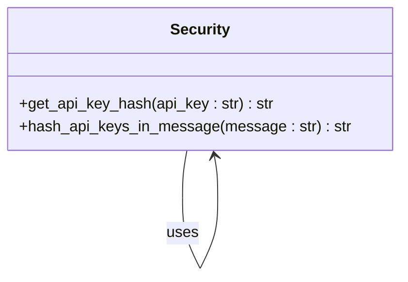
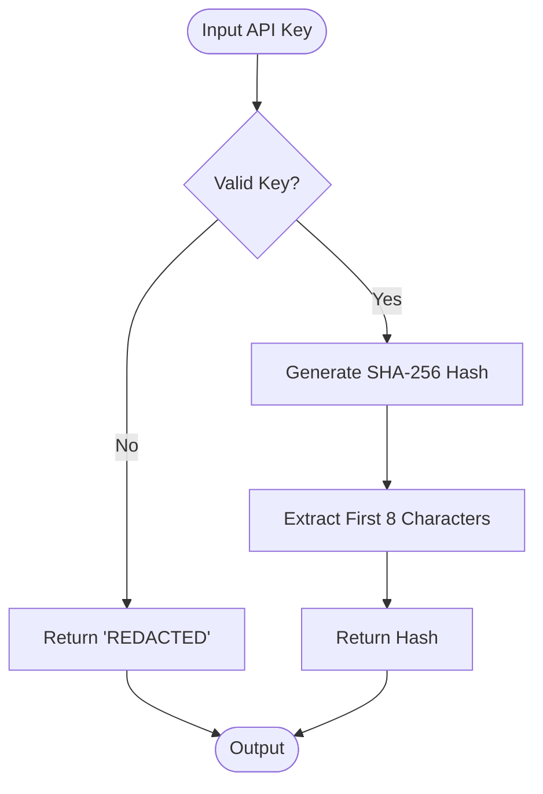
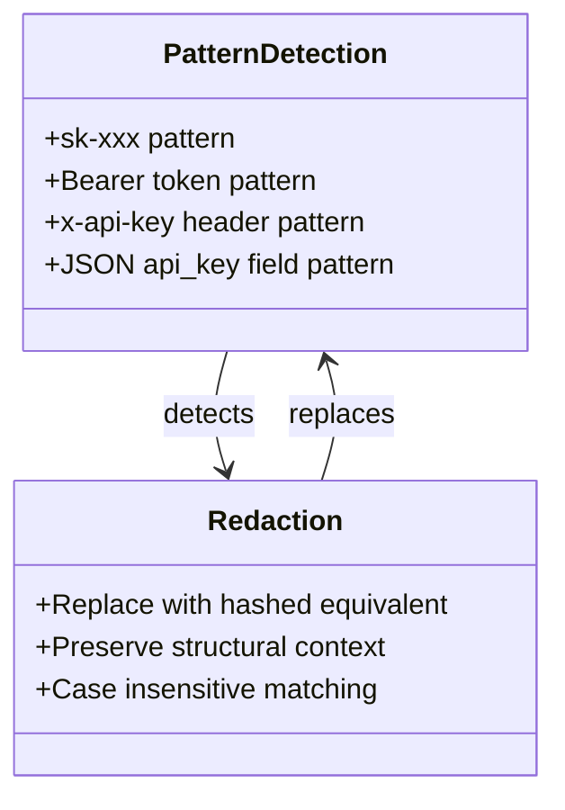
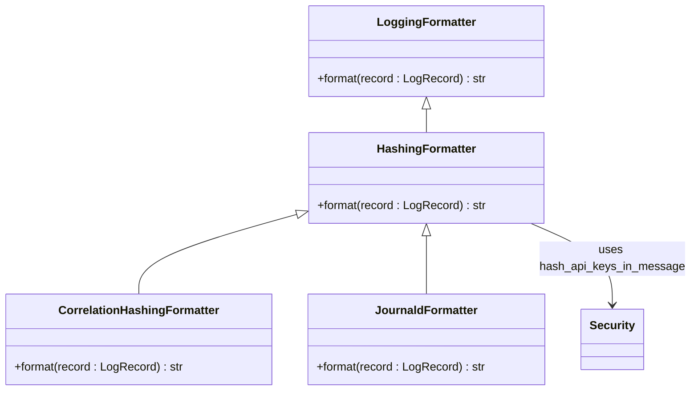
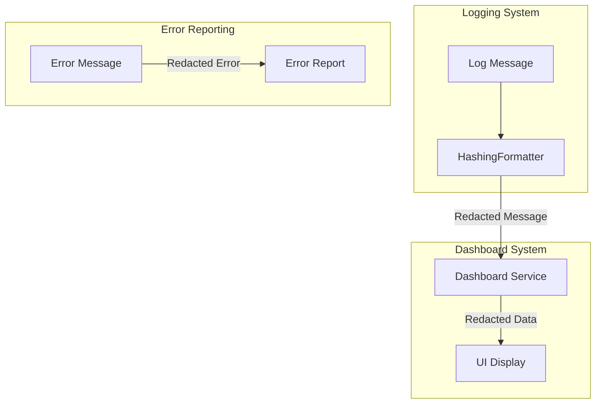
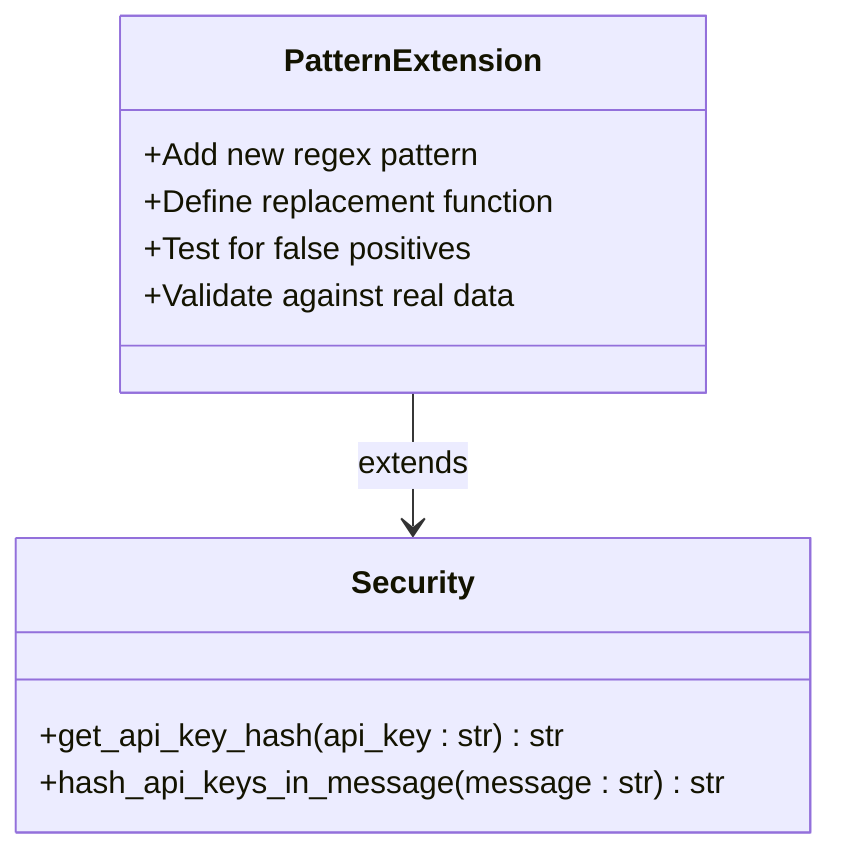
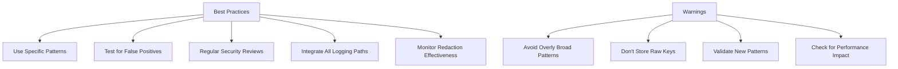

# Secure Key Handling

<cite>
**Referenced Files in This Document**   
- [security.py](file://src/core/security.py)
- [base.py](file://src/core/logging/formatters/base.py)
- [syslog.py](file://src/core/logging/formatters/syslog.py)
- [correlation.py](file://src/core/logging/formatters/correlation.py)
- [configuration.py](file://src/core/logging/configuration.py)
- [provider_manager.py](file://src/core/provider_manager.py)
- [logs.py](file://src/dashboard/services/logs.py)
- [transformers.py](file://src/dashboard/ag_grid/transformers.py)
</cite>

## Table of Contents
1. [Introduction](#introduction)
2. [Core Security Functions](#core-security-functions)
3. [API Key Hashing Mechanism](#api-key-hashing-mechanism)
4. [Pattern Detection and Redaction](#pattern-detection-and-redaction)
5. [Logging Integration](#logging-integration)
6. [Dashboard and Error Reporting](#dashboard-and-error-reporting)
7. [Security and Debuggability Balance](#security-and-debuggability-balance)
8. [Extending Pattern Detection](#extending-pattern-detection)
9. [Best Practices and Warnings](#best-practices-and-warnings)

## Introduction
The vandamme-proxy implements a comprehensive security strategy to prevent API key leakage in logs, error reports, and dashboard displays. The core of this strategy revolves around the `hash_api_keys_in_message` function in the security module, which replaces sensitive key material with stable short hashes while preserving structural context for debugging purposes. This document details the implementation, integration, and best practices for this secure key handling system.

**Section sources**
- [security.py](file://src/core/security.py#L1-L12)

## Core Security Functions
The security module provides two primary functions for API key protection: `get_api_key_hash` and `hash_api_keys_in_message`. These functions are designed to be stateless, composable, and safe-by-default, ensuring they can be used across different parts of the application without introducing security vulnerabilities.

**Diagram sources**
- [security.py](file://src/core/security.py#L20-L44)
- [security.py](file://src/core/security.py#L45-L94)

**Section sources**
- [security.py](file://src/core/security.py#L1-L12)

## API Key Hashing Mechanism
The `get_api_key_hash` function generates an 8-character stable hash for API keys using SHA-256. This approach ensures that the hash is non-reversible (safe to log), stable across runs (enabling incident correlation), and short enough for human scanning. The function handles empty or sentinel values by returning "REDACTED".

**Diagram sources**
- [security.py](file://src/core/security.py#L20-L44)

**Section sources**
- [security.py](file://src/core/security.py#L20-L44)

## Pattern Detection and Redaction
The `hash_api_keys_in_message` function detects and redacts common API key patterns using regular expressions. It targets four primary formats: OpenAI-style keys (sk-xxx), Bearer tokens, x-api-key headers, and JSON api_key fields. The patterns are designed to be conservative to avoid false positives while catching typical key formats.

**Diagram sources**
- [security.py](file://src/core/security.py#L74-L88)

**Section sources**
- [security.py](file://src/core/security.py#L45-L94)

## Logging Integration
The secure key handling system is integrated into the logging framework through specialized formatters that automatically hash API keys in log messages. The `HashingFormatter` class wraps the standard logging formatter and applies the `hash_api_keys_in_message` function to all rendered log entries, ensuring that sensitive information is never written to logs.

**Diagram sources**
- [base.py](file://src/core/logging/formatters/base.py#L14-L20)
- [syslog.py](file://src/core/logging/formatters/syslog.py#L15-L27)
- [correlation.py](file://src/core/logging/formatters/correlation.py#L24-L31)

**Section sources**
- [base.py](file://src/core/logging/formatters/base.py#L14-L20)
- [syslog.py](file://src/core/logging/formatters/syslog.py#L15-L27)
- [correlation.py](file://src/core/logging/formatters/correlation.py#L24-L31)

## Dashboard and Error Reporting
The security measures extend to the dashboard and error reporting systems, ensuring that API keys are protected in all user-facing displays. The dashboard services use the same hashing mechanism to redact sensitive information while preserving enough context for debugging and monitoring.

**Diagram sources**
- [logs.py](file://src/dashboard/services/logs.py#L19-L54)
- [transformers.py](file://src/dashboard/ag_grid/transformers.py#L50-L77)
- [transformers.py](file://src/dashboard/ag_grid/transformers.py#L80-L131)

**Section sources**
- [logs.py](file://src/dashboard/services/logs.py#L19-L54)
- [transformers.py](file://src/dashboard/ag_grid/transformers.py#L50-L131)

## Security and Debuggability Balance
The secure key handling system strikes a balance between security and debuggability by preserving structural context while removing sensitive information. For example, a Bearer token is replaced with "Bearer <hash>" rather than being completely removed, allowing developers to understand the authentication mechanism being used without exposing the actual token.

**Diagram sources**
- [security.py](file://src/core/security.py#L74-L88)

**Section sources**
- [security.py](file://src/core/security.py#L45-L94)

## Extending Pattern Detection
The pattern detection system can be extended to support custom key formats by adding new regular expressions to the substitutions list in the `hash_api_keys_in_message` function. When adding new patterns, it's important to ensure they are specific enough to avoid false positives while being broad enough to catch variations of the target format.

**Diagram sources**
- [security.py](file://src/core/security.py#L74-L88)

**Section sources**
- [security.py](file://src/core/security.py#L45-L94)

## Best Practices and Warnings
When implementing and extending the secure key handling system, several best practices should be followed to maintain security and reliability. These include avoiding overly broad patterns that could lead to false positives, regularly reviewing the effectiveness of the redaction system, and ensuring that all new logging paths are properly integrated with the hashing mechanism.

**Diagram sources**
- [security.py](file://src/core/security.py#L56-L58)
- [provider_manager.py](file://src/core/provider_manager.py#L183-L187)

**Section sources**
- [security.py](file://src/core/security.py#L56-L58)
- [provider_manager.py](file://src/core/provider_manager.py#L183-L187)