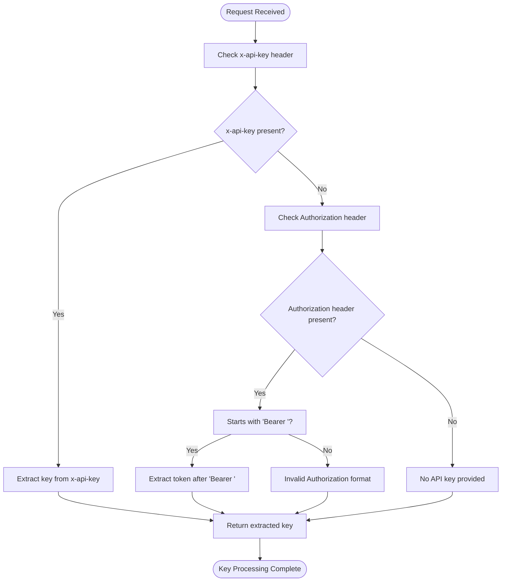
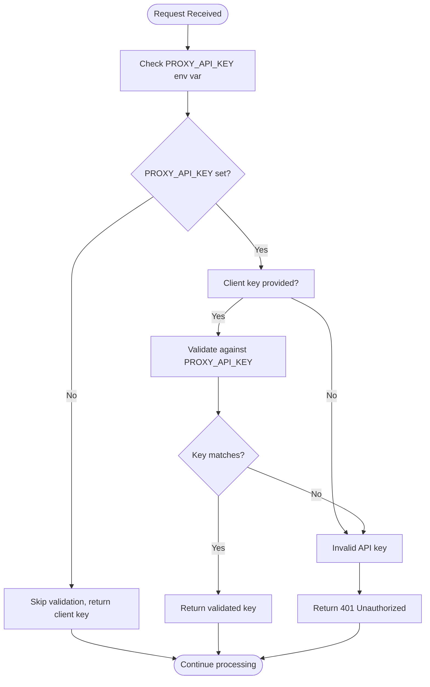
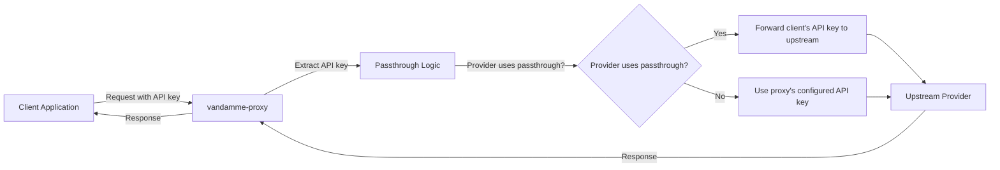
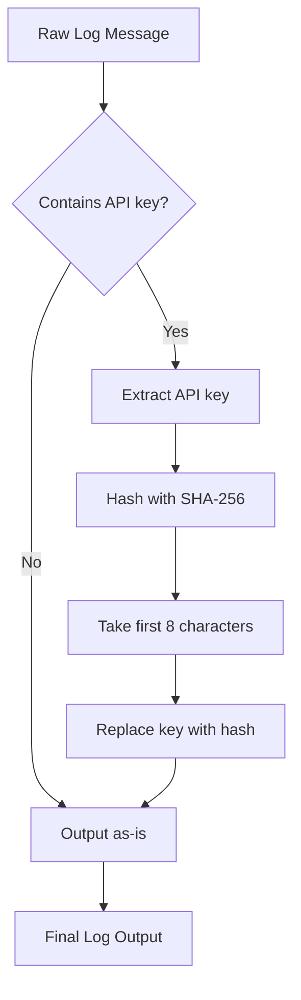
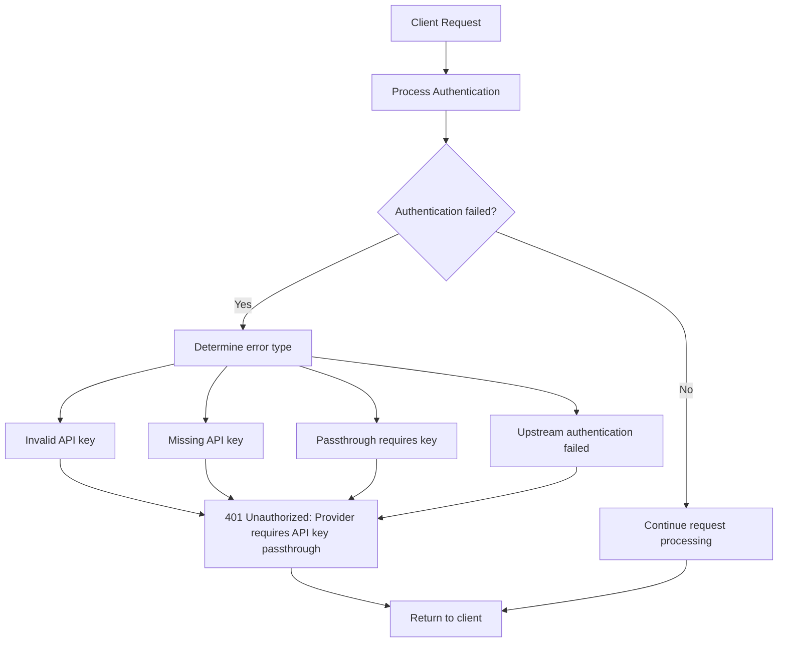

# Client Authentication

<cite>
**Referenced Files in This Document**   
- [endpoints.py](file://src/api/endpoints.py)
- [security.py](file://src/core/security.py)
- [config.py](file://src/core/config.py)
- [key_rotation.py](file://src/api/services/key_rotation.py)
- [api-key-passthrough.md](file://docs/api-key-passthrough.md)
</cite>

## Table of Contents
1. [Introduction](#introduction)
2. [API Key Header Processing](#api-key-header-processing)
3. [Conditional Validation Logic](#conditional-validation-logic)
4. [Passthrough Authentication Model](#passthrough-authentication-model)
5. [Security and Credential Protection](#security-and-credential-protection)
6. [Authentication Error Handling](#authentication-error-handling)
7. [Client Implementation Examples](#client-implementation-examples)
8. [Troubleshooting Authentication Issues](#troubleshooting-authentication-issues)

## Introduction

The vandamme-proxy implements a flexible client authentication system that supports multiple authentication methods and passthrough models for upstream providers. The authentication mechanism centers around the `validate_api_key` function in `src/api/endpoints.py`, which processes client credentials from HTTP headers and validates them according to the proxy's configuration. This documentation details the complete authentication workflow, including header processing, conditional validation based on environment variables, passthrough authentication for services like Anthropic, and security measures for protecting sensitive credentials in logs.

**Section sources**
- [endpoints.py](file://src/api/endpoints.py#L112-L138)
- [config.py](file://src/core/config.py#L233-L241)

## API Key Header Processing

The vandamme-proxy supports two standard methods for clients to provide API keys: the `x-api-key` header and the `Authorization` header with Bearer token format. The `validate_api_key` function processes both header types and extracts the client's API key for validation.

When a client makes a request to the proxy, the authentication system checks for the presence of API credentials in the following order:
1. The `x-api-key` header is checked first
2. If not present, the `Authorization` header is checked for a Bearer token

The function extracts the key value from the appropriate header and returns it for further processing. This dual-header support provides flexibility for clients while maintaining compatibility with common API authentication patterns.



**Diagram sources**
- [endpoints.py](file://src/api/endpoints.py#L122-L126)

**Section sources**
- [endpoints.py](file://src/api/endpoints.py#L122-L126)

## Conditional Validation Logic

The authentication system implements conditional validation logic that depends on the `PROXY_API_KEY` environment variable. This creates a flexible security model where API key validation can be enabled or disabled based on the deployment configuration.

When the `PROXY_API_KEY` environment variable is set, the proxy validates that the client's provided API key matches the expected value. This provides a simple shared-secret authentication mechanism suitable for controlled environments. If the `PROXY_API_KEY` is not set, the proxy skips validation and simply returns whatever API key was provided by the client (if any).

This conditional behavior allows the proxy to operate in different modes:
- **Secure mode**: When `PROXY_API_KEY` is set, all clients must provide the correct key
- **Open mode**: When `PROXY_API_KEY` is not set, no validation is performed

The conditional logic is implemented in the `validate_client_api_key` method of the Config class, which is called by the `validate_api_key` endpoint function.



**Diagram sources**
- [endpoints.py](file://src/api/endpoints.py#L127-L138)
- [config.py](file://src/core/config.py#L233-L241)

**Section sources**
- [endpoints.py](file://src/api/endpoints.py#L127-L138)
- [config.py](file://src/core/config.py#L233-L241)

## Passthrough Authentication Model

The vandamme-proxy implements a passthrough authentication model that forwards client API keys to upstream providers, particularly for services like Anthropic. This model is configured through environment variables and allows clients to use their own credentials when accessing upstream services.

Providers are configured for passthrough mode by setting their API key environment variable to the sentinel value `!PASSTHRU`. When a provider is in passthrough mode, the proxy extracts the client's API key from the request headers and uses it to authenticate with the upstream provider. This enables each client to use their own API key for a given provider rather than sharing a single proxy-managed key.

The passthrough model is particularly useful for:
- Multi-tenant deployments where clients should use their own credentials
- Cost allocation, as usage is billed to the client's account
- Access control, as clients can only access resources permitted by their own credentials

The passthrough functionality is coordinated between the `build_api_key_params` function in `key_rotation.py` and the provider configuration system, which determines whether a provider uses passthrough based on its configuration.



**Diagram sources**
- [key_rotation.py](file://src/api/services/key_rotation.py#L56-L58)
- [api-key-passthrough.md](file://docs/api-key-passthrough.md#L47-L52)

**Section sources**
- [key_rotation.py](file://src/api/services/key_rotation.py#L56-L58)
- [api-key-passthrough.md](file://docs/api-key-passthrough.md#L47-L52)

## Security and Credential Protection

The vandamme-proxy includes security measures to protect sensitive credentials, particularly in logging systems. The security module provides functions to hash API keys before they are written to logs, preventing accidental exposure of sensitive information.

The `get_api_key_hash` function in `src/core/security.py` generates an 8-character stable hash of an API key using SHA-256. This hash is stable across runs, allowing correlation of incidents without revealing the actual key value. The `hash_api_keys_in_message` function scans log messages for common API key patterns and replaces the secret portion with its hashed representation.

This approach provides several security benefits:
- **Non-reversible**: The hash cannot be used to reconstruct the original API key
- **Stable**: The same key always produces the same hash, enabling incident correlation
- **Short**: The 8-character hash is concise enough for human scanning in logs
- **Preserves structure**: The replacement maintains the format (e.g., "Bearer <hash>") for debugging purposes

The security functions are designed to be composable and can be used throughout the codebase in logging formatters, API code, and tests to ensure consistent protection of credentials.



**Diagram sources**
- [security.py](file://src/core/security.py#L20-L42)
- [security.py](file://src/core/security.py#L45-L94)

**Section sources**
- [security.py](file://src/core/security.py#L20-L94)

## Authentication Error Handling

The vandamme-proxy implements comprehensive error handling for authentication failures, returning appropriate HTTP status codes and error messages to clients. The primary authentication error is 401 Unauthorized, which is returned in several scenarios:

1. When `PROXY_API_KEY` is set but the client provides an invalid or missing API key
2. When a passthrough provider requires a client API key but none is provided
3. When the client's API key fails to authenticate with the upstream provider

The error responses include descriptive messages that help clients understand the nature of the authentication failure. For example, when a passthrough provider is configured but no client API key is provided, the response clearly indicates which provider requires the key.

The system also handles upstream authentication errors by mapping provider-specific error codes to standard HTTP status codes. For instance, upstream 401/403 errors are mapped to 401 Unauthorized responses to the client, while rate limit errors (429) are preserved to allow clients to implement appropriate retry logic.



**Diagram sources**
- [endpoints.py](file://src/api/endpoints.py#L134-L136)
- [endpoints.py](file://src/api/endpoints.py#L472-L476)
- [client.py](file://src/core/client.py#L176-L180)

**Section sources**
- [endpoints.py](file://src/api/endpoints.py#L134-L136)
- [endpoints.py](file://src/api/endpoints.py#L472-L476)

## Client Implementation Examples

Clients can authenticate with the vandamme-proxy using either the `x-api-key` header or the `Authorization` header with Bearer token format. The following examples demonstrate proper header formatting for both methods.

### Using x-api-key Header
```bash
curl -X POST http://localhost:8082/v1/messages \
  -H "Content-Type: application/json" \
  -H "x-api-key: sk-ant-client-..." \
  -d '{
    "model": "anthropic:claude-3-5-sonnet-20241022",
    "max_tokens": 100,
    "messages": [{"role": "user", "content": "Hello!"}]
  }'
```

### Using Authorization Bearer Header
```bash
curl -X POST http://localhost:8082/v1/messages \
  -H "Content-Type: application/json" \
  -H "Authorization: Bearer sk-ant-client-..." \
  -d '{
    "model": "anthropic:claude-3-5-sonnet-20241022",
    "max_tokens": 100,
    "messages": [{"role": "user", "content": "Hello!"}]
  }'
```

When the proxy is configured with `PROXY_API_KEY`, clients must provide the exact key value specified in the environment variable. When the proxy is in passthrough mode for a provider, clients should provide their own API key for that provider.

**Section sources**
- [endpoints.py](file://src/api/endpoints.py#L122-L126)
- [api-key-passthrough.md](file://docs/api-key-passthrough.md#L66-L75)

## Troubleshooting Authentication Issues

When experiencing authentication failures with the vandamme-proxy, consider the following troubleshooting steps:

1. **Verify header format**: Ensure the API key is provided in the correct header format (`x-api-key` or `Authorization: Bearer <token>`)
2. **Check PROXY_API_KEY configuration**: If the proxy requires a specific API key, ensure you're providing the exact value set in the environment variable
3. **Confirm passthrough requirements**: For providers configured with `!PASSTHRU`, ensure you're providing a client API key
4. **Validate environment variables**: Check that the proxy's environment variables are correctly set, particularly `PROXY_API_KEY` and provider-specific API keys
5. **Review error messages**: Examine the specific error message returned by the proxy to identify the nature of the authentication failure

Common authentication errors and their solutions:

- **401 Unauthorized: Invalid API key** - Verify the API key value matches the expected key when `PROXY_API_KEY` is set
- **401 Unauthorized: Provider requires API key passthrough** - Provide an API key when accessing a passthrough provider
- **401 Unauthorized: Invalid API key. Please provide a valid Anthropic API key** - Ensure the API key is valid for the upstream provider

The health check endpoint (`/health`) can also be used to verify the proxy's authentication configuration and provider status.

**Section sources**
- [endpoints.py](file://src/api/endpoints.py#L134-L136)
- [endpoints.py](file://src/api/endpoints.py#L472-L476)
- [config.py](file://src/core/config.py#L63)
- [health.py](file://src/api/endpoints.py#L998-L1070)