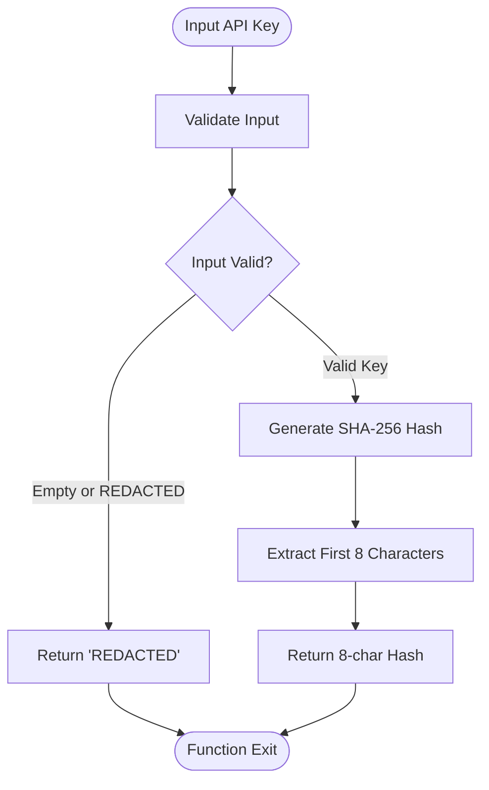
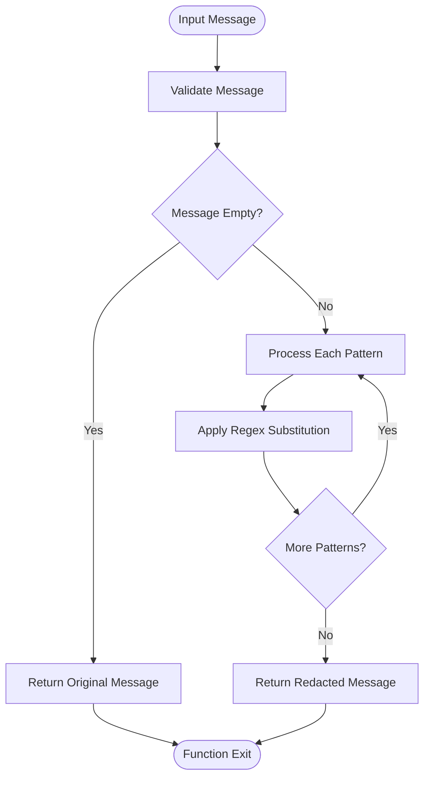
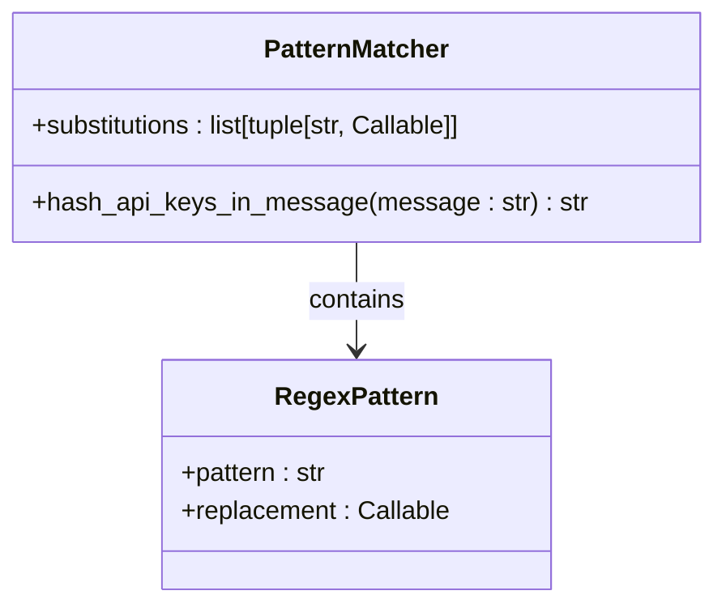
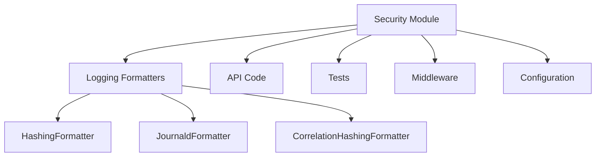
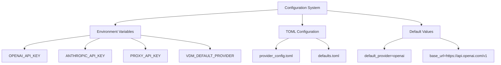
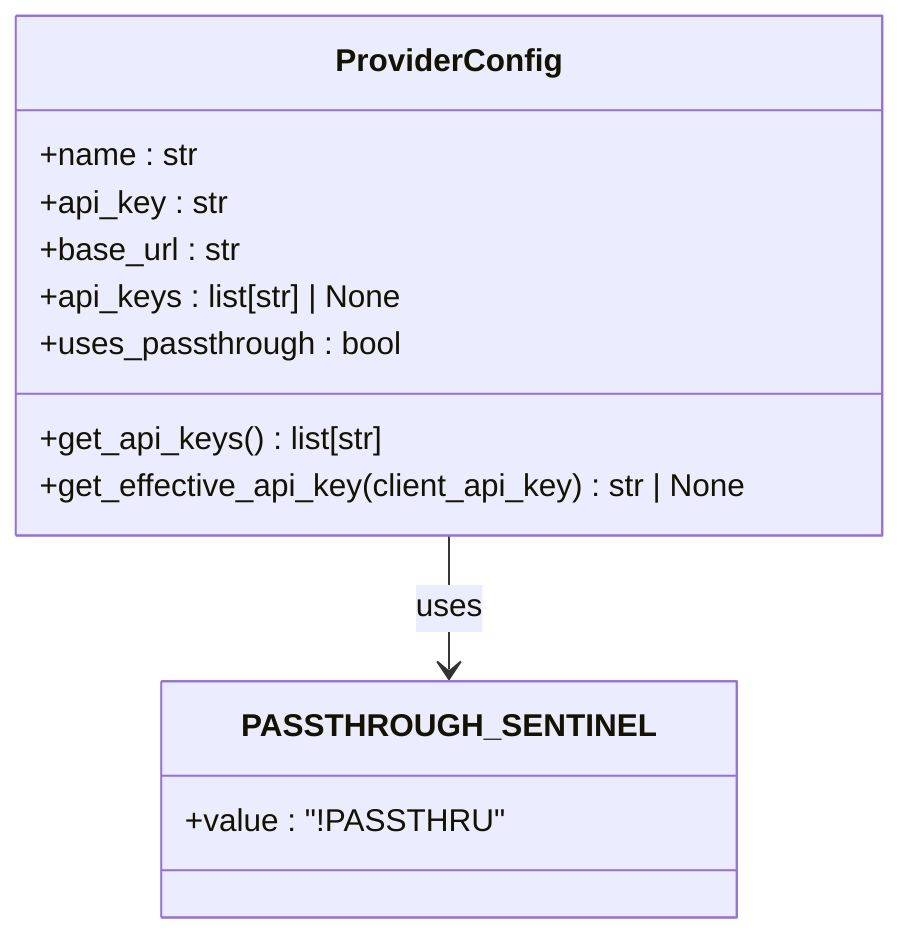
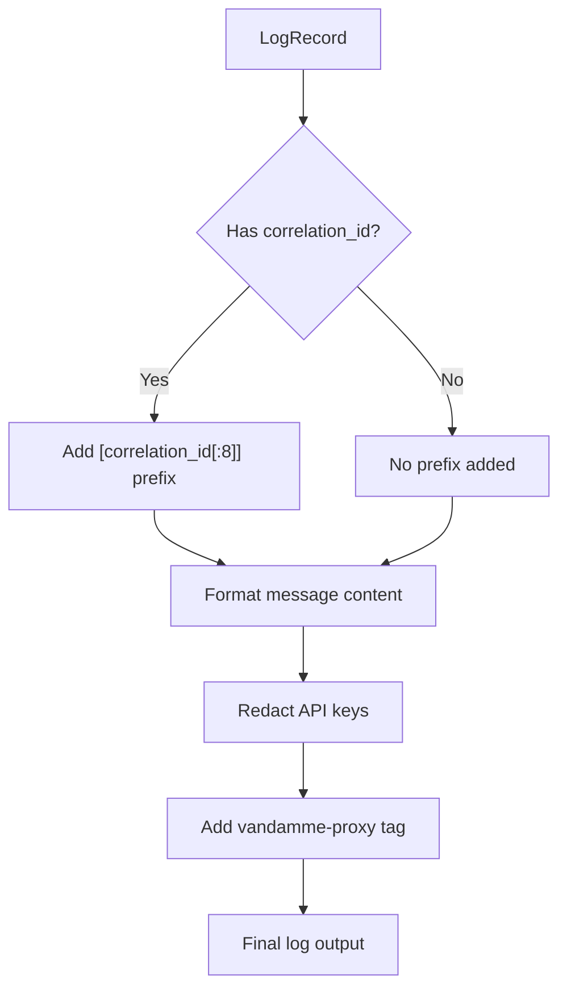

# Secure Configuration

<cite>
**Referenced Files in This Document**   
- [security.py](file://src/core/security.py)
- [config.py](file://src/core/config.py)
- [provider_manager.py](file://src/core/provider_manager.py)
- [provider_config.py](file://src/core/provider_config.py)
- [base.py](file://src/core/logging/formatters/base.py)
- [syslog.py](file://src/core/logging/formatters/syslog.py)
- [correlation.py](file://src/core/logging/formatters/correlation.py)
- [configuration.py](file://src/core/logging/configuration.py)
- [multi-provider.env](file://examples/multi-provider.env)
- [anthropic-direct.env](file://examples/anthropic-direct.env)
- [multi-api-keys.md](file://docs/multi-api-keys.md)
- [api-key-passthrough.md](file://docs/api-key-passthrough.md)
</cite>

## Table of Contents
1. [Introduction](#introduction)
2. [Core Security Implementation](#core-security-implementation)
3. [API Key Hashing Mechanism](#api-key-hashing-mechanism)
4. [Pattern Matching for Credential Detection](#pattern-matching-for-credential-detection)
5. [Security-by-Default Philosophy](#security-by-default-philosophy)
6. [Stateless and Composable Design](#stateless-and-composable-design)
7. [Configuration Management](#configuration-management)
8. [Multi-API Key Management](#multi-api-key-management)
9. [Secure Deployment Practices](#secure-deployment-practices)
10. [Logging Security](#logging-security)
11. [Best Practices](#best-practices)
12. [Troubleshooting](#troubleshooting)

## Introduction
The vandamme-proxy system implements robust security practices to protect sensitive configuration data, particularly API keys. This documentation details the secure configuration framework, focusing on the implementation in src/core/security.py that prevents credential leakage in logs. The system employs a security-by-default philosophy with stateless, composable design principles to ensure sensitive information remains protected while maintaining operational visibility for debugging and monitoring purposes.

## Core Security Implementation
The security module in vandamme-proxy provides essential utilities for protecting sensitive information across the proxy system. The implementation focuses on preventing accidental credential leakage in logs while maintaining traceability through stable hashing mechanisms.

The core security functions are designed with three primary goals:
- **Stateless**: The module never mutates global state upon import
- **Composable**: Functions can be used across different components including logging formatters, API code, and tests
- **Safe-by-default**: Helpers prevent accidental credential leakage in logs

The module contains only pure helper functions without any initialization logic, ensuring predictable behavior and easy integration across the codebase.

**Section sources**
- [security.py](file://src/core/security.py#L1-L12)

## API Key Hashing Mechanism
The vandamme-proxy system implements a sophisticated API key hashing mechanism that balances security requirements with operational needs. The system transforms API keys into stable 8-character SHA-256 hashes for safe logging while maintaining traceability across system runs.

### get_api_key_hash Function
The `get_api_key_hash` function generates a stable 8-character hash for API keys using SHA-256:



**Diagram sources**
- [security.py](file://src/core/security.py#L20-L42)

The function returns "REDACTED" for empty or sentinel values, otherwise returns the first 8 characters of the SHA-256 hash. This approach ensures that:
- Hashes are non-reversible (safe to log)
- Hashes are stable across runs (enabling incident correlation)
- Hashes are short enough for human scanning in logs

The 8-character length was chosen as a balance between collision resistance and human readability, providing sufficient entropy while remaining concise in log output.

### hash_api_keys_in_message Function
The `hash_api_keys_in_message` function systematically replaces API keys in log messages with their hashed equivalents:



**Diagram sources**
- [security.py](file://src/core/security.py#L45-L94)

This function processes log messages to detect and redact API keys while preserving message structure for debugging purposes. It maintains the context around redacted keys (e.g., "Bearer <hash>") to ensure logs remain useful for troubleshooting.

**Section sources**
- [security.py](file://src/core/security.py#L20-L94)

## Pattern Matching for Credential Detection
The vandamme-proxy system employs a comprehensive pattern-matching approach to detect various API key formats in log messages. The implementation uses regular expressions to identify and redact credentials while minimizing false positives.

### Supported API Key Formats
The system detects and redacts the following API key formats:

| Pattern | Regular Expression | Example Input | Example Output |
|--------|-------------------|---------------|----------------|
| OpenAI-style keys | `(sk-[a-zA-Z0-9]{20,})` | `sk-abc123...` | `sk-{8-char-hash}` |
| Bearer tokens | `(Bearer\s+[a-zA-Z0-9\-_\.]{20,})` | `Bearer abc123...` | `Bearer {8-char-hash}` |
| x-api-key headers | `(x-api-key:\s*[a-zA-Z0-9\-_\.]{20,})` | `x-api-key: abc123...` | `x-api-key: {8-char-hash}` |
| JSON api_key fields | `(\"api_key\":\s*\"[a-zA-Z0-9\-_\.]{20,}\")` | `"api_key": "abc123..."` | `"api_key": "{8-char-hash}"` |

The patterns are designed to be conservative, avoiding false positives while catching typical key formats. The minimum length requirement of 20 characters helps filter out potential false matches while accommodating the typical length of API keys from major providers.

### Pattern Implementation Details
The pattern matching implementation uses a list of tuples containing regex patterns and replacement functions:



**Diagram sources**
- [security.py](file://src/core/security.py#L74-L88)

Each pattern uses a lambda function to extract the key portion and apply the hashing function, ensuring consistent treatment across different key formats. The implementation uses case-insensitive matching to catch variations in header capitalization.

**Section sources**
- [security.py](file://src/core/security.py#L69-L93)

## Security-by-Default Philosophy
The vandamme-proxy system embodies a security-by-default philosophy, ensuring that secure practices are the natural outcome of using the system rather than requiring explicit configuration.

### Design Principles
The security implementation follows several key principles:

1. **Automatic Protection**: All log messages are automatically processed to redact sensitive information
2. **Minimal Configuration**: Security features require no additional configuration to be effective
3. **Defense in Depth**: Multiple layers of protection ensure that even if one mechanism fails, others provide backup
4. **Fail-Safe Defaults**: The system defaults to the most secure configuration when options are not explicitly set

### Implementation Examples
The security-by-default approach is evident in several aspects of the implementation:

- The `hash_api_keys_in_message` function is integrated into logging formatters, ensuring all log output is automatically redacted
- Empty or invalid API keys return "REDACTED" rather than exposing potential error information
- The system validates configuration at startup, preventing insecure configurations from being used

This philosophy ensures that developers and operators cannot accidentally expose sensitive information through normal use of the system.

**Section sources**
- [security.py](file://src/core/security.py#L5-L12)
- [base.py](file://src/core/logging/formatters/base.py#L14-L19)

## Stateless and Composable Design
The security module follows a stateless and composable design philosophy, making it highly reusable and predictable across different contexts.

### Stateless Implementation
The security functions are pure functions with no side effects or global state mutation:


**Diagram sources**
- [security.py](file://src/core/security.py#L6-L7)

This stateless design ensures that:
- Functions produce the same output for the same input
- No initialization or setup is required
- Functions can be safely imported and used without affecting global state
- Testing is simplified as no state needs to be managed

### Composable Architecture
The security functions are designed to be composable, allowing them to be integrated into various parts of the system:



**Diagram sources**
- [security.py](file://src/core/security.py#L7)
- [base.py](file://src/core/logging/formatters/base.py#L11)
- [syslog.py](file://src/core/logging/formatters/syslog.py#L12)
- [correlation.py](file://src/core/logging/formatters/correlation.py#L12)

The composable design enables the same security functions to be used across different components, ensuring consistent protection throughout the system. The `hash_api_keys_in_message` function is particularly valuable in this regard, as it can be applied to any string message regardless of context.

**Section sources**
- [security.py](file://src/core/security.py#L6-L8)
- [base.py](file://src/core/logging/formatters/base.py#L11-L19)
- [syslog.py](file://src/core/logging/formatters/syslog.py#L12-L26)
- [correlation.py](file://src/core/logging/formatters/correlation.py#L12-L30)

## Configuration Management
The vandamme-proxy system provides flexible configuration management for secure deployment, with multiple options for managing API keys and sensitive data.

### Environment Variable Configuration
The primary method for configuring API keys is through environment variables:



**Diagram sources**
- [config.py](file://src/core/config.py#L16-L285)
- [provider_manager.py](file://src/core/provider_manager.py#L32-L200)

The system supports multiple providers through provider-specific environment variables (e.g., OPENAI_API_KEY, ANTHROPIC_API_KEY). The VDM_DEFAULT_PROVIDER variable allows specifying the default provider, with "openai" as the system default if not specified.

### Configuration Hierarchy
The configuration system follows a specific hierarchy for determining values:

1. Environment variables (highest priority)
2. TOML configuration files
3. System defaults (lowest priority)

This hierarchy allows for flexible deployment scenarios, from development environments with minimal configuration to production deployments with complex, provider-specific settings.

**Section sources**
- [config.py](file://src/core/config.py#L16-L285)
- [provider_manager.py](file://src/core/provider_manager.py#L32-L200)

## Multi-API Key Management
The vandamme-proxy system supports multiple API keys per provider, enabling load balancing, failover, and rate limit management.

### Key Rotation Strategy
The system implements a round-robin rotation strategy for multiple API keys:

```mermaid
stateDiagram-v2
[*] --> Idle
Idle --> Processing : "Request received"
Processing --> SelectKey : "Select next key"
SelectKey --> ValidateKey : "Validate key"
ValidateKey --> KeyValid{"Key valid?"}
KeyValid --> |Yes| UseKey : "Use key for request"
KeyValid --> |No| NextKey : "Try next key"
NextKey --> ValidateKey
UseKey --> Success : "Request successful"
UseKey --> Failure{"Failure?"}
Failure --> |401/403/429| NextKey
Failure --> |Other| ReturnError
Success --> Idle
ReturnError --> Idle
```

**Diagram sources**
- [provider_manager.py](file://src/core/provider_manager.py#L43-L67)
- [provider_config.py](file://src/core/provider_config.py#L15-L19)

The rotation is process-global and thread-safe, using asyncio locks to ensure consistency across concurrent requests. Each provider maintains independent rotation state, allowing different providers to be at different points in their rotation cycle.

### Passthrough Mode
The system supports a passthrough mode for API keys using the "!PASSTHRU" sentinel value:



**Diagram sources**
- [provider_config.py](file://src/core/provider_config.py#L1-L102)

When a provider is configured with `!PASSTHRU`, the system uses the client-provided API key instead of a static key. This enables multi-tenant scenarios where clients provide their own credentials.

### Configuration Constraints
The system enforces several constraints to prevent ambiguous configurations:

- Cannot mix `!PASSTHRU` with static keys for the same provider
- All API keys must be non-empty
- Provider names and API formats are validated at configuration time

These constraints ensure that the configuration is always unambiguous and secure by design.

**Section sources**
- [provider_manager.py](file://src/core/provider_manager.py#L183-L187)
- [provider_config.py](file://src/core/provider_config.py#L90-L94)
- [multi-api-keys.md](file://docs/multi-api-keys.md#L1-L272)

## Secure Deployment Practices
The vandamme-proxy system supports various secure deployment practices to protect sensitive configuration data in production environments.

### Environment-Based Configuration
The recommended approach for production deployment is to use environment variables:

```bash
# Production configuration example
OPENAI_API_KEY="sk-key1 sk-key2 sk-key3"
ANTHROPIC_API_KEY="sk-ant-key1 sk-ant-key2"
LOG_LEVEL=INFO
VDM_DEFAULT_PROVIDER=openai
```

This approach ensures that API keys are not stored in configuration files that might be committed to version control.

### Containerized Deployment
For containerized deployments, API keys should be provided through environment variables or secrets:

```yaml
# Docker Compose example
version: '3.8'
services:
  vandamme-proxy:
    image: cedarverse/vandamme-proxy:latest
    environment:
      - OPENAI_API_KEY=${OPENAI_API_KEY}
      - ANTHROPIC_API_KEY=${ANTHROPIC_API_KEY}
      - LOG_LEVEL=INFO
    ports:
      - "8082:8082"
```

### Kubernetes Deployment
In Kubernetes environments, API keys should be stored in secrets:

```yaml
apiVersion: v1
kind: Secret
metadata:
  name: vandamme-proxy-secrets
stringData:
  openai-api-key: "sk-key1 sk-key2 sk-key3"
  anthropic-api-key: "sk-ant-key1 sk-ant-key2"
---
apiVersion: apps/v1
kind: Deployment
metadata:
  name: vandamme-proxy
spec:
  template:
    spec:
      containers:
      - name: proxy
        image: cedarverse/vandamme-proxy:latest
        env:
        - name: OPENAI_API_KEY
          valueFrom:
            secretKeyRef:
              name: vandamme-proxy-secrets
              key: openai-api-key
```

These deployment practices ensure that sensitive information is protected and not exposed in configuration files or version control systems.

**Section sources**
- [multi-provider.env](file://examples/multi-provider.env#L1-L48)
- [anthropic-direct.env](file://examples/anthropic-direct.env#L1-L22)
- [multi-api-keys.md](file://docs/multi-api-keys.md#L215-L255)

## Logging Security
The vandamme-proxy system implements comprehensive logging security to prevent credential leakage while maintaining operational visibility.

### Secure Logging Formatters
The system uses specialized logging formatters that automatically redact sensitive information:

```mermaid
classDiagram
class LoggingFormatter {
<<abstract>>
+format(record) str
}
class HashingFormatter {
+format(record) str
}
class JournaldFormatter {
+format(record) str
}
class CorrelationHashingFormatter {
+format(record) str
}
LoggingFormatter <|-- HashingFormatter
LoggingFormatter <|-- JournaldFormatter
LoggingFormatter <|-- CorrelationHashingFormatter
HashingFormatter <|-- CorrelationHashingFormatter
JournaldFormatter --> "hash_api_keys_in_message" : uses
HashingFormatter --> "hash_api_keys_in_message" : uses
CorrelationHashingFormatter --> "hash_api_keys_in_message" : uses
```

**Diagram sources**
- [base.py](file://src/core/logging/formatters/base.py#L14-L19)
- [syslog.py](file://src/core/logging/formatters/syslog.py#L15-L26)
- [correlation.py](file://src/core/logging/formatters/correlation.py#L24-L30)

All logging formatters that inherit from HashingFormatter automatically apply the `hash_api_keys_in_message` function to redact API keys in log output. This ensures that sensitive information is never written to logs in plain text.

### Correlation ID Integration
The system integrates correlation IDs with secure logging:



**Diagram sources**
- [correlation.py](file://src/core/logging/formatters/correlation.py#L24-L30)
- [syslog.py](file://src/core/logging/formatters/syslog.py#L18-L26)

Correlation IDs are truncated to 8 characters and added as a prefix to log messages, enabling request tracing across the system while maintaining security.

**Section sources**
- [base.py](file://src/core/logging/formatters/base.py#L14-L19)
- [syslog.py](file://src/core/logging/formatters/syslog.py#L15-L26)
- [correlation.py](file://src/core/logging/formatters/correlation.py#L24-L30)
- [configuration.py](file://src/core/logging/configuration.py#L88-L125)

## Best Practices
The following best practices are recommended for secure configuration of the vandamme-proxy system.

### Key Management
1. **Unique Keys**: Use completely independent API keys for each provider
2. **Equal Quotas**: Ensure keys have similar rate limits to avoid imbalanced usage
3. **Regular Rotation**: Periodically rotate keys as part of security hygiene
4. **Backup Keys**: Maintain spare keys for emergency situations

### Security Considerations
1. **Environment Variables**: Store API keys securely in environment variables, not in configuration files
2. **Access Control**: Limit access to key configuration to authorized personnel only
3. **Audit Trails**: Monitor key usage and rotation patterns for suspicious activity
4. **Key Revocation**: Have a process for quickly revoking compromised keys

### Performance Optimization
1. **Balance Load**: Distribute keys evenly across providers to maximize availability
2. **Monitor Usage**: Track per-key usage patterns to identify potential issues
3. **Adjust Distribution**: Add or remove keys based on demand patterns

### Configuration Patterns
1. **Use Multiple Keys**: Configure multiple API keys per provider for resilience
2. **Avoid Mixed Mode**: Do not mix `!PASSTHRU` with static keys for the same provider
3. **Validate Configuration**: Use the config validation command to verify settings

These best practices ensure that the vandamme-proxy system is deployed securely and operates reliably in production environments.

**Section sources**
- [multi-api-keys.md](file://docs/multi-api-keys.md#L131-L152)
- [api-key-passthrough.md](file://docs/api-key-passthrough.md#L166-L167)

## Troubleshooting
This section addresses common issues and their solutions when configuring the vandamme-proxy system securely.

### Common Issues

#### All Keys Exhausted
```
HTTP 429: All provider API keys exhausted
```
**Solution**: Check if all configured keys are valid or temporarily rate-limited. Verify that keys have sufficient quota and are not expired.

#### Mixed Configuration Error
```
Configuration Error: Cannot mix !PASSTHRU with static keys
```
**Solution**: Use either all static keys or `!PASSTHRU` for a provider, not both. The configuration must be unambiguous.

#### Empty Key Detection
```
Configuration Error: Empty API key detected
```
**Solution**: Ensure no empty strings in your key list. Verify that environment variables are properly set and not empty.

### Debugging Steps
1. **Check Configuration**:
   ```bash
   env | grep API_KEY
   ```
2. **Verify Key Format**: Ensure proper whitespace separation between multiple keys and check for trailing spaces
3. **Monitor Logs**: Use debug logging to track key usage and rotation
   ```bash
   vdm server start 2>&1 | grep -E "(API KEY|rotation|exhausted)"
   ```
4. **Test Individual Keys**: Temporarily use single keys to isolate configuration issues

These troubleshooting steps help identify and resolve common configuration issues while maintaining security.

**Section sources**
- [multi-api-keys.md](file://docs/multi-api-keys.md#L153-L197)
- [provider_config.py](file://src/core/provider_config.py#L70-L102)
- [provider_manager.py](file://src/core/provider_manager.py#L320-L348)