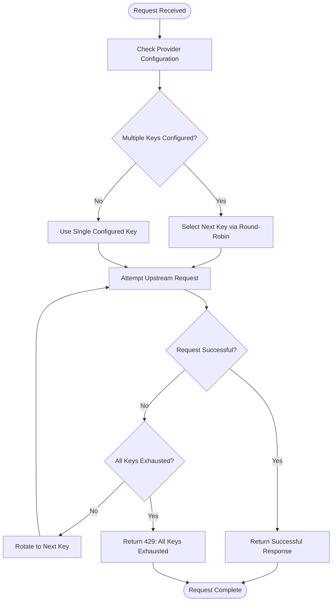
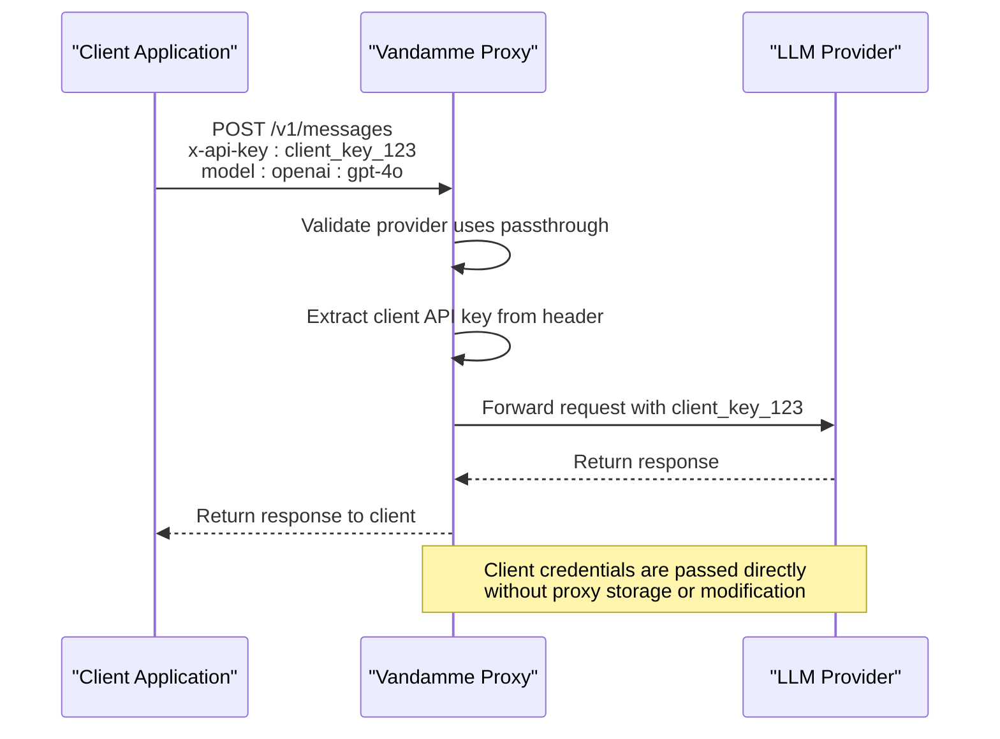
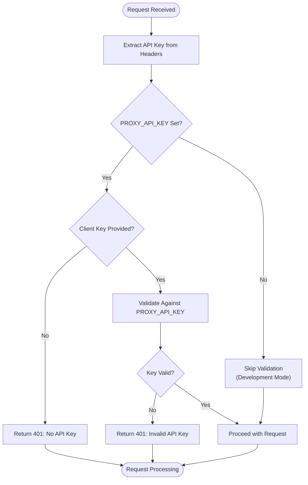
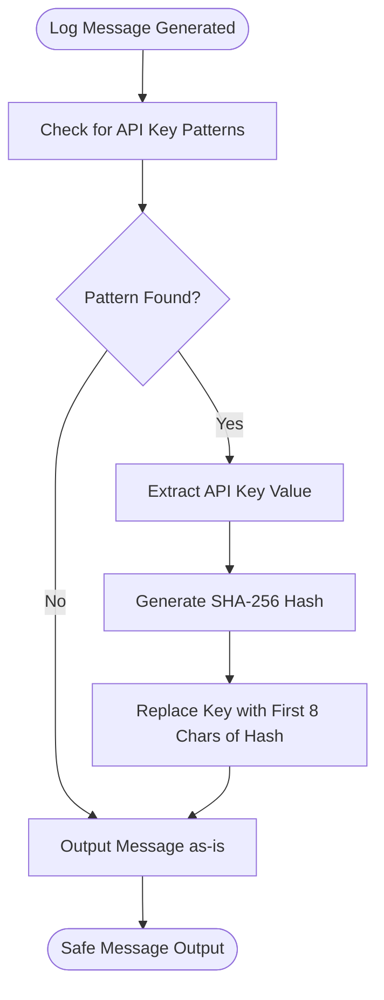

# Security Considerations

<cite>
**Referenced Files in This Document**   
- [key_rotation.py](file://src/api/services/key_rotation.py)
- [security.py](file://src/core/security.py)
- [endpoints.py](file://src/api/endpoints.py)
- [config.py](file://src/core/config.py)
- [provider_context.py](file://src/api/services/provider_context.py)
- [provider_config.py](file://src/core/provider_config.py)
- [provider_manager.py](file://src/core/provider_manager.py)
- [api-key-passthrough.md](file://docs/api-key-passthrough.md)
- [multi-api-keys.md](file://docs/multi-api-keys.md)
</cite>

## Table of Contents
1. [API Key Management](#api-key-management)
2. [Multi-Tenancy and Client Credential Handling](#multi-tenancy-and-client-credential-handling)
3. [Authentication Methods and Header Validation](#authentication-methods-and-header-validation)
4. [Security Controls and Request Validation](#security-controls-and-request-validation)
5. [HTTPS and Certificate Management](#https-and-certificate-management)
6. [Network Security and Intrusion Detection](#network-security-and-intrusion-detection)
7. [Production Deployment Best Practices](#production-deployment-best-practices)
8. [Security Incident Response](#security-incident-response)

## API Key Management

The Vandamme Proxy implements a comprehensive API key management system that supports both secure storage and dynamic rotation strategies. The system is designed to handle multiple API keys per provider with automatic failover and load balancing capabilities.

The key rotation mechanism is implemented in `src/api/services/key_rotation.py` and provides a reusable provider API key rotator that can be used across different endpoints. When a provider is configured with multiple API keys, the system automatically rotates through them using a round-robin approach. If a key fails (due to 401/403/429 errors), the system automatically rotates to the next viable key until all keys are exhausted.

**Diagram sources**
- [key_rotation.py](file://src/api/services/key_rotation.py#L14-L32)
- [provider_manager.py](file://src/core/provider_manager.py#L43-L46)

The system maintains process-global API key rotation state with per-provider tracking, ensuring thread-safe operation across concurrent requests. This state is reset when the proxy restarts, providing a clean slate for key rotation.

**Section sources**
- [key_rotation.py](file://src/api/services/key_rotation.py#L1-L70)
- [provider_manager.py](file://src/core/provider_manager.py#L43-L46)
- [multi-api-keys.md](file://docs/multi-api-keys.md#L1-L272)

## Multi-Tenancy and Client Credential Handling

The Vandamme Proxy supports multi-tenancy through its API key passthrough mechanism, allowing each client to use their own API keys for specific providers. This enables cost distribution, client autonomy, and gradual migration scenarios.

The security model for multi-tenancy is based on explicit configuration using the `!PASSTHRU` sentinel value. When a provider's API key is set to `!PASSTHRU` in the environment variables, the proxy requires clients to provide their own API keys via request headers. This explicit configuration prevents accidental passthrough and provides clear auditability of which providers use client-provided keys.

**Diagram sources**
- [provider_config.py](file://src/core/provider_config.py#L4-L40)
- [provider_context.py](file://src/api/services/provider_context.py#L38-L45)

The system enforces strict validation of passthrough requirements. If a provider is configured for passthrough but the client does not provide an API key, the proxy returns a 401 error with a descriptive message. The configuration also prevents mixing static keys with passthrough for the same provider, raising a configuration error if attempted.

**Section sources**
- [provider_config.py](file://src/core/provider_config.py#L4-L40)
- [provider_context.py](file://src/api/services/provider_context.py#L38-L45)
- [api-key-passthrough.md](file://docs/api-key-passthrough.md#L1-L211)

## Authentication Methods and Header Validation

The proxy implements robust authentication methods and header validation to ensure secure access to its endpoints. The primary authentication mechanism is API key validation, which supports both `x-api-key` and `Authorization: Bearer` header formats.

The validation process is implemented in the `validate_api_key` function in `src/api/endpoints.py`. This function extracts the API key from either the `x-api-key` header or the `Authorization` header (if it starts with "Bearer "). The validation behavior depends on whether the `PROXY_API_KEY` environment variable is set:

**Diagram sources**
- [endpoints.py](file://src/api/endpoints.py#L112-L138)
- [config.py](file://src/core/config.py#L233-L241)

When `PROXY_API_KEY` is set, the system validates that the client-provided API key matches the expected value. This provides an additional security layer for production deployments. In development environments where `PROXY_API_KEY` is not set, the validation is skipped, allowing for easier testing and development.

The system also supports provider-specific authentication through the passthrough mechanism, where client credentials are validated by the upstream provider rather than the proxy itself.

**Section sources**
- [endpoints.py](file://src/api/endpoints.py#L112-L138)
- [config.py](file://src/core/config.py#L233-L241)

## Security Controls and Request Validation

The Vandamme Proxy implements several security controls to protect against common vulnerabilities and ensure request integrity. These controls are implemented across multiple layers of the application, from input validation to response handling.

### Injection Attack Prevention

The proxy mitigates injection attacks through strict input validation and secure coding practices. The system does not execute user-provided code or interpret user input as executable commands. Instead, it acts as a pass-through or translation layer for LLM API requests, limiting the attack surface for code injection.

### SSRF Protection

Server-Side Request Forgery (SSRF) is prevented by the proxy's architecture, which only forwards requests to pre-configured provider endpoints. The base URLs for providers are configured through environment variables or configuration files, and the proxy does not allow clients to specify arbitrary endpoints. This ensures that all outbound requests are directed only to trusted LLM providers.

### Information Disclosure Prevention

The system implements comprehensive measures to prevent information disclosure, particularly regarding sensitive credentials. The `src/core/security.py` module provides utilities to safely handle API keys in logs and other output.

The `hash_api_keys_in_message` function automatically redacts API keys in log messages by replacing them with stable short hashes. This function detects common API key patterns (such as "sk-xxx", "Bearer xxx", "x-api-key: xxx", and JSON "api_key" fields) and replaces the secret portion with an 8-character SHA-256 hash.

**Diagram sources**
- [security.py](file://src/core/security.py#L45-L94)

The `get_api_key_hash` function provides a stable, non-reversible representation of API keys that can be safely used for correlation and debugging without exposing the actual key value.

### Request Validation

The proxy implements thorough request validation at multiple levels:

1. **Model resolution validation**: The system validates that requested models correspond to configured providers
2. **Provider configuration validation**: All provider configurations are validated on startup for required fields
3. **API format validation**: The system validates that API format is either "openai" or "anthropic"
4. **Key configuration validation**: The system prevents mixed configurations of static keys and passthrough

These validation checks are implemented in the `__post_init__` method of the `ProviderConfig` class and during provider configuration loading.

**Section sources**
- [security.py](file://src/core/security.py#L20-L94)
- [provider_config.py](file://src/core/provider_config.py#L69-L101)
- [provider_manager.py](file://src/core/provider_manager.py#L262-L266)

## HTTPS and Certificate Management

The Vandamme Proxy is designed to operate behind a reverse proxy or load balancer that handles HTTPS termination. The proxy itself does not implement HTTPS directly but is intended to be deployed in environments where TLS is managed at the infrastructure level.

The system supports configuration of custom base URLs for providers, which should use HTTPS endpoints. When configuring providers, administrators should ensure that the `BASE_URL` environment variables point to HTTPS endpoints to maintain secure connections to upstream LLM providers.

For production deployments, it is recommended to deploy the proxy behind a reverse proxy (such as NGINX, Traefik, or cloud load balancers) that handles:

- SSL/TLS termination
- Certificate management and renewal
- HTTP to HTTPS redirection
- HSTS (HTTP Strict Transport Security) headers
- Certificate pinning

The proxy's configuration allows for setting custom headers, which can be used to forward security-related information from the reverse proxy, such as client IP addresses (via `X-Forwarded-For`) or protocol information (via `X-Forwarded-Proto`).

**Section sources**
- [config.py](file://src/core/config.py#L67-L77)
- [provider_manager.py](file://src/core/provider_manager.py#L269-L272)

## Network Security and Intrusion Detection

The Vandamme Proxy should be deployed with appropriate network security controls to protect against unauthorized access and potential attacks. The following network security recommendations should be implemented:

### Firewall Rules

Deploy the proxy behind a firewall with the following rules:

- **Inbound rules**: Allow traffic only on the configured port (default 8082) from trusted sources (application servers, load balancers, or specific IP ranges)
- **Outbound rules**: Allow outbound connections only to the domains of configured LLM providers (e.g., api.openai.com, api.anthropic.com, api.poe.com)
- **Internal network segmentation**: Place the proxy in a dedicated network segment with restricted access

### Network Segmentation

Implement network segmentation to isolate the proxy from other systems:

- Deploy the proxy in a DMZ or dedicated service network
- Restrict database access (if applicable) to specific services
- Implement micro-segmentation for containerized deployments

### Intrusion Detection

Implement intrusion detection systems (IDS) to monitor for suspicious activity:

- **Log monitoring**: Monitor access logs for unusual patterns (e.g., high request rates, failed authentication attempts)
- **Anomaly detection**: Implement alerts for abnormal traffic patterns
- **Security Information and Event Management (SIEM)**: Integrate logs with SIEM systems for centralized monitoring

The proxy's logging system includes detailed request metrics that can be used for intrusion detection, including client IP addresses, request timestamps, and error patterns.

### Rate Limiting

While the proxy itself does not implement rate limiting, it should be deployed behind infrastructure that provides rate limiting capabilities:

- Implement rate limiting at the load balancer or API gateway level
- Set limits based on client IP or API key
- Configure burst limits and sustained rate limits

**Section sources**
- [config.py](file://src/core/config.py)
- [endpoints.py](file://src/api/endpoints.py)

## Production Deployment Best Practices

To ensure secure production deployments of the Vandamme Proxy, follow these best practices:

### Secure Configuration Management

- **Environment variables**: Store API keys and sensitive configuration in environment variables, not in code or configuration files
- **Secrets management**: Use dedicated secrets management solutions (e.g., Hashicorp Vault, AWS Secrets Manager, Azure Key Vault) for production deployments
- **Configuration validation**: Validate all configuration settings before deployment

### High Availability and Resilience

- **Multiple API keys**: Configure multiple API keys per provider for automatic failover and load balancing
- **Health checks**: Implement regular health checks to monitor proxy and upstream provider status
- **Monitoring**: Set up comprehensive monitoring for system metrics, request rates, and error rates

### Logging and Auditing

- **Secure logging**: Ensure logs do not contain sensitive information using the built-in API key redaction
- **Log retention**: Implement appropriate log retention policies based on compliance requirements
- **Audit trails**: Maintain audit logs of configuration changes and administrative actions

### Regular Updates and Patching

- **Dependency updates**: Regularly update dependencies to address security vulnerabilities
- **Security patches**: Apply security patches promptly
- **Version management**: Use versioned deployments to enable rollback if needed

### Backup and Recovery

- **Configuration backup**: Regularly backup configuration files and environment settings
- **Disaster recovery**: Implement disaster recovery procedures and test them regularly
- **Rollback capability**: Maintain the ability to quickly rollback to previous stable versions

**Section sources**
- [config.py](file://src/core/config.py)
- [provider_manager.py](file://src/core/provider_manager.py)
- [README.md](file://README.md)

## Security Incident Response

In the event of a security incident, follow this response procedure:

### Immediate Actions

1. **Isolate the system**: Disconnect the proxy from the network to prevent further exposure
2. **Preserve evidence**: Take snapshots of system state, logs, and memory before making changes
3. **Assess impact**: Determine the scope of the incident and affected systems

### Investigation

1. **Review logs**: Examine access logs, error logs, and audit trails for suspicious activity
2. **Identify entry point**: Determine how the incident occurred (e.g., compromised API key, configuration error)
3. **Assess data exposure**: Determine what data may have been accessed or exfiltrated

### Remediation

1. **Rotate credentials**: Immediately rotate all API keys and secrets
2. **Patch vulnerabilities**: Address any identified vulnerabilities in the system or configuration
3. **Restore service**: Gradually restore service with enhanced security controls

### Post-Incident Review

1. **Root cause analysis**: Conduct a thorough analysis of the incident causes
2. **Update procedures**: Update security policies and procedures based on lessons learned
3. **Staff training**: Provide additional training to prevent similar incidents

The proxy's design supports incident response through its logging capabilities and configuration flexibility, allowing for rapid credential rotation and service restoration.

**Section sources**
- [security.py](file://src/core/security.py)
- [config.py](file://src/core/config.py)
- [provider_manager.py](file://src/core/provider_manager.py)