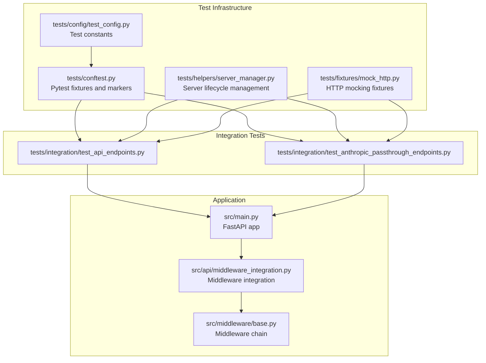
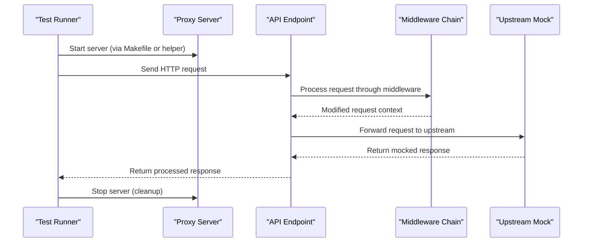
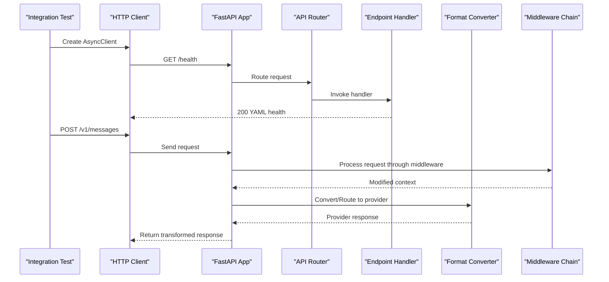
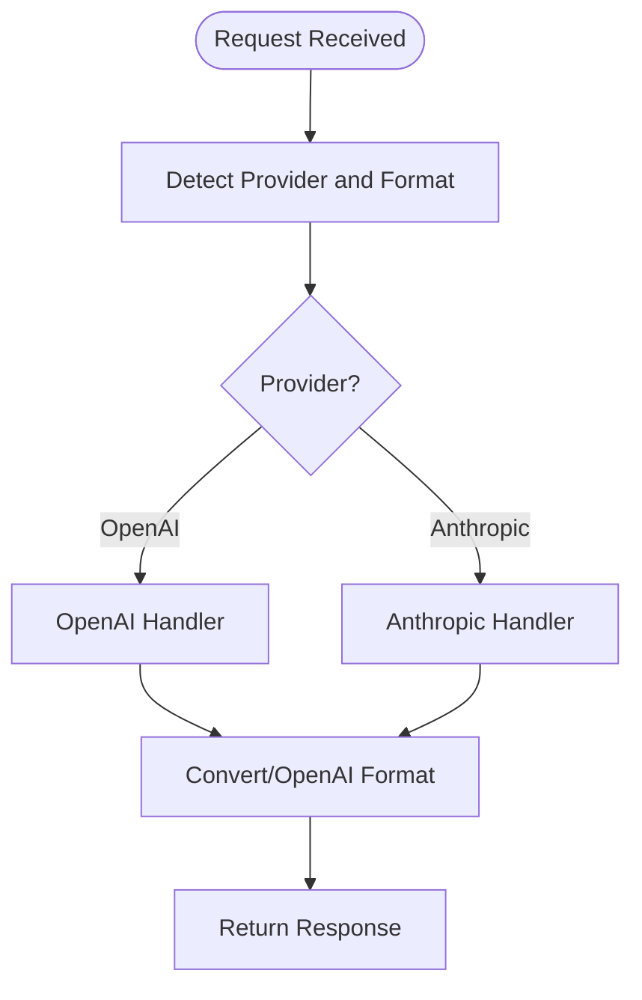
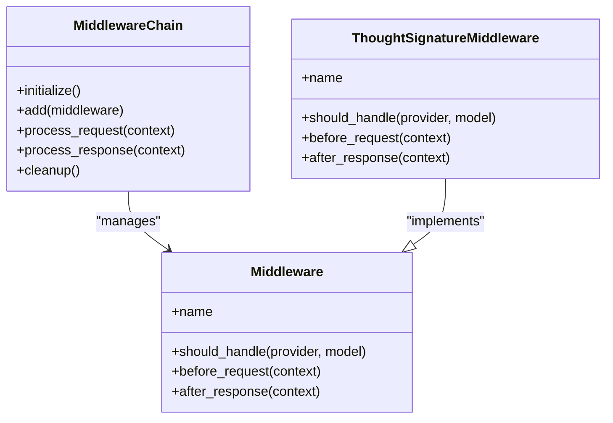
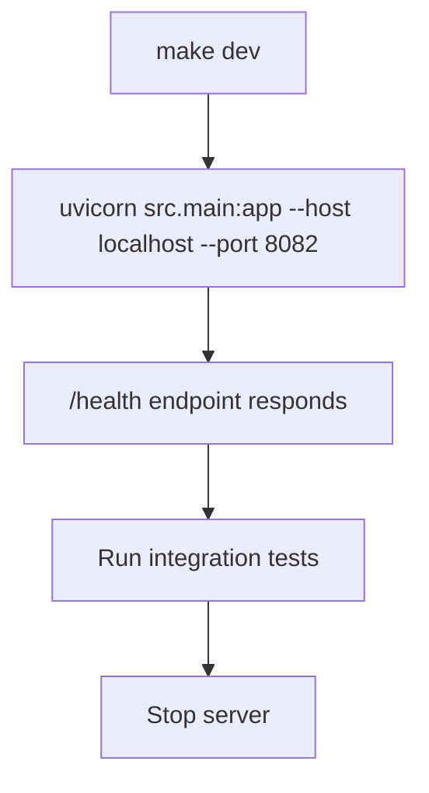
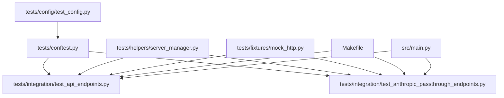

# Integration Testing

<cite>
**Referenced Files in This Document**
- [tests/conftest.py](file://tests/conftest.py)
- [tests/integration/test_api_endpoints.py](file://tests/integration/test_api_endpoints.py)
- [tests/integration/test_anthropic_passthrough_endpoints.py](file://tests/integration/test_anthropic_passthrough_endpoints.py)
- [tests/helpers/server_manager.py](file://tests/helpers/server_manager.py)
- [tests/fixtures/mock_http.py](file://tests/fixtures/mock_http.py)
- [tests/config/test_config.py](file://tests/config/test_config.py)
- [Makefile](file://Makefile)
- [src/main.py](file://src/main.py)
- [src/api/middleware_integration.py](file://src/api/middleware_integration.py)
- [src/middleware/base.py](file://src/middleware/base.py)
</cite>

## Table of Contents
1. [Introduction](#introduction)
2. [Project Structure](#project-structure)
3. [Core Components](#core-components)
4. [Architecture Overview](#architecture-overview)
5. [Detailed Component Analysis](#detailed-component-analysis)
6. [Dependency Analysis](#dependency-analysis)
7. [Performance Considerations](#performance-considerations)
8. [Troubleshooting Guide](#troubleshooting-guide)
9. [Conclusion](#conclusion)
10. [Appendices](#appendices)

## Introduction
This document describes the integration testing strategy for the Vandamme Proxy. Integration tests validate end-to-end request flows through the proxy server, ensuring that API endpoints behave correctly with real request processing, provider routing, format conversion, and middleware integration. Unlike unit tests that mock external HTTP calls, integration tests run against a live server instance and verify behavior without making actual external API calls by using mocked responses.

Key goals:
- Validate API endpoint behavior with realistic request flows
- Verify provider routing and format conversion
- Confirm middleware integration across providers
- Provide a repeatable, deterministic way to run integration tests locally

## Project Structure
The integration testing infrastructure is organized around:
- Shared pytest configuration and fixtures
- Integration test suites for API endpoints and provider-specific flows
- A server manager to start and stop the proxy server for tests
- HTTP mocking fixtures to simulate upstream provider responses
- Centralized test configuration constants

**Diagram sources**
- [tests/conftest.py](file://tests/conftest.py#L60-L81)
- [tests/helpers/server_manager.py](file://tests/helpers/server_manager.py#L14-L129)
- [tests/fixtures/mock_http.py](file://tests/fixtures/mock_http.py#L1-L316)
- [tests/config/test_config.py](file://tests/config/test_config.py#L1-L56)
- [tests/integration/test_api_endpoints.py](file://tests/integration/test_api_endpoints.py#L1-L556)
- [tests/integration/test_anthropic_passthrough_endpoints.py](file://tests/integration/test_anthropic_passthrough_endpoints.py#L1-L67)
- [src/main.py](file://src/main.py#L1-L105)
- [src/api/middleware_integration.py](file://src/api/middleware_integration.py#L1-L43)
- [src/middleware/base.py](file://src/middleware/base.py#L283-L323)

**Section sources**
- [tests/conftest.py](file://tests/conftest.py#L60-L81)
- [tests/helpers/server_manager.py](file://tests/helpers/server_manager.py#L14-L129)
- [tests/fixtures/mock_http.py](file://tests/fixtures/mock_http.py#L1-L316)
- [tests/config/test_config.py](file://tests/config/test_config.py#L1-L56)
- [tests/integration/test_api_endpoints.py](file://tests/integration/test_api_endpoints.py#L1-L556)
- [tests/integration/test_anthropic_passthrough_endpoints.py](file://tests/integration/test_anthropic_passthrough_endpoints.py#L1-L67)
- [src/main.py](file://src/main.py#L1-L105)
- [src/api/middleware_integration.py](file://src/api/middleware_integration.py#L1-L43)
- [src/middleware/base.py](file://src/middleware/base.py#L283-L323)

## Core Components
- Integration test fixtures and markers: define shared fixtures and test markers for categorizing tests by scope.
- Server manager: starts/stops the proxy server for integration tests and validates readiness.
- HTTP mocking fixtures: provide RESPX-based mocks for upstream providers to avoid real network calls.
- Test configuration: centralizes test constants for API keys, endpoints, and defaults.
- Integration test suites: cover API endpoints, provider routing, and Anthropic passthrough scenarios.

**Section sources**
- [tests/conftest.py](file://tests/conftest.py#L60-L81)
- [tests/helpers/server_manager.py](file://tests/helpers/server_manager.py#L14-L129)
- [tests/fixtures/mock_http.py](file://tests/fixtures/mock_http.py#L1-L316)
- [tests/config/test_config.py](file://tests/config/test_config.py#L1-L56)
- [tests/integration/test_api_endpoints.py](file://tests/integration/test_api_endpoints.py#L1-L556)
- [tests/integration/test_anthropic_passthrough_endpoints.py](file://tests/integration/test_anthropic_passthrough_endpoints.py#L1-L67)

## Architecture Overview
The integration testing architecture ensures that tests run against a live server while maintaining isolation and determinism. The server is started by the test runner or via the Makefile, and tests communicate with it over HTTP. Upstream provider calls are intercepted and mocked to prevent real network traffic.

**Diagram sources**
- [Makefile](file://Makefile#L287-L296)
- [tests/helpers/server_manager.py](file://tests/helpers/server_manager.py#L23-L86)
- [src/api/middleware_integration.py](file://src/api/middleware_integration.py#L26-L43)
- [src/middleware/base.py](file://src/middleware/base.py#L283-L323)
- [tests/fixtures/mock_http.py](file://tests/fixtures/mock_http.py#L215-L256)

## Detailed Component Analysis

### Integration Test Execution Flow
Integration tests rely on a running server and use HTTP clients to exercise endpoints. They validate:
- Endpoint responses and content types
- Provider routing and format conversion
- Middleware integration across providers
- Metrics and logs endpoints

**Diagram sources**
- [tests/integration/test_api_endpoints.py](file://tests/integration/test_api_endpoints.py#L19-L38)
- [tests/integration/test_api_endpoints.py](file://tests/integration/test_api_endpoints.py#L219-L240)
- [src/api/middleware_integration.py](file://src/api/middleware_integration.py#L26-L43)
- [src/middleware/base.py](file://src/middleware/base.py#L283-L323)

**Section sources**
- [tests/integration/test_api_endpoints.py](file://tests/integration/test_api_endpoints.py#L19-L38)
- [tests/integration/test_api_endpoints.py](file://tests/integration/test_api_endpoints.py#L219-L240)
- [src/api/middleware_integration.py](file://src/api/middleware_integration.py#L26-L43)
- [src/middleware/base.py](file://src/middleware/base.py#L283-L323)

### Provider Routing and Format Conversion
Integration tests validate that the proxy routes requests to the correct provider and converts formats appropriately. Tests demonstrate:
- Anthropic passthrough format handling
- OpenAI and Anthropic model lists in different formats
- Provider-specific behavior in streaming and tool-use scenarios

**Diagram sources**
- [tests/integration/test_anthropic_passthrough_endpoints.py](file://tests/integration/test_anthropic_passthrough_endpoints.py#L15-L41)
- [tests/integration/test_api_endpoints.py](file://tests/integration/test_api_endpoints.py#L42-L75)

**Section sources**
- [tests/integration/test_anthropic_passthrough_endpoints.py](file://tests/integration/test_anthropic_passthrough_endpoints.py#L15-L41)
- [tests/integration/test_api_endpoints.py](file://tests/integration/test_api_endpoints.py#L42-L75)

### Middleware Integration Without External Calls
Middleware integration is validated by sending requests through the proxy server. The middleware chain modifies request/response contexts without requiring external provider calls.

**Diagram sources**
- [src/middleware/base.py](file://src/middleware/base.py#L283-L323)
- [src/api/middleware_integration.py](file://src/api/middleware_integration.py#L26-L43)

**Section sources**
- [src/middleware/base.py](file://src/middleware/base.py#L283-L323)
- [src/api/middleware_integration.py](file://src/api/middleware_integration.py#L26-L43)

### Server Startup and Port Management
Integration tests depend on a running server. The Makefile provides commands to start the server, and tests use a port constant aligned with the development server.

**Diagram sources**
- [Makefile](file://Makefile#L143-L146)
- [Makefile](file://Makefile#L287-L296)
- [tests/conftest.py](file://tests/conftest.py#L60-L69)
- [tests/integration/test_api_endpoints.py](file://tests/integration/test_api_endpoints.py#L12-L14)

**Section sources**
- [Makefile](file://Makefile#L143-L146)
- [Makefile](file://Makefile#L287-L296)
- [tests/conftest.py](file://tests/conftest.py#L60-L69)
- [tests/integration/test_api_endpoints.py](file://tests/integration/test_api_endpoints.py#L12-L14)

### Writing New Integration Tests
Guidance for creating new integration tests:
- Mark tests with the integration marker to categorize them correctly.
- Use the base_url fixture to construct endpoint URLs consistently.
- Leverage HTTP mocking fixtures to simulate upstream provider responses.
- Structure tests to validate provider routing, format conversion, and middleware behavior.
- Prefer async HTTP clients for streaming and concurrent scenarios.

Examples to reference:
- Basic endpoint validation and YAML content type checks
- Provider-specific model list formats
- Metrics and logs endpoints
- Anthropic passthrough format handling

**Section sources**
- [tests/conftest.py](file://tests/conftest.py#L72-L81)
- [tests/conftest.py](file://tests/conftest.py#L66-L69)
- [tests/fixtures/mock_http.py](file://tests/fixtures/mock_http.py#L215-L256)
- [tests/integration/test_api_endpoints.py](file://tests/integration/test_api_endpoints.py#L19-L38)
- [tests/integration/test_api_endpoints.py](file://tests/integration/test_api_endpoints.py#L42-L75)
- [tests/integration/test_anthropic_passthrough_endpoints.py](file://tests/integration/test_anthropic_passthrough_endpoints.py#L15-L41)

## Dependency Analysis
Integration tests depend on:
- Pytest fixtures and markers for categorization and environment setup
- A running server instance managed by the server manager or Makefile
- HTTP mocking to isolate external dependencies
- Centralized test configuration constants

**Diagram sources**
- [tests/conftest.py](file://tests/conftest.py#L60-L81)
- [tests/helpers/server_manager.py](file://tests/helpers/server_manager.py#L14-L129)
- [tests/fixtures/mock_http.py](file://tests/fixtures/mock_http.py#L1-L316)
- [tests/config/test_config.py](file://tests/config/test_config.py#L1-L56)
- [tests/integration/test_api_endpoints.py](file://tests/integration/test_api_endpoints.py#L1-L556)
- [tests/integration/test_anthropic_passthrough_endpoints.py](file://tests/integration/test_anthropic_passthrough_endpoints.py#L1-L67)
- [Makefile](file://Makefile#L287-L296)
- [src/main.py](file://src/main.py#L1-L105)

**Section sources**
- [tests/conftest.py](file://tests/conftest.py#L60-L81)
- [tests/helpers/server_manager.py](file://tests/helpers/server_manager.py#L14-L129)
- [tests/fixtures/mock_http.py](file://tests/fixtures/mock_http.py#L1-L316)
- [tests/config/test_config.py](file://tests/config/test_config.py#L1-L56)
- [tests/integration/test_api_endpoints.py](file://tests/integration/test_api_endpoints.py#L1-L556)
- [tests/integration/test_anthropic_passthrough_endpoints.py](file://tests/integration/test_anthropic_passthrough_endpoints.py#L1-L67)
- [Makefile](file://Makefile#L287-L296)
- [src/main.py](file://src/main.py#L1-L105)

## Performance Considerations
- Integration tests should be kept fast by minimizing server restarts and reusing a single server instance when possible.
- Use targeted HTTP mocking to avoid unnecessary overhead.
- Prefer async HTTP clients for streaming tests to reduce latency.
- Keep test fixtures minimal to reduce initialization time.

## Troubleshooting Guide
Common issues and resolutions:
- Server not running: Ensure the server is started with the Makefile before running integration tests.
- Port conflicts: The integration tests expect a specific port; adjust VDM_TEST_PORT if needed.
- Missing environment variables: Ensure required environment variables are set for tests that require them.
- Network isolation: Verify that HTTP mocking fixtures are correctly configured to prevent real network calls.

**Section sources**
- [Makefile](file://Makefile#L287-L296)
- [tests/conftest.py](file://tests/conftest.py#L60-L69)
- [tests/fixtures/mock_http.py](file://tests/fixtures/mock_http.py#L215-L256)

## Conclusion
Integration tests provide confidence that the proxy behaves correctly in realistic conditions. By combining a live server, HTTP mocking, and structured test fixtures, the suite validates provider routing, format conversion, and middleware integration without relying on external API calls. Following the guidelines and examples in this document will help contributors write reliable and maintainable integration tests.

## Appendices

### Running Integration Tests
- Start the server: make dev
- Run integration tests: make test-integration
- Run all tests (including integration): make test-all

**Section sources**
- [Makefile](file://Makefile#L287-L296)
- [Makefile](file://Makefile#L310-L325)