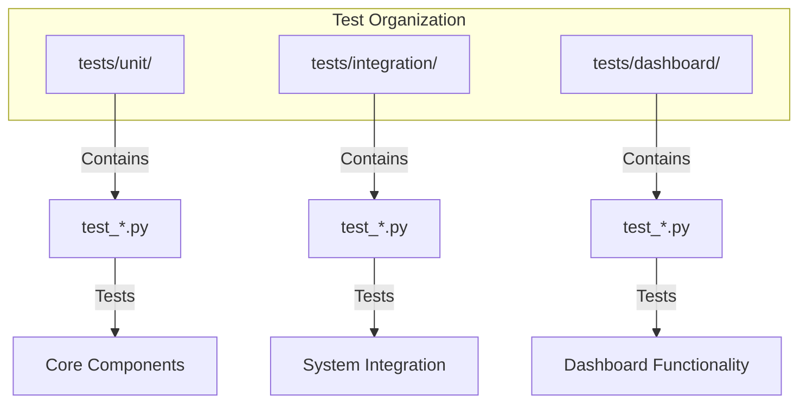
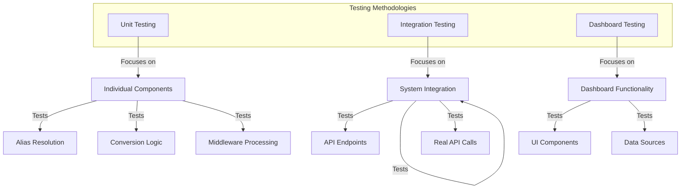
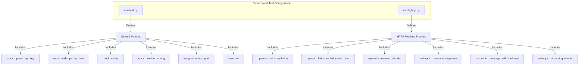
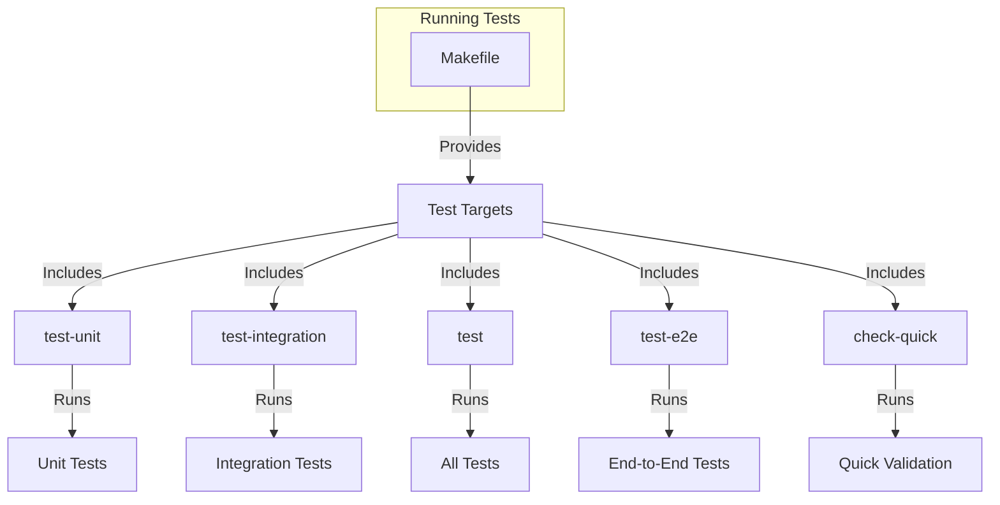
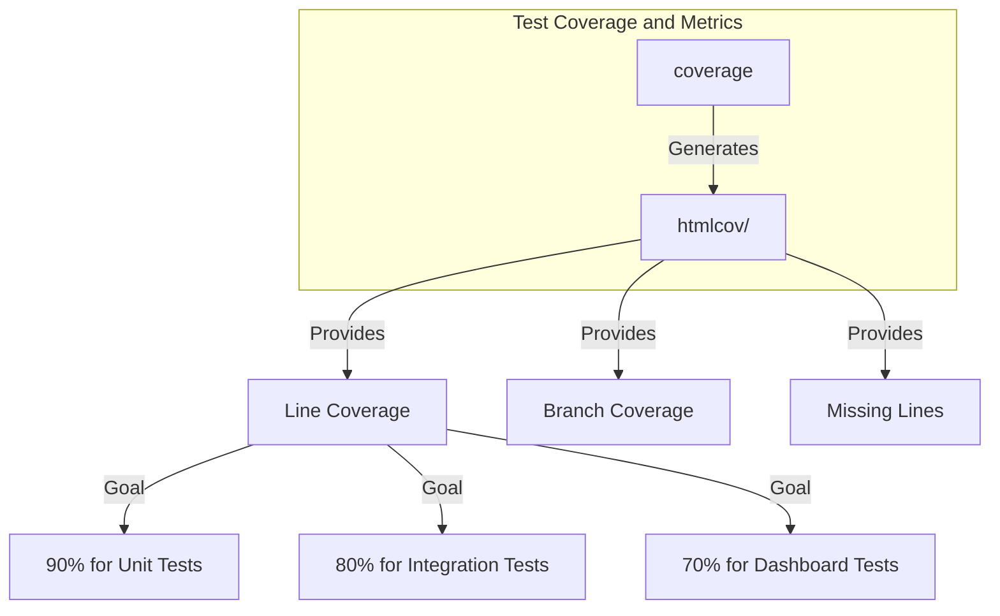

# Testing Strategy

<cite>
**Referenced Files in This Document**   
- [conftest.py](file://tests/conftest.py)
- [mock_http.py](file://tests/fixtures/mock_http.py)
- [Makefile](file://Makefile)
- [test_alias_manager.py](file://tests/unit/test_alias_manager.py)
- [test_api_endpoints.py](file://tests/unit/test_api_endpoints.py)
- [test_conversion_helpers.py](file://tests/unit/test_conversion_helpers.py)
- [test_middleware_streaming_wrapper_parses_openai_sse.py](file://tests/unit/test_middleware_streaming_wrapper_parses_openai_sse.py)
- [test_api_endpoints.py](file://tests/integration/test_api_endpoints.py)
- [test_dashboard_app.py](file://tests/dashboard/test_dashboard_app.py)
- [server_manager.py](file://tests/helpers/server_manager.py)
- [anthropic_tool_stream.py](file://tests/fixtures/anthropic_tool_stream.py)
- [pyproject.toml](file://pyproject.toml)
</cite>

## Table of Contents
1. [Introduction](#introduction)
2. [Test Organization and Structure](#test-organization-and-structure)
3. [Testing Methodologies](#testing-methodologies)
4. [Fixtures and Test Configuration](#fixtures-and-test-configuration)
5. [Running Tests](#running-tests)
6. [Test Coverage and Metrics](#test-coverage-and-metrics)
7. [Writing New Tests](#writing-new-tests)
8. [Conclusion](#conclusion)

## Introduction

The Vandamme Proxy employs a comprehensive multi-layered testing strategy to ensure the reliability, quality, and robustness of its codebase. This documentation provides a detailed overview of the testing approach, covering unit tests, integration tests, and dashboard tests. It explains the test organization, naming conventions, and the use of fixtures for mocking HTTP responses. The document also covers testing methodologies for critical components such as alias resolution, conversion logic, and middleware processing. Additionally, it provides guidance on running tests locally and in CI/CD pipelines using the Makefile, addresses test coverage goals, and offers examples of writing new tests for features and bug fixes. This section aims to enable developers to contribute tests that maintain the codebase's reliability and quality.

**Section sources**
- [conftest.py](file://tests/conftest.py#L1-L219)
- [mock_http.py](file://tests/fixtures/mock_http.py#L1-L316)
- [Makefile](file://Makefile#L1-L570)

## Test Organization and Structure

The test suite is organized into three main directories: `unit`, `integration`, and `dashboard`. Each directory serves a specific purpose in the testing hierarchy.

- **Unit Tests**: Located in `tests/unit/`, these tests focus on individual components and functions in isolation. They are designed to be fast and do not depend on external services. Unit tests are marked with the `@pytest.mark.unit` decorator and are automatically detected by the test runner based on their location.

- **Integration Tests**: Found in `tests/integration/`, these tests verify the interaction between different components and systems. They require a running server and may involve real API calls. Integration tests are marked with the `@pytest.mark.integration` decorator and are used to ensure that the system works as expected when components are combined.

- **Dashboard Tests**: Located in `tests/dashboard/`, these tests focus on the dashboard functionality, including UI components and data sources. They ensure that the dashboard correctly displays and interacts with the underlying data.

The test files follow a naming convention of `test_<component>.py`, where `<component>` is the name of the module or feature being tested. This convention helps in quickly identifying the purpose of each test file and ensures consistency across the codebase.



**Diagram sources **
- [conftest.py](file://tests/conftest.py#L72-L102)
- [pyproject.toml](file://pyproject.toml#L130-L140)

**Section sources**
- [conftest.py](file://tests/conftest.py#L72-L102)
- [pyproject.toml](file://pyproject.toml#L130-L140)

## Testing Methodologies

The testing strategy for the Vandamme Proxy is designed to cover various aspects of the system, ensuring that each component functions correctly and integrates seamlessly with others. The methodologies include unit testing, integration testing, and dashboard testing, each with specific focus areas and techniques.

### Unit Testing

Unit tests are the foundation of the testing strategy, focusing on individual functions and methods in isolation. They are designed to be fast and deterministic, ensuring that each component behaves as expected under various conditions. Key areas covered by unit tests include:

- **Alias Resolution**: Tests verify that aliases are correctly resolved and that the system handles various edge cases, such as empty alias values and invalid provider names.
- **Conversion Logic**: Tests ensure that the conversion between different API formats (e.g., OpenAI to Anthropic) is accurate and handles edge cases.
- **Middleware Processing**: Tests validate that middleware components correctly process requests and responses, including streaming and error handling.

### Integration Testing

Integration tests verify the interaction between different components and systems. They are more comprehensive than unit tests and may involve real API calls. Key areas covered by integration tests include:

- **API Endpoints**: Tests ensure that API endpoints respond correctly to various requests, including error conditions and edge cases.
- **System Integration**: Tests verify that the system works as expected when components are combined, ensuring that data flows correctly through the system.
- **Real API Calls**: End-to-end tests make real API calls to external services, ensuring that the system integrates correctly with external providers.

### Dashboard Testing

Dashboard tests focus on the dashboard functionality, including UI components and data sources. They ensure that the dashboard correctly displays and interacts with the underlying data. Key areas covered by dashboard tests include:

- **UI Components**: Tests verify that UI components render correctly and respond to user interactions.
- **Data Sources**: Tests ensure that data sources provide the correct data and that the dashboard updates correctly when data changes.



**Diagram sources **
- [test_alias_manager.py](file://tests/unit/test_alias_manager.py#L1-L532)
- [test_api_endpoints.py](file://tests/unit/test_api_endpoints.py#L1-L425)
- [test_conversion_helpers.py](file://tests/unit/test_conversion_helpers.py#L1-L66)
- [test_middleware_streaming_wrapper_parses_openai_sse.py](file://tests/unit/test_middleware_streaming_wrapper_parses_openai_sse.py#L1-L49)
- [test_api_endpoints.py](file://tests/integration/test_api_endpoints.py#L1-L556)
- [test_dashboard_app.py](file://tests/dashboard/test_dashboard_app.py#L1-L103)

**Section sources**
- [test_alias_manager.py](file://tests/unit/test_alias_manager.py#L1-L532)
- [test_api_endpoints.py](file://tests/unit/test_api_endpoints.py#L1-L425)
- [test_conversion_helpers.py](file://tests/unit/test_conversion_helpers.py#L1-L66)
- [test_middleware_streaming_wrapper_parses_openai_sse.py](file://tests/unit/test_middleware_streaming_wrapper_parses_openai_sse.py#L1-L49)
- [test_api_endpoints.py](file://tests/integration/test_api_endpoints.py#L1-L556)
- [test_dashboard_app.py](file://tests/dashboard/test_dashboard_app.py#L1-L103)

## Fixtures and Test Configuration

The testing framework uses fixtures to set up and tear down test environments, mock external dependencies, and provide reusable test data. The primary configuration file for pytest is `conftest.py`, located in the `tests/` directory. This file contains shared fixtures and configuration settings that are used across multiple test files.

### Shared Fixtures

The `conftest.py` file defines several shared fixtures that are used throughout the test suite:

- **mock_openai_api_key**: Mocks the OpenAI API key environment variable.
- **mock_anthropic_api_key**: Mocks the Anthropic API key environment variable.
- **mock_config**: Provides a mock configuration object with test values.
- **mock_provider_config**: Provides a mock provider configuration object.
- **integration_test_port**: Specifies the port for integration tests.
- **base_url**: Provides the base URL for integration tests.

These fixtures ensure that tests run in a consistent and isolated environment, reducing the risk of side effects and making tests more reliable.

### HTTP Mocking

The `mock_http.py` file in the `tests/fixtures/` directory provides fixtures for mocking HTTP API calls using the RESPX library. These fixtures allow tests to simulate responses from external services without making real network calls. Key fixtures include:

- **openai_chat_completion**: Standard OpenAI chat completion response.
- **openai_chat_completion_with_tool**: OpenAI chat completion with function calling.
- **openai_streaming_chunks**: OpenAI streaming response chunks.
- **anthropic_message_response**: Standard Anthropic message response.
- **anthropic_message_with_tool_use**: Anthropic message with tool use.
- **anthropic_streaming_events**: Anthropic streaming SSE events.

These fixtures are used to create realistic test scenarios and ensure that the system handles various response types correctly.



**Diagram sources **
- [conftest.py](file://tests/conftest.py#L15-L102)
- [mock_http.py](file://tests/fixtures/mock_http.py#L17-L257)

**Section sources**
- [conftest.py](file://tests/conftest.py#L15-L102)
- [mock_http.py](file://tests/fixtures/mock_http.py#L17-L257)

## Running Tests

The Makefile provides a convenient way to run tests locally and in CI/CD pipelines. It includes several targets for different types of tests and validation steps.

### Running Unit Tests

To run unit tests, use the `test-unit` target:

```bash
make test-unit
```

This command runs all unit tests in the `tests/unit/` directory and outputs the results.

### Running Integration Tests

To run integration tests, use the `test-integration` target:

```bash
make test-integration
```

This command runs all integration tests in the `tests/integration/` directory. Note that integration tests require a running server, so ensure the server is started before running these tests.

### Running All Tests

To run all tests, including unit and integration tests, use the `test` target:

```bash
make test
```

This command runs all tests except end-to-end tests, which require valid API keys.

### Running End-to-End Tests

To run end-to-end tests, use the `test-e2e` target:

```bash
make test-e2e
```

This command runs end-to-end tests that make real API calls. Ensure that the server is running and that API keys are set in the `.env` file before running these tests.

### Running Quick Validation

For a fast validation of the codebase, use the `check-quick` target:

```bash
make check-quick
```

This command runs static checks and quick tests, providing a fast feedback loop during development.



**Diagram sources **
- [Makefile](file://Makefile#L267-L325)

**Section sources**
- [Makefile](file://Makefile#L267-L325)

## Test Coverage and Metrics

Test coverage is an important metric for ensuring that the codebase is well-tested. The Makefile includes a `coverage` target that runs tests with coverage reporting:

```bash
make coverage
```

This command runs tests and generates a coverage report in the `htmlcov/` directory. The report provides detailed information about which lines of code are covered by tests and which are not. The goal is to achieve high test coverage, ensuring that critical components are thoroughly tested.

### Coverage Goals

The project aims to achieve the following coverage goals:

- **Unit Tests**: 90% line coverage for core components.
- **Integration Tests**: 80% line coverage for system integration.
- **Dashboard Tests**: 70% line coverage for dashboard functionality.

These goals ensure that the most critical parts of the codebase are well-tested, reducing the risk of bugs and regressions.



**Diagram sources **
- [Makefile](file://Makefile#L331-L344)

**Section sources**
- [Makefile](file://Makefile#L331-L344)

## Writing New Tests

When writing new tests, follow these guidelines to ensure consistency and maintainability:

### Test Naming Conventions

- Use descriptive names for test functions and methods.
- Prefix test functions with `test_`.
- Use underscores to separate words in test names.

### Test Structure

- Use the `@pytest.mark.unit`, `@pytest.mark.integration`, or `@pytest.mark.e2e` decorators to mark the type of test.
- Use fixtures to set up and tear down test environments.
- Use assertions to verify the expected behavior of the system.

### Example: Writing a Unit Test

Here is an example of a unit test for the `AliasManager` class:

```python
import pytest
from unittest.mock import patch, MagicMock

from src.core.alias_manager import AliasManager

@pytest.mark.unit
class TestAliasManager:
    def test_load_aliases_from_env(self):
        with (
            patch.dict(
                os.environ,
                {
                    "POE_ALIAS_HAIKU": "grok-4.1-fast-non-reasoning",
                    "OPENAI_ALIAS_FAST": "gpt-4o-mini",
                    "ANTHROPIC_ALIAS_CHAT": "claude-3-5-sonnet-20241022",
                    "OTHER_VAR": "should_be_ignored",
                },
            ),
            patch("src.core.provider_manager.ProviderManager") as mock_provider_manager,
        ):
            mock_pm = mock_provider_manager.return_value
            mock_pm._configs = {"poe": {}, "openai": {}, "anthropic": {}}

            with patch("src.core.alias_config.AliasConfigLoader") as mock_config_loader:
                mock_loader_instance = mock_config_loader.return_value
                mock_loader_instance.load_config.return_value = {"providers": {}, "defaults": {}}

                alias_manager = AliasManager()

            aliases = alias_manager.get_all_aliases()
            assert len(aliases) == 3
            assert aliases["poe"]["haiku"] == "grok-4.1-fast-non-reasoning"
            assert aliases["openai"]["fast"] == "gpt-4o-mini"
            assert aliases["anthropic"]["chat"] == "claude-3-5-sonnet-20241022"
```

### Example: Writing an Integration Test

Here is an example of an integration test for the `/v1/messages` endpoint:

```python
import pytest
import httpx

@pytest.mark.integration
@pytest.mark.asyncio
async def test_basic_chat():
    if not os.getenv("OPENAI_API_KEY"):
        pytest.skip("OPENAI_API_KEY not set")

    async with httpx.AsyncClient(timeout=30.0) as client:
        response = await client.post(
            f"{BASE_URL}/v1/messages",
            json={
                "model": "claude-3-5-sonnet-20241022",
                "max_tokens": 20,
                "messages": [{"role": "user", "content": "Say 'Hello world'"}],
            },
        )

        assert response.status_code == 200
        data = response.json()
        assert "content" in data
        assert len(data["content"]) > 0
        assert "role" in data
        assert data["role"] == "assistant"
```

**Section sources**
- [test_alias_manager.py](file://tests/unit/test_alias_manager.py#L1-L532)
- [test_api_endpoints.py](file://tests/integration/test_api_endpoints.py#L1-L556)

## Conclusion

The testing strategy for the Vandamme Proxy is designed to ensure the reliability, quality, and robustness of the codebase. By following a multi-layered approach that includes unit tests, integration tests, and dashboard tests, the project maintains a high level of confidence in its functionality. The use of fixtures and the Makefile simplifies the process of running tests and ensures consistency across different environments. Developers are encouraged to write new tests for features and bug fixes, following the guidelines provided in this document. By adhering to these practices, the codebase will continue to evolve with confidence and maintain its high standards of quality.