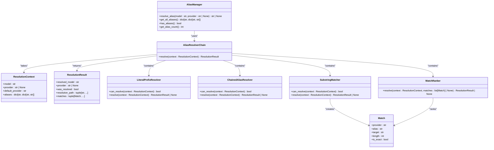

# Unit Testing

<cite>
**Referenced Files in This Document**   
- [conftest.py](file://tests/conftest.py)
- [test_alias_manager.py](file://tests/unit/test_alias_manager.py)
- [test_conversion_helpers.py](file://tests/unit/test_conversion_helpers.py)
- [test_model_manager.py](file://tests/unit/test_model_manager.py)
- [test_alias_cache.py](file://tests/unit/test_alias_cache.py)
- [test_resolvers.py](file://tests/unit/alias/test_resolvers.py)
- [mock_http.py](file://tests/fixtures/mock_http.py)
- [alias_manager.py](file://src/core/alias_manager.py)
- [model_manager.py](file://src/core/model_manager.py)
- [content_utils.py](file://src/conversion/content_utils.py)
- [tool_call_delta.py](file://src/conversion/tool_call_delta.py)
- [resolver.py](file://src/core/alias/resolver.py)
- [config.py](file://src/core/config.py)
</cite>

## Table of Contents
1. [Introduction](#introduction)
2. [Core Components Testing](#core-components-testing)
3. [Pytest Fixtures and Environment Setup](#pytest-fixtures-and-environment-setup)
4. [Mocking Strategy](#mocking-strategy)
5. [Test Isolation and Configuration State](#test-isolation-and-configuration-state)
6. [Writing New Unit Tests](#writing-new-unit-tests)
7. [Conclusion](#conclusion)

## Introduction

This document provides a comprehensive guide to the unit testing strategy for the Vandamme Proxy project. It details the implementation of tests for core components such as alias resolution, model management, and conversion logic. The testing framework leverages pytest fixtures, mocking with respx and MagicMock, and a robust test isolation strategy to ensure reliable and maintainable tests. The content is designed to be accessible to beginners while providing sufficient technical depth for experienced developers.

## Core Components Testing

### Alias Resolution Testing

The `test_alias_manager.py` file contains comprehensive unit tests for the `AliasManager` class, which handles model alias resolution. The tests validate various aspects of alias resolution, including exact and substring matching, case insensitivity, and chained alias resolution.

The `AliasManager` class uses a resolver chain pattern to handle different types of alias resolution. The chain consists of several resolvers:
- `LiteralPrefixResolver`: Handles literal model names prefixed with '!'
- `ChainedAliasResolver`: Resolves chained aliases (e.g., fast -> sonnet -> gpt-4o-mini)
- `SubstringMatcher`: Performs case-insensitive substring matching against alias names
- `MatchRanker`: Ranks and selects the best match from candidate aliases

The tests in `test_alias_manager.py` cover various scenarios, including exact matches, substring matches, longest match priority, alphabetical priority on ties, and handling of empty alias values. The tests also validate the behavior of chained alias resolution and cycle detection to prevent infinite loops.



**Diagram sources**
- [alias_manager.py](file://src/core/alias_manager.py#L167-L634)
- [resolver.py](file://src/core/alias/resolver.py#L1-L524)

**Section sources**
- [test_alias_manager.py](file://tests/unit/test_alias_manager.py#L1-L532)
- [test_resolvers.py](file://tests/unit/alias/test_resolvers.py#L1-L731)

### Model Management Testing

The `test_model_manager.py` file contains unit tests for the `ModelManager` class, which is responsible for resolving model names to their actual provider and model names. The tests validate the interaction between the `ModelManager` and the `AliasManager`, ensuring that model resolution works correctly with and without aliases.

The `ModelManager` class uses the `AliasManager` to resolve aliases and then parses the provider prefix from the resolved model name. The tests cover various scenarios, including resolving models with and without provider prefixes, handling of literal model names, and logging behavior.


**Diagram sources**
- [model_manager.py](file://src/core/model_manager.py#L1-L117)
- [test_model_manager.py](file://tests/unit/test_model_manager.py#L1-L260)

**Section sources**
- [test_model_manager.py](file://tests/unit/test_model_manager.py#L1-L260)

### Conversion Logic Testing

The `test_conversion_helpers.py` file contains unit tests for various conversion helper functions used in the project. These functions handle tasks such as extracting text from OpenAI and Anthropic messages, safely parsing JSON, and managing tool call arguments.

The tests validate the behavior of functions like `safe_json_loads`, `extract_openai_text_parts`, `extract_anthropic_text`, `ToolCallArgsAssembler`, and `ToolCallIdAllocator`. These functions are critical for the conversion logic between different API formats.


**Diagram sources**
- [content_utils.py](file://src/conversion/content_utils.py#L1-L64)
- [tool_call_delta.py](file://src/conversion/tool_call_delta.py#L1-L64)
- [test_conversion_helpers.py](file://tests/unit/test_conversion_helpers.py#L1-L66)

**Section sources**
- [test_conversion_helpers.py](file://tests/unit/test_conversion_helpers.py#L1-L66)

## Pytest Fixtures and Environment Setup

### conftest.py Fixtures

The `conftest.py` file contains shared pytest configuration and fixtures for the Vandamme Proxy tests. It defines several fixtures that are used across multiple test files to set up the test environment and provide mock data.

Key fixtures include:
- `mock_openai_api_key`: Sets a mock OpenAI API key in the environment
- `mock_anthropic_api_key`: Sets a mock Anthropic API key in the environment
- `mock_config`: Creates a mock configuration object with test values
- `mock_provider_config`: Creates a mock provider configuration
- `setup_test_environment_for_unit_tests`: Sets up the test environment for unit tests with minimal provider configuration

The `setup_test_environment_for_unit_tests` fixture is particularly important as it ensures a clean environment for each test by clearing environment variables, resetting module caches, and restoring the original environment after the test completes.

```python
@pytest.fixture(scope="function", autouse=True)
def setup_test_environment_for_unit_tests():
    """Setup test environment for unit tests with minimal provider configuration.

    This fixture runs before each test to ensure a clean environment.
    Unit tests should only need minimal provider setup since all HTTP calls are mocked.

    Strategy:
    1. Set minimal test environment variables
    2. Reset the global config singleton
    3. Clear module cache for affected modules
    4. Restore environment after test completes
    """
    import os

    # Store original environment
    original_env = os.environ.copy()

    # Store original sys.modules state for cleanup
    original_modules = set(sys.modules.keys())

    try:
        # Clear any existing test aliases (both old and new patterns)
        for key in list(os.environ.keys()):
            if "_ALIAS_" in key:
                os.environ.pop(key, None)

        # Set minimal test environment from centralized config
        from tests.config import DEFAULT_TEST_CONFIG, TEST_API_KEYS, TEST_ENDPOINTS

        test_env = {
            # Dummy provider keys for unit tests.
            # These are NOT used to make real network calls (RESPX intercepts HTTP);
            # they exist solely so provider configuration loads and request routing
            # code paths can be exercised offline.
            "OPENAI_API_KEY": TEST_API_KEYS["OPENAI"],
            "ANTHROPIC_API_KEY": TEST_API_KEYS["ANTHROPIC"],
            "ANTHROPIC_BASE_URL": TEST_ENDPOINTS["ANTHROPIC"],
            "ANTHROPIC_API_FORMAT": "anthropic",
            "POE_API_KEY": TEST_API_KEYS["POE"],
            "GLM_API_KEY": TEST_API_KEYS["GLM"],
            "KIMI_API_KEY": "test-kimi-key",
            "VDM_DEFAULT_PROVIDER": DEFAULT_TEST_CONFIG["DEFAULT_PROVIDER"],
            "LOG_LEVEL": DEFAULT_TEST_CONFIG["LOG_LEVEL"],
            "LOG_REQUEST_METRICS": "true",
            # Ensure top-models endpoints work deterministically in unit tests.
            "TOP_MODELS_SOURCE": "manual_rankings",
        }

        os.environ.update(test_env)

        # Clear module cache for modules that need fresh import
        modules_to_clear = [
            "src.core.config",
            "src.core.provider_manager",
            "src.core.provider_config",
            "src.core.client",
            "src.core.anthropic_client",
            "src.core.alias_manager",
            "src.core.alias_config",
            "src.core.model_manager",
            "src.api.endpoints",
            "src.main",
        ]

        for module_name in modules_to_clear:
            if module_name in sys.modules:
                del sys.modules[module_name]

        # Import and reset the config singleton
        import src.core.config

        src.core.config.Config.reset_singleton()

        # Reset ModelManager lazy singleton for test isolation
        try:
            from src.core.model_manager import reset_model_manager_singleton

            reset_model_manager_singleton()
        except Exception:
            # Best-effort: avoid breaking tests if import order changes
            pass

        # Reset the AliasConfigLoader cache for test isolation
        from src.core.alias_config import AliasConfigLoader

        AliasConfigLoader.reset_cache()

        # Force reload of modules that import config at module level
        # This ensures they get the new config instance after reset
        modules_to_reload = [
            "src.api.endpoints",
            "src.main",
        ]

        for module_name in modules_to_reload:
            if module_name in sys.modules:
                del sys.modules[module_name]

        # Import app modules after config reset to ensure they use the fresh config
        import src.main  # noqa: F401

        yield

    finally:
        # Restore original environment completely
        os.environ.clear()
        os.environ.update(original_env)

        # Clear any modules imported during test
        current_modules = set(sys.modules.keys())
        test_modules = current_modules - original_modules
        for module_name in test_modules:
            if module_name.startswith("src.") or module_name.startswith("tests."):
                sys.modules.pop(module_name, None)
```

**Section sources**
- [conftest.py](file://tests/conftest.py#L104-L219)

### Test Configuration

The test configuration is centralized in the `tests/config/test_config.py` file, which defines constants for test API keys, endpoints, and default configuration values. This ensures consistency across the entire test suite.

```python
# Standardized test API keys - used across all test files
# These are NOT real API keys and should never be used in production
TEST_API_KEYS = {
    "OPENAI": "test-openai-key",
    "ANTHROPIC": "test-anthropic-key",
    "AZURE": "test-azure-key",
    "GLM": "test-glm-key",
    "BEDROCK": "test-bedrock-key",
    "VERTEX": "test-vertex-key",
    "POE": "test-poe-key",
    "CUSTOM": "test-custom-key",
}

# Test endpoints for various providers
TEST_ENDPOINTS = {
    "OPENAI": "https://api.openai.com",
    "ANTHROPIC": "https://api.anthropic.com",
    "AZURE": "https://your-resource.openai.azure.com",
    "GLM": "https://open.bigmodel.cn",
    "BEDROCK": "https://bedrock-runtime.us-east-1.amazonaws.com",
    "VERTEX": "https://generativelanguage.googleapis.com",
    "POE": "https://poe.com",
    "CUSTOM": "https://api.custom-provider.com",
}

# Default test configuration
DEFAULT_TEST_CONFIG = {
    "DEFAULT_PROVIDER": "openai",
    "HOST": "0.0.0.0",
    "PORT": "8082",
    "LOG_LEVEL": "DEBUG",
    "MAX_TOKENS_LIMIT": "4096",
    "MIN_TOKENS_LIMIT": "100",
    "REQUEST_TIMEOUT": "30",
    "MAX_RETRIES": "1",
}
```

**Section sources**
- [test_config.py](file://tests/config/test_config.py#L1-L42)

## Mocking Strategy

### respx for HTTP Mocking

The project uses the `respx` library to mock HTTP requests in unit tests. The `mock_http.py` fixture file provides reusable fixtures for mocking OpenAI and Anthropic API endpoints.

The `mock_openai_api` and `mock_anthropic_api` fixtures create a `respx` mock with `assert_all_mocked=True`, ensuring that no real HTTP calls are made during testing. This provides strict network isolation and prevents tests from failing due to external dependencies.

```python
@pytest.fixture(scope="function")
def mock_openai_api():
    """Mock OpenAI API endpoints with strict network isolation.

    This fixture ensures NO real HTTP calls are made during testing.
    All endpoints must be explicitly mocked in tests.

    Example:
        def test_chat(mock_openai_api, openai_chat_completion):
            mock_openai_api.post("https://api.openai.com/v1/chat/completions").mock(
                return_value=httpx.Response(200, json=openai_chat_completion)
            )
    """
    # Use assert_all_mocked=True to guarantee no real network calls
    with respx.mock(assert_all_called=False, assert_all_mocked=True) as respx_mock:
        # Mock common OpenAI endpoints
        respx_mock.get(f"{TEST_ENDPOINTS['OPENAI']}/v1/models").mock(
            return_value=httpx.Response(200, json={"object": "list", "data": []})
        )
        # Note: Tests must explicitly mock /v1/chat/completions
        # This prevents silent failures and ensures proper test coverage
        yield respx_mock
```

**Section sources**
- [mock_http.py](file://tests/fixtures/mock_http.py#L215-L237)

### MagicMock for Object Mocking

The project uses `unittest.mock.MagicMock` to create mock objects for testing. This allows for the creation of mock configurations, provider managers, and other dependencies without requiring real implementations.

For example, in `test_alias_manager.py`, the `ProviderManager` is mocked to provide a controlled environment for testing alias resolution:

```python
with patch("src.core.provider_manager.ProviderManager") as mock_provider_manager:
    mock_pm = mock_provider_manager.return_value
    mock_pm._configs = {"poe": {}}
    
    with patch("src.core.alias_config.AliasConfigLoader") as mock_config_loader:
        mock_loader_instance = mock_config_loader.return_value
        mock_loader_instance.load_config.return_value = {"providers": {}, "defaults": {}}
        mock_loader_instance.get_defaults.return_value = {}
        alias_manager = AliasManager()
        
        aliases = alias_manager.get_all_aliases()
        assert len(aliases) == 3
        assert aliases["poe"]["haiku"] == "grok-4.1-fast-non-reasoning"
```

**Section sources**
- [test_alias_manager.py](file://tests/unit/test_alias_manager.py#L17-L45)

## Test Isolation and Configuration State

### Configuration Singleton Reset

The project uses a global configuration singleton to manage application settings. To ensure test isolation, the `Config` class provides a `reset_singleton` method that creates a fresh configuration instance for each test.

The `setup_test_environment_for_unit_tests` fixture calls this method to reset the configuration singleton before each test, preventing state leakage between tests.

```python
@classmethod
def reset_singleton(cls) -> None:
    """Reset the global config singleton for test isolation.

    This method should ONLY be called from test fixtures to ensure
    each test starts with a fresh configuration state.

    WARNING: Never call this in production code!
    """
    global config
    config = cls()
    # Ensure modules holding a reference to the old singleton see the fresh instance.
    # This is primarily used for test isolation.
    import sys

    # mypy: the module-level name `config` exists at runtime; this keeps tests isolated
    module = sys.modules.get(__name__)
    if module is not None:
        module.config = config  # type: ignore[attr-defined]
```

**Section sources**
- [config.py](file://src/core/config.py#L160-L179)

### Module Cache Clearing

To prevent module-level state from leaking between tests, the `setup_test_environment_for_unit_tests` fixture clears the module cache for affected modules. This ensures that modules are re-imported with the fresh configuration after the singleton is reset.

```python
# Clear module cache for modules that need fresh import
modules_to_clear = [
    "src.core.config",
    "src.core.provider_manager",
    "src.core.provider_config",
    "src.core.client",
    "src.core.anthropic_client",
    "src.core.alias_manager",
    "src.core.alias_config",
    "src.core.model_manager",
    "src.api.endpoints",
    "src.main",
]

for module_name in modules_to_clear:
    if module_name in sys.modules:
        del sys.modules[module_name]
```

**Section sources**
- [conftest.py](file://tests/conftest.py#L155-L167)

## Writing New Unit Tests

### Proper Fixture Usage

When writing new unit tests, it's important to use the appropriate fixtures to set up the test environment. The `setup_test_environment_for_unit_tests` fixture is automatically applied to all unit tests, ensuring a clean environment.

For tests that require specific mock data, use the provided fixtures such as `mock_openai_api_key`, `mock_anthropic_api_key`, and `mock_config`. These fixtures provide consistent test data across the test suite.

```python
@pytest.mark.unit
def test_my_feature(mock_config):
    """Test my feature with a mock configuration."""
    # Use the mock_config fixture to get a pre-configured mock
    assert mock_config.default_provider == "openai"
    assert mock_config.log_level == "DEBUG"
    
    # Your test code here
```

### Assertion Patterns

When writing assertions, follow the pattern of testing the expected outcome of the function under test. Use descriptive assertion messages to make it clear what is being tested.

```python
def test_resolve_exact_match():
    """Test resolving exact alias matches."""
    with (
        patch.dict(os.environ, {"POE_ALIAS_HAIKU": "grok-4.1-fast"}),
        patch("src.core.provider_manager.ProviderManager") as mock_provider_manager,
    ):
        mock_pm = mock_provider_manager.return_value
        mock_pm._configs = {"poe": {}}
        
        with patch("src.core.alias_config.AliasConfigLoader") as mock_config_loader:
            mock_loader_instance = mock_config_loader.return_value
            mock_loader_instance.load_config.return_value = {"providers": {}, "defaults": {}}
            mock_loader_instance.get_defaults.return_value = {}
            alias_manager = AliasManager()
            
        assert alias_manager.resolve_alias("haiku") == "poe:grok-4.1-fast"
        assert alias_manager.resolve_alias("HAIKU") == "poe:grok-4.1-fast"
```

### Testing Edge Cases

When writing unit tests, consider edge cases such as empty inputs, invalid configurations, and error conditions. The existing tests provide good examples of how to test these scenarios.

For example, the `test_empty_alias_value_skip` test validates that empty alias values are skipped:

```python
def test_empty_alias_value_skip():
    """Test that empty alias values are skipped."""
    with (
        patch.dict(
            os.environ,
            {
                "OPENAI_ALIAS_EMPTY": "",
                "POE_ALIAS_SPACES": "   ",
                "ANTHROPIC_ALIAS_VALID": "claude-3-5-sonnet-20241022",
            },
        ),
        patch("src.core.provider_manager.ProviderManager") as mock_provider_manager,
        patch("src.core.alias_config.AliasConfigLoader") as mock_config_loader,
    ):
        mock_pm = mock_provider_manager.return_value
        mock_pm._configs = {"openai": {}, "poe": {}, "anthropic": {}}
        
        # Mock empty fallbacks to avoid interference
        mock_loader_instance = mock_config_loader.return_value
        mock_loader_instance.load_config.return_value = {"providers": {}, "defaults": {}}
        
        alias_manager = AliasManager()
        
        aliases = alias_manager.get_all_aliases()
        assert aliases == {"anthropic": {"valid": "claude-3-5-sonnet-20241022"}}
```

## Conclusion

The unit testing strategy for the Vandamme Proxy project is comprehensive and well-structured, providing a solid foundation for maintaining code quality and reliability. The use of pytest fixtures, mocking with respx and MagicMock, and a robust test isolation strategy ensures that tests are reliable, maintainable, and free from external dependencies.

By following the patterns and practices outlined in this document, developers can write effective unit tests that validate the core functionality of the application while maintaining test isolation and consistency across the test suite.