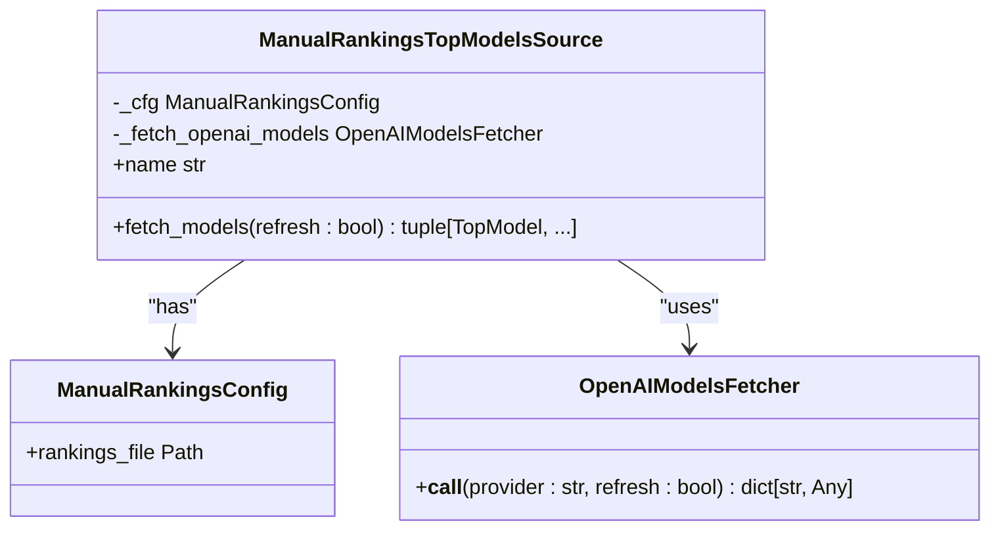
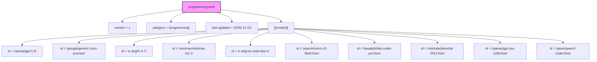
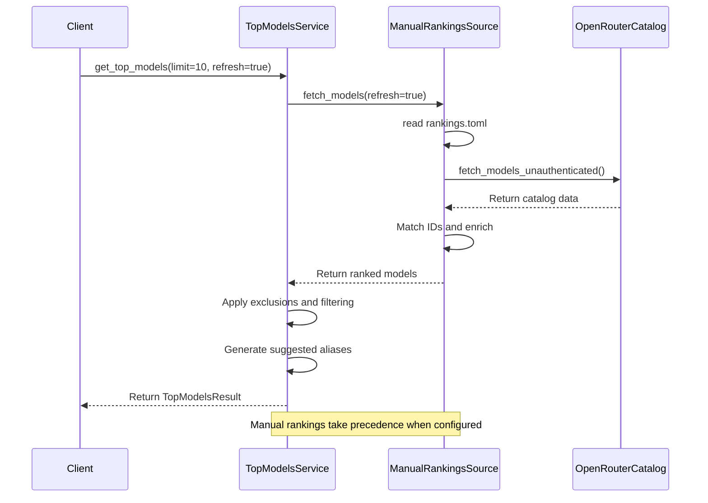
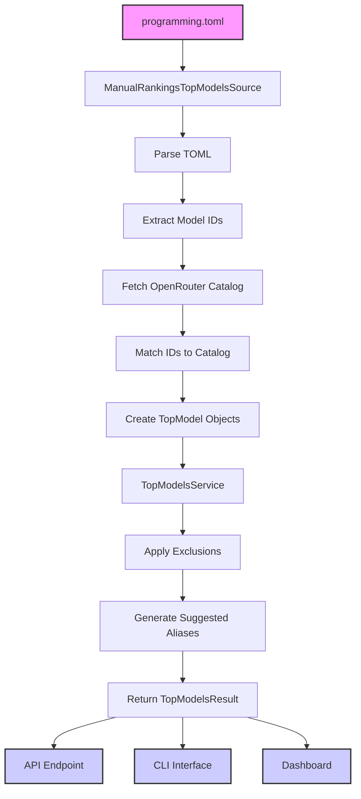

# Manual Rankings

<cite>
**Referenced Files in This Document**   
- [manual_rankings.py](file://src/top_models/manual_rankings.py)
- [programming.toml](file://config/top-models/programming.toml)
- [README.md](file://config/top-models/README.md)
- [service.py](file://src/top_models/service.py)
- [types.py](file://src/top_models/types.py)
- [source.py](file://src/top_models/source.py)
- [config.py](file://src/core/config.py)
- [top-models.md](file://docs/top-models.md)
- [top_models.py](file://src/dashboard/pages/top_models.py)
- [endpoints.py](file://src/api/endpoints.py)
</cite>

## Table of Contents
1. [Introduction](#introduction)
2. [Manual Rankings System Overview](#manual-rankings-system-overview)
3. [Configuration File Structure](#configuration-file-structure)
4. [Integration with Model Selection Pipeline](#integration-with-model-selection-pipeline)
5. [Practical Configuration Examples](#practical-configuration-examples)
6. [Use Cases and Policy Enforcement](#use-cases-and-policy-enforcement)
7. [Troubleshooting and Common Issues](#troubleshooting-and-common-issues)
8. [System Architecture and Data Flow](#system-architecture-and-data-flow)

## Introduction

The manual rankings system in the top models feature provides operators with the ability to define curated, static rankings of AI models for specific use cases such as programming. This system enables organizations to establish standardized model preferences, prioritize cost-effective options, and enforce provider policies through a human-maintained configuration. The manual rankings take precedence over dynamic sources when configured, ensuring consistent model recommendations across the organization.

**Section sources**
- [top-models.md](file://docs/top-models.md#L1-L297)

## Manual Rankings System Overview

The manual rankings system is implemented through the `manual_rankings.py` module, which serves as a top-models source based on a human-maintained TOML ordering. This system reads model rankings from a configuration file and enriches them with metadata from OpenRouter's catalog via the proxy's `/v1/models` endpoint.

The `ManualRankingsTopModelsSource` class is responsible for fetching and processing the rankings. It reads the TOML configuration file, parses the ordered list of model IDs, and matches them against the OpenRouter catalog to produce a ranked list of models with complete metadata. The system preserves the exact order specified in the configuration file, making it ideal for enforcing organizational standards and preferences.

When a model ID in the rankings file is not found in the OpenRouter catalog, it is skipped and logged, ensuring that the system remains robust even when models are deprecated or renamed. This approach combines human curation with automated metadata enrichment, providing both control and up-to-date information.



**Diagram sources**
- [manual_rankings.py](file://src/top_models/manual_rankings.py#L20-L105)

**Section sources**
- [manual_rankings.py](file://src/top_models/manual_rankings.py#L1-L105)

## Configuration File Structure

The configuration for manual rankings is stored in the `programming.toml` file located in the `config/top-models/` directory. This TOML file defines the priority order, provider information, and metadata for programming models.

The file structure includes several key components:
- `version`: The schema version (currently 1)
- `category`: The use case category (e.g., "programming")
- `last-updated`: The date of the last update in ISO format
- `[[models]]`: An array of model entries, each containing an `id` field

The model IDs follow the format `sub-provider/model` (e.g., `openai/gpt-5.2`), which corresponds to OpenRouter's model identification system. The order of the `[[models]]` entries determines the ranking priority, with the first entry being rank #1.

The configuration is designed to be simple and focused, with only the `[[models]].id` field being required. Optional fields like notes can be added as comments. This minimalist approach ensures that the configuration remains easy to maintain while providing the essential functionality for model ranking.



**Diagram sources**
- [programming.toml](file://config/top-models/programming.toml#L1-L34)
- [README.md](file://config/top-models/README.md#L32-L45)

**Section sources**
- [programming.toml](file://config/top-models/programming.toml#L1-L34)
- [README.md](file://config/top-models/README.md#L1-L45)

## Integration with Model Selection Pipeline

The manual rankings system is integrated into the model selection pipeline through the `TopModelsService` class in `service.py`. This service acts as the central coordinator for top model recommendations, supporting multiple sources including both manual rankings and dynamic sources like OpenRouter.

The integration process follows a specific sequence:
1. The system reads the rankings from the TOML configuration file
2. It calls the proxy's `/v1/models` endpoint with `provider=openrouter` and `format=openai` to retrieve the current catalog
3. It matches the TOML model IDs against the catalog and emits the results in the same order as specified in the configuration

The integration is controlled by environment variables, with `TOP_MODELS_SOURCE` determining whether to use manual rankings or dynamic sources. When set to "manual_rankings", the system prioritizes the curated list over any dynamically generated rankings.

The service also applies additional processing, including exclusions based on the `TOP_MODELS_EXCLUDE` environment variable and provider filtering. It generates suggested aliases (`top`, `top-cheap`, `top-longctx`) based on the filtered results, providing convenient shortcuts for common use cases.



**Diagram sources**
- [service.py](file://src/top_models/service.py#L100-L216)
- [manual_rankings.py](file://src/top_models/manual_rankings.py#L51-L105)

**Section sources**
- [service.py](file://src/top_models/service.py#L1-L216)
- [config.py](file://src/core/config.py#L99-L108)

## Practical Configuration Examples

Configuring custom rankings involves editing the `programming.toml` file to define the desired priority order of models. The process is straightforward and follows specific guidelines to ensure consistency and reliability.

To create a custom ranking, operators should:
1. Open the `programming.toml` file in a text editor
2. Update the `[[models]]` list in the exact order desired
3. Use OpenRouter model IDs in the format `sub-provider/model`
4. Save the file and verify the changes

For example, to prioritize cost-effective models for programming tasks, an organization might configure their `programming.toml` as follows:

```toml
version = 1
category = "programming"
last-updated = "2025-12-22"

[[models]]
id = "google/gemini-2.0-flash"

[[models]]
id = "mistralai/mistral-small"

[[models]]
id = "openai/gpt-4o"
```

This configuration would ensure that Gemini Flash is recommended first due to its lower cost, followed by Mistral Small, and then GPT-4o. The system automatically enriches these entries with current pricing, context window, and capability information from the OpenRouter catalog.

When making changes to the configuration, operators should follow best practices:
- Use stable model IDs and avoid temporary preview suffixes unless intentionally chosen
- Keep the list ordered with rank #1 at the top
- Regularly review and update the rankings based on performance and cost considerations
- Test changes in a staging environment before deploying to production

The system supports hot reloading of configuration changes, meaning that updates to the TOML file take effect immediately without requiring a server restart. This enables rapid iteration and adjustment of model rankings based on organizational needs.

**Section sources**
- [README.md](file://config/top-models/README.md#L23-L45)
- [test_top_models.py](file://tests/unit/test_top_models.py#L13-L86)

## Use Cases and Policy Enforcement

The manual rankings system supports several important use cases for organizations managing AI model usage. These use cases leverage the system's ability to enforce organizational standards, prioritize cost-effective models, and exclude providers based on policy requirements.

One primary use case is enforcing organizational standards. By curating a specific ranking of models, organizations can ensure consistency across teams and projects. This standardization helps maintain quality, reduces confusion about which models to use, and simplifies training and documentation. For example, an organization might establish GPT-4o as the default programming model across all teams, ensuring a consistent development experience.

Cost optimization is another significant use case. Organizations can prioritize models based on pricing metrics, directing users toward more cost-effective options without sacrificing quality. By placing lower-cost models higher in the ranking, the system naturally guides users toward economical choices. This is particularly valuable for organizations with budget constraints or those seeking to optimize their AI spending.

Provider policy enforcement allows organizations to exclude specific providers based on compliance, security, or strategic considerations. Using the `TOP_MODELS_EXCLUDE` environment variable, operators can prevent certain providers from being recommended. For instance, an organization might exclude all OpenAI models (`openai/`) due to data residency requirements or exclude beta models from specific providers to maintain stability.

The system also supports specialized use cases such as:
- Prioritizing models with specific capabilities (e.g., vision, tools)
- Creating regional rankings that consider latency and data sovereignty
- Implementing gradual model transitions by temporarily including both old and new preferred models
- Supporting different rankings for different teams or departments through configuration management

These use cases demonstrate how the manual rankings system provides operators with fine-grained control over model recommendations, enabling them to align AI usage with organizational goals and policies.

**Section sources**
- [top-models.md](file://docs/top-models.md#L218-L245)
- [config.py](file://src/core/config.py#L105-L107)

## Troubleshooting and Common Issues

When working with the manual rankings system, operators may encounter several common issues that can be resolved through systematic troubleshooting. Understanding these issues and their solutions ensures smooth operation of the model recommendation system.

One common issue is models not appearing in the rankings despite being correctly configured in the TOML file. This typically occurs when a model ID in the configuration does not match any model in the OpenRouter catalog. The system logs these mismatches, allowing operators to identify and correct the problematic entries. To resolve this issue, verify that the model IDs in the configuration file exactly match those in the OpenRouter catalog, paying attention to case sensitivity and special characters.

Another issue is stale recommendations despite using the `refresh=true` parameter. This can occur in multi-node deployments where the request is not reaching the expected server instance. To troubleshoot this, verify that the server being queried is the one serving the request and check the logs to confirm that the refresh operation is being processed.

Configuration syntax errors in the TOML file can prevent the system from reading the rankings. These errors include missing brackets in `[[models]]`, incorrect quoting, or invalid characters. The system provides clear error messages when parsing fails, helping operators identify and fix the syntax issues. Always validate the TOML file using a syntax checker before deploying changes.

Cache-related issues may also arise, such as recommendations not updating after configuration changes. While the manual rankings system has minimal caching for the configuration file itself, the underlying model catalog is cached. Using `refresh=true` bypasses this cache and ensures fresh data is retrieved from OpenRouter.

When troubleshooting, operators should:
1. Check the system logs for error messages related to file reading or parsing
2. Verify network connectivity to OpenRouter's API endpoint
3. Confirm that environment variables are correctly set
4. Test the configuration in a staging environment before production deployment
5. Use the CLI tools to validate the output and identify issues

By following these troubleshooting steps, operators can quickly resolve common issues and maintain a reliable manual rankings system.

**Section sources**
- [top-models.md](file://docs/top-models.md#L275-L291)
- [test_top_models.py](file://tests/unit/test_top_models.py#L88-L140)

## System Architecture and Data Flow

The manual rankings system follows a modular architecture that separates configuration management, data enrichment, and service integration. This design enables flexibility, maintainability, and clear separation of concerns.

The data flow begins with the configuration file (`programming.toml`) which contains the curated model rankings. This file is read by the `ManualRankingsTopModelsSource` class, which parses the TOML content and extracts the ordered list of model IDs. The parsing process validates the file structure and handles any syntax errors gracefully.

Next, the system enriches the model IDs with metadata by calling the proxy's `/v1/models` endpoint with `provider=openrouter`. This request retrieves the current catalog of models with detailed information including pricing, context window, and capabilities. The system uses the same caching semantics as the main models endpoint, ensuring efficient operation while allowing for cache invalidation when needed.

Once the catalog data is retrieved, the system matches the configured model IDs against the catalog entries. This matching process creates `TopModel` objects that combine the manual ranking order with the enriched metadata. Models that exist in the configuration but not in the catalog are skipped and logged, maintaining the integrity of the results.

Finally, the enriched model list is processed by the `TopModelsService`, which applies additional filtering based on exclusions and provider requirements. The service generates suggested aliases and formats the results for consumption by both API endpoints and the CLI interface.

The architecture supports both cached and real-time operations through the `refresh` parameter. When `refresh=true`, the system bypasses caches and fetches fresh data from upstream sources, ensuring up-to-date recommendations at the cost of increased latency.

This layered approach provides a robust foundation for manual rankings, combining human curation with automated data enrichment to deliver reliable and up-to-date model recommendations.



**Diagram sources**
- [manual_rankings.py](file://src/top_models/manual_rankings.py#L51-L105)
- [service.py](file://src/top_models/service.py#L100-L216)
- [endpoints.py](file://src/api/endpoints.py#L100-L107)

**Section sources**
- [source.py](file://src/top_models/source.py#L1-L23)
- [types.py](file://src/top_models/types.py#L1-L61)
- [top_models.py](file://src/dashboard/pages/top_models.py#L1-L156)