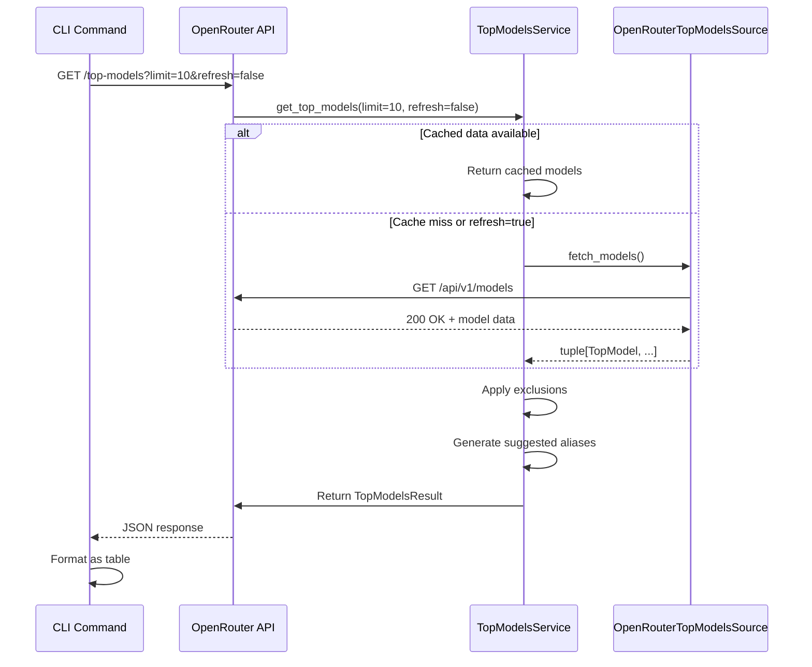
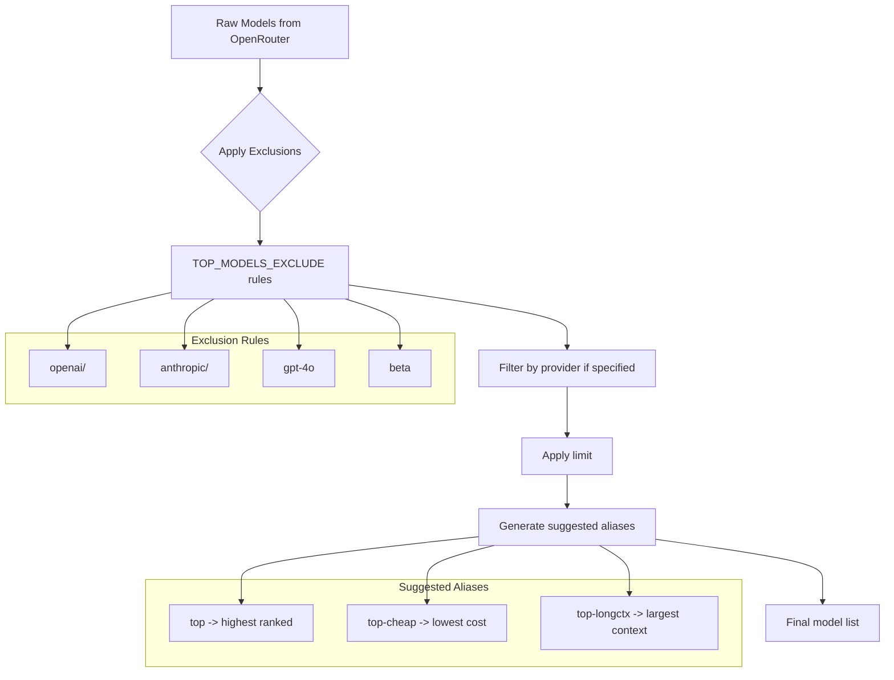

# OpenRouter Integration

<cite>
**Referenced Files in This Document**   
- [openrouter.py](file://src/top_models/openrouter.py)
- [service.py](file://src/top_models/service.py)
- [source.py](file://src/top_models/source.py)
- [types.py](file://src/top_models/types.py)
- [endpoints.py](file://src/api/endpoints.py)
- [models.py](file://src/cli/commands/models.py)
- [config.py](file://src/core/config.py)
</cite>

## Table of Contents
1. [Introduction](#introduction)
2. [Architecture Overview](#architecture-overview)
3. [Core Components](#core-components)
4. [Data Flow and Processing](#data-flow-and-processing)
5. [Configuration and Filtering](#configuration-and-filtering)
6. [Error Handling and Reliability](#error-handling-and-reliability)
7. [Integration with CLI and API](#integration-with-cli-and-api)
8. [Caching and Performance](#caching-and-performance)
9. [Debugging and Monitoring](#debugging-and-monitoring)
10. [Conclusion](#conclusion)

## Introduction

The OpenRouter integration within the top models system provides a mechanism to fetch, process, and present real-time model data from OpenRouter's API. This integration enables the system to identify and recommend top programming models based on various criteria such as pricing, context window, and capabilities. The implementation is designed to be extensible, with a clear separation between data source abstraction and business logic.

The integration supports both OpenRouter's native model catalog and manual rankings configurations, allowing for flexible model selection strategies. It provides a unified interface for accessing model metadata, with comprehensive filtering, caching, and error handling capabilities. The system is accessible through both a REST API endpoint and a CLI command, making it suitable for both programmatic and interactive use.

**Section sources**
- [openrouter.py](file://src/top_models/openrouter.py#L1-L127)
- [service.py](file://src/top_models/service.py#L1-L216)

## Architecture Overview

The OpenRouter integration follows a layered architecture with clear separation of concerns. At the core is the `TopModelsSource` interface that abstracts data source implementations, allowing for multiple sources to be used interchangeably. The `OpenRouterTopModelsSource` class implements this interface to fetch model data from OpenRouter's API, while the `TopModelsService` orchestrates the overall process of fetching, filtering, and presenting model recommendations.

```mermaid
graph TD
A[CLI Command vdm models top] --> B[/top-models API Endpoint]
B --> C[TopModelsService]
C --> D{Source Type}
D --> |openrouter| E[OpenRouterTopModelsSource]
D --> |manual_rankings| F[ManualRankingsTopModelsSource]
E --> G[OpenRouter API v1/models]
F --> H[programming.toml Rankings]
C --> I[Filtering Logic]
I --> J[Exclusion Rules]
I --> K[Provider Filtering]
C --> L[Alias Generation]
C --> M[Caching Layer]
M --> N[Disk Cache]
C --> O[Response Formatting]
O --> P[API Response]
P --> Q[CLI Table Output]
P --> R[JSON Output]
```

**Diagram sources**
- [openrouter.py](file://src/top_models/openrouter.py#L90-L127)
- [service.py](file://src/top_models/service.py#L100-L216)
- [endpoints.py](file://src/api/endpoints.py#L1345-L1392)
- [models.py](file://src/cli/commands/models.py#L16-L88)

## Core Components

The OpenRouter integration consists of several key components that work together to provide model recommendations. The `OpenRouterTopModelsSource` class is responsible for fetching raw model data from OpenRouter's API and normalizing it into a consistent format. This class handles HTTP communication, error handling, and response parsing, providing a clean interface for the rest of the system.

The `TopModelsService` class orchestrates the entire process, coordinating between data sources, filtering logic, and caching mechanisms. It applies configuration settings such as exclusions and provider filters, generates suggested aliases, and formats the final output. The service uses dependency injection to support different data sources, making the system extensible and testable.

The data model is defined in `types.py`, which includes classes for `TopModel`, `TopModelPricing`, and `TopModelsResult`. These classes provide a structured representation of model metadata, including pricing information, context window size, capabilities, and other attributes. The type system ensures consistency across the application and provides clear documentation of the data structure.

**Section sources**
- [openrouter.py](file://src/top_models/openrouter.py#L1-L127)
- [service.py](file://src/top_models/service.py#L1-L216)
- [types.py](file://src/top_models/types.py#L1-L61)
- [source.py](file://src/top_models/source.py#L1-L23)

## Data Flow and Processing

The data flow for the OpenRouter integration begins with a request to the `/top-models` endpoint or the `vdm models top` CLI command. The `TopModelsService` is instantiated with configuration from environment variables, determining whether to use the OpenRouter API or manual rankings as the data source.

When using the OpenRouter source, the `OpenRouterTopModelsSource` fetches model data from `https://openrouter.ai/api/v1/models` with a configurable timeout. The raw JSON response is parsed, and each model entry is normalized into a `TopModel` object using the `openrouter_model_dict_to_top_model` function. This function is designed to be resilient to schema changes in the OpenRouter API, extracting key information such as model ID, name, provider, context window, capabilities, and pricing.



**Diagram sources**
- [openrouter.py](file://src/top_models/openrouter.py#L97-L127)
- [service.py](file://src/top_models/service.py#L159-L216)
- [endpoints.py](file://src/api/endpoints.py#L1345-L1392)

## Configuration and Filtering

The OpenRouter integration is highly configurable through environment variables that control various aspects of its behavior. The `TOP_MODELS_SOURCE` variable determines whether to use "openrouter" or "manual_rankings" as the data source. When using manual rankings, the `TOP_MODELS_RANKINGS_FILE` specifies the path to a TOML file containing the ordered list of preferred models.

Model filtering is implemented through several mechanisms. The `TOP_MODELS_EXCLUDE` environment variable allows specifying a comma-separated list of substrings to exclude from the results. Any model whose ID contains one of these substrings will be filtered out. This provides a flexible way to exclude specific providers, models, or model categories. The filtering is applied as a substring match against the full model identifier (e.g., "openai/gpt-4o").

Additional filtering can be applied at request time through query parameters. The `provider` parameter filters models by their top-level provider, while the `limit` parameter controls the maximum number of models returned. The service also generates suggested aliases based on the filtered results, including "top" (the highest-ranked model), "top-cheap" (the most cost-effective model), and "top-longctx" (the model with the largest context window).



**Diagram sources**
- [service.py](file://src/top_models/service.py#L55-L97)
- [config.py](file://src/core/config.py#L100-L108)
- [endpoints.py](file://src/api/endpoints.py#L1345-L1392)

## Error Handling and Reliability

The OpenRouter integration includes comprehensive error handling to ensure reliability in the face of network issues, API changes, and other potential problems. The `OpenRouterTopModelsSource` class wraps all HTTP operations in try-except blocks, converting any exceptions into a `TopModelsSourceError` with a descriptive message. This provides a consistent error interface regardless of the underlying issue.

The integration is designed to be resilient to changes in the OpenRouter API schema. The `openrouter_model_dict_to_top_model` function includes defensive programming practices such as type checking and fallback values, ensuring that missing or malformed fields do not cause the entire process to fail. For example, it attempts to extract the context window from both "context_length" and "context_window" fields, accommodating variations in the API response.

Timeouts are configurable via the `TOP_MODELS_TIMEOUT_SECONDS` environment variable, with a default value of 30 seconds. This prevents the system from hanging indefinitely if the OpenRouter API is slow to respond. The HTTP client is configured with appropriate headers, including a User-Agent string, to ensure proper identification and potentially better service from the API.

**Section sources**
- [openrouter.py](file://src/top_models/openrouter.py#L103-L114)
- [config.py](file://src/core/config.py#L104)
- [source.py](file://src/top_models/source.py#L9-L11)

## Integration with CLI and API

The OpenRouter integration is accessible through both a REST API endpoint and a CLI command, providing flexibility for different use cases. The `/top-models` API endpoint returns a JSON response containing the curated list of models, along with metadata such as the source, last update time, and suggested aliases. The response structure is designed to be dashboard-friendly, with fields that can be easily consumed by frontend applications.

The CLI command `vdm models top` provides a human-friendly interface to the same functionality, displaying the results in a formatted table by default. It supports various options such as `--json` for JSON output, `--limit` to control the number of models shown, and `--refresh` to bypass the cache. The CLI also displays the suggested aliases, making it easy for users to discover and use the recommended models.

Both interfaces support the same filtering parameters, ensuring consistency across different access methods. The API endpoint includes additional metadata in the response when the `include_cache_info` parameter is set to true, providing information about the cache file and exclusion rules. This transparency helps users understand how the results were generated and troubleshoot any issues.

**Section sources**
- [endpoints.py](file://src/api/endpoints.py#L1345-L1392)
- [models.py](file://src/cli/commands/models.py#L16-L88)

## Caching and Performance

The OpenRouter integration includes a caching mechanism to improve performance and reduce the load on the OpenRouter API. The cache is controlled by the `TOP_MODELS_CACHE_TTL_DAYS` environment variable, which determines how long cached results remain fresh. By default, the cache TTL is set to 2 days, balancing freshness with performance.

The caching system is implemented at multiple levels. The `TopModelsService` maintains an in-memory cache of the most recent results, while the underlying `ModelsDiskCache` stores responses on disk for longer-term persistence. The cache key is generated based on the provider, base URL, and custom headers, ensuring that different configurations are cached separately.

Cache behavior can be controlled through the `refresh` parameter. When set to true, the system bypasses the cache and fetches fresh data from the OpenRouter API. This is useful when the user wants to ensure they have the most up-to-date model information. The CLI command exposes this parameter as the `--refresh` option, while the API endpoint accepts it as a query parameter.

The caching strategy reduces the number of HTTP requests to the OpenRouter API, improving response times and reducing the risk of rate limiting. It also ensures that the system remains functional even if the OpenRouter API is temporarily unavailable, as it can serve stale but still useful data from the cache.

**Section sources**
- [service.py](file://src/top_models/service.py#L160-L164)
- [config.py](file://src/core/config.py#L100-L108)
- [models.py](file://src/cli/commands/models.py#L24)

## Debugging and Monitoring

The OpenRouter integration includes several features to aid in debugging and monitoring. DEBUG-level logs provide detailed information about the fetching process, including the number of models loaded from cache, cache staleness, and any errors encountered during API requests. These logs help administrators understand the system's behavior and diagnose issues.

The system includes comprehensive error handling with descriptive messages that indicate the nature of any problems encountered. For example, if the OpenRouter API returns an unexpected response format, the error message will specify which part of the response was malformed. This specificity makes it easier to identify and fix issues, whether they are caused by API changes or configuration problems.

The `/top-models` API endpoint includes metadata in its response that can be used for monitoring and debugging. When the `include_cache_info` parameter is set to true, the response includes information about the cache file and exclusion rules, providing transparency into how the results were generated. This information can be used to verify that the correct configuration is being applied and to troubleshoot any unexpected filtering behavior.

**Section sources**
- [openrouter.py](file://src/top_models/openrouter.py#L108-L109)
- [endpoints.py](file://src/api/endpoints.py#L1377-L1379)
- [service.py](file://src/top_models/service.py#L177-L178)

## Conclusion

The OpenRouter integration provides a robust and flexible system for discovering and recommending top programming models. By combining real-time data from the OpenRouter API with configurable filtering and caching, it delivers relevant model recommendations while maintaining performance and reliability. The clear separation of concerns between data source abstraction, business logic, and presentation layers makes the system extensible and maintainable.

The integration supports multiple access methods, including a REST API and a CLI command, making it suitable for both programmatic and interactive use. Comprehensive configuration options allow users to tailor the system to their specific needs, from excluding certain providers to controlling cache behavior. The inclusion of suggested aliases simplifies model selection for users, promoting the use of optimal models for different use cases.

Future enhancements could include support for additional data sources, more sophisticated ranking algorithms, and enhanced filtering capabilities. The current architecture provides a solid foundation for these improvements, ensuring that the system can evolve to meet changing requirements while maintaining its core principles of reliability, performance, and usability.