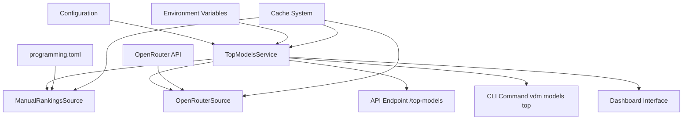
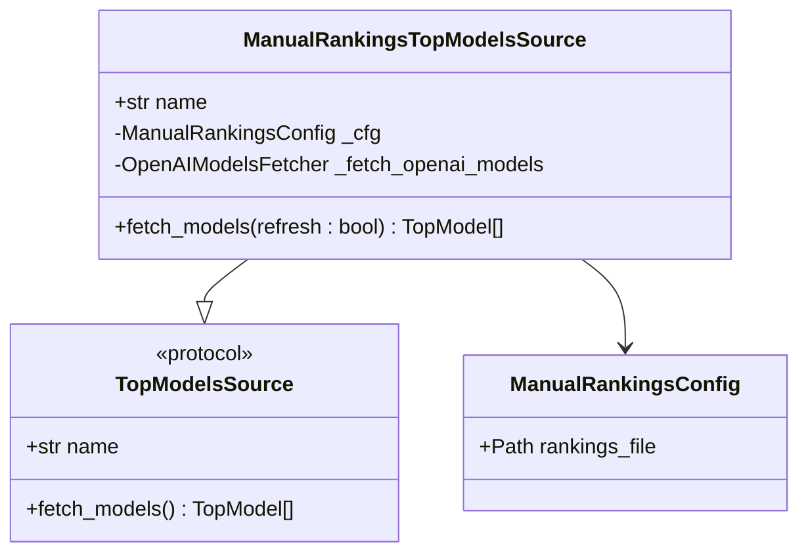
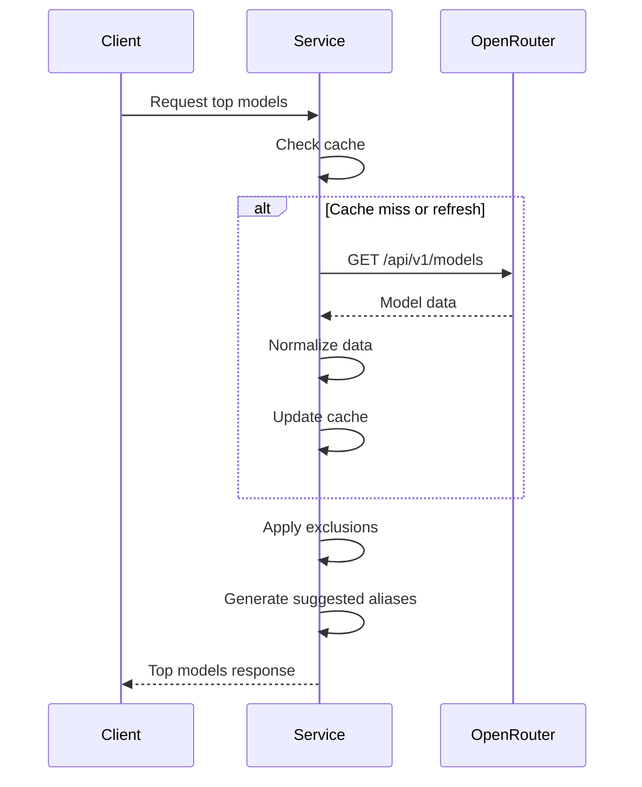
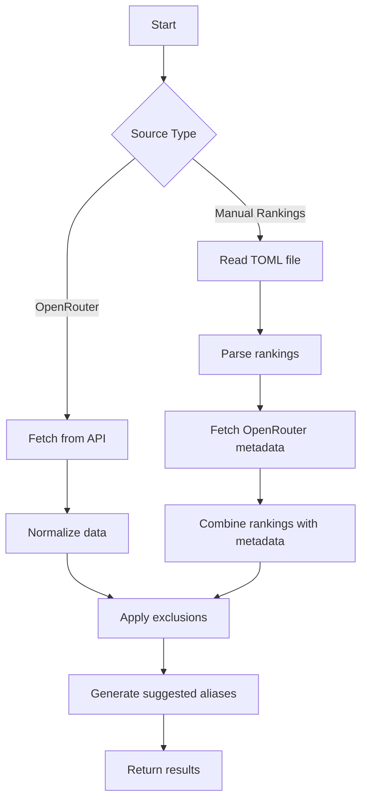

# Top Models System

<cite>
**Referenced Files in This Document**   
- [manual_rankings.py](file://src/top_models/manual_rankings.py)
- [openrouter.py](file://src/top_models/openrouter.py)
- [service.py](file://src/top_models/service.py)
- [types.py](file://src/top_models/types.py)
- [source.py](file://src/top_models/source.py)
- [programming.toml](file://config/top-models/programming.toml)
- [top_models.md](file://docs/top-models.md)
- [config.py](file://src/core/config.py)
- [top_models.py](file://src/dashboard/services/top_models.py)
- [top_models.py](file://src/dashboard/pages/top_models.py)
</cite>

## Table of Contents
1. [Introduction](#introduction)
2. [Architecture Overview](#architecture-overview)
3. [Core Components](#core-components)
4. [Manual Rankings System](#manual-rankings-system)
5. [OpenRouter Integration](#openrouter-integration)
6. [Configuration and Environment Variables](#configuration-and-environment-variables)
7. [Data Flow and Processing Logic](#data-flow-and-processing-logic)
8. [Suggested Aliases System](#suggested-aliases-system)
9. [Dashboard Integration](#dashboard-integration)
10. [Use Cases](#use-cases)
11. [Extending the Ranking System](#extending-the-ranking-system)

## Introduction
The Top Models System in Vandamme Proxy provides a comprehensive solution for ranking and recommending optimal AI models based on performance, cost, and availability metrics. This system enables users to discover the best models for specific use cases such as programming task optimization and cost-effective model selection. The system supports multiple ranking sources, including manual curation through configuration files and dynamic ranking through OpenRouter integration. It provides both API and CLI interfaces for accessing model recommendations, with suggested aliases to simplify model selection. The system is designed to be resilient, with caching mechanisms and error handling to ensure reliable operation even when upstream sources are unavailable.

## Architecture Overview
The Top Models System follows a modular architecture with clear separation of concerns between data sources, processing logic, and presentation layers. The system is built around a source abstraction pattern that allows for multiple ranking methodologies while maintaining a consistent interface. At its core, the system implements a service-oriented design where the TopModelsService orchestrates the retrieval, filtering, and presentation of model recommendations. The architecture supports both static manual rankings and dynamic external API integration through the OpenRouter source. The system integrates with the proxy's caching infrastructure to minimize external API calls and improve response times. The dashboard provides a user-friendly interface for exploring model recommendations, while the API and CLI enable programmatic access to the ranking data.

**Diagram sources**
- [service.py](file://src/top_models/service.py)
- [manual_rankings.py](file://src/top_models/manual_rankings.py)
- [openrouter.py](file://src/top_models/openrouter.py)

## Core Components
The Top Models System consists of several core components that work together to provide model recommendations. The system is built around the TopModelsService class, which serves as the central coordinator for all ranking operations. This service interacts with different source implementations through a common interface defined by the TopModelsSource protocol. The system includes specialized classes for handling manual rankings and OpenRouter integration, each implementing the source interface. Data models are defined using Python dataclasses to ensure type safety and immutability. The system leverages the proxy's existing caching infrastructure to store model data and improve performance. Configuration is managed through environment variables and TOML files, providing flexibility for different deployment scenarios.

**Section sources**
- [service.py](file://src/top_models/service.py#L1-L216)
- [types.py](file://src/top_models/types.py#L1-L61)
- [source.py](file://src/top_models/source.py#L1-L23)

## Manual Rankings System
The manual rankings system allows administrators to curate model rankings through configuration files. This system is implemented in the ManualRankingsTopModelsSource class, which reads model rankings from a TOML file and combines them with metadata from OpenRouter. The configuration file specifies the order of models, with models listed first considered higher priority. The system validates the TOML file structure, ensuring it contains the required models list with valid model IDs. When retrieving model data, the system uses the OpenRouter API to enrich the manually ranked models with up-to-date pricing, context window, and capability information. This approach combines human curation with real-time data, ensuring that the rankings reflect both expert judgment and current market conditions. The manual rankings system is particularly useful for organizations that want to maintain control over which models are recommended to their users.

**Diagram sources**
- [manual_rankings.py](file://src/top_models/manual_rankings.py#L1-L105)
- [source.py](file://src/top_models/source.py#L1-L23)

## OpenRouter Integration
The OpenRouter integration provides dynamic model ranking based on real-time data from the OpenRouter API. This system is implemented in the OpenRouterTopModelsSource class, which fetches model information directly from OpenRouter's API endpoint. The integration normalizes the OpenRouter model data into the system's internal TopModel format, extracting key information such as model ID, provider, context window, capabilities, and pricing. The system handles schema variations in the OpenRouter API response, making it resilient to changes in the upstream data format. Pricing information is converted to a consistent format, with input and output costs per million tokens. The integration includes robust error handling to manage network failures and API issues, ensuring the system remains operational even when the OpenRouter API is temporarily unavailable. This dynamic approach provides up-to-date model recommendations that reflect the current landscape of available models.

**Diagram sources**
- [openrouter.py](file://src/top_models/openrouter.py#L1-L127)
- [service.py](file://src/top_models/service.py#L1-L216)

## Configuration and Environment Variables
The Top Models System is configured through a combination of environment variables and configuration files. The primary configuration is managed through environment variables that control the system's behavior, including the ranking source, timeout settings, and exclusion rules. The TOP_MODELS_SOURCE environment variable determines whether the system uses manual rankings or OpenRouter integration. When using manual rankings, the TOP_MODELS_RANKINGS_FILE variable specifies the path to the TOML configuration file. The system supports exclusion rules through the TOP_MODELS_EXCLUDE variable, which allows administrators to filter out specific models or providers. Timeout settings control the HTTP request timeout when fetching data from external sources. These configuration options provide flexibility for different deployment scenarios and allow administrators to customize the system's behavior without modifying code.

**Section sources**
- [config.py](file://src/core/config.py#L100-L108)
- [programming.toml](file://config/top-models/programming.toml#L1-L34)

## Data Flow and Processing Logic
The data flow in the Top Models System follows a well-defined sequence of operations that transform raw model data into curated recommendations. The process begins with data retrieval from the configured source, either a manual rankings file or the OpenRouter API. The retrieved data is then normalized into the system's internal TopModel format, ensuring consistency across different sources. After normalization, the system applies exclusion rules to filter out unwanted models based on configuration. The filtered models are then sorted according to their ranking, with manually ranked models following the order specified in the configuration file and dynamically ranked models following the order provided by the external API. Finally, the system generates suggested aliases based on the top models, including the highest-ranked model, the most cost-effective option, and the model with the longest context window. This processed data is then made available through the API, CLI, and dashboard interfaces.

**Diagram sources**
- [service.py](file://src/top_models/service.py#L159-L216)
- [manual_rankings.py](file://src/top_models/manual_rankings.py#L68-L104)

## Suggested Aliases System
The suggested aliases system provides a convenient way for users to access top models without needing to remember specific model IDs. The system generates three types of suggested aliases: "top" for the highest-ranked model, "top-cheap" for the most cost-effective option, and "top-longctx" for the model with the longest context window. These aliases are derived deterministically from the current model rankings, ensuring consistency across different requests. The suggested aliases are included in the response from the /v1/aliases endpoint as a non-mutating overlay, meaning they do not interfere with existing configured aliases. This approach allows users to discover recommended models while maintaining their existing configuration. The system handles errors in alias generation gracefully, ensuring that issues with suggested aliases do not affect the availability of the main model list.

**Section sources**
- [service.py](file://src/top_models/service.py#L67-L97)
- [top_models.md](file://docs/top-models.md#L35-L55)

## Dashboard Integration
The Top Models System is integrated into the Vandamme Proxy dashboard, providing a user-friendly interface for exploring model recommendations. The dashboard displays the top models in a sortable table, with filters for provider and search functionality. The interface includes sections for viewing the status of the model data, metadata about the ranking source, and the suggested aliases. Users can refresh the model list directly from the dashboard interface, bypassing the cache to get the latest recommendations. The dashboard also provides visual feedback about the freshness of the data, showing when the model list was last updated. This integration makes it easy for operators and developers to discover and evaluate model options without needing to use the API or CLI. The dashboard components are implemented using Dash, with the backend services providing the necessary data through asynchronous functions.

**Section sources**
- [top_models.py](file://src/dashboard/services/top_models.py#L1-L137)
- [top_models.py](file://src/dashboard/pages/top_models.py#L1-L156)

## Use Cases
The Top Models System supports several key use cases for both operators and developers. For operators, the system provides a way to establish default models for their organization by identifying the top-ranked model through the API or CLI. The exclusion functionality allows operators to prevent the recommendation of models from providers they don't trust or that are too expensive. For developers, the system helps identify cost-effective models for specific tasks, such as finding the cheapest model with sufficient capabilities for a particular use case. The system is also valuable in CI/CD pipelines, where it can be used to automatically select models that meet specific criteria such as having the longest context window or being the most cost-effective option. The suggested aliases provide a convenient way to reference top models in applications without hardcoding specific model IDs.

**Section sources**
- [top_models.md](file://docs/top-models.md#L218-L244)

## Extending the Ranking System
The Top Models System is designed to be extensible, allowing for the addition of new ranking sources beyond the current manual rankings and OpenRouter integration. The system's architecture is based on a source abstraction pattern, with the TopModelsSource protocol defining the interface that all ranking sources must implement. To add a new ranking source, developers can create a new class that implements this protocol, providing an implementation of the fetch_models method that returns a list of TopModel objects. The system's configuration can then be extended to support the new source type. This extensibility makes it possible to integrate with other model marketplaces or to implement custom ranking algorithms based on specific criteria. The system's use of dataclasses for data models and protocol-based interfaces ensures type safety and makes it easy to reason about the behavior of different components.

**Section sources**
- [source.py](file://src/top_models/source.py#L13-L17)
- [service.py](file://src/top_models/service.py#L107-L157)